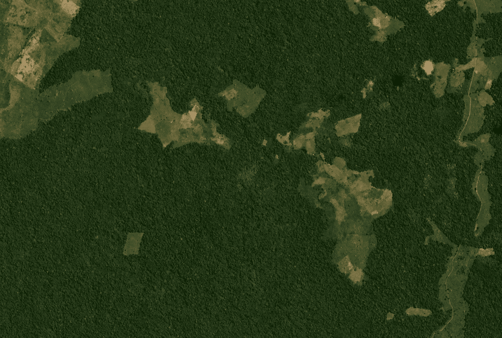
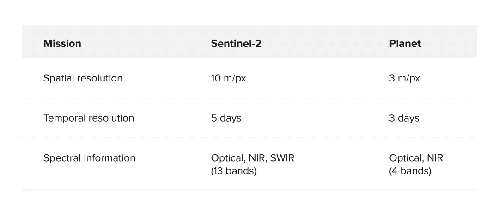
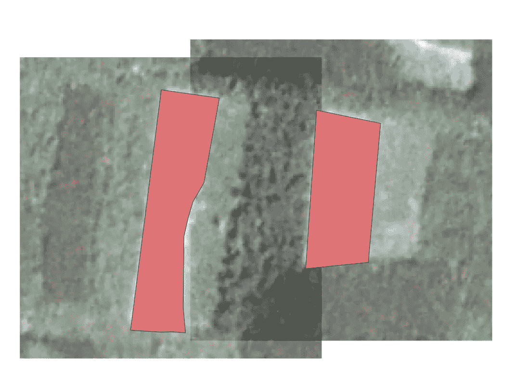
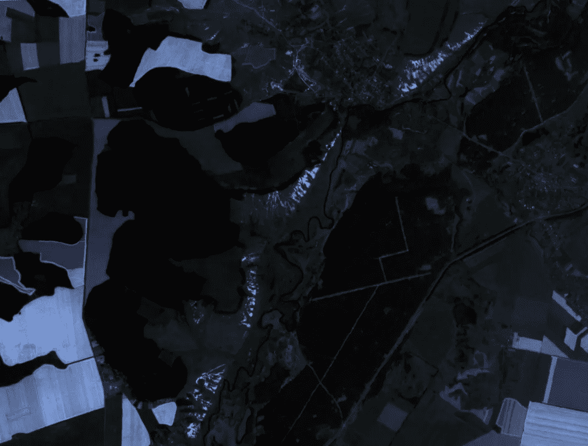
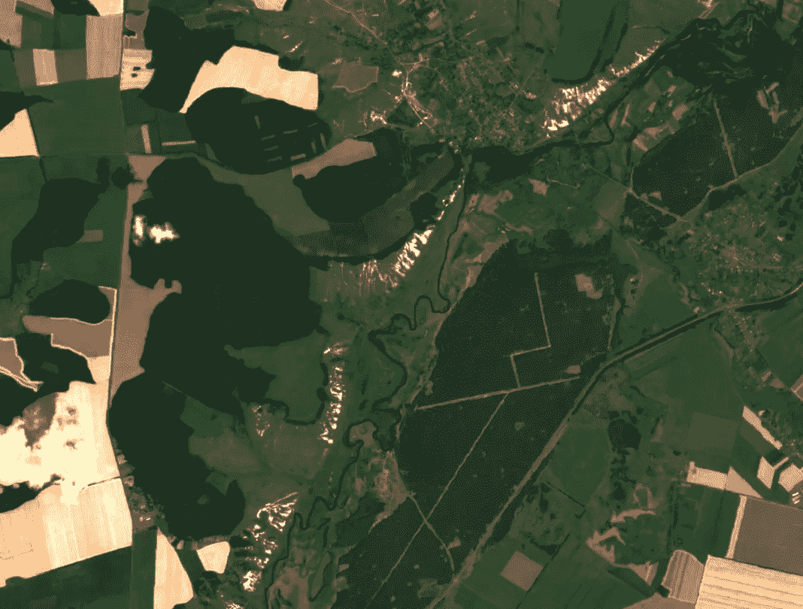
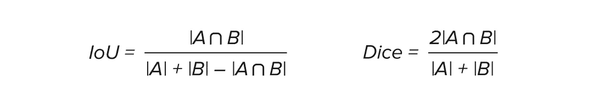
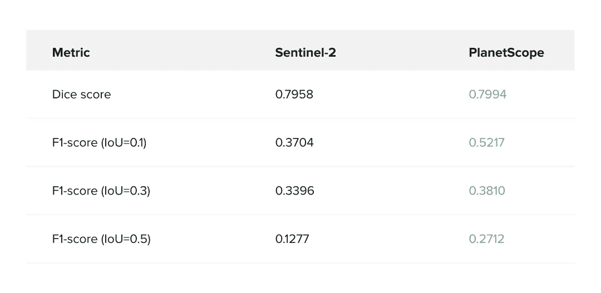
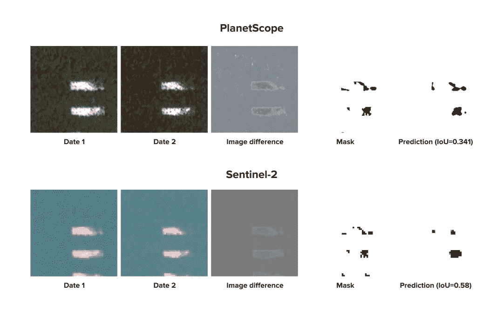
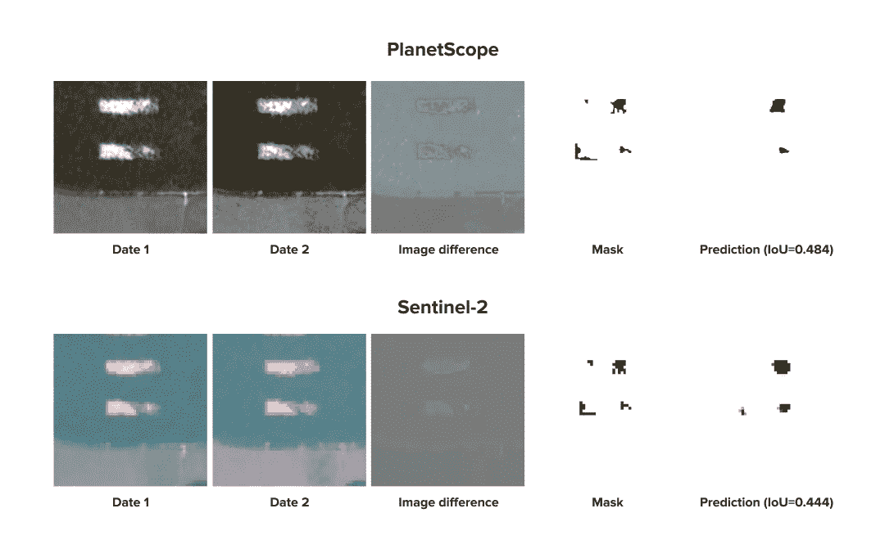

# 用于森林砍伐探测的 Sentinel-2 和 PlanetScope 图像的比较

> 原文：<https://medium.datadriveninvestor.com/%D1%81omparison-of-sentinel-2-and-planetscope-imageries-for-deforestation-detection-efab5196d45c?source=collection_archive---------8----------------------->

Deforestation imagery by Planet.com

与其他国家的大多数森林一样，乌克兰的林地也面临着非法砍伐的风险。乌克兰非法伐木的官方统计数据显示，过去 10 年期间，非法伐木案件从每年 10，000 起减少到 5，000 起，但独立观察表明，违规数量有所增加。与此同时，根据国家和民间的估计，非法采伐量正在增加，2019 年达到 10 万立方米以上。此外，最大数量的非法伐木案件和非法砍伐的木材只发生在乌克兰的森林草原地区，而不是山区。

减少非法砍伐森林的有效机制是监测系统，这些系统大多以遥感为基础。为了系统地检测 ClearCut，我们部署了[clear cut](http://clearcut.quantumobile.com/)——用于监控伐木区域的开源服务。如今，它使用 Sentinel-2 图像作为[皆伐探测](https://ieeexplore.ieee.org/document/9241044)的数据源。

但是，假设 Sentinel-2 任务的时空分辨率(每像素 10 米，重访时间为 5 天)，PlanetScope 的图像似乎是一个非常有前途的森林变化监测平台，因为它具有非常高的时空分辨率。因此，在这个项目中，我们的目标是用 PlanetScope 数据确定森林砍伐检测的质量，并用 Sentinel-2 数据比较分割质量。

我们用 PlanetScope 数据手工创建了一个清晰的数据集。然后，我们执行了行星镜和哨兵-2 瓦片之间的匹配。在数据准备之后，我们使用深度学习模型对创建的数据集进行了森林变化检测，但使用了两个成像数据源:PlanetScope 和 Sentinel-2。在结果中，我们表明 PlanetScope 图像提供了更高质量的分割(F1 值等于 0.52 对 0.37，来自 Sentinel-2 数据)，因此可以用作检测伐木区的潜在平台。收集具有高空间和时间分辨率的大型 PlanetScope 数据集将提供一个高质量监测森林变化检测的机会，其质量高于 Sentinel-2 图像所能提供的质量。

# 数据和方法

## 成像数据

作为成像数据的来源，我们使用了 Sentinel-2 和 PlanetScope 图像。表 1 给出了空间-时间-光谱信息的比较。

Table 1\. Comparison of Sentinel-2 and PlanetScope imagery features

作为来自 Sentinel-2 的数据，我们使用了 A 级光学(真彩色图像，B02、B03、B04 波段)图像。在行星镜中，我们使用了光学波长范围(RGB 波段)的分析产品。这两个数据源都包括 NIR 信息，但是我们的实验表明，在分析中加入 NIR 波段后，没有改善。

## 标签程序

一开始，我们决定使用现有的基于 Sentinel-2 的标记，但是分析表明我们不能用它来解决我们的问题。可用的 PlanetScope 数据覆盖了不同的日期范围，因此我们的实验需要收集一组新的标签。此外，这个新的标签集必须在可用的 PlanetScope 和 Sentinel-2 图像中有尽可能多的匹配图像。

因此，基于 PlanetScope 的数据，我们收集并组合了新的清晰切割数据集。清晰切割的数据集来自 100 个 PlanetScope 瓦片，在时间和空间上与 Sentinel-2 瓦片重叠。这些地区覆盖了乌克兰的一些森林地区(哈尔科夫地区)，并在 2016 年 10 月 2 日和 2019 年 10 月 31 日期间由 PlanetScope 观测到。在这些瓦片中，我们发现并人工标记了 212 个森林砍伐事件。这些事件是在 150 个不同的皆伐区域内观察到的。

## 毁林检测方法

为了检测皆伐区域，我们比较两幅按时间分开的图像，并突出显示出现新皆伐的像素。这个问题被称为图像分割。我们使用深度学习 [UNet](https://arxiv.org/abs/1505.04597) 模型解决了这个问题。

为了创建训练数据集，我们检索了每个皆伐区周围的小图像(见图 1 ),并对毁林事件进行了分段，比较了相同皆伐区按时间划分的片段。

Figure 1\. Example of cropping images around each clearcut

**行星镜。**我们在每个图块上裁剪了每个清晰区域周围的 168×168 像素区域(504×504 米)。在不同的日期(最长 30 天的时间间隔)比较每个皆伐的图像。结果，我们收到了 1，042 条数据(分别为 798，132，112 条训练、验证和测试数据)。这些作品中只有 139 张伐木面具。正如我们之前提到的，图像包括三个光学通道。

**哨兵-2。**我们在每个清晰的 56×56 像素区域(560×560 米)周围进行裁剪。为了防止产生多余的作物，我们用 PlanetScope 瓦片几何图形截断了 Sentinel-2 瓦片。这一步是为了将 Sentinel-2 瓦片与相应的(时间和空间)行星镜瓦片对齐。在不同的日期(最长 30 天的时间间隔)比较每个皆伐的图像。结果，我们收到了 1，042 条数据(分别为 798，132，112 条训练、验证和测试数据)。这些作品中只有 139 张伐木面具。图像包括三个光学通道。

我们的数据集创建过程保证了在训练分割模型期间，以及在测试期间，我们将比较两个图像源的相同清晰界限(在时间和空间上)。这两个数据集之间的唯一区别在于所使用的图像来源(PlanetScope 和 Sentinel-2)。

Figure 2\. PlanetScope RGB image tile

Figure 3\. Cropped the True Color Image from the Sentinel-2 tile

## 细分质量指标

作为准确性指标，我们使用了以下评分函数，该函数比较了 clearcut 的基本事实屏蔽和模型预测的屏蔽。

–[IoU](https://en.wikipedia.org/wiki/Jaccard_index)(交集超过并集)和[骰子](https://en.wikipedia.org/wiki/S%C3%B8rensen%E2%80%93Dice_coefficient)得分:

此外，我们使用度量，它代表清晰检测的质量(但不是实际的分割)。为了计算这一指标，必须在 IoU 得分上设置一个阈值，并计算森林砍伐区域的数量，这些区域在假设分割质量阈值的情况下被正确分割和错误分割。这些数字表示检测的类型，即真阳性(地面真实遮罩具有清晰边界，并且模型预测其 IoU 大于阈值)、假阳性(地面真实遮罩中没有清晰边界，但是模型预测不真实的森林砍伐事件)和假阴性(地面真实遮罩具有清晰边界，但是模型不能检测其 IoU 大于阈值)。

–[F1-得分](https://en.wikipedia.org/wiki/F1_score)

其中 TP，FP，FN 代表正确检测(TP)和错误检测(FP，FN)实例的数量。

# 结果和结论

我们训练了深度学习模型，并将其应用于数据集。结果，我们在验证数据集上获得了以下分数(见表 2):

Table 2\. Values of different quality metrics for datasets. The highest metric among the two datasets is highlighted as bold-green text

PlanetScope 为不同的 IoU 阈值提供了比 Sentinel-2 更高的骰子得分和 F1 得分值。我们具有几乎相等的骰子分数的事实意味着我们在两个数据集中几乎相等地分割清晰。但是 F1-分数显示 PlanetScope 提供了对地面真实遮罩更严格的预测，因为与 Sentinel-2 相比，使用该图像，我们在设定 IoU 阈值的情况下获得了更多的 TP 和更少的 FP+FN。因此，我们可以更有把握地用 PlanetScope 探测清晰的轮廓。

正如我们从预测的视觉比较(图 3–4)中看到的，我们可以推断出具有更高分割质量的清晰轮廓，并使用 PlanetScope 数据获得更平滑的预测。

Figure 4\. Comparative visualization of model inference on both datasets. First row: PlanetScope imagery. Second row: Sentinel-2 imagery. First and second columns: images at the first and second dates; third column: the differences of images; fourth column: ground truth mask of forest changes; fifth column: model segmentation of clearcuts with IoU score on this mask.

Figure 5\. Comparative visualization of model inference on both datasets. First row: PlanetScope imagery. Second row: Sentinel imagery. First and second columns: images at the first and second dates; third column: the differences of images; fourth column: ground truth mask of forest changes; fifth column: model segmentation of clearcuts with IoU score on this mask.

因此，我们可以得出结论，PlanetScope 是 ClearCut 服务中监测森林砍伐区域的一个很好的平台。它的空间分辨率允许我们获得更好的探测质量，假设它的时间分辨率很高，使用 PlanetScore 数据，我们可以以非常高的频率精确地探测到清晰的轮廓。我们相信，作为 ClearCut 服务基础的模型的进一步改进，可以通过扩展 clear cut 的训练样本以及添加更多 PlanetScope 数据来实现。

这篇文章是米哈伊尔·尤舒克和塞尔吉·斯利普申科写的。