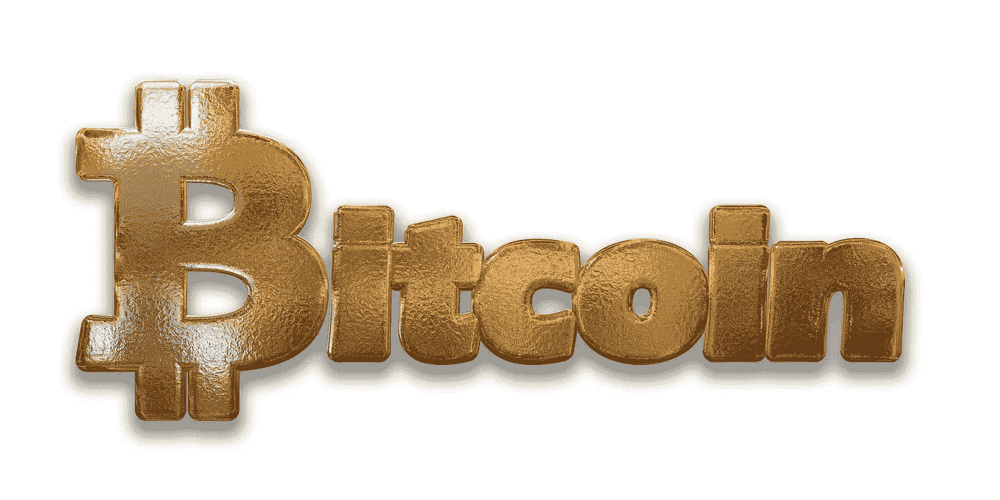
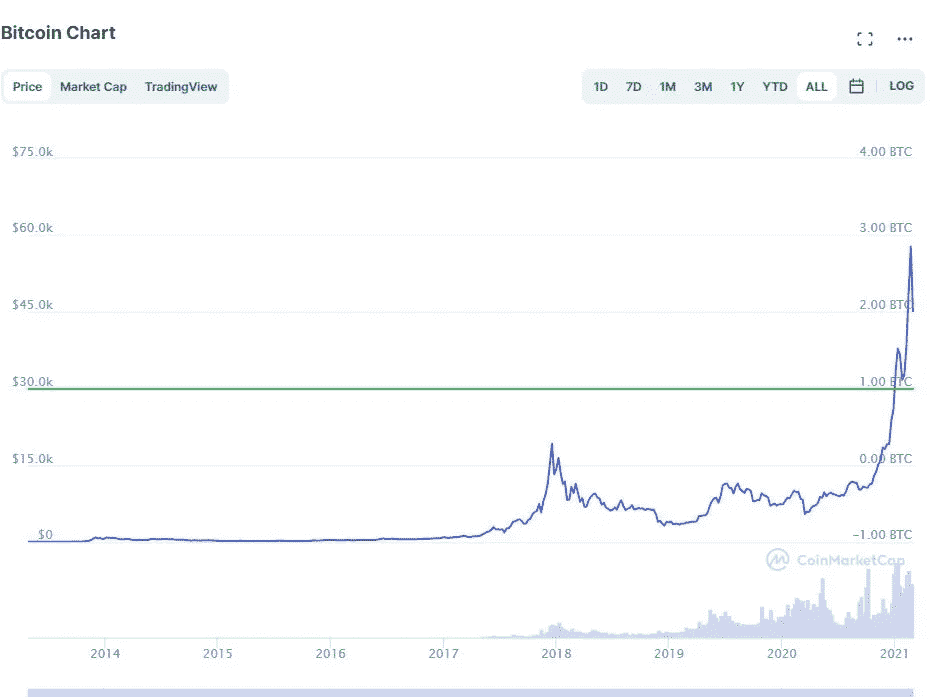

# 2010 年投入比特币的 1000 美元如今价值 2.875 亿美元(截至本文撰写之时)

> 原文：<https://medium.datadriveninvestor.com/1-000-invested-in-bitcoin-in-2010-would-be-worth-287-5-million-today-c9c343416fd4?source=collection_archive---------0----------------------->

## 加密货币

## 你想分一杯羹还来得及吗？

Image by [Pete Linforth](https://pixabay.com/users/thedigitalartist-202249/?utm_source=link-attribution&utm_medium=referral&utm_campaign=image&utm_content=1995370) from [Pixabay](https://pixabay.com/?utm_source=link-attribution&utm_medium=referral&utm_campaign=image&utm_content=1995370)

# 2010 年比特币价格

2010 年比特币的价格是…我简直不敢相信…

比特币在 2010 年只有 8 美分(0.08 美元)，而现在，在我写这篇文章的时候，价格已经超过了 23000 美元(23000 美元)！

太疯狂了，对吧？

这意味着，如果你在 2010 年以 0.08 美元的价格在比特币上投资 1000 美元，那么这笔投资在今天将价值超过 2.87 亿美元。如果你除了拿着硬币什么也不做，也不做任何交易。

## 让我们算一下。

1000 美元/. 08 = 12500 比特币

12，500 x 23，000 美元= 287，500，000 美元

令人难以置信！

# 比特币历史图表

有时候，看到一个画面有助于更好地说明你在处理什么。从 2012 年[到 2021 年，比特币的价格轨迹从不到 0.01 美元到超过 57000 美元](https://coinmarketcap.com/currencies/bitcoin/)。

Image generated by Author on [Coinmarketcap.com](https://coinmarketcap.com/currencies/bitcoin/)

正如你所看到的，尽管有一些下跌(这是交易活动和市场影响的特征)，比特币在 10 年的时间里一直保持着较高的低点和较高的高点。

# 2015 年投资比特币的 1000 美元在 2020 年将值多少钱？

Photo by [Bermix Studio](https://unsplash.com/@bermixstudio?utm_source=medium&utm_medium=referral) on [Unsplash](https://unsplash.com?utm_source=medium&utm_medium=referral)

让我们看看 5 年的差异会如何影响同样 1000 美元的投资结果。

2015 年 11 月的[比特币价格为 360 美元。](https://www.investopedia.com/articles/forex/121815/bitcoins-price-history.asp)

与五年前的 0.08 美元相比，这是一个显著的差异。你的 1000 美元只能买到 2.78 个比特币，而不是 12500 个比特币。

因此，2015 年投资比特币的 1000 美元在今天将价值约 63，940 美元(没有任何交易)。

这令人沮丧吗？

 [## 出土加密宝石蓄势待发|数据驱动的投资者

### 你并不总是有第二次早期发现的机会。无论是股票，加密货币，还是收藏…

www.datadriveninvestor.com](https://www.datadriveninvestor.com/2020/12/17/unearthed-crypto-gem-poised-for-resurgence/) 

# 主流的比特币

一篇关于美国消费者新闻与商业频道的文章指出，2018 年哈里斯民意调查的结果显示，2018 年只有约 5%的美国人拥有比特币。

最近的哈里斯民意调查发现，大约三分之一的美国人对比特币感兴趣，并在 2020 年开始相信比特币。

截至 2020 年 11 月，加密货币市场的全球市值为 5100 亿美元。此外，主流企业集团最近也跳上了比特币列车。

例如， [PayPal 和 Square](https://www.barrons.com/articles/bitcoin-goes-mainstream-as-paypal-and-square-embrace-digital-currencies-51607457036) 正在他们的平台上添加比特币和其他加密货币，作为货币交易的替代形式。据[彭博](https://www.bloomberg.com/news/storythreads/2020-11-18/the-bitcoin-comeback-is-crypto-finally-going-mainstream)称，贝宝网络中至少有 2600 万商家接受加密货币。

其他采用比特币的主流例子包括像 Robinhood 和 Revolut 这样的交易和银行应用，像 Fidelity Investments 和 Ark Investment Management 这样的投资公司。

欧洲中央银行和美联储等中央银行正在探索如何将货币数字化和利用区块链的途径。

接受比特币的主要[公司有特斯拉、宝马、微软、Overstock、家得宝、星巴克等等。](https://www.buybitcoinworldwide.com/who-accepts-bitcoin/)

# 现在进入比特币还来得及吗？

我想说这个问题的答案是——不。

这是我的观点，但是投资一个从一开始就呈现持续上涨趋势的东西怎么可能会为时过晚呢？

花旗银行预测比特币的价格将在 2021 年升至 31.8 万美元。

哇！

因此，如果你在 2015 年投资了 1000 美元，你将持有 2.78 个比特币。如果增加到 318，000 美元，该投资将值 884，040 美元。

嘿，我相信这是有可能的。

我不确定我是否相信比特币的价格会在 2021 年达到 31.8 万美元。

但我确实相信，它可能会在未来五年内这样做，就像比特币在五年内从 0.08 美元涨到 360 美元一样。增长了 4500 倍！

因此，如果历史不断重演，比特币的价格将继续上涨，特别是因为它现在正在成为主流。

# 该不该投资比特币？

我的朋友，这由你来决定。

但是，我知道我肯定是，而且已经有几年了。我没有我想要的那么多，但我一直在增加我的比特币收藏。我在股票市场赚了很多钱。

如果你想了解更多关于比特币和加密货币的知识，那么我建议你在谷歌和 YouTube 上做一些自学，在那里你可以免费获得所有你需要的信息。

只要记住，如果你决定投资，明智地去做。与任何市场投资一样，投资加密货币也存在一些风险。

*注:我不是金融专业人士。这篇文章不能作为财务建议。它是基于我个人的观点和研究。*

**相关故事**

 [## 投资加密货币时你不想犯的 3 个错误

### 在过去的四年里，这些错误让我损失了数百万的潜在成本，我正在为此后悔

medium.datadriveninvestor.com](/3-mistakes-you-dont-want-to-make-when-investing-in-cryptocurrency-33fced6f28cf)  [## 新的比特币价格预测显示，2021 年其价值将超过 10 万美元

### 但看起来这种数字黄金有望在 4 月或 5 月突破 10 万美元

medium.com](https://medium.com/nova-thinker/new-bitcoin-price-prediction-puts-its-worth-over-100-000-in-2021-4d944f87e09f)  [## 花旗银行比特币价格预测 2021 年 318K 美元——是时候投资区块链技术了吗？

### 2020-2021 年的牛市正在发生。还会继续吗？

medium.datadriveninvestor.com](/bitcoin-is-projected-to-reach-318k-in-2021-now-is-the-time-to-invest-in-blockchain-technology-416eebf291a4) 

感谢 [**订阅我的内容**](https://audreysdesk.medium.com/subscribe) 。

 [## 通过我的推荐链接加入媒体-奥黛丽·马龙

### 阅读奥黛丽·马龙的每一个故事。(也可以从自己的故事中赚取！)您将可以访问…上的每个故事

audreysdesk.medium.com](https://audreysdesk.medium.com/membership) 

## 访问专家视图— [订阅 DDI 英特尔](https://datadriveninvestor.com/ddi-intel)