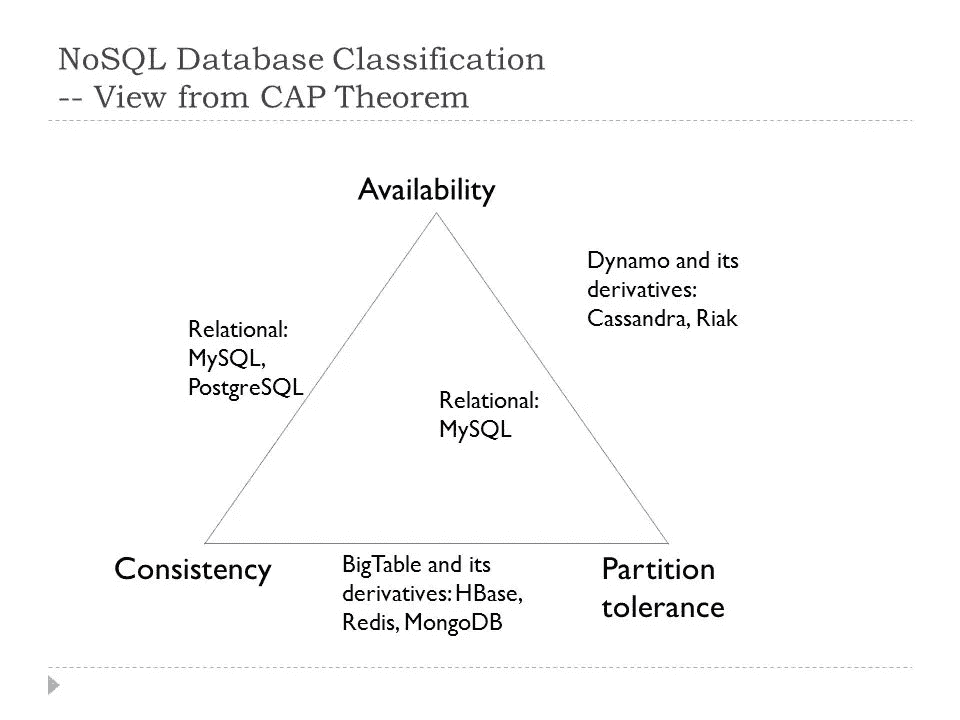

# 关于数据存储的一个大秘密将帮助你在 ML 项目中 100%成功

> 原文：<https://medium.datadriveninvestor.com/1-big-secret-about-data-storage-which-will-help-you-succeed-100-in-your-ml-project-541131a24dcc?source=collection_archive---------16----------------------->

Photo by [Austin Distel](https://unsplash.com/@austindistel?utm_source=medium&utm_medium=referral) on [Unsplash](https://unsplash.com?utm_source=medium&utm_medium=referral)

我们将非结构化数据定义为只有很少或没有元数据以及很少或没有分类的数据。ML(机器学习)经常使用非结构化数据。非结构化数据包括许多类别，如视频、电子邮件、图像、物联网(IoT)设备数据、文件共享、安全数据、监控数据、日志文件、web 数据、用户和会话数据、聊天、消息、twitter 流传感器数据、时间序列数据、物联网设备数据和零售客户数据。

非结构化数据可以用三个 v 来表征:量、速度和多样性。

容量:数据的大小。

速度:数据生成的速度。例如，喷气发动机传感器每秒可以产生数千个样本。

多样性:有许多不同种类的数据。

传统数据库的问题在于它们难以扩展，并且不太适合非结构化数据。在云中存储非结构化数据的最佳方式之一是使用 NoSQL 数据库，因为他们在处理这种类型的数据方面做得更好。

 [## 创建折衷书架的程序员指南|数据驱动的投资者

### 每个开发者都应该有一个书架。他的内阁中可能的文本集合是无数的，但不是每一个集合…

www.datadriveninvestor.com](https://www.datadriveninvestor.com/2019/03/25/a-programmers-guide-to-creating-an-eclectic-bookshelf/) 

为了理解 NoSQL 数据库与传统 RDBMS(关系数据库管理系统)数据库的区别，回顾一下最初由 Eric Brewer 描述的 CAP 定理是有用的。CAP 定理指出，对于分布式数据库体系结构，不可能同时提供以下三种保证中的两种以上:

*   一致性:每次读取都会收到最近的写入或错误。
*   可用性:始终可以读取或写入系统，但不保证它包含最新的值。
*   分区容差:尽管节点之间的网络丢弃或延迟了任意数量的消息，系统仍能继续运行。

数据库理论家使用了两个有趣的术语来描述这些数据库哲学:

酸:原子性、一致性、隔离性、耐久性

基本:基本可用，柔软状态，最终一致性

RDBMS 数据库选择 ACID 是为了一致性和可用性。分布式 NoSQL 数据库选择分区/一致性或分区/可用性的基础。许多流行的 NoSQL 数据库使用基本原理。

**谷歌 Bigtable**

谷歌的 NoSQL 大数据数据库服务。谷歌表示，它可以以低延迟和高吞吐量处理大量工作负载。它支持许多谷歌服务，如地图、Gmail 和搜索。

**AWS DynamoDB**

从亚马逊完全管理的专有 NoSQL 数据库。DynamoDB 支持键值和文档数据结构。高耐用性和可用性。

**阿帕奇 HBASE**

分布式、可扩展的大数据存储。HBASE 是 HADOOP 数据库。Apache 项目的目标是托管包含数十亿行和数百万列的非常大的表。用 Java 编写，模仿 Google 的 Bigtable。

**Riak KV**

来自 Basho 的分布式 NoSQL 数据库。允许您存储大量的非结构化键值数据。物联网的流行解决方案。

**阿帕奇卡珊德拉**

高度可伸缩的 NoSQL 数据库。由于体系结构的选择，声称优于其他 NoSQL 数据库。被网飞、苹果、易趣等使用。

**MongoDB**

跨平台、基于文档、基于 JSON 类文档的 NoSQL 数据库。

**CouchDB**

分布式面向 NoSQL 文档的数据库，为交互式应用程序而优化。

结论:

在选择 NoSQL 数据库时，数据大小和性能也是需要考虑的重要因素。MongoDB 和 CouchDB 是中小型数据集的绝佳选择，而 Cassandra 则是大型数据集的绝佳选择。