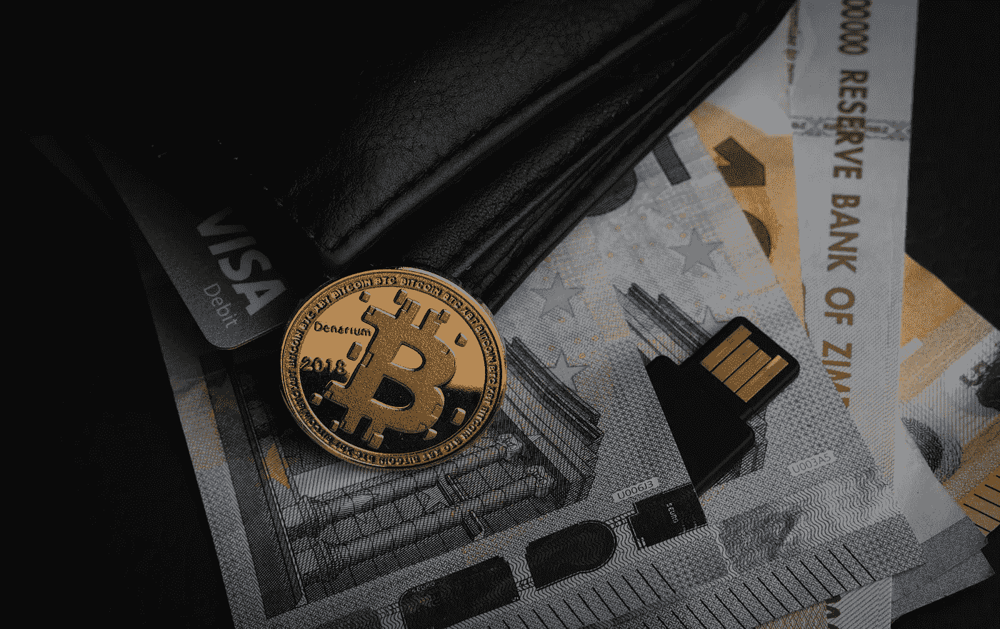

# 1 比特币= 3 万美元再创纪录

> 原文：<https://medium.datadriveninvestor.com/1-bitcoin-30-000-to-hit-another-record-52eb170b797b?source=collection_archive---------50----------------------->

## 有史以来第一次。比特币突破 3 万美元。半个月投资回报率高达 50%，持续上涨背后的风险不容忽视

Image by [MichaelWuensch](https://pixabay.com/users/michaelwuensch-4163668/?utm_source=link-attribution&utm_medium=referral&utm_campaign=image&utm_content=2007769) from [Pixabay](https://pixabay.com/?utm_source=link-attribution&utm_medium=referral&utm_campaign=image&utm_content=2007769)

周六晚，比特币有史以来首次突破 3 万美元，市值超过沃伦·巴菲特治下的伯克希尔。去年 12 月 16 日，比特币刚刚突破 2 万美元，短短半个月时间，投资者已经实现了高达 50%的回报率。

> 2021 年，比特币狂热还在继续！

1 月 2 日，比特币历史上首次突破 3 万美元！再次创下历史新高，最高接近 3.1 万美元，市值突破 5500 亿美元。

巴菲特旗下伯克希尔的最新市值为 5437 亿美元。

值得注意的是，去年 12 月 16 日，比特币刚刚突破 20000 美元，短短半个月投资者已经实现了高达 50%的回报率。

【2020 年 3 月，比特币价格一度跌破 5000 美元，但最近重拾升势。去年 12 月，比特币的价格上涨了近 50%。

一些分析师认为，比特币价格的上涨是投资者对冲美元走软的一种策略。

但与此同时，一些分析师认为，加密货币市场一直存在投机的因素，监管部门的行动可能是这一市场今年面临的主要不确定性。

比特币在过去一年的飙升是由多种因素推动的。机构投资者的进入，全球央行的宽松政策，比特币数量有限，突破 2 万美元后的市场狂潮，都是幕后推手。

 [## 2020 年:迄今为止最神奇的一年！

### 2020 年是近十年来最复杂最难言的一年。它带来了毁灭性的打击和灾难性的…

medium.com](https://medium.com/datadriveninvestor/2020-most-magical-year-yet-74ba3b82d174) 

# **持续飙升背后的风险不容忽视**

比特币持续大幅上涨，市场仍不时有理性声音，警告过度上涨背后是一种投机行为。

股市中的巴菲特也一直不太看好加密货币，认为存在泡沫:“我几乎可以肯定地说，它们会有不好的结局。买比特币不是投资，你是投机。如果你想赌有人会跟投，多出钱。那是游戏，不是投资。”

资产管理公司 CoinShares 的首席战略官 Meltem Demirors 警告说，加密货币行业未来可能会受到更多审查和更严格的监管。比特币仍然是一种不稳定的资产。如果投资进去，会有很大的风险。

Photo by [Aleksi Räisä](https://unsplash.com/@denarium_bitcoin?utm_source=unsplash&utm_medium=referral&utm_content=creditCopyText) on [Unsplash](https://unsplash.com/s/photos/bitcoin?utm_source=unsplash&utm_medium=referral&utm_content=creditCopyText)

# **比特币和黄金:哪个是更强的抗通胀安全天堂？**

在零利率甚至低利率时代，包括比特币在内的加密数字货币被暂时作为投资资产来“对冲通胀”。处于高光时刻的比特币，其投资价格和走势更吸引了投资者的关注。

**黄金**长期以来一直扮演着安全屋的角色，但投资者对比特币抗通胀安全屋功能的预期明显增强。

新疫情下，各国央行的财政刺激力度空前，包括美国国会两院批准了最新一轮规模达 9000 亿美元的刺激计划。

在这种超宽松的货币政策下，全球通胀预期上升，市场对抗通胀资产的需求大幅增加。

“在经济大幅波动的时期，数字和加密货币往往会受到更多关注，”专家认为，比特币价格的上涨本质上是全球数字周期的红利。

> 随着全球数字经济的加速发展，区块链技术和创新应用也在加速发展

对区块链基础设施的需求将直接推动对相应数字资产的需求，进而推动资产价格上涨。比特币是数字资产的一般等价物，这导致对区块链平台和数字资产的需求增加。会导致比特币的价格。

此外，今年比特币等区块链数字资产逐渐受到主流投资机构的广泛关注，并开始加速与主流金融体系的融合。

**回到 2019 年 10 月**

[PayPal](http://Paypal.com) 控股公司声明将允许客户使用加密货币。PayPal 今年 11 月再次声明，允许客户在线购买、出售和持有比特币和其他加密货币。

**与此同时**，从 2021 年初开始，其客户将能够使用加密货币在其网络上的 2600 万家商户进行购物。在线拍卖市场[易贝](http://ebay.com)正在与以加密货币为中心的购物应用 [Lolli](http://lolli.com) 合作，为其 1.27 亿用户整合比特币奖励。

 [## 苹果 iCar:规格和传言

### 路透社爆料称，苹果正在推进自动驾驶技术，计划在 2024 年生产一款乘用车…

medium.com](https://medium.com/datadriveninvestor/apple-icar-specs-and-rumors-299a41cfdedb) 

新加坡星展银行也为机构投资者推出了比特币和其他数字资产交易服务。在 DBS 数字交易所的帮助下，由银行、公司和投资者支持的数字交易所现在可以使用集成的解决方案生态系统来进入数字货币市场。

Photo by [Aleksi Räisä](https://unsplash.com/@denarium_bitcoin?utm_source=unsplash&utm_medium=referral&utm_content=creditCopyText) on [Unsplash](https://unsplash.com/s/photos/bitcoin?utm_source=unsplash&utm_medium=referral&utm_content=creditCopyText)

# 在获得更多关注的同时，比特币的未来风险也在被热议

虽然黄金在 2020 年的表现略逊于比特币，但与高风险的加密货币不同。中国区块链应用研究中心专家对 21 世纪经济报道记者表示，比特币的此轮上涨是海外机构投资者的进入。

一方面，越来越多的海外投资机构将比特币纳入投资组合。例如，管理规模超过 200 亿欧元的英国投资管理公司 Ruffer，其多策略基金持有的比特币资产约占总资产的 2.5%。

另一方面，一些上市公司也开始将比特币作为资产储备的一部分。Microstrategy 目前持有超过 7 万个比特币。

在这位中国专家看来，比特币走向主流是必然趋势。在全球量化宽松的背景下，比特币的稀缺性和与传统资产的低相关性使其成为机构分散投资风险、提升投资收益的较好选择，正逐渐取代黄金成为新的储备资产。

目前比特币的市值还不到黄金的十分之一。随着更多机构进入市场进行资产配置，比特币的价值还有很大的上升空间。

专家还表示，就整体规模而言，比特币仍然非常小。要达到和黄金一样的规模，需要 10 倍以上的增长空间。

随着大量以资产配置为目的的机构开始囤积硬币，比特币实际上已经进入了通货紧缩的状态。

> 20%到 50%暴跌背后的逻辑

天桥资本创始人认为，目前比特币大涨后存在暴跌风险，可能会突然暴跌 20%至 50%，投资者必须非常谨慎。

一位比特币投资者告诉记者，他最近不太关注比特币等加密货币。“在过去的两个月里，它变得疯狂了。我打算再观望一段时间。”

值得注意的是，自 2013 年 3 月比特币市值达到 10 亿美元以来，比特币经历了两次飙升至历史高点，随后又经历了价值缩水 80%以上的周期。2017 年比特币暴涨后的大幅下跌。

Photo by [André François McKenzie](https://unsplash.com/@silverhousehd?utm_source=unsplash&utm_medium=referral&utm_content=creditCopyText) on [Unsplash](https://unsplash.com/s/photos/bitcoin?utm_source=unsplash&utm_medium=referral&utm_content=creditCopyText)

在 2017 年 12 月创下 19783 美元的纪录后，比特币随后下跌 29%，跌幅高达 38%。在见顶后的第 31 天，比特币跌破 1 万美元，高点暴跌近 50%。

> **在接下来的两年里，它的价格一直处于很低的水平**

**今年 1 月至 10 月初**，比特币在 7000–11000 左右的相对低位徘徊。10 月开始，比特币从月初的 10731 美元涨到 28000 多美元。

过去一周，其变化幅度高达 5600 美元左右。

郭盛证券是一家中国国有金融服务公司，总部位于中国深圳。郭盛证券区块链研究员宋佳吉的团队告诉 21 世纪经济报道，较低的利率可能有几个前提来提振比特币。

**首先**，利率降低意味着无风险资产的收益率降低，风险资产的吸引力增加。

**第二个**是多次违约降低了固定收益类金融资产的吸引力，增加了权益类资产的吸引力。

**最后**，比特币被认为是一种权益资产。如果这些前提成立，比特币的价格可能还有上涨空间。

按照宋佳吉团队的说法，如果比特币 ETF 长期没有获得美国证券交易委员会(SEC)的批准；比特币基地和其他加密货币交易所被封锁，上市公司被禁止购买比特币以及其他类似事件发生，比特币价格面临压力。

**访问专家视图—** [**订阅 DDI 英特尔**](https://datadriveninvestor.com/ddi-intel)

 [## 硅谷面临逃离危机

### 加州是世界第五大经济体。但现在硅谷正面临前所未有的逃亡危机…

medium.com](https://medium.com/datadriveninvestor/silicon-valley-faces-an-escape-crisis-bb747e0d46af)