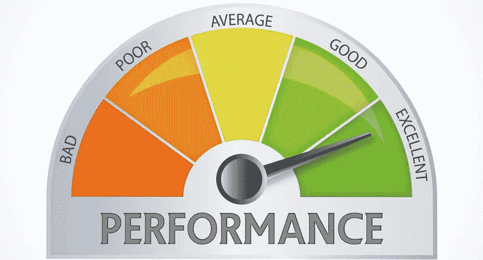
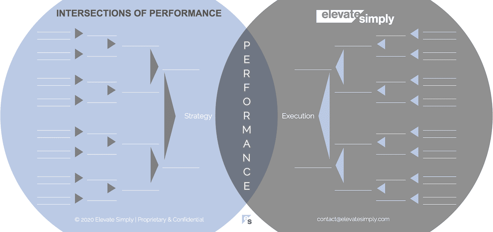

# 绩效:战略与执行的交叉点

> 原文：<https://medium.datadriveninvestor.com/1-performance-the-intersection-of-strategy-execution-2bf06329f8d4?source=collection_archive---------5----------------------->

Image from 123rf.com

是什么让一个公司或组织的业绩好坏？像高或低，伟大或可怕，惊人或可怕这样的性能描述符很容易被抛来抛去。通过选择“从好到坏”范围内的单词作为“性能”的前缀，我们做出了强有力的、结果性的陈述，不管这个断言是多么主观或客观。

确定公司如何实现业绩成功往往比判断本身更有意义和复杂。为了追求高性能，投入了大量的时间、金钱和精力。问题是，大多数时候这些投资都是在表面层面的调整，而不是根本原因驱动的系统分析或变革。

在剖析绩效时，所达到的成就水平是一个公司如何驾驭导致绩效的关键交叉点的结果。如果这些交叉路口导航成功，有较高的概率表现良好。

**什么是性能交集？**

绩效本身就是战略和执行的交集*(见下图交集 1)*。这不应该是一个惊喜。当然，好的战略加上好的执行可能会带来好的业绩。然而，这里的重点不是惊讶，而是提醒和加强。同样重要的是另一面，糟糕的战略加上糟糕的执行会导致糟糕的业绩。

交集 1:绩效=战略+执行

Image by [Brett Simpson](https://medium.com/u/191cf90a65d7?source=post_page-----2bf06329f8d4--------------------------------)

成功的领导者会找到优化绩效的方法，因为这很难保证。优化意味着让公司走向成功。听起来很简单，但做起来很难。我一直惊讶于人们对个人、团队或公司走向成功意味着什么的思考是如此之少。

**为成功做准备**

成功是一个过程。它从个人开始，移动到团队，然后到整个组织。然而，很多时候，领导者首先关注团队，并假设个人会赶上或适应，从而无意中破坏了他们自己的成功。我很少看到领导者有意把成功对团队成员个人的意义作为出发点。

通常我听到的是每个团队成员负责的任务列表，以及一些关于领导者认为团队成员能够完成的程度的陈述。这是一种范式，人们的期望是，一旦一个人有了他或她的待办事项清单，他或她应该能够从那里想出一切并执行，因为“我们一直都很忙，所以没有时间牵手”。

成功文化正在形成吗？

就像一份只列出责任而不列出成就的简历，团队成员被简单地归入任务所有权而不是可量化的、有意义的贡献，将会缺乏领导和表现不佳。这为成功文化制造了另一个障碍，即团队成员不理解他们的日常战术执行如何与公司战略甚至公司的目的联系在一起。

以我的经验来看，这种情况的发生是因为自上而下弥漫着一种假设，即人们会充分发挥增值能力，只是因为这是预期的。这是一种“责任止于此”的情况，在这种情况下，让每个人和每个团队获得成功的刻意做法必须得到高层领导的认可，并在整个组织中进行沟通。

要真正对整个公司的绩效产生重大影响，所有层面都必须有一种心态，即为了取得成功，“我需要确保我下面的人成功，我上面的人成功”。这种观点促进了对 1)需要做什么，2)需要如何做，3)为什么需要做的更全面的理解。

**领导者能做什么？**

作为领导者，我们经常会遇到我们能控制的因素和我们不能控制的因素。我们团队中那些人的成功是可以控制的，其程度比许多领导者意识到的要大。它需要时间和努力，这些都是稀缺资源。具有讽刺意味的是，作为一名领导者，从长远来看，你将浪费更多的时间和精力来处理一个优化不足的团队，而不是从一开始就花时间来创造成功文化。

成功取决于每个人如何处理完成工作所需的数据、决策和关系。领导者必须:

*   为团队成员提供数据
*   赋予团队成员人际关系，以及
*   为团队成员提供决策自主权。

我曾经从我的外祖父那里听到的一句话是，“如果你照顾好便士，美元就会自己照顾好自己。”他不是这句话的创始人，但这一教训适用于个人和团队的表现。作为一名领导者，如果你关注每个人的表现，团队的表现就会自然而然。如果每个团队都表现良好，再往上一层，公司的业绩就会走上正轨。

**总结&下一个**

说到性能，没有任何保证，这就是为什么我们专注于优化，而不是天真地假设确定性。总会有一些外部因素，其中大部分是可预测不可预测的，增加了不确定性，只能减轻，而不能完全解决。

如果公司文化允许领导者自由(并鼓励他们)安排团队中的个人，从而让团队本身走向成功，那么通过战略加执行来优化绩效的道路就更好走了。

下次我们将更详细地考察第二个交叉点，即**策略交叉点**。

*在这一系列文章中，我们探索*性能*的交叉点，共有 30 个。*绩效的交叉点*框架是基于*[*Brett Simpson*](https://www.linkedin.com/in/brettjsimpson/)*[*董事总经理(简称为*](https://www.linkedin.com/company/elevatesimply/)*)20 多年来作为企业家、顾问和投资者在大大小小的组织中的领导经验和见解。**

***绩效-文章链接的交叉点***

*1.[绩效:策略的交集&执行](https://medium.com/the-innovation/1-performance-the-intersection-of-strategy-execution-2bf06329f8d4)*

*2.[战略:领导力的交叉点&分化](https://medium.com/the-innovation/2-strategy-the-intersection-of-leadership-differentiation-a568b17731ab)*

*3.[领导:约定的交集&风险承受能力](https://medium.com/the-innovation/3-leadership-the-intersection-of-engagement-risk-tolerance-f8c887e6c1d3)*

*4.[差异化:创新的交叉点&意识](https://medium.com/@brettjsimpson/4-differentiation-the-intersection-of-innovation-awareness-a21d053ecf12)*

*5.[订婚:目的的交集&对齐](https://medium.com/@brettjsimpson/5-engagement-the-intersection-of-purpose-alignment-953747437c26)*

*6.[风险承受能力:机会的交集&估值](https://medium.com/@brettjsimpson/6-risk-tolerance-the-intersection-of-opportunity-valuation-29cf4d9a0ac)*

*7.[认知:信息的交集&关联性](https://medium.com/@brettjsimpson/7-awareness-the-intersection-of-information-relevance-f0fd5322bcb7)*

*8.[创新:创造力的交汇点&动机](https://medium.com/@brettjsimpson/8-innovation-the-intersection-of-creativity-motivation-7c1a12e0d5e2)*

*9.[目的:变化的交叉点&意义](https://medium.com/@brettjsimpson/9-purpose-the-intersection-of-change-meaningfulness-9f12b0153e1)*

*10.[估值:对价的交集&验收](https://medium.com/@brettjsimpson/valuation-the-intersection-of-consideration-acceptance-eebe7b15e763)*

*11.[机遇:欲望的交汇&责任](https://medium.com/the-innovation/opportunity-the-intersection-of-desire-accountability-7e81adb1e195)*

*12.[相关性:重要性的交集&及时性](https://medium.com/@brettjsimpson/relevance-the-intersection-of-importance-timeliness-56cc748eb066)*

*13.[信息:数据的交集&解读](https://medium.com/@brettjsimpson/information-the-intersection-of-data-interpretation-62acc94ba8bf)*

*14.[动机:焦点的交集&驱动](https://medium.com/@brettjsimpson/14-motivation-the-intersection-of-focus-drive-d9ebd3ca9951)*

*15.[创造力:观察的交集&独立性](https://medium.com/@brettjsimpson/15-creativity-the-intersection-of-observation-independence-57f7294acb2b)*

*16.执行力:毅力与交付的交集*(即将推出！)**

*17.交付:准备与能力的交集*(即将推出！)**

*18.毅力:天资与态度的交汇*(即将推出！)**

*19.准备:洞察力和一致性的交集*(即将推出！)**

*20.能力:坚持与质量的交汇点*(即将推出！)**

*21.态度:控制与成熟的交汇点*(即将推出！)**

*22.资质:努力与能力的交汇点*(即将推出！)**

*23.洞察力:评估与解释的交集*(即将推出！)**

*24.质量:彻底性和标准化的交汇点*(即将推出！)**

*25.坚持:乐观与勇气的交汇*(即将推出！)**

*26.成熟:经验与理性的交集*(即将推出！)**

*27.控制:果断与自信的交汇*(即将推出！)**

*28.能力:能力与实践的交集*(即将推出！)**

*29.努力:远见和职业道德的交集*(即将推出！)**

*30.走向:传播与综合的交汇点*(即将推出！)**