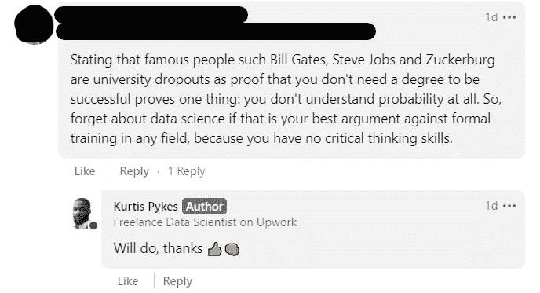

# 一年的数据科学博客

> 原文：<https://medium.datadriveninvestor.com/1-year-of-data-science-blogging-e3a9412e00e8?source=collection_archive---------11----------------------->

## 吸取的教训——值得吗？

Photo by [Damian Zaleski](https://unsplash.com/@zal3wa?utm_source=medium&utm_medium=referral) on [Unsplash](https://unsplash.com?utm_source=medium&utm_medium=referral)

今天标志着我接受直线经理的建议并决定开始写博客一周年。大约在去年的这个时候，我在 Medium 上发表了我的第一篇文章，现在我已经删除了这篇文章，因为我对公开展示我的作品非常不自信(事后看来，我绝不会删除它)。我现在写的这篇文章是我的第 88 篇文章。

Benjamin Obi Tayo 博士和 T2 的 Dario rade CII 博士让我有了探索数据科学博客对我有多大益处的想法。他们都比我早一年左右开始写博客，这是一件幸事，因为我有两个伟大的媒体同胞值得尊敬。以下是各自的文章:

 [## 一年的数据科学博客——值得吗？

### 你应该试一试吗？

towardsdatascience.com](https://towardsdatascience.com/one-year-of-data-science-blogging-was-it-worth-it-6022d38b9a02)  [## 2 年的数据科学博客

### 写博客不仅奇妙有趣，还会让人上瘾

benjaminobi.medium.com](https://benjaminobi.medium.com/2-years-of-data-science-blogging-e89439a50f45) 

对于那些已经关注我的博客一段时间的人来说，你可能知道我要说写关于数据科学的博客绝对是值得的。该领域的进步日复一日地让我惊叹，这总是给我提供灵感来发表这么多关于它的文章。虽然对于大多数人来说，开始写博客，一个关键因素(虽然可能不是唯一的)可能是可以赚取的收入潜力。

以下是我过去一年在 Medium 上写博客的**平均**收入:

*   每天 6.57 美元(2020 年 366 天)
*   每周 45.37 美元(2020 年为 53 周)
*   每月 200.40 美元

绝不是百万富翁浪子，也比我的一些同行谦虚得多。然而，直到 2020 年 10 月，我一直是一名全职实习机器学习工程师，每月额外的 200 美元绝对改变了我的生活。

> **注意**:我住在英国伦敦，所以按照目前的汇率，每月 200.40 美元(平均)相当于 147.05 美元。

以下是一些你可能会感兴趣的其他数据:

*   1 095 名追随者
*   416，712 次浏览
*   点击率最高的故事获得了 46k+的点击率( [**获得数据科学工作比以往任何时候都难**](https://towardsdatascience.com/getting-a-data-science-job-is-harder-than-ever-fb796aae1922) )
*   来自 358 个不同用户的 774 个点击量最高的故事(与上面的故事相同)

在我写博客的 1 年里，我的故事获得了 416，712 次浏览，其中 67%的浏览是在这一年的最后 4 个月获得的。你可能想知道发生了什么变化？。

嗯，我注意到那些靠媒体谋生的人每月写博客多达 56 次，相比之下，我每月随机发的博客只有 3-6 篇。尽管我知道我不想靠写博客谋生， 我想我会尝试一个小实验，所以在过去的 4 个月前的 2 个月，我致力于每周发布 3 篇文章——尽管每周我都不成功，导致每月 10-12 个月的总帖子波动——我相信这 2 个月的势头已经建立起来，并让我得到了 Medium 算法的认可，开始更多地展示我的故事，幸运的是，我的一些故事进入了 Medium Daily Digest 电子邮件(每天发送给成千上万的人)。

结果，我的文章的浏览量飙升至每月 20 万左右，并在 12 月前稳定在 7 万，而从 1 月到 7 月，我每月的浏览量为 3 万。

“中等收入”的收入不错，但由于收入不稳定，远远达不到 9-5。我认为最好是全职工作，除非你的财务状况可以承受这种波动。此外，我想说，只希望赚钱而接近中等水平也可能不是一个好策略，因为你很容易失去继续下去的动力。相反，你应该更加关注为他人增加价值——正如贝佐斯所说的，专注于你的客户。

现在我们已经了解了这一部分，让我们来看看媒体博客的一些好的和可以更好的方面。

## 好人

写博客的很多好处都超过了好处，所以对我来说从那里开始很有直觉。

**正反馈**

当一名博士生联系我，告诉我我的工作已经帮助他们克服了他们面临的一个障碍——无论是编码问题还是一般的数据科学问题(例如，如何开始，等等)，这总是对我的自尊心的一种促进。但总的来说，积极的反馈是一个主要的士气助推器，当数据科学领域职位比你高的人认可你的工作并引用它时，这尤其令人鼓舞。

当你发布好的内容时，积极的反馈经常发生，这种反馈循环无疑在我思考我可以做更多来帮助人们的方式中发挥了重要作用——例如，从零开始提出[算法系列](https://towardsdatascience.com/tagged/algorithms-from-scratch)。

**机遇**

由于我的博客，我接触到了无数的机会。其中之一是艾伦图灵研究所数据科学负责人 Ganna Pogrebna 在数据驱动播客中的一个专题。

我还出现在另一个播客上，该播客尚未发布，但录制起来也很有趣。

除了合作机会，我也有很好的工作机会，这也是我开始自由职业的原因。当我在 10 月份被解雇时，我已经收到了立即接受新工作的邀请。相反，我决定要提升技能，因此选择了一些自由职业的机会，作为我学习期间保持财务健康的媒介——然而，我相信即使我回到全职行业，我也会继续自由职业，因为这很有趣，你可以从不同的项目中学到很多东西。

**理解**

每当我对一个话题不确定或者我最近学到了一些新东西时，我会立即写下来，以更好地了解我的知识差距在哪里，以及我是否真正理解了我认为我理解的东西。每当我的知识有缺口时，我会立即寻找必要的信息并填补它。

我袖手旁观·理查德·费曼说过—

> "如果你不能用简单的术语解释某事，你就不理解它。"

它帮助我掌握了一些最复杂的数据科学概念，如机器学习。

## 可以做得更好

我称之为“可能更好”,因为我不认为被引用的“不好”的东西总是不好的，比如批评。在某些情况下，批评实际上会让你成为一名更好的数据科学实践者或作家，但如何表达会产生重大影响。

**粗鲁的批评**

如果我给你举个例子会更好，因为它可能会被误解。在最近的一篇文章中， [**我需要一个学位才能在数据科学领域找到工作吗？我认为，如果你想成为一名从业者，实际工作经验胜过花大量时间接受教育，因为你会更清楚什么在工业界行得通，什么行不通，而在学术界，你只能对不同的情况进行理论化和反思。**](https://towardsdatascience.com/do-i-need-a-degree-to-land-a-job-in-data-science-3e50b9a1a5e9)

在这篇文章的开头，我说“*我仍然认为，在某种程度上，关注某人的实际工作经验胜过他们的教育，即使我们看看科技领域一些最伟大的成就者，他们中的许多人都是辍学生——马克·扎克伯格、比尔·盖茨、&史蒂夫·乔布斯，仅举几例。*

这是我在 LinkedIn 上收到的回复:

Image By Author

关于这个人的帖子，我真的不反对他们。我相信他们说的很有道理，有人成为下一个比尔盖茨的几率很小，这一点我本可以说得更清楚。然而，如果这是这个人从博客上摘下来的，那么我怀疑他们是否真的读过，因为我绝对没有试图告诉任何人他们会成为下一个比尔盖茨和他的公司。

无论哪种方式，他表达观点的方式都可以更好，但如果你把自己放在那里接受审查，这是事情的一部分，我不是告诉人们应该如何提供反馈的人。

此外，不管对方的表达方式是否粗鲁，试着判断对方的观点也是非常重要的，因为从他们要说的话中仍有很多可以借鉴的地方。

一般来说，这是最突出的，因为最大的可能更好。将来，我会写一个关于如何开始写数据科学博客的完整帖子，并提供一些写作技巧来接近媒体(即出版物、策划等)。

## 包裹

总结一下我写的所有东西——是的，你肯定应该尽快开始写关于技术和数据科学的博客，开始写博客时要记住以下几点:

*   从简单开始，逐步积累
*   不要追逐硬币
*   为了你的利益而写作，并利用你所学到的知识让其他人学习起来更容易
*   接受粗鲁的评论，试着从他们所说的话中找到观点和价值
*   频率和良好的内容在这个平台上做得很好

这听起来很简单，但是保持一致并不像你想的那么简单。

通过 [LinkedIn](https://www.linkedin.com/in/kurtispykes/) 和 [Twitter](https://twitter.com/KurtisPykes) 与我联系，了解我关于数据科学的最新帖子。