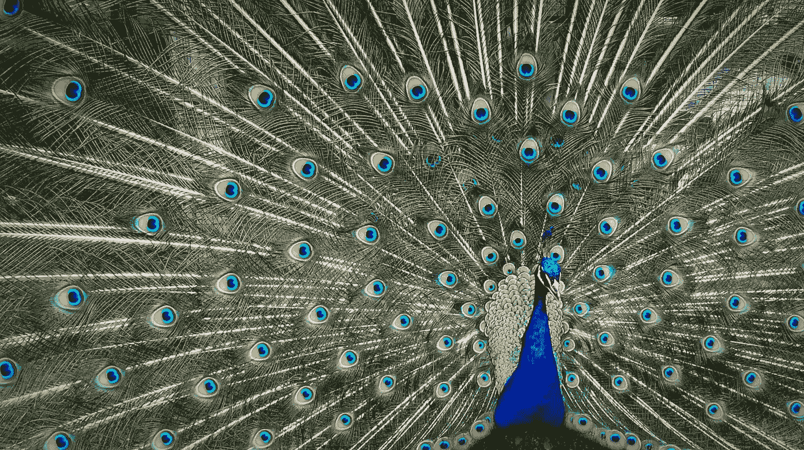

# 控制自我的 10 个行动

> 原文：<https://medium.datadriveninvestor.com/10-actions-to-control-your-ego-2ca29cefb8c3?source=collection_archive---------10----------------------->

所以它不会控制你

Photo by [Kelly Sikkema](https://unsplash.com/@kellysikkema?utm_source=unsplash&utm_medium=referral&utm_content=creditCopyText) on [Unsplash](https://unsplash.com/s/photos/ego?utm_source=unsplash&utm_medium=referral&utm_content=creditCopyText)

我的个人经历已经提炼出一个清晰的人生教训，那就是要有一个充实的人生，就必须抑制自我。是的，自我不一定是邪恶的，甚至可能是进步的重要催化剂。但是自我有时很难管理，因为它没有明确的界限，打破界限会给人一个信号，开始控制局面！

在我分享可能有助于抑制自我的 10 个行动之前，我必须强调，在所有这些行动中，潜在的主题是感恩，在我看来，没有感恩，自我就会控制我们，反之亦然。

> 感恩不仅是最伟大的美德，也是所有其他美德之母。
> 
> ~马库斯·图留斯·西塞罗

**1。快常**

饥饿有一种肉体的、身体的和直接的方式来抑制自我。它提醒我们对营养的依赖和人体的脆弱性。经过一整天的禁食，第一滴水感觉很珍贵，一种恢复活力的感觉随之而来，是一种感恩的感觉。

**2。参加葬礼**

除了支持悲伤的朋友和家人，向逝者表达敬意之外，每个葬礼都会因死亡的临近而震惊。经常回忆“momento mori”或“记住你一定会死”能让我们以不变的视角看待生命的有限性，因此很少允许一个人乘着自我的翅膀飘向妄想的天空。葬礼，尤其是让我们在很多方面都保持冷静。

**3。志愿者时间**

帮助教育弱势群体对一个人的心灵有着非常强烈的影响。有敬畏的时刻，例如，当你发现孩子们盯着一个彩色铅笔盒，终于第一次打开它，20 分钟后，他们睁大眼睛，笑得更开心，画出了他们的第一只鹦鹉。意识到我们认为理所当然的小事是如此之深，以至于一个人不禁对已经给予的东西感到感激，并为成为他人欢乐的管道而感到高兴。

**4。竞争起来**

作为一个 40 岁以上的人，尝试在激烈的运动或身体活动中与 20 出头的人竞争。然后，试着让一位 70 多岁的老人参与到一场哲学辩论中来，这位老人已经过上了一种被充分审视的生活。在这两种情况下，你的身体和智慧的差距在短时间内变得明显。谦逊的浪潮开始冲击自我的锯齿状岩石，这是一件好事。

**5。每三个月做一次慈善**

当然，在没有摄像机的情况下，为有需要的人提供食物和衣服。尽管如今，随着冠状病毒在全球范围内的封锁，这可能在后勤方面更具挑战性，但这一想法是在全年从事慈善活动。没有一个心脏跳动的人敢忘记他或她亲自帮助的人的眼睛。这些图像不断提醒我们命运有时是多么变化无常，并让我们保持谦卑。

**6。有幽默感**

如果你不能好好烘烤，那么也许是时候认真重温“项目自尊”了。一个以你为代价的好笑话应该带走一些沉重的虚张声势的空气，让你呼吸更轻、更干净的氧气！这就是为什么拥有强大家庭关系的人往往有更好的社交应对技巧，因为他们给予和接受终生的“软刺”，自嘲式的幽默深植于他们的 DNA 中。

**7。跟随你的榜样**

有一两个你真正钦佩的榜样，无论是个性还是品行，而不仅仅是技能。通常，技术高超的偶像会因其个人行为而令粉丝失望。观察这个榜样在受到赞扬时，在与普通人交谈时，在聚光灯变得炽热或暗淡时的表现。在不同的情况下，一个有良好基础的人总是会反映出他或她的谦逊和稳重的价值观。效仿那种善良。

**8。听听爱因斯坦和苏格拉底**

> “自我= 1/知识。知识越多，自我越少，知识越少，自我越多。”~阿尔伯特·爱因斯坦

我们获得的知识越多，我们就越意识到我们是一个永远在求知游戏中的学生。在知识不断增长的情况下，骄傲不应该持续，特别是对于那些保持足够谦虚继续寻求的人。

> 我知道我什么都不知道。~苏格拉底

尽管他被认为是他那个时代最伟大的思想家之一。获取知识只是提醒苏格拉底，他醒来时只是智慧的冰山一角。这是真正的自我解脱。

**9。'拆掉这堵墙'**

罗纳德·里根的柏林演讲以“……推倒这堵墙！”这四个字应该铭刻在任何一个与自尊抗争的人的心中。自我是一个很好的砌墙者。它不仅会将一个人与外界隔离，还会将他所爱的人推到墙的另一边。我注意到，自我膨胀的人在晚年会更加孤独。自我会给你的人际关系带来不必要的痛苦，其结果是几十年的复合效应。不要让这堵墙太高。

**10。专注祈祷**

真诚的请求是生活中最令人谦卑的经历之一——在我看来，无与伦比。祈祷者在要求上是无限的，但在行动上却是极其顺从的。承认一个人缺乏完全的控制和对外部因素的依赖可以缓和侵略性和野心勃勃的行为。我们在生活中都需要这种平衡，以获得更清晰的思维、更好的弹性以及更好的精神和情感健康。

 [## 良好的生活是习惯的形成|数据驱动的投资者

### 过度思考是过度紧张。仅仅几个简单的习惯就会在一天中产生巨大的影响。那是…

www.datadriveninvestor.com](https://www.datadriveninvestor.com/2020/01/17/a-good-life-is-habit-forming/) 

希望你有一个为你服务的自我，而不是相反。