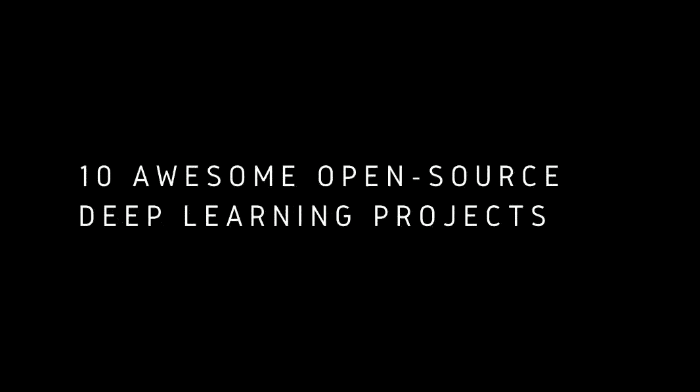
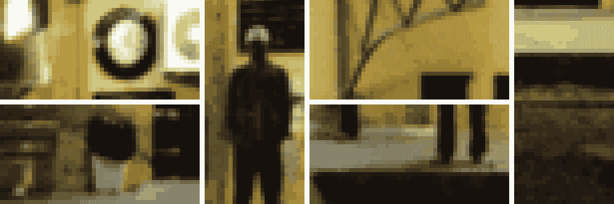
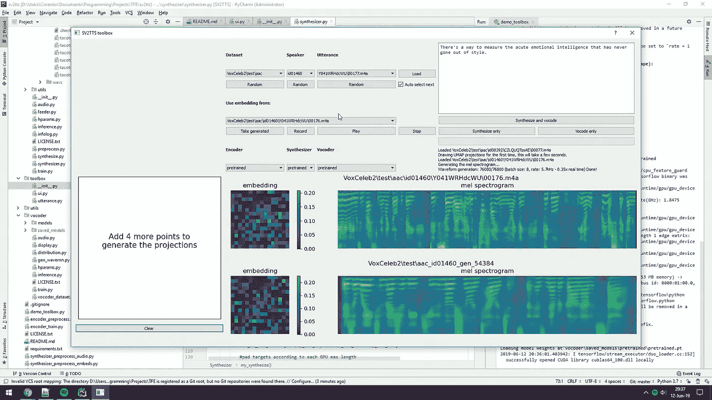
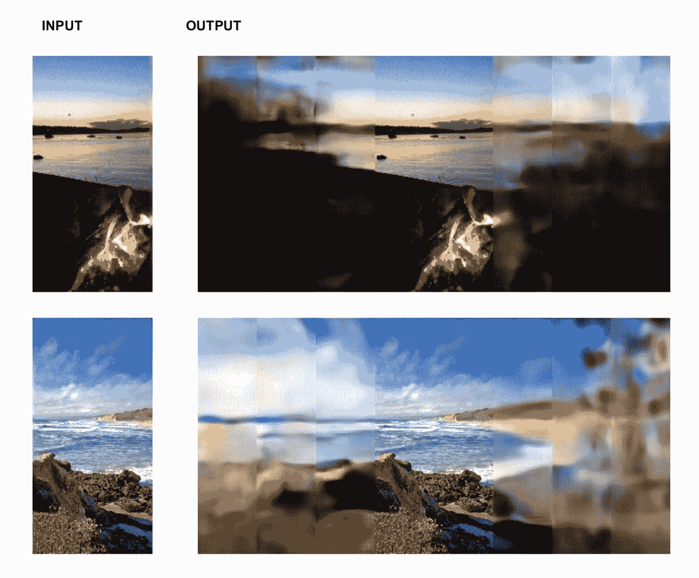
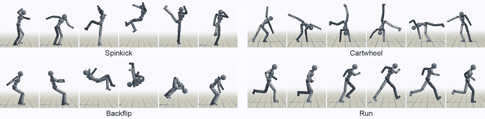
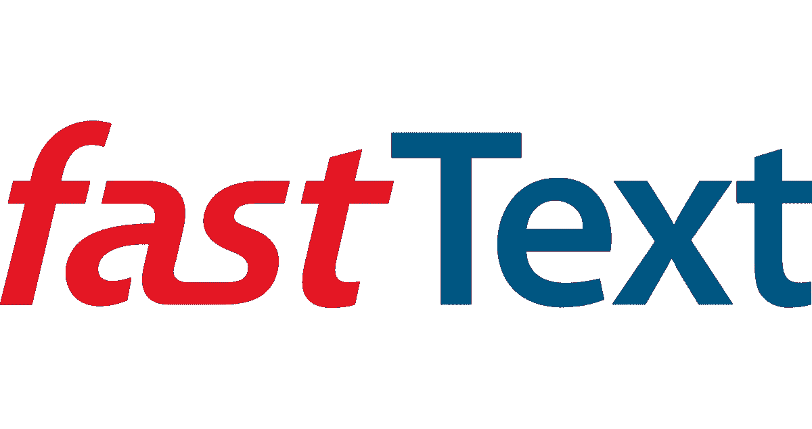

# 10 个令人敬畏的开源深度学习项目

> 原文：<https://medium.datadriveninvestor.com/10-awesome-open-source-deep-learning-projects-ec207fb397f6?source=collection_archive---------3----------------------->

## 2020 年你必须尝试的令人敬畏的开源深度学习项目列表

# 什么是深度学习？

深度学习是机器学习的子集，实际上是人工智能的子集。人工智能是一种使机器能够模仿人类行为的技术。机器学习是通过用数据训练的算法来实现人工智能的技术。最后，深度学习是受人脑结构启发的机器学习类型。

 [## 认知计算——一套被广泛认为是……

### 作为它的用户，我们已经习惯了科技。这些天几乎没有什么是司空见惯的…

www.datadriveninvestor.com](https://www.datadriveninvestor.com/2020/02/19/cognitive-computing-a-skill-set-widely-considered-to-be-the-most-vital-manifestation-of-artificial-intelligence/) 

我最近写了一篇关于开源机器学习回购清单的文章，你可以在这里参考[。在这篇文章中，我列出了 10 个开源深度学习项目，并附上了它们的链接。](https://towardsdatascience.com/list-of-awesome-open-source-machine-learning-repos-537fdc08ad4d)

## 1.[肺癌检测仪](https://github.com/ddhaval04/Lung-Cancer-Detection)

肺癌是最难识别的疾病类型之一，因此，要么癌症被诊断得太晚，要么根本没有被识别出来。癌症结节可能有各种各样的外观，需要很长时间才能了解所有不同的外观。作为这个问题的解决方案，[12-适马](http://www.12sigma.cn/)公司创造了一种使用深度学习的人工智能算法，这将帮助医生更有效地分析肺部的 CT 扫描。

## 2.[检测器 2](https://github.com/facebookresearch/detectron2)

Example of Detectron2

Detectron2 是脸书的人工智能研究软件系统。其中包括最先进的目标检测算法。它是用 python 编写的，由 PyTorch 深度学习框架提供支持。它被设计成可调整的，以支持新研究的敏捷实现和评估。

## 3.[面部互换](https://github.com/deepfakes/faceswap#deepfakesfaceswap)

Jennifer Lawrence/Steve Buscemi FaceSwap

Face Swap 是一个深度学习项目，它可以帮助你复制某人的脸，并将其放在另一个人的脸上。这项技术被广泛称为 Deepfakes。使用深度学习 deepfake 视频可以模仿真实人脸的工作和特征。从上面詹妮弗·劳伦斯和史蒂夫·巴斯米换脸的例子中，你可以看到这个换脸项目是多么的酷和令人毛骨悚然。

## 4.[波辉](https://github.com/NVIDIA/waveglow)

Waveglow 是一个基于流的语音合成生成网络，由 Nvidia 提供支持。它连接了来自 [Glow](https://blog.openai.com/glow/) 和 [WaveNet](https://deepmind.com/blog/wavenet-generative-model-raw-audio/) 的精明，以便在不使用自回归的情况下提供快速、高效和有效的音频合成。它仅使用单个网络来实现，仅使用单个成本函数来训练。这将导致更稳定和简单的训练程序。

## 5.[神经增强](https://github.com/alexjc/neural-enhance)

Example of Neural Enhance

Neural Enhance 可以从微小的像素化源图像创建详细的图像。利用这一点，你可以训练神经网络以 2 倍甚至 4 倍的速度放大图像。通过调整神经元的数量或使用与低分辨率图像相似的数据集进行训练，可以获得更好的结果。

## 6.[实时语音克隆](https://github.com/CorentinJ/Real-Time-Voice-Cloning)

[Video Demonstration](https://www.youtube.com/watch?v=-O_hYhToKoA)

实时语音克隆是一个深度学习项目，它需要 5 秒钟的时间来克隆某人的声音。所以你可以用他们的声音发出声音命令。这个项目仍处于早期阶段，听起来更像机器人。不管怎样，这都是一个非常酷的深度学习项目。

## 7.[图像溢出](https://www.youtube.com/redirect?q=https%3A%2F%2Fgithub.com%2Fbendangnuksung%2FImage-OutPainting&event=video_description&v=09hTTPYV3Jg&redir_token=jDhr6iAXzrLtteaV2JE4Nnb0dJx8MTU5MzEwNTMwN0AxNTkzMDE4OTA3)

Example of Image Outpainting

这个项目可以预测图像边界之外的视觉内容。这是斯坦福大学图像打印论文的 Keras 实现。上图显示了最终的输出是什么样的。

## 8.[深度模仿](https://github.com/xbpeng/DeepMimic)

Example of DeepMimin

DeepMimic 用于模仿人形，以精确和令人信服地再现从人类主体的运动捕捉数据中学习的动态和杂技身体姿势。这可以习惯于学习能够反映各种示例运动剪辑的鲁棒控制策略。DeepMimic 在动画行业中被大量使用，在这种行业中，你无法实际构建一些东西。

## 9.[快速文本](https://github.com/facebookresearch/fastText)

FastText 是脸书的另一个人工智能研究软件。这是一个允许用户有效地学习单词表示和文本分类的库。对于对自然语言处理感兴趣的人来说，这是一个很棒的库。

## 10.[郁金香翻译器](https://github.com/GoogleCloudPlatform/tulip)

Example of Tulip Translator

如果你想知道如果你的植物和花朵会说话，它们会对你说什么。使用谷歌云平台创建的郁金香翻译器，你可以与你最喜欢的花或植物进行模拟对话。

# 结论

如果你想找到更多关于机器学习的 GitHub repos，你可以在这里查看我以前的文章。如果你有我在这个列表中没有提到的你最喜欢的深度学习项目，请发表评论。谢谢，注意安全。

## 资源

 [## 2019 年你需要了解的最新深度学习项目| Edureka

### 深度学习显然是一个在过去几年里取得了疯狂进步的领域。这些进步已经…

www.edureka.co](https://www.edureka.co/blog/deep-learning-projects/) 

**访问专家视图—** [**订阅 DDI 英特尔**](https://datadriveninvestor.com/ddi-intel)