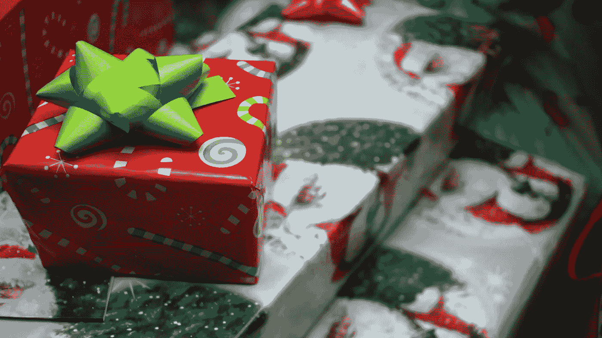

# 给开发者的 10 个最佳礼物创意

> 原文：<https://medium.datadriveninvestor.com/10-best-gift-ideas-for-developers-1aef7c635885?source=collection_archive---------19----------------------->

## 假日

## 为开发者准备节日礼物的想法和建议列表

Photo by [Halacious](https://unsplash.com/@halacious?utm_source=unsplash&utm_medium=referral&utm_content=creditCopyText) on [Unsplash](https://unsplash.com/?utm_source=unsplash&utm_medium=referral&utm_content=creditCopyText)

圣诞节就要到了。即使是在疫情，或者因为疫情，我们也可能想给别人(也许是我们自己)一份特殊的礼物。如果你的朋友、家人、男朋友或女朋友是程序员，而你正在寻找一份完美的礼物，我有一些想法想和你分享。

我精心挑选了 10 个礼物点子，正好能让你的开发者朋友开心。由于它们的价格从相对昂贵到便宜不等，您可以根据您的预算和偏好选择以下任何产品。

读完这篇文章后，你就可以开始买礼物了。

> 一些链接可能是附属链接。我们可能会得到报酬，如果你买东西或采取行动后，点击其中一个。

# 机械键盘

拥有完美键盘的开发人员是快乐的开发人员。没有比机械键盘更好的了，尤其是如果你送键盘的人也是游戏玩家。

有各种价位的机械键盘。我用的是 [Keychron K6](https://www.amazon.com/Keychron-Backlight-Aluminum-Mechanical-Keyboard/dp/B07ZT1BXKC/ref=as_li_ss_tl?ie=UTF8&linkCode=ll1&tag=livecodestrea-20&linkId=19b7c4203ebd7ead446faabaaada28c0&language=en_US) 键盘。它是无线的，电池可持续 72 小时。这是我的日常驱动器，也是我用来写这篇文章的驱动器。这是一个任何开发者都会喜欢的神奇键盘。

键盘也有不同的尺寸，因此 Keychron 还提供了 [Keychron K2](https://www.amazon.com/Keychron-Wireless-Bluetooth-Mechanical-Keyboard/dp/B07Y9Y69N7/ref=as_li_ss_tl?dchild=1&keywords=keychron+k2&qid=1607375996&sr=8-3&linkCode=ll1&tag=livecodestrea-20&linkId=d412358eba125d3e13c919c495df3c6d&language=en_US) 和 [Keychron K1](https://www.amazon.com/Keychron-Ultra-Thin-Wireless-Bluetooth-Mechanical/dp/B07YJSM85Z/ref=as_li_ss_tl?dchild=1&keywords=keychron+k1&qid=1607376072&sr=8-3&linkCode=ll1&tag=livecodestrea-20&linkId=3629d85175bd8a2c20365856e3091cda&language=en_US) ，前者提供了额外的一行功能键，后者提供了单独的箭头键。

可能我最喜欢的键盘是 Ducky One 2 SF，这是一个非常棒的键盘，带有樱桃开关(一些最好的开关)。它超级可定制，舒适，但有点贵。

# 一只老鼠

鼠标是开发人员的另一个生产力工具；必备。有各种各样的鼠标可供选择。如果你想用你的礼物给某人留下深刻印象，那就用无线的、符合人体工程学的、快速滚动的或高精度的鼠标。

最好的鼠标选择之一是罗技 MX Master 3。它有一个优雅的设计，符合人体工程学和无线，并有一个拇指轮，允许水平滚动。您最多可以同时将它与 3 台设备配对。这款鼠标的最大特点之一是滚轮及其快速模式。它改变了游戏规则。是我用的鼠标(我自己有 MX Master 2，但是有机会我会升级的)。

另一个高价但便宜的选择是[罗技 M720 铁人三项](https://www.amazon.com/Logitech-Triathalon-Multi-Device-Wireless-Mouse/dp/B01LF37K80/ref=as_li_ss_tl?ie=UTF8&linkCode=ll1&tag=livecodestrea-20&linkId=157fa17ca55d565b62841330dc92cb4a&language=en_US)无线鼠标。像 MX Master 3 一样，它可以与多达 3 个设备配对，并支持超快速滚动。

# 树莓派

如果你的朋友喜欢机器人、物联网设备或玩电脑硬件，你可以送给他们的最好礼物之一就是树莓派。凭借其 40 个 GPIO 引脚，您的朋友将能够构建从机器人到成熟的计算机和网络服务器的一切。

最新一代的树莓 Pi 是[树莓 Pi 4 B](https://www.amazon.com/dp/B07TC2BK1X/ref=as_li_ss_tl?ie=UTF8&linkCode=ll1&tag=livecodestrea-20&linkId=95319d76424564dca63aaf5c58d73f46&language=en_US) 。它有一个 64 位四核处理器，能够支持分辨率高达 4K 的双显示器，并支持 wifi 和千兆以太网连接。您也可以从 1GB、2GB 和 4GB RAM 容量中选择一种。

# 一本编程书

赠书是一种永不过时的仪式。你的礼物将会非常乐意为他们的收藏增加一本书。你必须克服的唯一障碍是事先做一些调查，弄清楚他们是否已经拥有你希望赠送的书。

对于渴求知识的开发人员来说，有几本编程书籍可供选择。我们已经为程序员提供了一个最佳书籍推荐列表，所以你不必为不同的选择而不知所措。从列表中选择一本书或三本，你的书将成为你的朋友在圣诞节收到的最好的礼物之一。

# 白板

白板是可视化抽象概念的完美工具，比如系统设计和算法。特别是在疫情期间，当大多数开发人员在家工作时，他们是收集和组织您的想法、向他人展示想法以及记录您希望立即完成的事情的宝贵工具。

不管怎样，白板对于开发者来说是一个很好的礼物。你的礼物可以取代他们的旧白板，或者向他们介绍白板练习。最重要的是，白板不会花你很多钱，但仍然是一个很好的礼物。更好的是，你可以从[一系列尺码中选择最合适的](https://www.amazon.com/Whiteboard-Set-Dry-erase-Scoreboard-Landscape/dp/B01DJJXYZG/ref=as_li_ss_tl?ie=UTF8&linkCode=ll1&tag=livecodestrea-20&linkId=59aa06b683aec0ddf667fed867a56759&language=en_US)。

 [## 我作为软件工程师学会的 4 个关键习惯|数据驱动的投资者

### 我从事软件工程已经快 3 年了。老实说，我不认为我擅长这个(我不知道我会不会…

www.datadriveninvestor.com](https://www.datadriveninvestor.com/2020/10/12/4-key-habits-i-learned-as-a-software-engineer/) 

# 一门深奥的课程

赐予知识的力量。如果你知道你的开发朋友热衷于学习但还没有开始的东西，这是一个无价的礼物。 [Udemy](https://click.linksynergy.com/fs-bin/click?id=A4mR6mRW38Q&offerid=507388.81&type=3&subid=0) 有各种各样的课程，你可以选择任何主题或领域。最棒的是，如果你关注 Udemy 的闪购活动，你可以以高达 90%的折扣买到你想要的课程。

一些最受开发者欢迎的 Udemy 课程有:

*   [现代 React with Redux](https://click.linksynergy.com/deeplink?id=A4mR6mRW38Q&mid=39197&murl=https%3A%2F%2Fwww.udemy.com%2Fcourse%2Freact-redux%2F) 斯蒂芬·格里德:如果你想掌握 React 和 Redux，这是最好的课程之一。
*   学习和理解 NodeJS(作者 Anthony Alicea ):本课程向您全面介绍 Node.js，包括它的工作原理以及更高级的概念，如缓冲区和流。
*   [完整的数据科学训练营](https://click.linksynergy.com/deeplink?id=A4mR6mRW38Q&mid=39197&murl=https%3A%2F%2Fwww.udemy.com%2Fcourse%2Fthe-data-science-course-complete-data-science-bootcamp)由 365 Careers Team 提供:如果你想要一个流畅但完整的数据科学入门，这个课程将是完美的。

# 降噪耳机

程序员讨厌分心。特别是如果你在家工作，有更多的机会从你的工作中分心，因为家里有家人和孩子。那么，有什么比降噪耳机更好的方法来抵消噪音呢？

虽然不是很划算，但它们是专注于工作和收听您最喜欢的 Spotify 播放列表的绝佳礼物。下面是我的推荐:[索尼 WH1000XM3](https://www.amazon.com/Sony-Noise-Cancelling-Headphones-WH1000XM3/dp/B07G4MNFS1/ref=as_li_ss_tl?ie=UTF8&linkCode=ll1&tag=livecodestrea-20&linkId=0fd32094c55b7f54caf19b1636e066fb&language=en_US) 和 [Bose QuietComfort 35 II](https://www.amazon.com/Bose-QuietComfort-Wireless-Headphones-Cancelling/dp/B0756CYWWD/ref=as_li_ss_tl?ie=UTF8&linkCode=ll1&tag=livecodestrea-20&linkId=1e6a4cbcaa72de7d190457c997ff5aa4&language=en_US) 。

我不是耳机方面的专家，但是当我征求推荐的时候，这两个是最受欢迎的。

# 外置硬盘

无论你的朋友是什么类型的开发者，外置硬盘都是一份不可浪费的礼物。它们对于存储我们的文档、照片或视频的备份副本总是很有用。当您的设备磁盘空间不足时，它们还可以用作电脑的外部存储器。

在决定购买哪种硬盘时，你可以选择硬盘或固态硬盘。与相同存储大小的硬盘相比，固态硬盘价格昂贵，但可以提供高速数据传输。

硬盘的最佳选择是这款[希捷备份加便携式硬盘](https://www.amazon.com/dp/B0196J3UZ2/ref=as_li_ss_tl?ie=UTF8&linkCode=ll1&tag=livecodestrea-20&linkId=6474d3ca30283245db0b1f86c4ec4769&language=en_US)。 [SanDisk Extreme 便携式外置固态硬盘](https://www.amazon.com/SanDisk-Extreme-500GB-Portable-SDSSDE60-500G-G25/dp/B078SWJ3CF/ref=as_li_ss_tl?ie=UTF8&linkCode=ll1&tag=livecodestrea-20&linkId=593ba631cd503a20fa1eb53e8106c6ea&language=en_US)是固态硬盘前端的完美选择。

# 一个有趣又厚脸皮的杯子或 t 恤

如果你正在寻找一件能让你朋友开心的礼物，一定要选择一些有趣和厚脸皮的东西，比如一个马克杯或者一件印有令人捧腹的编程笑话的 t 恤。它们很便宜，但总能成为令人难忘的礼物。

你可以穿这件“我把咖啡变成代码”t 恤或者这件[的“吃饭，睡觉，代码，重复”t 恤](https://www.amazon.com/CreativeIdeas-Repeat-T-Shirt-Casual-Collar/dp/B07V9V9LF8/ref=as_li_ss_tl?dchild=1&keywords=eat+sleep+code+shirt&qid=1607377637&sr=8-9&linkCode=ll1&tag=livecodestrea-20&linkId=10808cce92ad95cd1e258e8b74da3923&language=en_US)。在亚马逊上花几分钟，你就能找到几十件专为开发者制作的 t 恤。

还有一个爆笑的马克杯集合，里面有糟糕的编程笑话。看看这个[“我从另一个本该是邮件杯的会议中幸存下来”](https://www.amazon.com/Willcallyou-Survived-Another-Meeting-Should/dp/B07TXL7T1D/ref=as_li_ss_tl?ie=UTF8&linkCode=ll1&tag=livecodestrea-20&linkId=ec01f23181913d54305379425fc78908&language=en_US)和[“调试的 6 个阶段”杯](https://www.amazon.com/Debugging-Programmer-Humorous-Computer-Science-Mug-Novelty/dp/B07P5F8T5D/ref=as_li_ss_tl?ie=UTF8&linkCode=ll1&tag=livecodestrea-20&linkId=f3a1372b0c4a21e9f7d2b32b391d9c10&language=en_US)。

# 礼品卡

如果你不确定送礼者的喜好和习惯，送他们一张礼品卡是你能选择的最好的礼物。这让他们可以选择用卡买任何他们想要的东西，你也不用担心他们不喜欢你的礼物或者觉得它没用。

你可以在网上轻松买到一张亚马逊礼品卡。如果朋友是咖啡迷，你可以给他们一张星巴克礼品卡。

你也可以购买网飞和 Spotify 的礼品卡。即使你的朋友已经订阅了网飞和 Spotify，他们也会感激有几个月不用自掏腰包支付订阅费的机会。

# 结论

有多种礼物可供开发商选择，涵盖所有价格范围。无论你选择什么，记住节日都是关于在一起享受彼此，而不是我们收到什么礼物。

我希望你喜欢这篇文章，如果你有任何其他建议，请在评论中告诉我们。

感谢阅读！

## 访问专家视图— [订阅 DDI 英特尔](https://datadriveninvestor.com/ddi-intel)