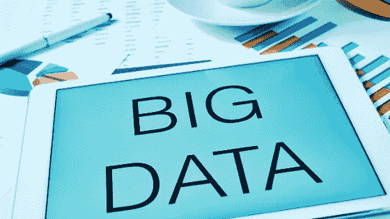

# 每个初学者都应该知道的 10 个数据分析术语

> 原文：<https://medium.datadriveninvestor.com/10-data-analytics-terms-every-beginner-should-know-73e590ecb1b9?source=collection_archive---------2----------------------->

如果您刚刚开始数据分析，并且不熟悉一些基本术语，不要担心。在 Cangler，我们为您介绍了该领域每个人都应该知道的十个基本数据分析术语。从不同类型的数据分析，到数据分析和机器学习之间的交叉，本文将对当今该领域中使用的一些简单而基本的概念和过程进行必要的介绍。

**本文将涵盖以下数据分析术语:**

1.  数据分析
2.  描述性分析
3.  诊断分析
4.  预测分析
5.  规定性分析
6.  数据挖掘
7.  云/基于云的
8.  机器学习
9.  资料组
10.  大数据/大数据分析

# 什么是数据分析？

数据分析就是收集、展示和评估数据，以帮助做出明智的决策。这种分析的复杂程度可以从分析天气模式到评估 Twitter 帖子以预测股市波动。

根据分析任务的最终目标，数据分析分为不同的类型或流程。

 [## 数据科学和软件工程哪个更有前途？数据驱动的投资者

### 大约一个月前，当我坐在咖啡馆里为一个客户开发网站时，我发现了这个女人…

www.datadriveninvestor.com](https://www.datadriveninvestor.com/2019/01/23/which-is-more-promising-data-science-or-software-engineering/) 

# 什么是描述性分析？

简而言之，描述性分析是以清晰易懂的方式向目标受众呈现数据。借助描述性分析，您的数据通常会以图形、图表和其他信息图的形式转化为视觉效果。

虽然数据分析的其他领域处理如何分析数据并从中得出结论，但描述性分析的目标只是以最有效的方式呈现数据。

这在处理历史业务数据时尤其重要，比如销售数字随时间的上升和下降。

描述性分析的职责也是在上下文中准确地呈现数据。如果与去年相比，你的销售额大幅下降，仅仅显示你公司今年销售额的增长可能是不够的。

在这种情况下，最好将去年和今年的销售情况绘制在同一个图表上，以显示与前一年相比你的表现如何。

# 什么是诊断分析？

描述性分析试图简单地呈现数据，而诊断性分析则试图深入挖掘数据，找到事情发生的原因。例如，为什么你的销售数字会在四月激增？为什么今年 4 月份的销售额低于去年？

诊断分析让我们深入了解为什么数据点保持静止或向某个方向移动。使用诊断分析，有时您必须在数据本身之外寻找，并从内部和外部的其他数据来源中得出可能的相关性。

# 什么是预测分析？

顾名思义，预测分析侧重于使用统计数据来发现模式和预测数据的移动。在实践中，预测分析可以用来在问题发生之前预测问题，或者预测销售增长和其他业务指标。

从简化维护计划到分析营销活动，预测分析可以惠及各行各业。

你可能熟悉的预测分析的一个好例子是网飞和其他流媒体网站上的推荐系统。

通过使用你的观看历史、搜索历史和评级等数据，网飞的系统使用一种算法来预测你会喜欢目录中的哪些节目和电影。类似的系统被亚马逊用来推荐商品，被谷歌用来选择向你展示哪些广告。

# 什么是规定性分析？

将预测性分析向前推进了一步，规范性分析寻求利用数据提供的可操作的见解。

预测分析为您提供原始数据预测，而规范分析则寻求根据数据为您提供各种行动计划。

与每个计划相关的预计结果和风险也将包括在内，以便进行比较和采取行动。

# 什么是数据挖掘？

顾名思义，数据挖掘就是从各种形式的非结构化数据中提取有用信息的过程。这些数据可以是文本、图像、音频等形式。

非结构化数据的主要区别在于，它尚未经过处理、标记或格式化，无法用于数据分析或机器学习算法。

数据挖掘的一个现代例子是社交媒体帖子的[情感分析](https://lionbridge.ai/services/sentiment-analysis/)以确定品牌认知度。这是通过抓取一个社交媒体平台，如 Twitter，并收集大量帖子来完成的。然后对这些帖子进行审查，以了解公众对你的公司或品牌的看法。

# 云或基于云的是什么意思？

“云”不是机器学习的专有术语，而是指在线存在的数字空间。

因此，当您听到诸如基于云的数据存储这样的术语时，它指的是一种存储系统，其中您的数据托管在远程服务器上，而不是存储在本地。

这意味着数据不是直接保存在你电脑的硬盘上，而是保存在你通过互联网访问的服务器上。

# 什么是机器学习(ML)？

[机器学习](https://lionbridge.ai/articles/whats-the-difference-between-ai-machine-learning-and-deep-learning/)是一个研究领域，它使用算法来处理数据，并以类似于人类的方式进行学习。

正是由于机器学习，我们才有了令人惊叹的技术，比如自动驾驶汽车和语音助手，今天我们可以使用这些技术。随着机器学习行业的发展，越来越多的人正在使用基于 ML 的算法进行数据分析。

# 什么是数据集？

数据集只是一组数据，通常组织成行和列。当训练机器学习或数据分析算法时，[数据集](https://lionbridge.ai/datasets/ultimate-dataset-aggregator-for-machine-learning/)被分成训练和测试两部分。

训练数据集用于开发模型，测试数据集用于评估模型的准确性。

# 什么是大数据或大数据分析？

从互联网流量到用户行为，大大小小的许多公司都可以访问非常大的、通常是非结构化的数据集。大数据是指用于处理大型数据集的数据分析方法，这些数据集通常包含数十万(如果不是数百万)行数据。

这些只是你今天在数据分析中听到的一些最常见的术语。希望这些术语能帮助你在整个旅程中理解关于数据分析的更复杂的文章。有关更多数据分析指南和资源，请查看以下文章:

*最初发表于*[T5【https://blog.getcangler.com】](https://blog.getcangler.com/10-data-analytics-terms-every-beginner-should-know)*。*