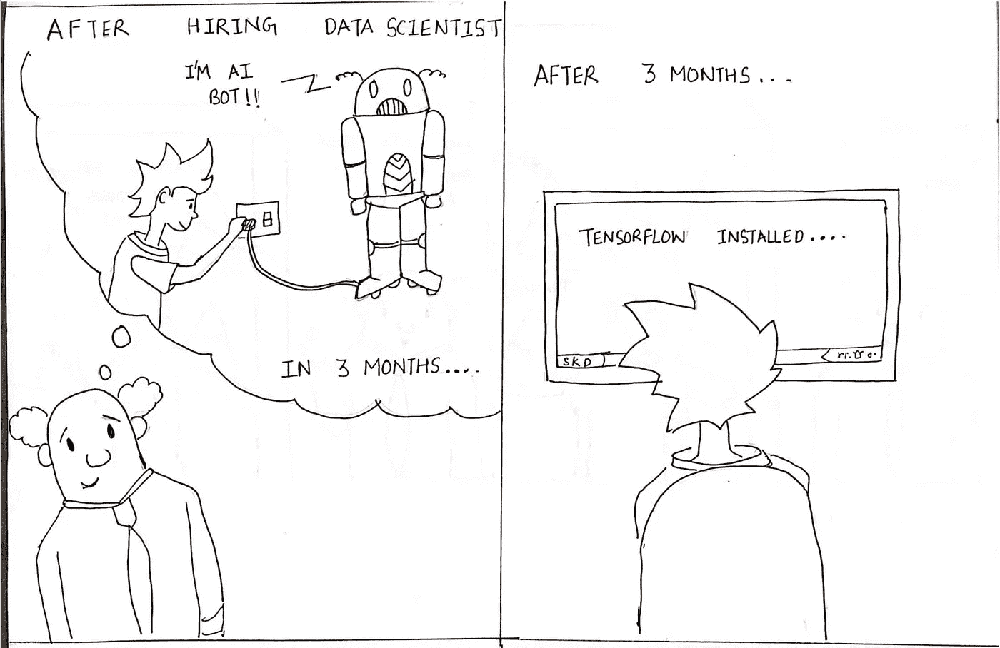

# 让数据科学发挥作用的 10 个维度(第 1 部分)

> 原文：<https://medium.datadriveninvestor.com/10-dimensions-of-making-data-science-work-2057183f0770?source=collection_archive---------1----------------------->

## 期望:维度#1

Expectation from Data Science by [Sumit Dutta](https://www.instagram.com/amatuer_chitrakar/)

*“你所说的数据科学是什么？”*

当我在 [xto10x](https://medium.com/u/61021e800281?source=post_page-----2057183f0770--------------------------------) 时，我曾多次向初创企业生态系统中不同背景和职能的人问过这个问题——创始人、技术领袖、企业高管、运营负责人等等。这些回答围绕着从数据中提供见解，建立自动化智能和应用深度学习的最新趋势。

通过我们的多次对话，我们得出了数据科学最简单的定义— ***让数据对业务有用*** *。这个定义不仅有助于揭开这个术语的复杂性，而且让组织中的每个人都有责任让它发挥作用。那么下一个问题自然是*

*如何让数据科学有效工作？*

对这个问题的回答引导我们找到了让数据科学发挥作用的 10 个维度。在一家初创企业从刚刚实现产品市场匹配的年轻公司到成熟的数据驱动型组织的演变过程中，每个维度都有成熟的阶段。这面向初创企业生态系统中的所有决策者，包括在让数据科学为其组织服务方面发挥作用的创始人。

在这个系列的第一部分，我们将讨论第一个也是最重要的方面——期望。

# 期望:要么成功，要么失败

对任何计划抱有正确的期望几乎是实现有效性的 80%的工作。许多人都会同意，组织中的新职能或计划(尤其是数据科学)通常会因为以下原因之一而受到影响或无法提供正确的结果——缺乏对预期目标的明确性，或者对这种高度投入的精英职能(称为数据科学)抱有错误的预期。这里有 5 个阶段，你可以期待这个*让数据变得有用的整个旅程*会如何发展。

*   **第一阶段** : **构建适应型—** 在这个阶段，初创企业只是在反复构建解决方案，以找到与市场的契合点。在这里，数据的唯一用途是验证通过实验构建产品的假设和直觉。
*   **第二阶段:跟踪业务—** 在这个阶段，初创企业正处于扩展之旅，因此数据最重要的作用是回答这样一个问题—“*业务进展如何？”*尽可能快，用最少的人力。在这个阶段，您所能期望的就是在自动化仪表板上定期跟踪 L0 和 L1 指标。通常，这是投资获取数据战略蓝图的正确阶段，以便企业在 12-18 个月后实现目标。这有助于为所有团队定义路线图，平衡长期和短期带宽分配实践。
*   **第三阶段:v0 时代—** 当一个业务是可追踪的时，很明显会引出这样的问题— *“为什么会这样？我们该如何改善这一点？”就像他们说的，你只能改进你能衡量的。这就产生了几个分析性问题得到回答的时期，以及通常称为零版本(v0)的基本模型和规则框架的建立，这些模型和框架帮助人们更好地做出决策，并使决策的某些部分自动化。在这个过程中取得的低挂果实设定了一个基线，需要通过进一步的阶段来打破。*
*   **阶段 4:平台和生产** —这是应用复杂性的基本要求的阶段。像数据平台、实验平台、功能商店和机器学习服务平台这样的平台已经建立起来，如果没有这些平台，只有雇佣数据科学家在笔记本上建立模型，要么需要几个月的时间，要么根本无法投入生产。在此阶段，跨多个团队协作解决正确的问题并启用平台以加快生产速度是关键。这实际上是正确利用数据的非线性影响开始显现的时候。想象一下，一个创始人和领导团队需要多大的耐心和正确的期望才能从一开始就达到这个阶段。
*   **第 5 阶段:清洗和重复—** 最后一个阶段是成熟阶段，数据科学功能扩展到新形成的垂直业务领域。成熟的数据驱动的工作方式现在已经深入到每个业务部门，这个循环又开始了。

对各个阶段有正确的预期和理解的关键是要意识到数据科学的新陈代谢率与业务运营有很大不同。这一功能需要经历这些阶段的孕育期，并得到培育才能蓬勃发展。

很快，我们将在本系列的第 2 部分中讨论第二个维度的战略。

*内容与* [*阿南德·夏尔马*](https://medium.com/u/ce87d9792f4a?source=post_page-----2057183f0770--------------------------------) *和* [*马内什·米什拉*](https://medium.com/u/b25fb0a8be01?source=post_page-----2057183f0770--------------------------------) *而在* [*xto10x*](https://medium.com/u/61021e800281?source=post_page-----2057183f0770--------------------------------)