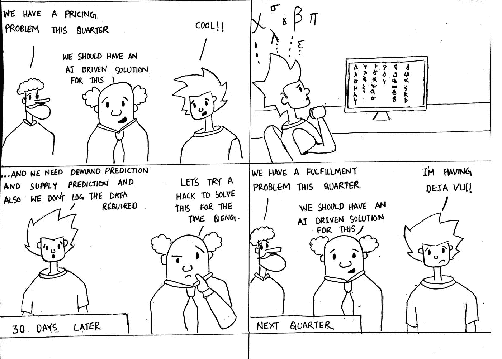

# 让数据科学发挥作用的 10 个维度(第二部分)

> 原文：<https://medium.datadriveninvestor.com/10-dimensions-of-making-data-science-work-3be4358a991d?source=collection_archive---------5----------------------->

## 战略:维度#2

Strategy for Data Science by [Sumit Dutta](https://www.instagram.com/amatuer_chitrakar/)

这是让数据科学发挥作用的 10 个维度系列的第 2 部分。在[第 1 部分](https://medium.com/@godaramkumar/10-dimensions-of-making-data-science-work-2057183f0770)中，我们讨论了协调的最重要维度，以便对数据科学功能有正确的预期。下一个维度我们称之为*数据策略*。在 A 轮或 B 轮阶段，几位联合创始人多次问我这个问题，我对他们的回答都是一样的。

> 问:什么时候是数据科学的合适时机？我们应该等吗？
> 
> 答:数据科学可以等，但数据战略不能等。

数据战略是一个需要理解的关键维度，因为组织中除了数据科学家之外的每个人都是这个维度的所有者。对于大多数组织来说，数据策略可以归结为— *让我们开始收集我们能够收集的所有数据。当我们拥有大量数据时，我们应该雇佣一些数据科学家，这应该会开始见效。*但是这个维度的数据策略不是关于收集我们*能收集的所有数据而是关于收集我们*应该收集的所有数据。**

# **策略:从终点到达终点的艺术**

**从 ***可以*** 到 ***应该*** 关于数据收集的旅程从明确数据应该为组织实现什么目标开始。创始人的清晰性渗透到设计最终用户体验和界面的人身上。这里有几个例子可以更好地说明这一点。**

*   **数据是实现移动市场供需平衡的主要促成因素。如果用户界面设计为仅在找到履行选项后收集目的地，则未履行需求的预期目的地将丢失。数据的大部分价值都丢失了，因为它无法帮助了解需求以平衡供应。**
*   **如果一个电子商务列表公司收集了列表页面上的所有点击信息，而没有收集显示给用户的所有选项的数据，那么这些数据对于理解数百万消费者的转化行为是没有用的。**

**因此，这不仅是我们是否收集数据的问题，也是我们在哪个阶段收集数据的问题。数据战略是一把包罗万象的伞，涉及组织的每个职能部门——创始人、业务、产品、工程、设计，因此需要一种结构化的方法来实现从第一天起就要求的清晰性。[动力传动系统方法](https://www.oreilly.com/radar/drivetrain-approach-data-products/)通过回答以下从目标到*应该*收集的数据的问题来实现这种清晰性。**

*   ****目标**:作为一个组织，我们需要实现的目标是什么？**
*   **杠杆:为了实现这个目标，我们会做出什么样的决定？**
*   **信息:有哪些信息可以帮助我们做出正确的决定？**
*   ****指标**:我们如何衡量我们所做决策的有效性？**
*   ****数据**:我们如何收集支持信息和指标的数据？**

**除了数据收集阶段，战略维度还适用于以下方面的选择**

*   **利用数据选择要解决的问题**
*   **解决问题的顺序**
*   **建设非线性影响所需的能力**

**以下是在让数据科学发挥作用的征途中，你如何应用*策略*并发挥作用的 5 个阶段**

*   ****阶段 1:** **数据收集—** 这是应用动力驱动方法并确定数据在组织的长期发展中需要扮演的角色的阶段。只是在设计产品和界面时应用了一点预先的想法，以正确的方式收集了 ***应该*** 收集的数据。**
*   ****第 2 阶段:跟踪和监控—** 数据对组织产生影响的第一个迹象是给业务带来一种可跟踪性，这种可跟踪性可以验证或否定直观的行动。从战略上为组织正在使用的每一个杠杆定义度量标准，换句话说，不同职能部门正在做出的每一个决策都是这一阶段的必要步骤。仅够回答“*业务发生了什么”*的问题，并指导组织中特定职能部门的行动。**
*   ****阶段 3:发现和洞察** —这是从*什么*到*为什么*的阶段。基本上，仅仅知道正在发生什么是不够的，但是能够足够快地回答为什么会发生是必要的。在这种情况下，当特定指标显示异常行为时，关于关键指标的战略思考，如应该问什么问题，应该测试什么假设，可以避免许多痛苦的被动发现循环。像[五个为什么](https://en.wikipedia.org/wiki/Five_whys)这样的框架在这里会有很大帮助。
    例如，如果收入呈下降趋势，当务之急将是围绕哪些地点、哪些客户群、一天中的哪些时间。电子商务战略思维将支持将这些维度添加到商业智能仪表板中，以便在根本原因分析中达到足够的深度，从而使分析团队只能发现不可见和未知的见解**
*   ****阶段 4:基础能力** —这是回到动力传动系统模型并找出工作流程和系统中最有影响力的部分的阶段。像 [Airflow](https://airflow.apache.org/) 这样的解决方案有助于定义和监控由于依赖关系而需要根据特定工作流发生的作业。这个阶段非常类似于定义数据功能的路线图，说明某个解决方案可能具有的依赖性和影响。
    例如，像数据平台、机器学习平台和实验平台这样的平台是从输入数据管道到模型构建、实验和影响测量的端到端解决方案的核心能力。
    提供数据科学解决方案的某些核心信息可以驱动多个决策系统。这些就像社交网络中的中心高影响力节点。一个很好的例子就是需求预测系统，如果首先建立的话，它可以驱动多种杠杆，如定价、供应伙伴关系和库存管理。如果这种能力没有按照执行的顺序首先建立，它将导致在最后期限的压力下建立的许多孤立的简单无效的解决方案，或者在旅程的后期停止高影响的项目。**
*   ****第 5 阶段:非线性起飞** —假设在到达建立智能决策系统的这一阶段之前，前面的所有阶段都通过了，这是收获第 4 阶段所有努力的非线性收益的阶段。从基于规则的手动决策转变为数据驱动的自动化智能决策，是高效扩展业务的关键。**

**在初创企业的早期成长阶段，战略是完成进化并达到最成熟阶段所需的维度，在应用于数据科学功能时，它可能是最不为人所知的维度。这是因为战略总是与业务紧密相关，而不是像数据科学那样被认为是技术性的功能。创始人和领导团队在这方面发挥着关键作用。**

**很快，我们将在本系列的第三部分中讨论第三个维度的角色。**

***内容与* [*阿南德·夏尔马*](https://medium.com/u/ce87d9792f4a?source=post_page-----2057183f0770----------------------) *和* [*马内什·米什拉*](https://medium.com/u/b25fb0a8be01?source=post_page-----2057183f0770----------------------) *而在* [*xto10x*](https://medium.com/u/61021e800281?source=post_page-----2057183f0770----------------------)**