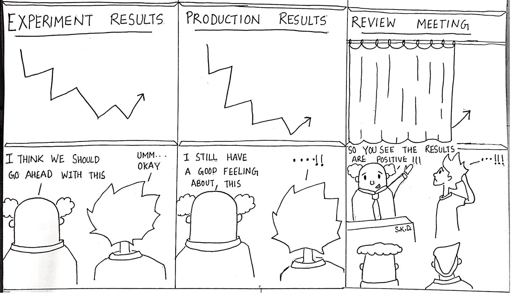

# 让数据科学发挥作用的 10 个维度(第 5 部分)

> 原文：<https://medium.datadriveninvestor.com/10-dimensions-of-making-data-science-work-79778a970498?source=collection_archive---------8----------------------->

## 文化:维度#5

Culture by [Sumit Dutta](https://www.instagram.com/amatuer_chitrakar/)

这是让数据科学发挥作用的 10 个维度系列的第 5 部分。**文化**可能是让数据科学发挥作用的最不明确也是最重要的维度。尽管如此，在涵盖了[第一部分](https://medium.com/the-innovation/10-dimensions-of-making-data-science-work-2057183f0770)中的**期望**、[第二部分](https://medium.com/the-innovation/10-dimensions-of-making-data-science-work-3be4358a991d)中的、**角色**第三部分以及[第四部分](https://medium.com/the-innovation/10-dimensions-of-making-data-science-work-part-4-6ae8a7a3823)中的**协作**的其他维度之后，我们仍在讨论这个问题，因为文化是这些维度被迎合的副产品，还附加了态度和意识。

对于大多数创业公司来说，文化始于创始人和第一个种子团队。由于文化的定义可能对不同的人有不同的含义，因此在数据科学的上下文中定义我所说的文化是有帮助的。这三个问题决定了文化如何随着时间的推移而发展，以及一个组织在多大程度上真正由数据驱动。

> -如何做出决定？

几乎在每个初创企业的开始阶段，决策都是基于直觉做出的。这就是开始的方式，但它是否会保持这种方式决定了收集数据、使其可访问以及依靠数据做出决策的重要性。

> -是什么推动了优先级划分？

基于度量标准、根本原因分析、战略假设分析和影响评估，公司中的最高优先级是否是**、*谁*“想要做某事”与*、*“需要做什么”**是决定人们有多大动力投入新想法并使其工作的因素。

> -当数据结果与直觉相反时，会问什么问题？

当一个直觉的假设或实验失败，反直觉的结果摆在你面前，你的第一反应是否是——“*让我们更深入地找出原因并做出弥补*“vs”*这是不可能的。我的直觉是对的，让我们继续前进吧*”这决定了数据科学是要做的**事情**还是驱动业务的**事情**。这也决定了数据是否开始显示“*人们想看什么*”vs“*什么是*”。

# 文化:我们如何做与我们做什么

以下是创业企业文化发展的 5 个阶段。在每个阶段采取的行动几乎决定性地决定了下一个阶段，因此早期阶段会有很长一段时间的影响，以后变得更加难以改变。

**第一阶段:直觉—** 在初创企业的早期阶段，当目标是实现产品的市场适应性时，直觉是确定目标优先顺序和做出决策的唯一途径，因为除了一些标尺检查和轶事证据之外，几乎没有任何数据可以帮助他们。通常没有一个结构化的和测量的方法来验证任何假设，这是非常可以接受的。

**第二阶段:假设验证实验—** 这是第一个分析团队开始形成的阶段，这个团队的最佳用途是将可跟踪性引入业务。关键的 L0 和 L1 指标每天都进行测量，它们的变化有助于提出为什么要理解这些指标的驱动因素的问题。这种理解导致了想法和假设，即想法应该是可行的。为让数据科学在未来发挥作用的文化播下种子的理想方式是开始特别的实验和影响衡量，以扩大或缩小想法的规模。大多数初创企业都会做实验，但关键的区别在于如何利用实验结果。“**零假设为真是一个结果”——这应该在这个阶段写在墙上，以鼓励人们分享没有给出预期结果的实验结果。**一个好的结果不是指标总是上升，而是你知道它为什么会这样变化**，这种信念是文化的基石。**

**第 3 阶段:规模和优先顺序—** 到这个阶段，大多数初创企业都已经发展到一定规模，你想的所有事情都不可能在一个电话里一夜之间完成，人们需要获得清晰的目标才能实现。这也是更多人加入成长中的组织并找到融入文化的方法的阶段。因此，在这个阶段做正确的事情很重要，因为这是写在墙上的无形信息，人们进来后会捡起来并适应它。因此坚持一个过程

1.  估计机会的大小
2.  在执行之前，写下一个带有清晰的实验和测量方法的想法提案
3.  执行
4.  回顾所有执行的想法，包括那些没有给出预期结果的想法，以理解和推动下一步行动

将创建一种成为人们遵循的规范的实践，并创建一种根据数据中的“是什么”来确定优先级并做出决策的文化。

> 归根结底，我们是否在开始工作前问了“**哪个度量标准和多少**”以及在完成工作后问了“**我们学到了什么**

**第 4 阶段:明确输出并奖励输入—** 尽管第 3 阶段确保以数据驱动的方式决定“做什么”,但它仍然为在执行阶段“如何”完成它留有余地。当个人目标与组织目标不一致或者目标本身在两个层面上都不明确时，组织中的大多数文化问题就会出现。这需要一个由三部分组成的解决方案

1.  用系统的思维来定义目标，将所有需要的部分集合在一起，形成一个整体。基本上，OKRs 的定义基于优先的“什么”
2.  为跨职能部门的目标创建 pod，模糊组织内的任何领域，并阐明 pod 中每个成员的角色和职责
3.  衡量输入的质量，而不是 pod 输出的影响，并奖励 pod 成员。这将重申一点，好的结果不是指标总是上升，而是你对它为什么以你以前不知道的方式移动有了新的了解

**阶段 5:信念—** 如果前面的阶段确实形成了让数据科学发挥作用的文化，那么组织肯定会达到一个相信数据科学的力量、数据驱动的决策的力量以及最重要的持续学习的力量的阶段。从高层领导市政厅到团队回顾会议，数据成为每一次谈话的关键部分。在此阶段之后，数据科学永远不会成为一件事，而只会成为整个企业的一种做事方式。

很快，我们将在本系列的第六部分[中讨论第六个维度的发现。](https://godaramkumar.medium.com/10-dimensions-of-making-data-science-work-part-6-a34aa698bf6f)

*内容与* [*阿南德·夏尔马*](https://medium.com/u/ce87d9792f4a?source=post_page-----2057183f0770--------------------------------) *和* [*马内什·米什拉*](https://medium.com/u/b25fb0a8be01?source=post_page-----2057183f0770--------------------------------) *同时在* [*xto10x*](https://medium.com/u/61021e800281?source=post_page-----2057183f0770--------------------------------)