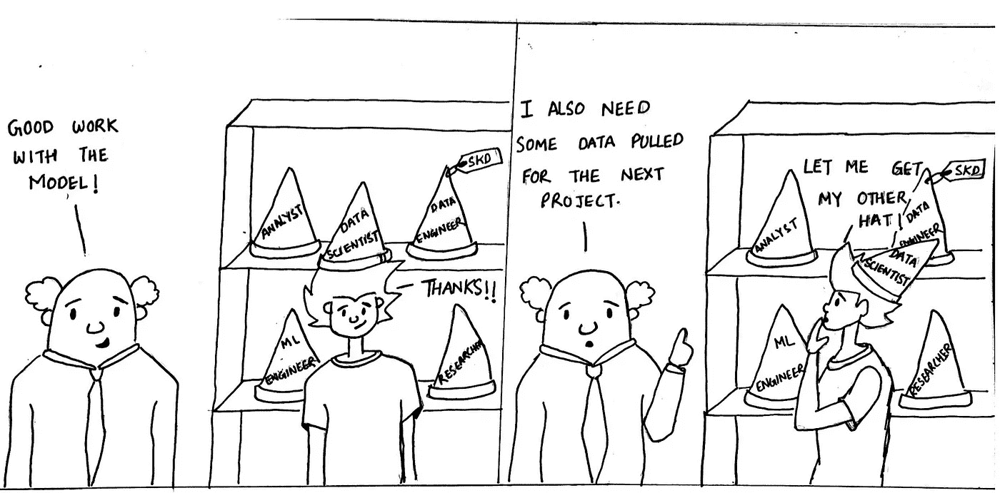

# 让数据科学发挥作用的 10 个维度(第 3 部分)

> 原文：<https://medium.datadriveninvestor.com/10-dimensions-of-making-data-science-work-part-3-cd628818de8c?source=collection_archive---------2----------------------->

## 角色:维度#3

Roles in Data Science by [Sumit Dutta](https://www.instagram.com/amatuer_chitrakar/)

让数据科学发挥作用的 10 个维度系列的第 3 部分。在[第 1 部分](https://medium.com/the-innovation/10-dimensions-of-making-data-science-work-2057183f0770)中，我们讨论了协调的最重要维度，以便对数据科学功能有正确的预期。在[第二部](https://medium.com/the-innovation/10-dimensions-of-making-data-science-work-3be4358a991d)中，我们了解了从结果到手段的艺术——策略。下一个维度是我们大多数人表示困惑的内容，即在使数据科学功能成为一个整体的过程中扮演的不同角色。

数据分析师，商业分析师，商业智能，数据工程师，数据科学家，机器学习工程师，研究工程师，名单很长。你说出它的名字，就有一个角色叫这个名字。初次创业者通常会感到困惑，并会问这样一个问题

> 此时，我需要为我的组织雇用谁？我现在应该雇用一名数据科学家吗？

*的回答是“看情况”。*这取决于你需要这个人做什么，取决于组织目前的状态在启用这个人方面有多成熟，取决于你所处的业务。当我们理解这些角色的不同或相同之处，以及它们的成功依赖于什么时，这种依赖性就会变得清晰起来。

> 全栈数据科学家是一个神话，但不是全栈数据科学功能。

数据科学职能由一组人组成，每个人都是其中一个角色的深入专家，也是其他角色的知情人，这个团队齐心协力就是成功的定义。

# 角色:不同角色的不同目标

要使数据科学在组织中有效发挥作用，80%的工作是了解对某个角色的期望以及何时为该角色安排合适的人选。以下是数据科学职能角色演变的 5 个阶段，以及什么样的人会让它为创业公司工作。

*   **第一阶段:不惜一切代价—** 每个初创公司都从一个阶段开始，在这个阶段，所有初始成员都会竭尽全力让公司进入产品市场适应阶段。在这个阶段，角色之间的区别变得模糊，每个人都朝着一个单一的目标前进。鉴于现阶段组织的规模较小，它在没有角色专门化的情况下也能很好地工作。
*   **第 2 阶段:事实、见解和故事—** 这是进入产品适应市场后的增长阶段，组织将经历一次自我认知之旅。在这个阶段，需要对组织的关键指标进行跟踪和了解，并在它们变得足够大时密切监控它们，以免留在人们的脑海中。在这个阶段，需要更深入地回答事实背后的“为什么”,并提供纠正过程的见解。在这个阶段，需要用证据数据来讲述故事，以协调所有的利益相关者，这个群体的规模最近有所扩大。
    这还不是机器为公司做出重要决策的阶段。人们仍在做决定，但需要数据的支持来做出“明智的”决定。在这个阶段，一个组织需要的是善于从生产数据库中提取数据的人，汇总数据，提供事实和见解，并编织一个有数据支持的故事，以帮助*人们做出决策*。这就是与产品和业务团队密切合作的**分析师**的角色。

> 分析师是善于发现相关数据的人，他们将数据转化为可靠的事实、见解和故事，帮助人们做出决策并回答“为什么”的问题

*   **第 3 阶段:集中化和平台化—** 在此阶段，分析团队逐渐演变为一个中心职能部门。这个中心团队认识到整个组织的需求模式，支持为“什么”答案构建自助式分析产品，并提升分析功能以回答“为什么”和“如果”的问题。为了支持这种提升，组织需要在构建 [ETL](https://en.wikipedia.org/wiki/Extract,_transform,_load) 管道方面的专家将来自所有不同来源的数据以流和批处理的方式纳入一个中央数据湖，这些专家可以设计符合组织需求的数据仓库的架构和模式，并成为数据访问民主化的旗舰所有者。这就是**数据工程师**的角色，他们构建并拥有数据平台，使分析师和数据科学家能够高效工作。

> 数据工程师擅长将原始数据流转换为数据仓库架构，通过使对相关信息的访问变得更加简单快捷，从而将分析效率提高一倍

*   **阶段 4:机器学习决策—** 这是**数据科学家**发挥作用的阶段。这些人可以利用数据建立预测和优化模型，使生产中的机器或系统能够做出决策。你可以想象，在第二阶段，价格可能是由运行业务功能的人决定并上传的。在第 4 阶段，这将根据需求和供应预测模型以及收入增长的优化模型实现自动化。
    数据科学家从建立简单的模型开始，这些模型与人类迄今为止做出这些决定时使用的启发式方法相匹配，以设定基线，并逐步提高模型的复杂程度，以增加价值。

> 数据科学家擅长建立预测和优化模型，帮助机器做出决策并快速应对不断变化的情况

*   **第 5 阶段:大规模数据科学周期—** 第 4 阶段由数据科学家构建的初始模型以批处理模式离线运行，以填充一些数据库表，或者由工程团队在生产中开发决策逻辑应用程序。这对许多组织来说效果很好，可能永远也不会进入阶段 5，但对某些组织来说，每天做出的决策数量在数百万或数十亿的规模上，并且决策过程的输入以超出人类处理的高频率变化，一个新的角色变得必要。**机器学习工程师的作用。**构建解决业务问题的模型与确保模型部署在生产环境中，使用正确的实时和历史功能，并满足业务所需的吞吐量，这是略有不同的技能。对于需要高吞吐量决策系统的组织，在生产中大规模部署机器学习需要构建机器学习平台。ML 工程师拥有这些平台，这些平台维护实时特征管道、历史特征管道、模型服务层，提供跟踪和监控模型指标的能力，支持影子模式和对多个版本的模型进行实验，运行模型的自动化再培训，等等。ML 工程师构建 ML 服务层，并与数据科学家紧密合作。对于随机森林模型中的某个超参数为何有助于提高准确性，他们可能没有确切的意见，但将能够更好地判断模型应如何暴露以在特定延迟限制内服务于预测。ML 工程师通过构建一个 ML 平台增加了很多价值，该平台使数据科学家能够更快地将模型添加到生产中，并减少整个 ML 生命周期时间。

> 机器学习工程师擅长为每天做出数百万或数十亿个决策的高吞吐量系统大规模部署机器学习模型

了解和评估数据科学职能中每个关键角色的需求是建立成功的全职能团队的开始。那些迎合所有这些角色并像第一阶段一样一直拖到第五阶段的人可能存在，但很少。因此，关键是建立一个团队，其中每个人都是其中一个角色的核心，同时与提供补充角色支持的其他人密切合作。

很快，我们将在本系列的第 4 部分中讨论协作的第四个维度。

*内容与* [*阿南德·夏尔马*](https://medium.com/u/ce87d9792f4a?source=post_page-----2057183f0770----------------------) *和* [*马内什·米什拉*](https://medium.com/u/b25fb0a8be01?source=post_page-----2057183f0770----------------------) *而在* [*xto10x*](https://medium.com/u/61021e800281?source=post_page-----2057183f0770----------------------)