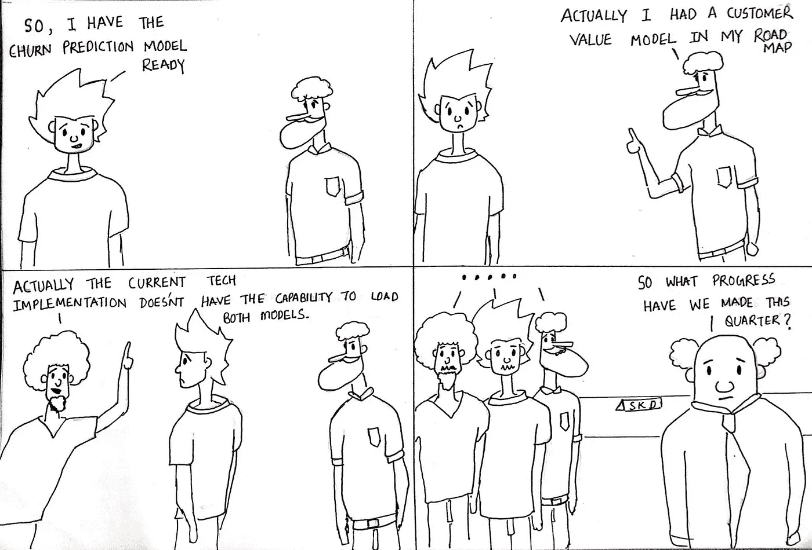

# 让数据科学发挥作用的 10 个维度(第 4 部分)

> 原文：<https://medium.datadriveninvestor.com/10-dimensions-of-making-data-science-work-part-4-6ae8a7a3823?source=collection_archive---------6----------------------->

## 协作:维度#4

Collaboration in Data Science by [Sumit Dutta](https://www.instagram.com/amatuer_chitrakar/)

这是让数据科学发挥作用的 10 个维度系列的第 4 部分。作为继续前进前的复习，我们在[第一部分](https://medium.com/the-innovation/10-dimensions-of-making-data-science-work-2057183f0770)中提到了调整到正确的**预期**。在[第 2 部分](https://medium.com/the-innovation/10-dimensions-of-making-data-science-work-3be4358a991d)中，我们了解了从最后到达手段的艺术——**策略**，我们还讨论了[第 3 部分](https://medium.com/the-innovation/10-dimensions-of-making-data-science-work-part-3-cd628818de8c)中的**角色**，它们使数据科学功能成为一个整体。所以那些已经阅读了所有三个部分的人现在已经知道该期待什么，如何计划，以及该给团队配备谁了。下一个重大挑战来了——第四维决定了是有动量还是只有运动。**协作的维度。**

鉴于大多数初创公司最初都是非常小的团队，几乎知道彼此兄弟姐妹的名字，合作在开始时似乎并不是一个挑战。当一家初创企业进入成长阶段时，团队就会成长；新人开始加入，他们带来了更新的观点、实践和想法，这时，为实现共同目标而合作开始看起来像是一件要做的事情。

> 协作是目标清晰、与目标一致的组织结构、将人们聚集在一起以实现目标的实践，以及作为一个团队来衡量绩效的评估机制的结果

# 协作:2+2>4？

以下是创业过程中协作发展的 5 个阶段。你需要知道你在哪里才能看到你要去哪里。

**第一阶段:不在状态—** 在初创企业的早期阶段，当目标是实现产品与市场的契合时，角色本身并没有分离，因此协作不在状态。大多数决策都是由直觉和市场脉搏研究驱动的，很少得到数据功能的帮助，因为数据功能可能并不完全存在。

**阶段 2:嵌入式和筒仓式** —这是分析推动数据功能实现可跟踪性和洞察力的阶段。对速度的需求导致在产品和业务职能中嵌入分析师。每个职能部门都会进行几项假设分析，并研究各种指标的行为，以利用他们自己的一组分析师来规划下一个重大举措。他们彼此之间交流不多，并且在各自为政的环境中工作，对整个组织的洞察力不够清晰。这个阶段可能是只有 CEO 知道所有努力的阶段。处于这个阶段是很常见的，但也有必要看到信号，在这个阶段失控之前努力进入下一个阶段。

**第 3 阶段:有所动作的集中化—** 在此阶段，分析职能演变为服务于多个业务和产品职能的中央团队，数据平台的初始版本建立起来，处理该平台的平台团队出现，一些数据科学家发现他们首先要解决的问题。在这个阶段，有很多运动的良好感觉，但通常情况下，它们不会都朝着一个方向运动以实现一个目标。因此它是没有动量的运动。这种情况预计会发生，但不应让它持续下去。在这个阶段有所帮助的是应用传动系统模型，并获得我们在[战略](https://medium.com/the-innovation/10-dimensions-of-making-data-science-work-3be4358a991d)维度中谈到的数据战略蓝图。关于可以将数据科学之旅从典型转变为理想的调整的[文章中也解释了一个很好的例子。这将有助于澄清本组织不同职能的目标，并确定相互依赖从而共同前进的部分。为组织制定有效的](https://medium.com/@xto10x/data-science-journey-for-startups-the-5-tweaks-that-turn-typical-to-ideal-998cbdeb07d3)[okr](https://medium.com/@xto10x/implementing-okrs-to-drive-execution-velocity-in-your-startup-305849694bbc)的好方法。

**第 4 阶段:从运动到动力—** 这是充分利用数据科学功能并通过协作实际实现 2+2 > 4 的阶段。努力清晰地制定数据战略蓝图，确保团队的结构与 OKRs 相一致，并配备合适的[角色](https://medium.com/the-innovation/10-dimensions-of-making-data-science-work-part-3-cd628818de8c)，人才是开始。使所有这些努力有效的是实践的点缀，使这些团队走到一起，朝着一个共同的目标努力。定义 OKR 只完成了一半的工作，剩下的工作是通过定义一个 pod 来实现 OKR，它配备了各种各样的人员—数据工程师、数据科学家、产品、分析、工程师、QA 等等。Pods 跨越了团队的界限，使规划更具协作性，而不是各自为政。我亲眼目睹了这种带给人们使命感的奇迹。总会有架构师、数据科学、分析和平台职能部门的负责人保持警惕，识别模式，并确保各个单元之间的差异较小。对人们来说，让他们感到自己是 pod 的一部分的关键是确保个人的抱负和目标与 pod 的一致。如果没有经过深思熟虑就将人分配到 pod，或者我们继续根据 pod 的成功与否以外的标准来评估人的表现，我们将采取一种不成熟的方法，这种方法注定会失败。

> 咒语是——一个清晰的计划，具体的目标，跨职能的豆荚和一个联系这一切的评估机制。

**第 5 阶段:使之成为一种规范—** 这是最成熟的阶段，当协作成为文化的一部分时，战略优先目标、为目标设置 okr、形成流和 pods 以及与 pods 相关的绩效评估的所有实践都成为规范。每 6 个月回顾一次数据战略蓝图，以进行修正和进一步规划，这已经成为一种惯例。锦上添花的是采用让分享、追踪和交流更容易的工具。在此之后，组织涉足的每一个新业务单元和每一个新项目都需要更快地适应这一点，并快速前进。

合作是乐高积木产生创意的原因。否则，你能想象乐高积木没有办法互相连接吗？在一个组织中，没有一个职能是独立的，可以坐在一个封闭的房间里实现目标。肯定不是数据科学。

很快，我们将在本系列的第五部分中讨论文化的第四个维度。

*内容与* [*阿南德·夏尔马*](https://medium.com/u/ce87d9792f4a?source=post_page-----2057183f0770----------------------) *和* [*马内什·米什拉*](https://medium.com/u/b25fb0a8be01?source=post_page-----2057183f0770----------------------) *而在* [*xto10x*](https://medium.com/u/61021e800281?source=post_page-----2057183f0770----------------------)