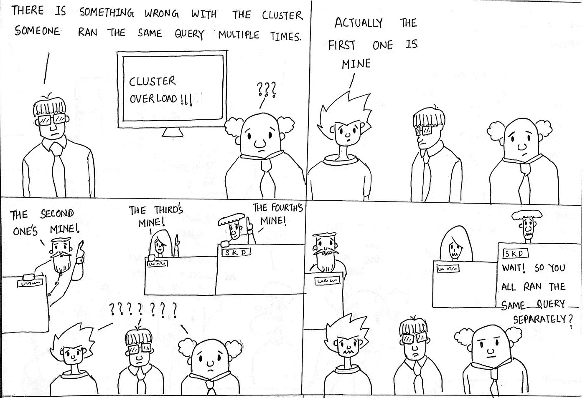

# 让数据科学发挥作用的 10 个维度(第 7 部分)

> 原文：<https://medium.datadriveninvestor.com/10-dimensions-of-making-data-science-work-part-7-7f1fc08a4477?source=collection_archive---------7----------------------->

## 平台:维度#7

Platforms by [Sumit Dutta](https://www.instagram.com/amatuer_chitrakar/)

这是让数据科学发挥作用的 10 个维度系列的第 7 部分。我们首先经历了[第一部](https://medium.com/the-innovation/10-dimensions-of-making-data-science-work-2057183f0770)中的**期望**、[第二部](https://medium.com/the-innovation/10-dimensions-of-making-data-science-work-3be4358a991d)中的**战略**、[第三部](https://medium.com/the-innovation/10-dimensions-of-making-data-science-work-part-3-cd628818de8c)中的**角色**、[第四部](https://medium.com/the-innovation/10-dimensions-of-making-data-science-work-part-4-6ae8a7a3823)中的**协作**以及[第五部](https://medium.com/the-innovation/10-dimensions-of-making-data-science-work-79778a970498)中的**文化**这些软性的、非技术性的维度。我们在[第 6 部分](https://medium.com/the-innovation/10-dimensions-of-making-data-science-work-part-6-a34aa698bf6f) 中开始讨论**发现和访问**的第一个技术层面，我们将在第 7 部分继续讨论平台。

平台最基本的定义是一组技术或工具，这些技术或工具概括了常见的功能，因此它可以用作构建其他应用程序、流程和服务于不同用例的基础。我们大多数人容易理解的一个例子是 OS(操作系统)。但有人可能会问，为什么这是让数据科学发挥作用的一个重要方面。首先，让我们开始列出数据科学中每个人都做的常见任务或功能，我们将意识到为什么我们需要平台。

*   收集数据以进行清理、处理和分析
*   构建和训练模型
*   预测使用模型来帮助决策
*   进行现场实验以研究模型的影响并完成反馈循环

因此，我们在列出这些平台时，已经暗示了 4 个平台。当一个组织很小的时候，这些任务和功能也是临时执行的，并不常见。但是扩展之旅使这些任务变得足够“常见”,以保证拥有自己的平台，这些平台将通常需要的功能组合在一起，并支持多种用例。

# 平台:投资 x 以获得 10 倍的执行速度

以下是创业公司平台发展的 5 个阶段。这是一个维度，在这里你可以见证自己的冗余水平引导着跨阶段的转变。

**阶段 1:整体时代—** 这是工作软件优先于设计良好的软件的早期阶段，以便能够更快地进入市场，测试想法，并实现产品与市场的契合。对于大多数初创公司来说，在这个阶段，最终得到的是整体代码、孤立的数据存储、嵌入在后端的基本规则引擎和一堆谷歌表单。如果创业公司不是这样的，那么很可能直接提升到成为榜样的第五阶段。因此，在这个阶段没有谈论“平台”,也没有必要，因为平台是为我们知道将被长期使用的东西而建造的，而前 PMF 充满了未知。

**第二阶段:数据平台诞生—** 扩展过程中对指标可跟踪性的需求以及处理孤立数据源的痛苦催生了第一个平台—数据平台。这是映射到[发现和进入](https://medium.com/the-innovation/10-dimensions-of-making-data-science-work-part-6-a34aa698bf6f)维度的阶段 3 的阶段。这有助于跨组织的可扩展数据访问，许多常见的数据处理被转换为 ETL(提取、转换和加载)计划作业，这样我们就不会陷入漫画中描述的情况，最重要的是，深入了解组织的关键指标变得更容易，回答“为什么”的问题变得更快。如果一个组织感受到了痛苦，但仍然停留在第 1 阶段，没有投资于数据平台，这是一个错误，也是一个迹象，表明应该立即开始向第 2 阶段过渡。

**阶段 3:字母表开始— A/B —** 随着组织规模的扩大，人员数量也在增加，想法的数量也在增加。很快，想法和实验的爆炸使得什么导致什么变得难以处理，以及将观察到的影响归因于给定的想法变得几乎不可能。这导致了投资实验平台的需求和实现。

一个平台

*   支持将生态系统的不同实体分为控制和测试。这不需要总是只有顾客；可能是地点、时间、各种资产和业务中的参与者
*   坚持观察长期效果
*   测量和统计观察到的显著变化，将干扰最小化和正常化，并帮助以分阶段的方式将想法推广到 100%
*   为组织提供所有正在进行的实验的可配置性和可见性

请注意，这一阶段不仅要创建一个平台，还要设计系统中所有服务的架构，以支持实验标签。在某种程度上，从整体到模块的转变应该在第三阶段成功之前就发生了。也就是说，大多数 B2B 组织跳过这个阶段，因为实验的自由是有限的。因此，这一阶段主要适用于 B2C 或 B2B2C 组织。

**阶段 4:大规模 ML—**不是每个人都需要这个阶段来让数据科学发挥作用。有几个组织可以使用离线模型很好地实现数据科学，这些离线模型成批运行，并更新数据仓库中几个表中的某些值。因此，第二阶段设计良好的数据平台足以为许多用例增加价值。
有一些组织需要在大规模的近实时决策中应用 ML。一些例子包括电子商务、打车服务、超本地按需交付等。有两个问题可以用来判断阶段 4 是否是必要的过渡。

> 我们多久做一次决定？每月→每周→每天→每秒百万次决策
> 
> 什么输入推动决策？输入因素的变化速度是否超过了人类的处理极限？

如果答案是*每秒百万次*和*是的，*第 4 阶段是必要的。这个阶段，机器学习平台

*   创建历史处理特征和流近实时计算特征的特征库
*   用于探索性数据分析、模型训练、验证和测试性能测量的通用数据科学模块的存储库
*   满足必要吞吐量的生产环境中模型推理的模型服务
*   用于模型创建、部署和监控模型指标的 UI

市场上的几个托管云服务，如 [**AWS SageMaker**](https://aws.amazon.com/sagemaker/) 或 [**GCP 人工智能平台**](https://cloud.google.com/ai-platform/) 提供了这些功能，可以很好地开始这个阶段的旅程。许多组织倾向于构建内部平台，以便更好地控制模型和成本。

**第 5 阶段:角色模型—** 当多平台的优势开始变得明显时，一个组织可以被誉为其他已经达到第 5 阶段的组织的角色模型。民主访问，因此整个组织的数据驱动决策，减少模型开发和生产周期，快速和可跟踪的想法实验；所有这些都变得很明显。平台能力成为组织工作方式的核心，在这一阶段，组织需要做的就是通过博客、研讨会和会议向更广泛的社区宣传平台在数据科学工作中的重要性。

很快，我们将在本系列的[第 8 部分](https://godaramkumar.medium.com/10-dimensions-of-making-data-science-work-part-8-ff1d672b7571)中讨论可伸缩性的第八个维度。

*内容与* [*阿南德·夏尔马*](https://medium.com/u/ce87d9792f4a?source=post_page-----2057183f0770--------------------------------) *和* [*马内什·米什拉*](https://medium.com/u/b25fb0a8be01?source=post_page-----2057183f0770--------------------------------) *同时在* [*xto10x*](https://medium.com/u/61021e800281?source=post_page-----2057183f0770--------------------------------)