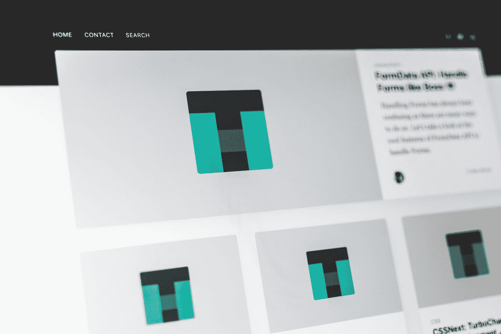

# 在家赚钱的 10 个专家建议

> 原文：<https://medium.datadriveninvestor.com/10-expert-ideas-to-make-money-from-home-39c296ebd37d?source=collection_archive---------18----------------------->

Photo by [Bermix Studio](https://unsplash.com/@bermixstudio?utm_source=medium&utm_medium=referral) on [Unsplash](https://unsplash.com?utm_source=medium&utm_medium=referral)

在家赚钱不是一件容易的事。为了享受舒适的环境，灵活的工作时间，每天一顿家常饭，你需要努力争取。

经过大量的研究，我制定了这十个专家的想法，可以让你在家赚钱。这些想法在任何时候都有效，当你读到这些时，你会感到惊讶。

# 想法一:建立一个网站

Photo by [Pankaj Patel](https://unsplash.com/@pankajpatel?utm_source=medium&utm_medium=referral) on [Unsplash](https://unsplash.com?utm_source=medium&utm_medium=referral)

如果你是一个不断寻找在家赚钱方法的人，那么开设自己的网站将是一个救星。创建一个网站可以让你向世界表达你的观点。

网站将作为你和你的观众之间的媒介。一旦你在你的网站上产生了高质量的数字信息，你将会获得巨大的流量。

这将让你从你的网站产生良好的收入。即使你改变主意，想到设置一些其他业务，那么你可以出售你的网站数千美元，并享受其好处。

# 想法二:保姆

Photo by [Ana Tablas](https://unsplash.com/@tablas08?utm_source=medium&utm_medium=referral) on [Unsplash](https://unsplash.com?utm_source=medium&utm_medium=referral)

你可以通过做临时保姆获得不错的收入。有些父母工作太忙，几乎没有时间陪孩子。因为他们不断努力赚钱，改善他们孩子的生活方式，他们总是需要一个保姆。

在互联网上搜索保姆网站，你会遇到两个知名网站，分别是 [**保姆城市**](https://www.sittercity.com/) 和**[**Care.com**](https://www.care.com/)。这些网站有人会把你和真正的客户联系起来。保姆费可高达每小时 40 美元。**

# **想法三:联盟营销**

****

**Photo by [Austin Chan](https://unsplash.com/@austinchan?utm_source=medium&utm_medium=referral) on [Unsplash](https://unsplash.com?utm_source=medium&utm_medium=referral)**

**通过联盟营销技术赚钱的确是一个很好的赚钱方式。要掌握它，你需要良好的销售驱动技能来驱动你的观众购买特定的产品。**

**连接像[**易贝**](https://partnernetwork.ebay.co.uk/) 和 [**Shopify**](https://www.shopify.co.uk/affiliates) 这样的网站，加入他们的联盟营销计划。选择一个特定的利基，你很舒服，并制作内容，你会迫使客户购买这些网站的产品。**

**一旦你在这个网站上进行销售，网站所有者会给你提供一些销售佣金。销售佣金可以是 1000 美元，也可以高达 2000 美元。**

# **想法四:学习学术写作**

****

**Photo by [Tran Mau Tri Tam](https://unsplash.com/@tranmautritam?utm_source=medium&utm_medium=referral) on [Unsplash](https://unsplash.com?utm_source=medium&utm_medium=referral)**

**以我的经验，我见过很多从事学术写作的人。他们在家把它当作一份全职工作。作为一名学术作家，你应该知道如何使用引文，如何从学生的角度写作。**

** [## 商业无国界:如何走向全球？数据驱动的投资者

### 首先，你要形成你的主要目标。例如，寻找投资，固定你的市场…

www.datadriveninvestor.com](https://www.datadriveninvestor.com/2020/07/14/business-without-borders-how-to-go-global/) 

学术写作需要非常认真地对待，因为它可能导致学生被开除。如果你被发现复制副本，学生可能会失败，你会被行业除名。这表明你作为学术作家的生活将会结束。我推荐的网站有 [**Fiverr**](https://www.fiverr.com/) 和 [**Upwork**](https://www.upwork.com/)

# 想法五:付费聆听

Photo by [Malte Wingen](https://unsplash.com/@maltewingen?utm_source=medium&utm_medium=referral) on [Unsplash](https://unsplash.com?utm_source=medium&utm_medium=referral)

你有没有想过你真的可以通过听别人的歌赚钱，答案可能是响亮的否定。在现实中，有一些网站，比如[**slice theipe**，](https://www.slicethepie.com/)会根据你的音乐评论向你付费。

对于每个音乐评论，你将通过你的贝宝获得 10 美元，前提是你的音乐评论是详细的，并为阅读它的人增加价值。

# 想法六:客户服务

Photo by [Proxyclick Visitor Management System](https://unsplash.com/@proxyclick?utm_source=medium&utm_medium=referral) on [Unsplash](https://unsplash.com?utm_source=medium&utm_medium=referral)

如果你有很好的沟通技巧，那么这份工作就是为你准备的。有一些公司外包他们的客户服务。举一个知名网站 [**1800 朵**](https://www.1800flowers.com/) 的例子。

当你注册这个网站时，你作为顾客代表的工作就是说服顾客从他们的网站上购买鲜花。此外，您还将与可能会就任何与花卉相关的问题打电话给您的客户打交道。

# 想法 7:在线销售课程

Photo by [NeONBRAND](https://unsplash.com/@neonbrand?utm_source=medium&utm_medium=referral) on [Unsplash](https://unsplash.com?utm_source=medium&utm_medium=referral)

你一定遇到过通过视频卖课程的人。这里有一个人，告诉你买一门课程并收取费用。这些课程包括教你某一特定主题的数字视频。

为了推销你的课程，你需要选择一个主题，然后根据这个主题制作视频。完成后，向你的听众推销课程。你的听众应该乐于学习一门新课程，所以要非常详细地介绍你的主题。为了提高课程的知名度，在脸书、推特和 Instagram 等社交媒体渠道上推销自己。

# 想法 8:在线调查

Photo by [Isaac Smith](https://unsplash.com/@isaacmsmith?utm_source=medium&utm_medium=referral) on [Unsplash](https://unsplash.com?utm_source=medium&utm_medium=referral)

对于这个，你需要非常小心。不要参加要求个人信息和预付款的调查。这表明这些网站是欺诈网站。

不过，那是我个人推荐的一些通过调查赚钱的正版网站，像 [**调查通**](https://www.surveysavvy.com/) 和 [**Vipvoice**](https://www.vipvoice.com/Toluna.MR.TrafficUI/MSCUI/Page.aspx?pgtid=5) 。这些网站是正版的，受到数百万用户的信任。

# 想法 9:内容作者

Photo by [hannah grace](https://unsplash.com/@oddityandgrace?utm_source=medium&utm_medium=referral) on [Unsplash](https://unsplash.com?utm_source=medium&utm_medium=referral)

这个职业越来越受欢迎。作为一名内容作者，你的工作是为不同的公司制作高质量的作品。这些公司会为此支付一大笔钱。此外，你还将担任编辑和校对。

作为校对，你的工作将是审查文件并提出改进建议。同样，作为一名编辑，你的工作是编辑掉文档中出现的不相关的填充。我推荐的网站有 [**五、**](https://www.fiverr.com/) 和 [**Upwork**](https://www.upwork.com/)

# 想法 10:优步

Photo by [Anastase Maragos](https://unsplash.com/@visualsbyroyalz?utm_source=medium&utm_medium=referral) on [Unsplash](https://unsplash.com?utm_source=medium&utm_medium=referral)

YouTube 现在管的很严。有那么多的 YouTubers 用户，多年来没有通过该平台尝到过一次挣钱的滋味。这是因为他们有低质量的视频，他们的内容不符合标准。

为了缓解这一问题，请使用高分辨率摄像机来录制视频。此外，你应该在开始你的 Youtuber 职业生涯之前决定你的主题。一些最受欢迎的是健身，喜剧和化妆。

# 最后的想法

我希望你喜欢阅读这条信息。如果你有，不要忘记与你的朋友和家人分享这个数字作品。每个人都应该知道如何充分利用互联网的潜力。

**获取专家观点—** [**订阅 DDI 英特尔**](https://datadriveninvestor.com/ddi-intel)**