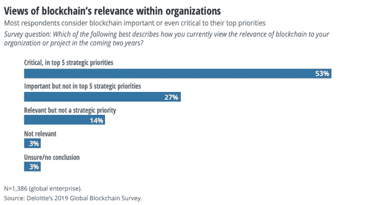
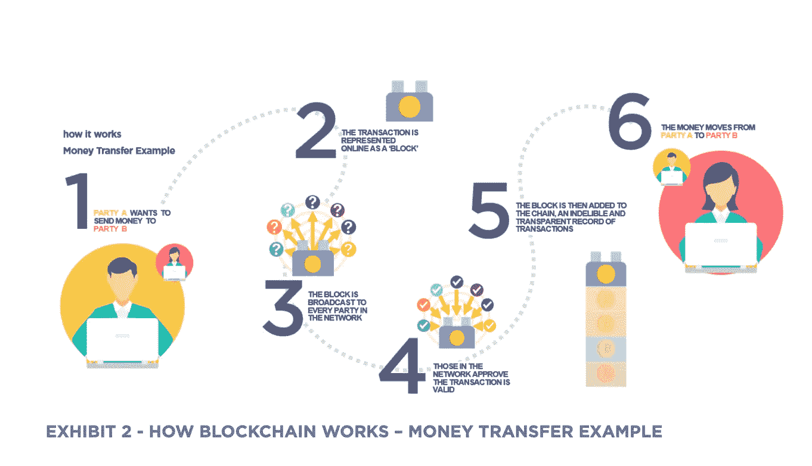

# 每个敏捷专业人士都应该知道的关于区块链技术的 10 个常见问题

> 原文：<https://medium.datadriveninvestor.com/10-faqs-on-blockchain-technology-every-agile-professionals-should-know-6d20f3d57b0d?source=collection_archive---------15----------------------->

区块链入门

Source — [https://www.wallpaperflare.com/](https://www.wallpaperflare.com/block-chain-network-concept-distributed-ledger-technology-blockchain-wallpaper-aakih)

## 为什么我们需要了解区块链技术？

德勤在 2019 年在十几个国家进行了一项[调查](https://www2.deloitte.com/content/dam/Deloitte/se/Documents/risk/DI_2019-global-blockchain-survey.pdf)，以了解大型公司决策者对区块链作为一项技术的整体态度和投资。

> 53%受访者表示，区块链已成为他们组织在 2019 年的关键优先事项，比去年增加了 10 个百分点，并将成为前五大战略优先事项。

Source — Deloitte [survey](https://www2.deloitte.com/content/dam/Deloitte/se/Documents/risk/DI_2019-global-blockchain-survey.pdf)

这一项关于区块链的调查清楚地表明，区块链对于公司和政府来说变得越来越重要。这意味着将会有许多基于区块链技术的项目。

在 T2 的一项研究中，CBInsights 发现银行业并不是唯一受到影响的行业。以下是公司利用全球区块链力量的最新创新方式。

*   银行业务
*   消息应用
*   对冲基金
*   投票
*   互联网身份和域名系统
*   关键基础设施安全
*   乘车共享
*   互联网广告
*   密码交换
*   还有更多

现在我们已经了解了区块链的力量及其在全球的影响。这个故事的目的是讨论许多专业人士提出的一些关键的常见问题。

所以让我们开始吧..

## #1.什么是区块链

> “区块链是一个不朽的经济交易数字账本，可以通过编程不仅记录金融交易，还记录几乎所有有价值的东西。”
> –唐&亚历克斯·泰普斯科特，《区块链革命》作者(2016)

这句话抓住了区块链的本质，即:

*   **廉洁数字账本** —一个基于*透明*和*信任*不会被破坏的数据库。
*   **可通过编程记录**的交易——专注于将业务系统从纸质系统转移到数字系统，以便能够*跟踪*、*审计*和*保护*。
*   **一切有价值的东西—** 今天在互联网上，我们可以自由地分享信息，如 pdf、电子邮件、消息、文档，类似于区块链，我们应该能够自由地分享价值，如金钱、债券、股票、音乐、艺术、合同、身份

Source-[https://www.smartdubai.ae/](https://www.smartdubai.ae/docs)

## #2 什么是分布式账本技术？

> 我把区块链称为“价值互联网”和“信任互联网”因为一切都变得不可信。这是一个很大的分布式分类账。把它想象成一个 Excel 文件，由世界上数百万台计算机维护、更新和管理。
> 
> **企业家和风险投资家**

术语**分类账**通常用来记录任何涉及价值转移的交易，如付款、财产合同、资产。目前，分类账集中存储，这意味着有一个中央机构来验证分类账中的记录。

使用术语**分布式分类账**，分类账的副本现在存储在许多不同地理位置的多个服务器上。这意味着没有中心故障点。没有一个人或机构可以在分布式分类账上验证交易。验证将通过共识算法进行。

**区块链**是一种分布式账本，由交易块组成。所以分布式账本的实现方式是区块链与众不同的地方。

> 区块链和分布式分类帐都被称为分布式分类帐技术(DLT)

## #3 中介有哪些顾虑，区块链能提供什么帮助？

> 比特币是完全分散的，没有中央服务器或可信方，因为一切都是基于加密证明而不是信任。
> -中本聪-比特币创始人

> [比特币](https://en.bitcoin.it/wiki/Main_Page)寻求解决传统货币的根本问题:让它运转所需的所有信任——这并不是说合理的信任是一件坏事，**但信任让系统变得脆弱、不透明，运营成本高昂。**

在加密货币出现之前，双方之间的数字交易需要一个可信的第三方作为中介。

**与中介有关的几个问题是:**

1.欺诈的可能性，服务器集中崩溃，这意味着单点故障

2.对商业交易收费——交易成本很高

3.许多人被排除在金融服务之外的可能性，例如，人们需要银行账户来利用金融服务。

> 对于许多投资者和分析师来说，2008 年的金融危机是一个强有力的证明，证明了当金融界过于信任中央集权机构时会发生什么

区块链旨在通过创建一个**无信任**平台来解决这些担忧！它有以下优点:

第一，是 ***分布式*** :运行在世界各地志愿者提供的电脑上，所以没有中央数据库可以黑。

二是 ***公开*** :任何人都可以随时查看，因为它驻留在网络上。

第三，是 ***加密*** :使用重型加密来维护安全性。

## #4 区块链是如何做到如此安全的？

区块链技术以多种不同的方式利用密码学——用于钱包、交易、安全和隐私保护协议。

**公钥加密**

公钥加密(也称为非对称加密)是一种使用一对密钥的加密系统——一个**公钥**和一个**私钥**。公钥可能被广泛分发，但是私钥应该只有它的所有者知道。密钥总是成对创建的，每个公钥必须有一个对应的私钥。

**哈希:**

加密哈希函数*是具有以下重要属性的哈希函数:

*   **确定性**:无论你给函数多少次特定的输入，它总会有相同的输出。
*   **不可逆**:无法从功能的输出确定输入。
*   **抗碰撞**:没有两个输入可以有相同的输出。

*作为参考，比特币使用名为 [SHA-256](https://en.bitcoin.it/wiki/SHA-256) 的加密哈希函数，以太坊使用 [keccak256](https://eth-hash.readthedocs.io/en/latest/) 。

> 那么，加密哈希是如何实现区块链技术的不变性的呢？答案是，每个新的数据块都包含前一个数据块中所有数据的散列输出。

**Merkle 树:**

Merkle 树(或散列树)是利用加密散列函数在每个节点中存储散列输出而不是原始数据的树。每个叶节点由其原始数据的加密哈希组成，每个父节点是其子节点哈希的组合哈希。

> 那么，为什么 Merkle 树对区块链科技如此重要呢？
> 
> 使用 Merkle 根并应用加密哈希函数的属性，可以快速判断给定块中的事务是否已经被篡改以及具体的事务正在被篡改。

阅读更多—[https://crushcrypto.com/cryptography-in-blockchain/](https://crushcrypto.com/cryptography-in-blockchain/)

## #5 区块链平台中的挖掘是什么？

当一个人 A 发起一个交易，比如说给人 B 发送几个硬币，该交易需要被记录在一个块中，然后这个块需要被保护和认证。验证交易的过程称为挖掘。

有些矿工加入了区块链网络，他们可以通过解决一个密码难题来进行验证，并为该块分配一个*密码散列*。

> 加密哈希函数是一种数学算法，它将任意大小的数据映射到固定大小的位数组。它是一个单向函数，也就是说，一个实际上不可行反转的函数。[维基百科](https://en.wikipedia.org/wiki/Cryptographic_hash_function)

这个谜题的解决方案被称为*工作证明*，它证明了矿工们确实花费了大量的时间和资源来解决这个问题。

一旦安全块被添加到区块链，那么所有节点(计算机)可以通过称为*共识*的过程来验证该块

*阅读更多—*[*https://www.ethos.io/what-are-miners-cryptocurrency-mining*](https://www.ethos.io/what-are-miners-cryptocurrency-mining)

它可能被称为采矿，因为它类似于黄金等商品的开采——开采黄金需要大量的努力和资源。

## #6 区块链是什么意思？

区块链交易由网络以连接到前面区块的数字区块的形式不断验证、清算和存储，从而创建一个链。

> 一个块由一个标题和一长串事务组成
> 
> **未确认的**交易是指已经传输到比特币网络，但尚未被纳入区块链的区块的交易。网络上的每个节点都有一个未确认的事务池，称为它的 mempool。[来源](https://www.quora.com/How-many-transactions-are-included-in-a-block-chain)

## #7 什么是双重支出问题？

当我给你发邮件或文件时，我会给你一份副本。如果我再给你发一封同样的邮件，不会有问题，但是当我发送像钱一样有价值的东西时，那就有问题了。

> 比特币等基于区块链的加密货币通过使用一种被称为工作证明(PoW)的共识机制来防止这种“双重花费”问题

## #8 区块链有哪些不同的架构选项？

有两种主要类型的区块链配置。它们包括以下内容。

*   公共/无许可-公共区块链绝对没有访问限制。任何具有互联网连接的人都可以向其发送交易以及成为验证者(即，参与共识协议的执行)
*   私有/许可-允许私有区块链。除非网络管理员邀请，否则不能加入。这是一个可扩展的架构。

## #9 区块链的下一步是什么，对我有什么好处？

区块链在医疗保健、治理、网络安全、汽车、媒体、旅游、物流和酒店、教育、法律、能源、智能城市等领域都有应用。

> ***迪拜被美国消费者新闻与商业频道冠以“世界区块链之都”的称号，并在巴塞罗纳智慧城市博览会上获得“第一个区块链上的智慧城市”奖。*** [***来源***](https://www.smartdubai.ae/newsroom/news/smart-dubai-announces-achievements-of-dubai-blockchain-strategy-2020)

要在区块链建立一个开发人员或产品专业人员的职业生涯，了解领域和技术是很重要的。

作为应用程序开发人员，要开始使用区块链，可以学习 DApps(分布式应用程序)开发。

> **Dapp 或分散式应用程序是一种在分布式网络上运行的软件应用程序。它不是托管在一个中央服务器上，而是托管在一个点对点的分散网络上。—** [**来源**](https://www.freecodecamp.org/news/what-is-a-dapp-a-guide-to-ethereum-dapps/)

## #10 什么是比特币？

[**比特币**](https://en.bitcoin.it/wiki/Bitcoin) 是一种去中心化的[数字货币](https://en.bitcoin.it/wiki/Digital_currency)，可以向世界上任何地方的任何人进行即时支付。

> 比特币拥有类似货币商品的所有可取属性。它们是:
> 
> **便携，**
> 
> **经久耐用，**
> 
> **可分，**
> 
> **可识别，**
> 
> **可替换，**
> 
> **稀缺和**
> 
> **难以仿造。**

> 比特币使用[公钥加密](https://en.wikipedia.org/wiki/Public-key_cryptography)，点对点网络和[工作证明](https://en.bitcoin.it/wiki/Proof_of_work)来处理和验证支付。

# 结论

互联网用了 20 年时间发展，又用了 10 年时间商业化，相比之下，区块链生态系统作为一个经济平台发展更快，尽管存在可扩展性、交易速度、隐私和监管等挑战。

> 就像互联网如何彻底改变了信息共享一样，区块链将为价值共享做同样的事情！

# 参考

[https://consensys . net/blog/enterprise-区块链/which-governments-is-use-区块链-right-now/](https://consensys.net/blog/enterprise-blockchain/which-governments-are-using-blockchain-right-now/)