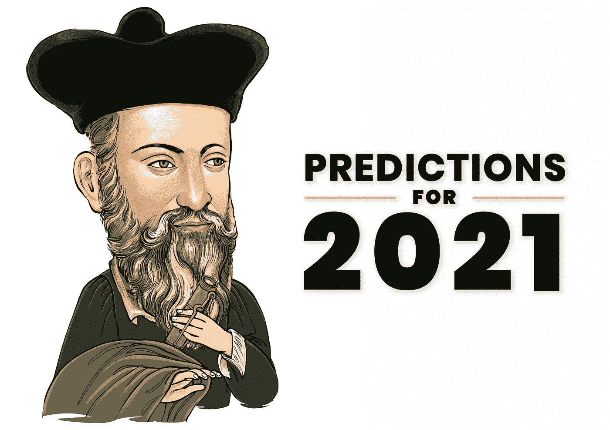

# 2021 年 10 大理财预测，保护你的财富

> 原文：<https://medium.datadriveninvestor.com/10-financial-predictions-for-2021-to-protect-your-wealth-ce259a512c12?source=collection_archive---------15----------------------->

## 为未来做准备会给你难以置信的自信。现在，你比以往任何时候都更需要一种清晰的感觉。

为未来做准备会给你难以置信的自信。

现在，你比以往任何时候都更需要一种清晰的感觉。无论你走到哪里，都有不确定性会毁了你的一天。但是未来比你想象的更可预测。

所以，这里是我认为 2021 年可能出现的十个结果。

# 1.锁定明年不会结束。

八个月前，我们的政治家告诉我们，限制只会持续几个星期，然后我们就会恢复正常。好了，现在是年底，进入第二次更严重的浪潮。最有可能的是，我们的行动和集会自由将继续受到限制。政府仍将禁止我们大多数人工作，赚取我们生存所需的钱。简而言之，封锁明年不会结束，第二波的余波将是第三、第四或第五波。

# 2.气候变化将重新提上日程。

乔·拜登将气候列为首要任务之一。当选总统竞选时提出了一项 1.7 万亿美元的计划，到 2050 年过渡到 100%的清洁能源。那些投资于碳排放资产(如欧洲排放配额)的人，应该准备好迎接 2021 年的历史新高。

# 3.家庭办公室将成为常态。

如果你愿意，你仍然可以选择去办公室。但会不一样。办公室将是举行重要会议的地方，而不是工作的地方。所有其他的对话你都必须在你的家庭办公室通过 Zoom 来管理。使用 **Slack 或 Trello** 进行工作相关的交流将成为常态。不管是好是坏，在家工作将成为标准。结果呢？这将对商业地产和商务旅行造成**损失**。同时，引发大城市白领的第二波外流。

# 4.密码会攻击银行。

让我们在这里陈述显而易见的事情。银行完蛋了。他们即将受到**央行、金融科技和密码公司的攻击。**一个开放的、更具包容性的金融体系将更接近现实。像**储蓄、贷款、投资或保险这样的每一项金融服务都将被打乱。**首先，由于央行数字货币(CBDCs)，各国央行将绕开整个银行体系。其次，Alphabet、苹果、阿里巴巴和腾讯等金融科技巨头将加大对银行业的关注。然后，**密码交易所和 DeFi 一起，**将把他们的服务扩展到借贷领域。正如摩根克里克数字公司(Morgan Creek Digital)的联合创始人安东尼·蓬皮亚诺(Anthony Pompliano)喜欢说的那样，“做多比特币，做空银行家。”

# 5.标准普尔 500 将突破 4000

随着零利率持续到 2023 年，以及无限制的印钞，你可以闭上眼睛做多股票。同样，拜登政府下的财政刺激和与贸易战相关的积极发展导致前景更加乐观。摩根士丹利预计，到 2021 年 12 月，标准普尔 500 指数将升至 3900 点。摩根大通的观点更加乐观。他们为 S & P 500 设定了接近 4200 的目标。当然，对股票市场做出乐观的预测通常是一个安全的赌注，因为股票通常上涨的次数比下跌的次数多。但是，这并不意味着收益会一帆风顺。波动性将继续弥漫市场。

# 6.债券价格会下降。

在未来两年零利率的情况下，固定收益等大规模资产类别几乎一文不值。例如，仅美国养老金负债和 401K 就管理着超过 60 万亿美元的资产。这是一种不可思议的购买力，必须具有生产力。没有一个理性的投资组合经理愿意将 70%的资金投入表现不佳的股票。这些资金中的一部分将开始转向股票、黄金或比特币。

# 7.原油价格将飙升至每桶 50 美元以上。

鉴于全球经济的进一步开放，石油输出国组织减产，美国页岩产量在拜登政府下逐步减少；石油市场看起来相当平衡。我认为油价将突破每桶 50 美元，并在可预见的未来保持不变。

 [## 这么说一家大型风投基金正在投资你的初创公司？4 实际考虑|数据驱动的投资者

### 首先，恭喜你。融资总是需要努力的，一个大的风险投资基金当然是一个大的…

www.datadriveninvestor.com](https://www.datadriveninvestor.com/2020/08/09/so-a-big-vc-fund-is-investing-in-your-startup-4-practical-considerations/) 

# 8.通胀率将远高于 2%

全球封锁的成本估计为 30 万亿美元。那可是一大笔钱。不幸的是，政府为了减少经济损失，会简单地借钱。他们从央行借钱，央行只会印更多的钱。这意味着更高的商品和服务价格和更低的货币购买力。人们可以争论这是否道德。但是，系统就是这样。此外，它严重依赖于不理解它的人。正如亨利·福特所说， ***“这个国家的人民不了解我们的银行和货币体系，这已经够好了，因为如果他们了解，我相信在明天早上之前会有一场革命。”***

# 9.黄金将升至历史新高。

仅在过去的十个月里，美元印刷总量就增长了 35%。众所周知，在货币宽松期间，投资者倾向于从美元转向黄金，以对冲通胀。尽管 2020 年有 24%的惊人涨幅，但避险资产的目标是又一个辉煌的一年。金价在 8 月份达到顶峰，当时价格创下每盎司 2075 美元的新高。但是在 2021 年，我们将会看到另一个历史新高。

# 10.比特币的价格将飙升至 5 万美元

我的 2020 年比特币预测 100%应验了。我希望我的 2021 年也是准确的。今年，我们看到大型对冲基金，如[古根汉姆](https://markets.businessinsider.com/currencies/news/guggenheim-fund-bitcoin-investment-cryptocurrency-market-rally-grayscale-trust-btc-2020-11-1029849060)、[文艺复兴科技](https://www.theblockcrypto.com/post/62322/75-billion-hedge-fund-renaissance-technologies-is-eyeing-the-bitcoin-futures-market)、[保罗·都铎·琼斯](https://news.bitcoin.com/paul-tudor-jones-bitcoin-apple-google/)或[斯坦利·德鲁肯米勒](https://www.forbes.com/sites/billybambrough/2020/11/12/a-legendary-hedge-fund-billionaire-just-flipped-to-bitcoin-calling-it-better-than-gold/?sh=7037b2d6222f)，因鼓吹比特币是价值储存手段而成为头条新闻。**华尔街简直爱上了比特币。**大型机构如[摩根大通](https://www.forbes.com/sites/billybambrough/2020/05/30/jp-morgan-bitcoins-biggest-enemy-suddenly-appears-to-be-going-all-in-on-crypto/?sh=1d39665223a6)、[渣打](https://decrypt.co/44469/standard-chartered-wants-to-hold-more-crypto-for-institutions)、[花旗](https://www.forbes.com/sites/billybambrough/2020/11/19/leaked-citibank-report-reveals-bitcoin-could-rocket-to-300000-price-by-end-of-2021/?sh=596072826eab)或[德意志银行](https://www.db.com/what-we-do/Focus-topics/cryptocurrencies-and-blockchain/)继续为客户构建解决方案，并开始常规资产类别覆盖。同样，散户投资者也将在 2021 年开始购买比特币。事实是，购买 crypto 从未如此简单。这些事件可能会造成供应紧张和牛市，将油价推高至 50，000 美元以上。

# 最终想法

希腊哲学家赫拉克利特说过，“变化是生活中唯一不变的东西。”

2020 年是变革的一年。2021 年将是一个适应它的机会。

当你在 2021 年变得有弹性时，你会取得巨大的进步。

此外，如果你相信 2021 年将会是一个好年景，那么你就会这么看。好年景和坏年景都是感知的问题。

为伟大的 2021 年干杯！

如果你喜欢这篇文章，请在左下角“鼓掌”50 次，这样会有更多人分享。您可以随时关注我的 [*Twitter*](https://twitter.com/RasVasilisin) *和*[*LinkedIn*](https://www.linkedin.com/in/rastislav-ras-vasilisin-11bb5819/)*，别忘了订阅我们发送给全球 15，000 多名投资者的*[*Virtuse News*](https://www.virtuse.com/)*。*

## 获得专家观点— [订阅 DDI 英特尔](https://datadriveninvestor.com/ddi-intel)