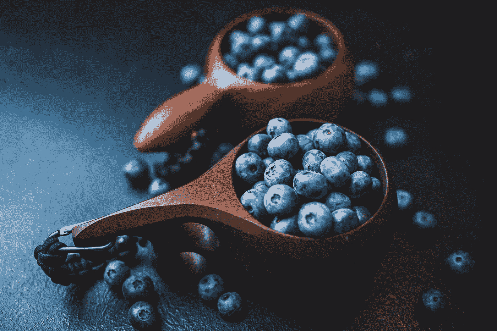

# 10 种超级食物让你头脑发热。

> 原文：<https://medium.datadriveninvestor.com/10-foods-you-should-eat-to-have-a-super-brain-d30c9f30b9dd?source=collection_archive---------15----------------------->

超级食物可以帮助你达到超人的水平，其中一些也会刺激你的味蕾。

Photo by [Daniil Silantev](https://unsplash.com/@betagamma?utm_source=medium&utm_medium=referral) on [Unsplash](https://unsplash.com?utm_source=medium&utm_medium=referral)

我们都试图在封锁期间有所作为，成为我们的阿尔法版本，以超人的水平工作。但是，我们经常过度劳累，大脑模糊，疲劳，或者对我们正在做的事情失去清晰和理解。这些食物可以作为你的午餐小吃，或者做一杯奶昔来提神醒脑。

# 1.鳄梨

如今，鳄梨经常被称为超级食物，考虑到它对健康的益处，这并不奇怪。这是注重健康的人的普遍选择。鳄梨含有大量的单饱和脂肪酸，可以保护脑细胞免受腐败。
鳄梨还有其他几个好处:减肥、增加体内有益胆固醇以及有益心脏健康。

# 2.蓝莓

你可以称它们为“大脑浆果”，因为它们对大脑有好处。蓝莓等于大脑健康。这些美味的浆果可以提高你的注意力和集中力，改善心理健康，促进脑细胞，保护你免受年龄相关的记忆丧失。这样的例子不胜枚举。
如果你还没有把蓝莓纳入你的饮食，现在是时候开始吃蓝莓了。

# 3.花椰菜

抱歉，但我们不能让名单都超级好玩，对吧？必须有一些绿色蔬菜。众所周知，花椰菜可以提高你的推理能力，促进大脑康复。持续保持最佳状态会改善你的认知功能。
研究表明，西兰花还能提高你的学习能力。

Photo by [karl muscat](https://unsplash.com/@kmus07?utm_source=medium&utm_medium=referral) on [Unsplash](https://unsplash.com?utm_source=medium&utm_medium=referral)

# 4.椰子油

椰子油含有许多健康的脂肪，并鼓励你的身体燃烧脂肪，为你的大脑和身体提供燃料。椰子油中的 MCTs 分解成酮，帮助你的大脑像超级跑车一样运转。
除此之外，椰子油对你的皮肤、头发和牙齿来说是正确的选择。

# 5.蛋

鸡蛋是最好的营养来源之一。说到好处，很少有人能与鸡蛋相提并论。鸡蛋有助于你的精神健康，提高你的记忆力。它在很大程度上改善了你的认知功能。这是你饮食中绝对应该有的超级食物之一。

# 6.多脂鱼

当人们寻找健脑食物时，鱼是必不可少的。大约 50-60%的大脑由脂肪组成，其中大部分是ω-3 脂肪酸。你的大脑利用这些脂肪来构建新的神经细胞。这些细胞是学习和记忆所必需的。我建议直接吃鱼，比如鲑鱼，尽管鱼油胶囊也是有益的。

# 7.绿叶蔬菜

像菠菜这样的绿叶蔬菜是极好的健脑食物。它们含有 B 族维生素叶酸。已经证明它可以降低高半胱氨酸的水平，高半胱氨酸是一种对神经元有毒的化合物。每天只吃一份菠菜可以显著增强你的大脑，降低任何与大脑相关疾病的风险。

# 8.姜黄

思维不清晰通常伴随着注意力不集中、注意力不集中和记忆问题。更好的说法是脑雾或精神疲劳，这在技术上不是一种医学状况。姜黄可以改善神经系统疾病，如阿尔茨海默氏病、偏头痛和抑郁症，这三种已知的精神疲劳因素。

# 9.胡桃

不喜欢鱼吗？你可以从核桃中获得同样的好处。核桃比其他任何坚果都富含ω-3 脂肪酸。它减少炎症，炎症是导致许多脑相关疾病的主要因素之一。总的来说，核桃是一种不可思议的食物。

Photo by [Sara Cervera](https://unsplash.com/@saracervera?utm_source=medium&utm_medium=referral) on [Unsplash](https://unsplash.com?utm_source=medium&utm_medium=referral)

# 10.黑巧克力

我们把最好的留到了最后。这是每个人的最爱，巧克力。巧克力已经被证明可以提升你的情绪。它增加了大脑中的血流量，使大脑更加活跃，并使你的整体认知功能。
这是你每天吃每一块巧克力的理由。

希望你喜欢这份清单，并把它们融入你的饮食中。你也可以把它们混合起来，做一杯超级奶昔。