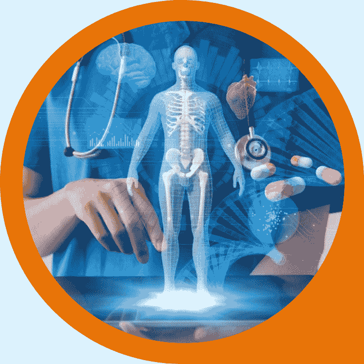
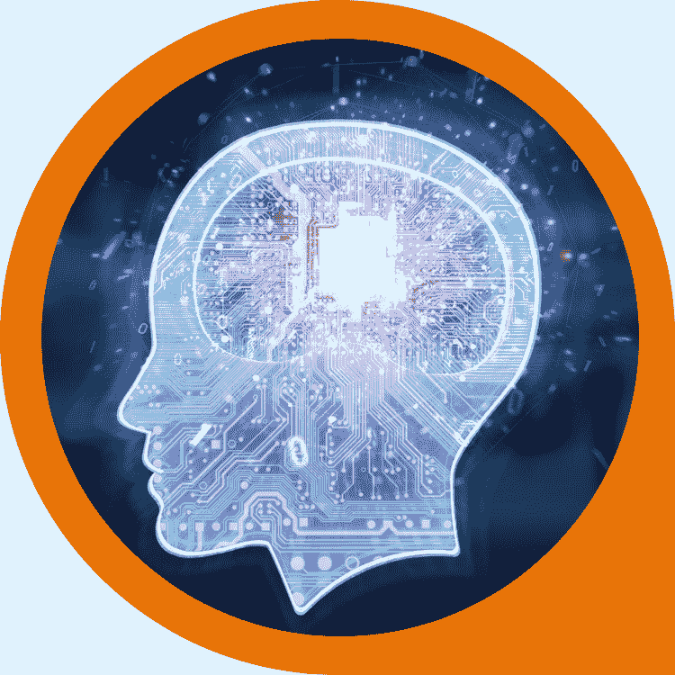
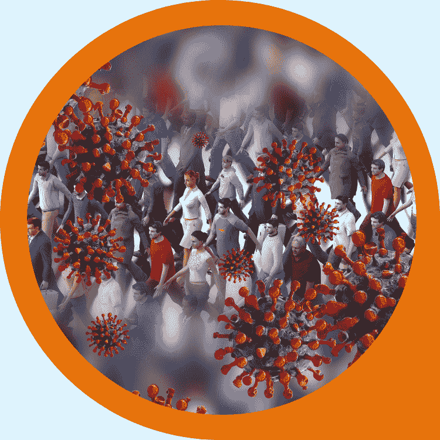
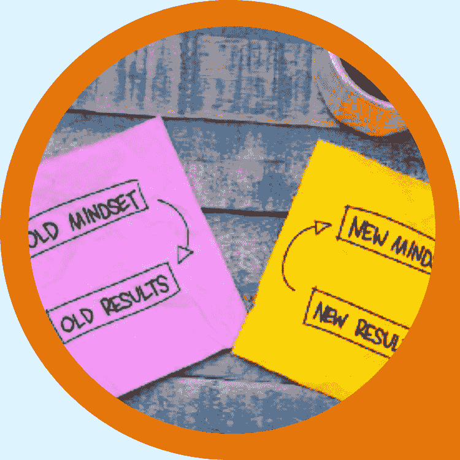
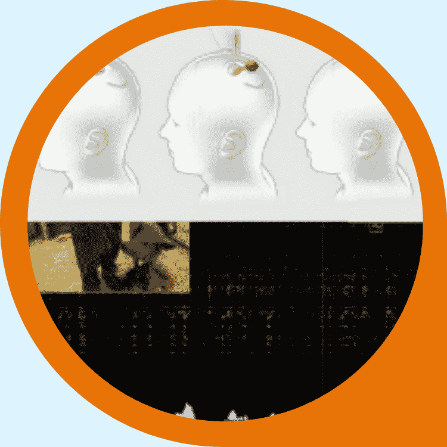
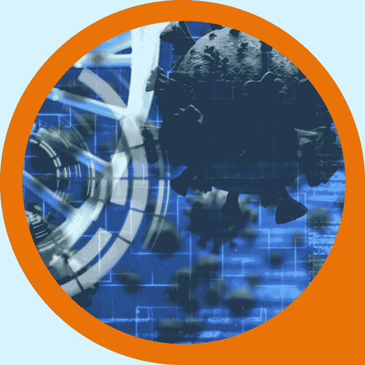

# 10 个新鲜故事开启周末

> 原文：<https://medium.datadriveninvestor.com/10-fresh-stories-to-start-the-weekend-a9451282c6cb?source=collection_archive---------22----------------------->

## **DDI 英特尔| 9 月 4 日开始的一周**

# 家政

**嘿，我们喜欢中号，但你见过这个吗？**

当我们将您的文章发布到我们的[领先网站](https://www.datadriveninvestor.com/)时，它就有资格出现在 DDI 英特尔时事通讯中。让我们与全球 60，000 多名订户和观众分享您的最佳作品。

你在大数据、人工智能、物联网、创业文化或科技相关领域挖掘出了什么独特的东西吗？请[寄给我们一份草稿](https://datadriveninvestor.com/mainsubmission)。

# DDI 编写器亮点

如有可能出现在英特尔 DDI 和 Datadiveninvestor.com[展会上](https://www.datadriveninvestor.com/)，请与[一起提交此表格](https://datadriveninvestor.com/mainsubmission)。

# [AI 与医学影像创业公司？6 个主要趋势](https://www.datadriveninvestor.com/2020/08/30/ai-and-medical-imaging-startups-6-key-trends/)

“这篇文章将探讨医学成像中人工智能的需求和解决方案，试图消除现实中的炒作。”— [阿米特·加尔格](https://www.linkedin.com/in/amgarg/)

# [未来科技:Neuralink 更新](https://www.datadriveninvestor.com/2020/09/03/futuristic-tech-neuralink-update/)

“Neuralink 的目标是使用一种小型、无缝植入的大脑芯片，称为“链接”，来解决各种大脑和脊柱问题，以及增强人类的能力。”— [拉曼迪普·塞尼](https://www.linkedin.com/in/ramandeep-saini-9211b4175/)

# 美国人永远不应该吸取的教训

“政府的权力应该是确保个人有释放其创造力的自由，而不是像《大西洋月刊》的文章所建议的那样，充当其替代品。”亨里克·科瓦尔茨克

# [初创公司创始人的最高准则](https://www.datadriveninvestor.com/2020/09/02/top-rules-for-startup-founders/)

"这里有一些要点需要考虑，以便为你的企业打下坚实的基础."弗朗西丝卡·波罗

# [人工智能帮你聪明理财](https://www.datadriveninvestor.com/2020/09/02/artificial-intelligence-helps-you-be-smart-with-money/)

“即使没有疫情，财务状况也是不祥之兆。根据比罗的数据，55%的成年人没有为退休储蓄足够的钱。— [吉姆·卡扎曼](https://www.linkedin.com/in/jim-katzaman-33641b21/)

# 与投资者取得联系

## 技术远见者

**你对未来有什么憧憬吗？**可能是一个应用程序、一项新服务或一个问题的独特解决方案？

需要具备特定技能的人，或者需要特定类型的资源或数据？

还是你项目的投资人？

让我们知道 DDI 能帮上什么忙——你可以发送一些基本信息给*ventures@datadriveninvestor.com*。

## 交易算法向导

如果你有一个能产生稳定业绩的交易策略，请告诉我们。我们也许能为你的扩建提供资金。联系我们在 research@datadriveninvestor.com 的研究团队。

*如果您和我们一样对 DDI 英特尔感到兴奋，请转告我们。如果还没有，可以* [*订阅*](https://data-driven-investor.ck.page/a258e80d70) *。*

# 让你成为更好的营销人员的 5 个思维技巧

"在实现对他人的领导之前，必须先掌握对自己的领导."詹妮弗·日本京都电子工业株式会社

# Neuralink:未来还是终结？

“Neuralink 展示的技术甚至与它所说的愿景相去甚远。”— [沙查尔奥兹](https://www.linkedin.com/in/ozshachar/)

# [集体意识——一种天生的反驳](https://www.datadriveninvestor.com/2020/09/01/collective-consciousness-an-innate-retort/)

"过度的集体主义会增强力量，但往往会适得其反."— [医学博士亚当·塔布里兹](https://www.linkedin.com/in/adamtabriz/)

# [商务沟通不畅是网络安全问题的 5 个原因](https://www.datadriveninvestor.com/2020/09/01/5-reasons-why-poor-business-communication-is-a-cybersecurity-issue/)

“成功的团队明白每个人都保持一致的重要性，没有对话，这种‘流动’就不会发生。”大卫·卢基奇

# [4 种 COVID 细胞疗法和制造它们的公司](https://www.datadriveninvestor.com/2020/08/31/4-covid-cell-therapies-and-the-companies-that-are-making-them/)

“目前正在进行大量的临床试验，研究它们对于降低 COVID 诱导的急性呼吸窘迫综合征(ARDS)的安全性和有效性。”— [塔拉·费尔南德斯](https://www.linkedin.com/in/tlfern/)

[**比特币基础知识:比特币入门**](https://www.amazon.com/dp/B08FBP9W4Y) 帮助你开启比特币之旅。了解构成比特币的基本概念，深入研究比特币的历史，等等。

# 会员之角

我从你们提交的所有材料中收集了一些发人深省的问题。我们非常乐意阅读您对这些问题的回答(电子邮件在本部分末尾)。

*   "机器人、仿生人和机器人很快会和我们生活在一起吗？"—沙查尔湖
*   “你认为埃隆·马斯克的 *Neuralink* 背后的技术应该被赋予生命吗？”—拉曼迪普·塞尼

**当我们在这里的时候:**想要在会员之角分享你的想法，或者也许你已经对数据驱动投资者上的一个故事有了有益的回应？

给[members@datadriveninvestor.com](mailto:members@datadriveninvestor.com)发一条主题为“会员-英特尔”的消息。

# 对我们媒体出版物订户的提醒

你们中的一些人可能已经订阅了 DDI 的媒体出版物时事通讯和主要网站的时事通讯。我们欣赏粉丝，但两个简讯是同一只野兽。

如果你在这种情况下，我们建议坚持使用领先的网站。你会注意到正确的一个缺乏媒体品牌。如果你有任何问题，给我们发电子邮件:members@datadriveninvestor.com