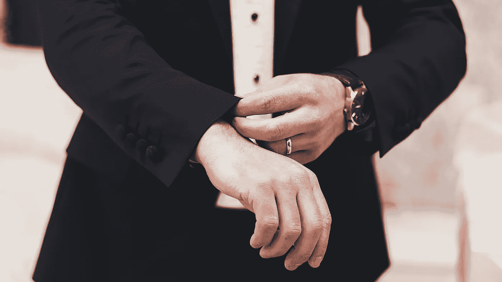

# 保持自信应该避免的 10 个习惯

> 原文：<https://medium.datadriveninvestor.com/10-habits-that-you-should-avoid-to-keep-your-self-confidence-5b00526ee2e2?source=collection_archive---------15----------------------->

1.  不要与悲观的人、长舌妇和消极的人交往— 这样与人交谈没有价值，也没有成效。这往往只会导致更糟糕的感觉，对你没有任何好处。
2.  **寻找相似之处而不是不同之处——为了避免消极地比较自己，寻找相似之处，找出是什么让你*和其他人*更亲近。尤其是当这是一个英雄或者比你更远的人的时候！**
3.  **谈论问题太多—** 当然你应该找出问题，但之后的一切都应该是解决方案——谈论，而不是更多地谈论问题。弄清楚。分析一下。然后制定步骤来纠正它，这样你就可以尽快行动起来！
4.  尽你所能，记住你所拥有的不是既定的。你是幸运的，被祝福的，并且会对你所拥有的无比感激。权利建造了太容易被打破的假墙。
5.  **努力取悦他人—** 你这样做得越多，你就越依赖他人来为你规划生活。你对他们推卸责任，而自己却从不迈出一步，这让你对自己的能力缺乏信心。
6.  **改变你的想法——尽你所能坚持你选择做的事情。多选择，即使是很小的事情。今晚你想和你的朋友出去吗？是还是不是？你想买那块巧克力吗？是还是不是？无论你做了什么决定，你都要坚持到底。为更大的事情也这样做，为它做准备。**
7.  屈服——让你自己和你的目标捆绑在一起，而不是时间。不管付出什么代价，都要把事情做完，而不是设定一个上床睡觉的时间限制。在你完成之前不要放弃！这对你的任何梦想都是正确的。
8.  待在你的舒适区——当你离开你的舒适区，给生活一个机会的时候，生活中最美好的事情就会来到你身边！每天做一些让你稍微不舒服的事情，你的生活就会完全改变。
9.  兑现不足和承诺不足——相反，在承诺上过度承诺和兑现过度！它会建立一种比其他任何东西都要高的自信和一种不容易动摇的自尊。
10.  被动——你越被动，就越容易陷入别人的游戏，走上一条你从未想过要走的路。自己做选择。选择自己的人生。走自己的路。