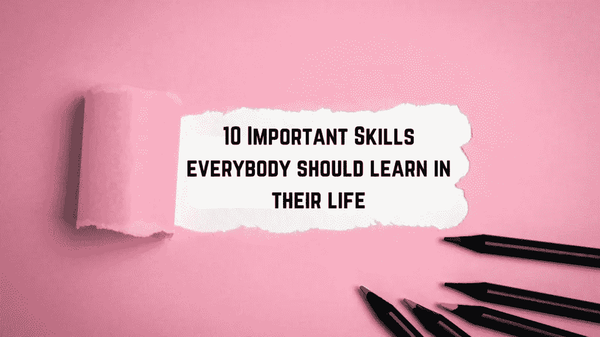
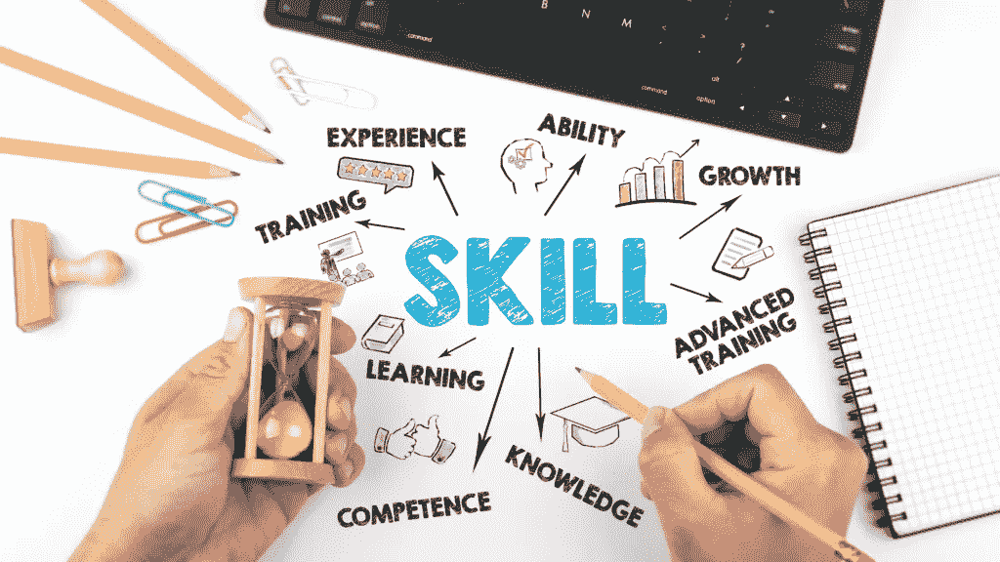

# 每个人一生中都应该学会的 10 项重要技能

> 原文：<https://medium.datadriveninvestor.com/10-important-skills-everybody-should-learn-in-their-life-74dddd2e22ec?source=collection_archive---------8----------------------->

canva.com user-edited photo

获得必要的甚至是最基本的生活技能不仅可以帮助我们过上更好的生活，还可以帮助我们在我们所做的每一件事情上都更加成功，因为这从根本上改善了我们生活的各个方面。

下面列出的这些生活技能能够让我们有效地应对和适应日常生活中的需求和挑战，因此培养和主动学习这些技能非常重要。

canva.com user-edited photo

***1。自律***——自我自律是任何领域成功的关键。它帮助我们继续前进。

如果一个人在生活的各个方面都很自律，无论是健康、职业、商业、人际关系还是财务方面，他们总能找到方法控制自己的坏习惯，并不断克服遇到的任何障碍，他们不会感到消极并很快放弃，而是会找到方法改变计划中的错误，从而帮助他们实现目标。

当你缺乏这种技能时，你生活的其他方面就会陷入困境。所以，从计划好你的一天开始，坚持做下去，然后随着时间的推移，你会开始看到更加自律的结果。

***2。自我意识***——变得有自我意识意味着你正在了解你今天是什么样的人，以及如果你改善了生活中的某些事情，你将会成为什么样的人。它是对我们自己的认识，无论是来自我们的优点、缺点、思想、情感和行为。

当你认为目前有些事情不对劲，并且认为需要做些什么的时候，你就意识到了改变的可能性，因为这会让你的生活比现在更好。

***3。时间管理****——学会如何管理自己的时间意味着你可以更有效、更高效地完成某件事，因为时间是有限的。*

*通过分配和指定你要做每项任务的时间，可以帮助你完成更多的工作。这有助于你不再浪费时间去做不必要的事情，比如疯狂地看一场演出，而是把更多的精力放在重要的、有成效的事情上，而这些事情是首先需要做的。基本上，现在工作，然后做其他事情，利用剩下的时间。*

****4。沟通***——提高你的沟通技巧将有助于你清楚地向他人展示自己，并帮助你融入周围的环境。一旦你知道如何在讨论中更好地向他人表达自己，你就能让对话变得有趣而不是尴尬。*

*公开演讲是测试你恰当有效沟通能力的一个例子，因为你在观众面前向许多人传达信息。*

*通过提高你的沟通技巧，一个人必须学会如何在说话时更加自如和自信。*

****5。解决问题****

*解决问题的技巧不仅能帮助我们找到更好的解决问题的方法，还能帮助我们避免很多可能发生的问题。我们越知道如何解决问题，我们就能得到越多的解决方案。*

***⑥*。倾听技巧*–**倾听他人的观点有时能给我们提供我们需要知道的有价值的见解和教训，并让我们受到启发。*

*如果你是那种在任何谈话中都倾向于说得太多，并且不让对方说话的人，培养这种技能是很重要的。*

*记住，伟大的听众总是多听少说。也就是说，他们不会因为说了别人不喜欢的话而容易陷入麻烦，因为他们会通过少说的行为自动避免很多麻烦。*

*当一个人说得越少，被误解的机会就越少，通过多听的行为，好的倾听者能够更多地了解说话的人，因为那些说得越多的人最终总是透露太多关于他们自己的信息或泄露太多信息。*

* [## 健身房 10 年的 10 条人生经验|数据驱动的投资者

### 走错一步，他们就会掉下去。两位登山者优雅地回到了地面。他们在那里…

www.datadriveninvestor.com](https://www.datadriveninvestor.com/2020/02/03/10-life-lessons-from-10-years-in-the-gym/)* 

****7。决策能力***——提高你的决策能力会让你在任何情况下都能做出快速而有效的决定。*

*能够分析和决定你所知道的对你有益的事情，而不是随波逐流，凭直觉行事，这将有助于你带来好的结果，因为错误的决定会带来后果，有时会毁了你的生活。*

****8。情绪恢复力* —** 我们一生中总是面临艰难的处境，虽然这些逆境有时更容易处理，但我们仍然必须能够在前进的道路上找到正确的方法。*

*我们必须学会如何在遇到困难时保持冷静和积极，并理解一切都是暂时的，这样我们就可以轻松应对*

****9。自信—*** 相信自己是我们需要拥有的最重要的东西之一。我们应该相信我们正在做的每件事都会很棒，而不是总是情绪低落。没有它，什么都不可能，因为成功的第一步是在别人都不相信你的时候相信自己。*

***10 日*。适应变化——生活向我们抛出许多挑战，尤其是在我们最意想不到的时候，当这种情况发生时，一个人必须改变，否则他们将永远停留在那个地方。****

*为了在生活中前进，你必须善于适应变化。*

*~~~~~~~~~~~~~~~~~~~~~~~~~~~~~~~~~~~~~~~*

***如果你错过了我们之前的文章，可以点击下面这些链接阅读；***

* [## 睡眠的重要性——你需要优先考虑睡眠的 7 个理由

### 适当的睡眠对我们一生的健康和整体幸福至关重要

medium.com](https://medium.com/in-fitness-and-in-health/the-importance-of-sleep-7-reasons-why-you-need-to-prioritize-it-a36df8116030)  [## 如果你觉得生活停滞不前该怎么办

### #1 训练你的思维不要消极思考

medium.com](https://medium.com/the-innovation/what-to-do-if-you-feel-stuck-in-life-30b1b7eb9806)  [## 如何防止脱发

### 脱发是许多人的共同问题，影响着世界上数百万人

medium.com](https://medium.com/in-fitness-and-in-health/how-to-prevent-hair-loss-d7128f5f6124)  [## 应对变化的 10 种方法

### 变化是不断的，是不可避免的。我们不能抗拒变化，而是顺应变化，尤其是在…

medium.com](https://medium.com/the-innovation/10-ways-to-cope-with-change-df0d4468abcd) 

## 访问专家视图— [订阅 DDI 英特尔](https://datadriveninvestor.com/ddi-intel)*