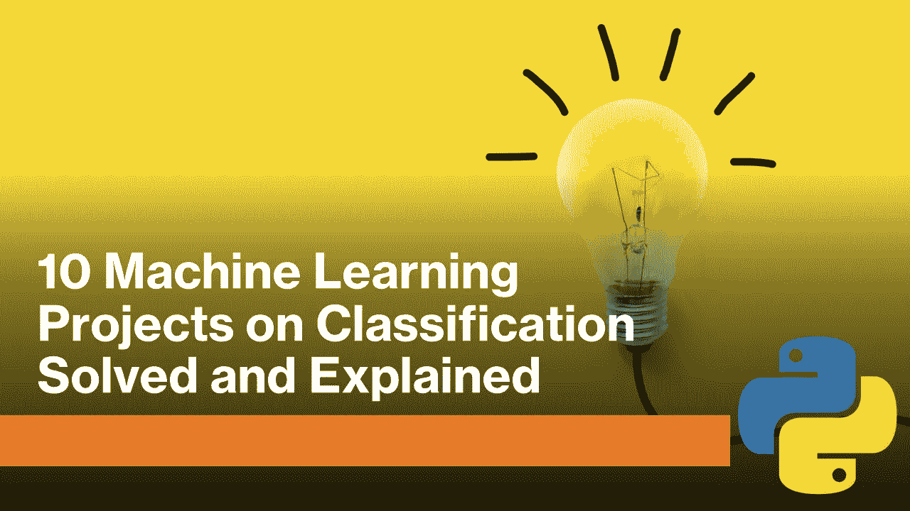

# 使用 Python 进行分类的 10 个机器学习项目

> 原文：<https://medium.datadriveninvestor.com/10-machine-learning-projects-on-classification-with-python-9261add2e8a7?source=collection_archive---------0----------------------->

## 用 Python 解决并解释了 10 个关于分类的机器学习项目。

在机器学习中，分类被称为基于先前训练的模型来确定对象是否属于特定类别的问题。在本文中，我将向大家介绍 10 个用 Python 编程语言实现的机器学习分类项目。

在进行下面的项目之前，你必须了解什么是分类。机器学习中有两种分类:

1.  [**二元分类**](https://thecleverprogrammer.com/2020/07/20/binary-classification-model/)
2.  [**多类分类**](https://thecleverprogrammer.com/2020/07/21/multiclass-classification/)

 [## 机器学习和人工智能如何改变电子商务的面貌？|数据驱动…

### 电子商务开发公司，现在，整合先进的客户体验到一个新的水平…

www.datadriveninvestor.com](https://www.datadriveninvestor.com/2020/11/19/how-machine-learning-and-artificial-intelligence-changing-the-face-of-ecommerce/) 

# 使用 Python 的 10 个分类项目

1.  [**性别分类**](https://thecleverprogrammer.com/2020/11/25/gender-classification-with-python/)
2.  [**心脏病预测**](https://thecleverprogrammer.com/2020/11/10/heart-disease-prediction-using-machine-learning/)
3.  [**肺炎检测**](https://thecleverprogrammer.com/2020/11/22/pneumonia-detection-with-python/)
4.  [**假币检测**](https://thecleverprogrammer.com/2020/09/29/fake-currency-detection-with-machine-learning/)
5.  [**泰坦尼克号生存预测**](https://thecleverprogrammer.com/2020/08/25/titanic-survival-with-machine-learning/)
6.  [**新冠肺炎探测**](https://thecleverprogrammer.com/2020/07/09/covid-19-detection/)
7.  [**皮肤癌分类**](https://thecleverprogrammer.com/2020/06/29/skin-cancer-classification-with-machine-learning/)
8.  [**狗和猫的分类**](https://thecleverprogrammer.com/2020/06/16/dog-and-cat-classification-using-convolutional-neural-networks-cnn/)
9.  [**欺诈检测模型**](https://thecleverprogrammer.com/2020/08/04/fraud-detection-with-machine-learning/)
10.  [**语言分类模式**](https://thecleverprogrammer.com/2020/10/08/language-classification-with-python/)
11.  [**100+机器学习项目解决并讲解**](https://thecleverprogrammer.com/2020/11/15/machine-learning-projects/)

我希望你喜欢这篇关于解决和解释 10 个[机器学习](https://amankharwal.medium.com/)分类项目的文章。欢迎在下面的评论区提出你有价值的问题。

## 访问专家视图— [订阅 DDI 英特尔](https://datadriveninvestor.com/ddi-intel)