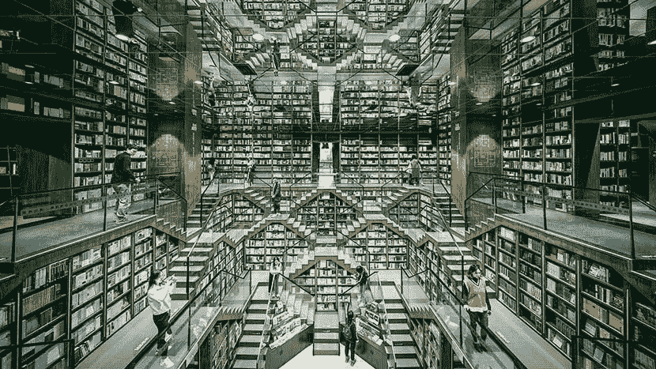
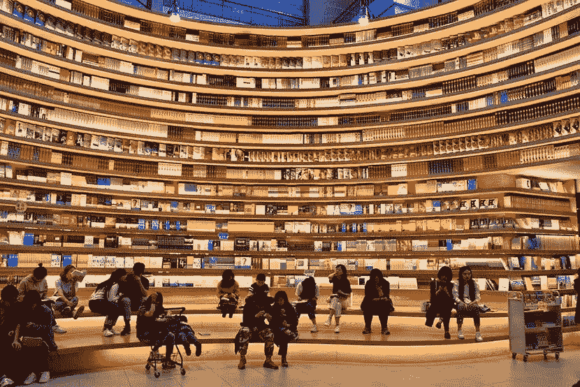
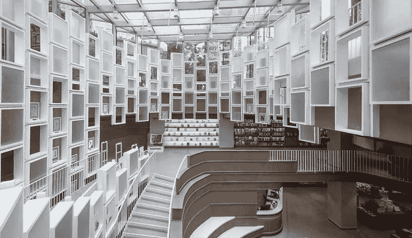
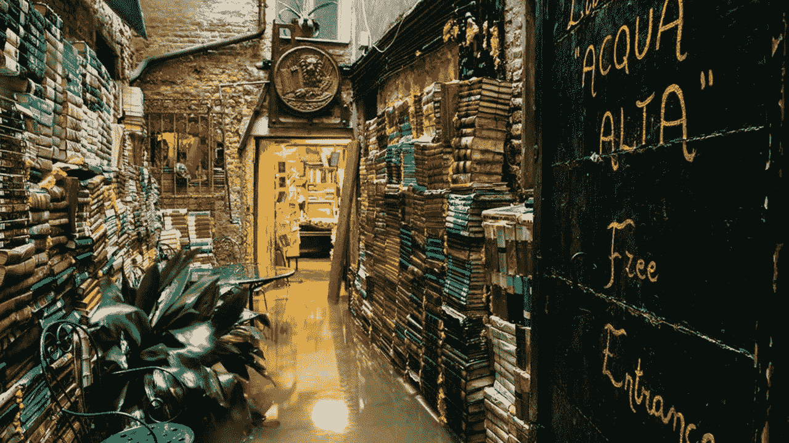
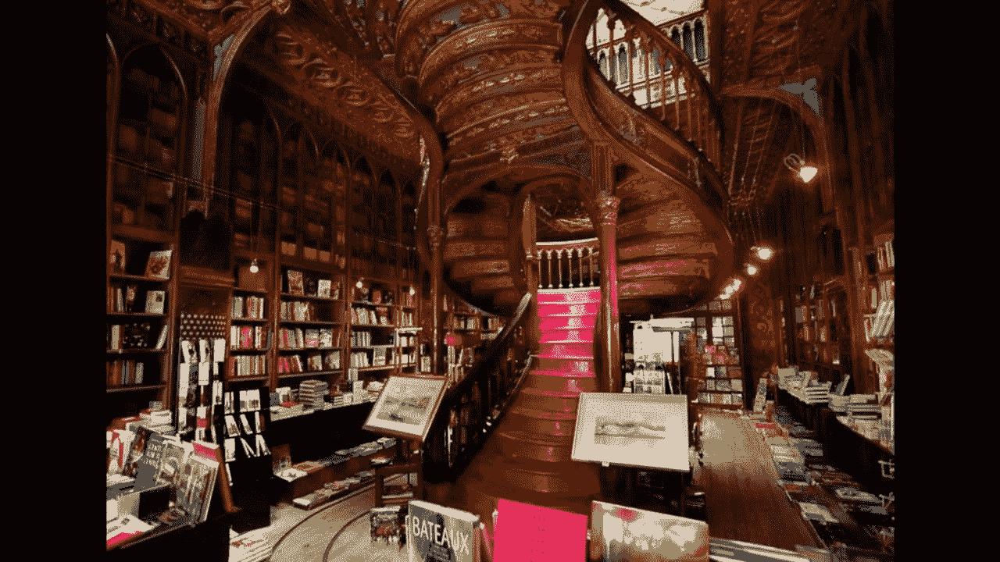
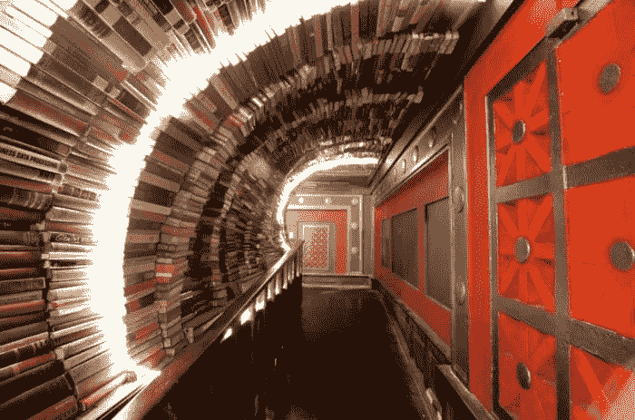
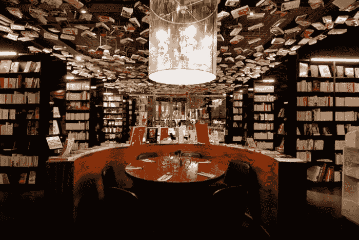
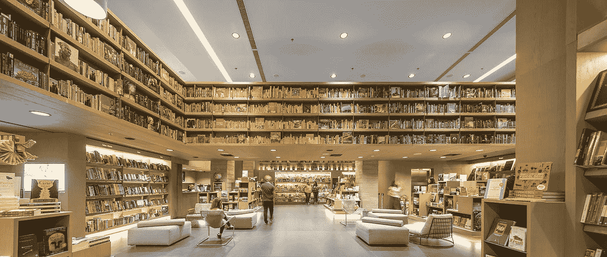

# 创新禅的 10 个瞬间

> 原文：<https://medium.datadriveninvestor.com/10-moments-of-innovation-zen-9004beaf2487?source=collection_archive---------15----------------------->

Photo by [Simon Rae](https://unsplash.com/@simonrae?utm_source=medium&utm_medium=referral) on [Unsplash](https://unsplash.com?utm_source=medium&utm_medium=referral)

我不知道你怎么想，但是我已经厌倦了这些天不断出现的歇斯底里。在新冠肺炎、政治、经济和汤姆·布拉迪的合同(抱歉，我住在波士顿)之间，世界似乎正在经历一场恐慌。

大家好。合十礼。

为了*不*加剧恐慌，我不会写一些话题性的东西并将其与创新联系起来，而是简单地分享一些让我非常快乐和平静的事情的图像，并将它们与创新联系起来。

书籍。

我喜欢书。我喜欢阅读它们，看着它们，谈论它们，置身其中。在亚马逊出现之前的日子里，我会去书店，简单地坐在过道里，因为这是我能想到的最平静和最有活力的事情。甚至不要让我从走进图书馆的书库的纯粹快乐中开始。

但是随着亚马逊的成长和大型连锁书店的萎缩或倒闭，我享受充满书籍的禅的机会变得越来越少。

 [## 精疲力竭耗尽了简单的答案|数据驱动的投资者

### “大多数卫生专业人员知道如何照顾病人，但不知道如何照顾自己。”医疗保健…

www.datadriveninvestor.com](https://www.datadriveninvestor.com/2019/01/15/burnout-exhausts-easy-answers/) 

创新有时会出现这种情况——当新事物以不同的方式创造价值时，不能或不愿改变的旧解决方案就会逐渐消失。是的，我喜欢亚马逊，因为我可以在两天内把任何我想要的书送到我家门口，但我也讨厌它，因为我失去了被书包围时的发现感、喜悦感和平静感。

这就是为什么我喜欢独立书店正在做的事情。他们也在创新，通过改变他们所处的行业。他们不再从事图书销售业务(亚马逊赢得了这场战斗)，他们从事图书体验业务。

《体验商业》这本书提供了 Amazon.com 所不能提供的一切——发现、社区、刺激你所有五种感官的环境。不相信我？你认为亚马逊为什么要开实体书店？

是的，重新定义你所在的行业需要时间、金钱、风险和资源，但这是值得的，因为这不仅能让你继续经营，还能创造持久的竞争优势。

甚至可能创造禅的时刻。

An interior view of the Zhongshuge bookstore in Chongqing, Oct. 22, 2019\. VCG

People browse for books at a new store with wraparound shelving units in Hohhot, Inner Mongolia Autonomous Region, April 21, 2019\. IC

An interior view of the Sanlian Taofen bookstore in Ningbo, Zhejiang province. From @设计美学志 on Weibo

An interior view of the Zhongshuge bookstore in Beijing, June 26, 2019\. VCG

Libreria Acqua Alta, Venice

Livraria Lello, Porto

Shakespeare & Co, Paris

The Last Bookstore, Los Angeles, United States

Cook & Book, Brussels Belgium

Saraiva, Rio de Janeiro

如果您喜欢这篇文章，请与朋友分享，单击👏很多次，跟着我在媒体上。

如果你想了解我在创新方面阅读和喜欢的更多内容，请在 [LinkedIn](http://www.linkedin.com/in/robynmbolton) 上关注我。

要了解我如何与企业创新者合作，超越理论和戏剧，创造持久的变化和切实的商业成果，请访问我在 [MileZero](http://www.milezero.io/) 的邮箱。