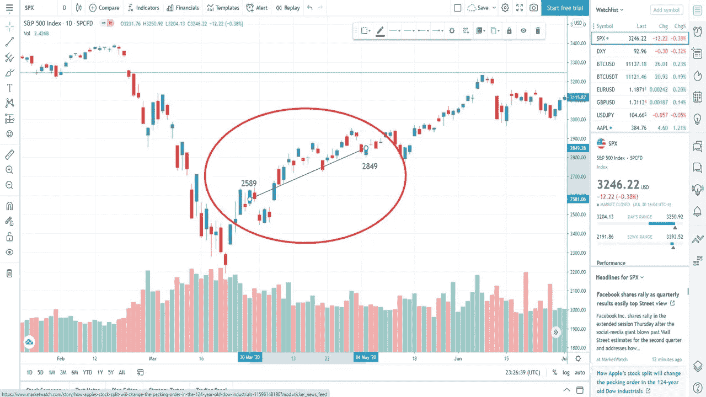

# 帮助你在 2020 年投资的 10 个强有力的建议

> 原文：<https://medium.datadriveninvestor.com/10-powerful-tips-to-help-you-invest-in-2020-be40ecb8edf1?source=collection_archive---------5----------------------->

## 在你的旅途中避开噪音以及所谓的专家。

Photo by [Moose Photos](https://www.pexels.com/@moose-photos-170195?utm_content=attributionCopyText&utm_medium=referral&utm_source=pexels) from [Pexels](https://www.pexels.com/photo/woman-wearing-blue-shawl-lapel-suit-jacket-1036622/?utm_content=attributionCopyText&utm_medium=referral&utm_source=pexels)

我于 1997 年开始投资，我想分享一些经验，或许能在你的投资之旅中帮到你。在经历了一些事件如 1997 年的亚洲金融危机、9/11、2008 年的金融危机、2020 年的金融危机以及一些小事件之后，我的一些建议将在长期内帮助你。

首先，我们从什么是投资开始。人们总是混淆这两个词，混淆投资和交易。投资不是交易，因为两者非常不同，尽管有些人误用了这个术语。

根据 Investopedia:

> 投资是分配资源的行为，通常是金钱，期望产生收入或利润。你可以投资事业，比如用钱创业，也可以投资资产，比如购买房地产，希望以后能以更高的价格出售。

你投资了一段时间，你可以选择在未来的某个特定时间卖出。这笔交易可能会在几个月到几年后进行..

至于交易，你是在短期内找钱。

Investopedia 有一个不错的定义，但 InvestorWords 有一个更好的定义:

> 短期买卖证券或商品，希望快速获利。

交易者希望在任何地方赚钱，从几秒钟到几天，快速获利。

作为一个投资者，你不是在一天或几周内就能找到钱。你很有耐心，在一段时间内积累投资，你可能会在投资中增加更多的钱，让投资变得更大。

你可能希望有一天用这笔投资买一栋房子，或者作为退休后使用的资金。这就把我带到了下一个话题。

 [## 生存还是毁灭:经营者 Vs 创始人 Vs 投资人？数据驱动的投资者

### 作为一名从经营者转型为创始人、再转型为投资者的人，我经常被问到这两者的利弊。我经常用一句…

www.datadriveninvestor.com](https://www.datadriveninvestor.com/2020/08/02/to-be-or-not-to-be-operator-vs-founder-vs-investor/) 

# 1.为你的投资设定一个目标

我总是告诉人们，当他们投资时，他们需要为他们的钱设定一个目标。他们打算用这笔钱做什么？他们是在一个月后还是几年后需要这笔钱？

给你的钱设定一个数字有助于你了解你投资的目的。这也给了你继续增加投资的动力。

最有可能的是，投资将会是一笔可观的金额，所以你会每月、每季度，甚至在你拿到奖金的时候增加投资。除了你，没人能想出这个。为你的投资设定一个目标，看着你的投资增长。

# 2.不要试图把握市场时机

前几天我在看几篇文章，发现有意思的是，有些投资者把所有股票都卖了换现金。我不是金融专家，但这可能非常冒险。没有人能把握市场时机。如果有人可以，他们会是千万富翁。

当然，有时你会认为市场表现得不理性，这在你的投资生涯中会发生很多次。今年是有趣的一年，由于欧洲的石油战争和冠状病毒的结合，股票市场在三月份遭受了巨大的下跌。有些人觉得我们会再次经历 1929 年或 2008 年。自 3 月份崩盘以来，股市恢复的速度超过了多年来的任何时候。许多股票开始创历史新高，如亚马逊、脸书、微软和其他一些股票。

这导致一些投资者认为，由于冠状病毒、高失业率、公司破产、过度的经济支出以及可能的房屋止赎，我们将面临第二次崩盘。可能会出现崩盘，但股市是向前看的。股票市场并不总是对你认为的问题做出反应。股票市场已经把冠状病毒和失业计算在内了。

当崩盘开始时，许多人没有离开市场，而是把钱投入市场。很多人都是第一次。千禧一代正在通过交易今年早些时候遭受打击的航空公司和邮轮公司等股价下跌的股票赚钱。

将资金撤出市场可能非常危险。市场可能会突然转向，继续向上攀升。因此，如果你在 4 月 1 日卖出股票，并想在一两个月后回购，你可以以更高的价格买入同样的股票。

Trading View

关键是不要动你的股票，尤其是当你的股票比你买入时下跌的时候。如果你醒了，那么这可能是一个拿着你的收入进行再投资的好时机。

在 2008 年的股灾中，我卖掉了一些股票。如果我能回到过去，我会不去管那些股票。在这段时间里，市场比今天更疯狂。公司得到救助，银行关闭，并与更大的银行合并。汽车公司倒闭了。你也可以在细价股范围内找到许多股票。

一两年后，在这场崩盘中，我开始买入那些被击败的优质公司。其中一些是美国银行和摩根大通。我持有它们，并以 100%到 200%的收益卖出。

除非你是一个非常有经验的投资者，否则把握市场时机可能是你犯的最严重的错误之一。

# 3.继续教育自己

所以如果你已经投资了一年或者五年，而且你的投资做得非常好，那么永远要继续教育自己。总是有更多的东西要学。市场经历周期。

股票市场不仅受到公司本身表现的影响，还受到外部因素的影响。高失业率或通货膨胀可能会影响进入市场的资金量。对正在发生的事情有一个大致的了解是很好的。所以当你的股票下跌了一年，你就知道为什么了。该股可能会出现领导层变动。由于特斯拉和其他电动汽车上市，汽车行业的大多数股票下跌。对影响你投资的其他因素有一个大致的了解是有好处的。

许多金融新闻来源每天都提供快速更新。如果你有一个投资经纪账户，许多这样的平台会告诉你你的股票的最新消息。如果你没有这个，你可以很容易地做一个谷歌搜索来找出一只股票的最新消息。

 [## 你需要的最好的金融教育书籍

### 从投资到债务，再到思维方式的转变

medium.com](https://medium.com/makingofamillionaire/the-best-books-for-your-financial-education-that-you-need-to-have-70a90f2ddae8) 

# 4.每月投资

如果你是认真的，有一天想要一个百万美元的储蓄，那么我强烈鼓励你每个月都坚持投资。让投资成为你每月的首要任务之一。所以你需要确保你把这个和你的账单一起包括在你的预算里。我坚信，你需要先付出自己。你赚了钱，所以你需要确保你将来有这笔钱可用，不管是买房子还是退休后用。

# 5.听取投资建议后，做好尽职调查

无论你的朋友或金融专家告诉你投资一支股票，我都鼓励你退后一步，自己做研究。其他人可能会说特斯拉可能是一个好的投资，但特斯拉适合你今天的投资组合吗？在写这篇文章的时候，特斯拉(TSLA)的股价是 1500.49 美元。在过去的一个月里，特斯拉的价格已经起飞，所以你可能想等待下跌后再购买这只股票。

股票分析师做出推荐有他们自己的理由。他们看待股票的时间框架可能与你不同。他们可能会看到 20 年后的情况，而你可能会看到 5 年后的情况。年数会对你决定做什么有很大影响。

# 6.参加投资研讨会

如果你做过投资，读过二十几本书，有时候听听不同的观点也不错。我鼓励你参加投资研讨会。最有可能的是，这些团体会在活动结束时说服你购买他们的课程，但你会了解到还有哪些你不知道的信息。有时信息会有用，而其他时候可能没用。仅仅从一个研讨会上学习一条信息就能让你赚上几千美元。

几年前，我参加了一个期权交易研讨会，了解到我可以交易我的罗斯退休投资组合中的股票，而不会遭受任何税收后果。一旦我了解到这一点，我就对我的投资组合做了一些小的改变，买卖我账户里的股票。

幸运的是，这是在正确的时间，因为我也利用了今年早些时候的市场，因为我正在买卖波音公司的股票。我看到波音降到 100 美元，我认为在这个价格上是便宜的。所以我买了一些股票，然后在股价涨到 170 美元后卖出。

如果你有机会参加一两次投资研讨会，我鼓励你参加。这很值得。

# 7.避免细价股

你可能会看到一个广告或有人分享他们用细价股赚的钱的截图。细价股看起来令人兴奋，有可能带走数千美元。小心，因为这可能不会告诉你这个投资者在他们赚钱之前损失了多少。

细价股是一种快速交易和赚钱的方式，但也是一种快速亏损的方式。我尝试过几次细价股票投资。当你赢的时候你会非常兴奋，但是当你输的时候你会非常生气。

我认为除非你有很多时间和金钱可以浪费，否则你应该坚持投资这种无聊的生活方式。股票投资可能并不总是令人兴奋的，但与交易细价股相比，投资时要安全得多。

如果有一天你决定尝试这个，我鼓励你用小账户余额交易，不要太投入。这是一个快速输掉很多钱的简单方法。你甚至可以把这比作股票市场的赌博。

# 8.当我们处于衰退或萧条时，不要听新闻

当经济不景气时，股市可能会紧随其后。这是你需要限制你的金融新闻和一般新闻的时间。媒体喜欢重复悲观论调 100 次，以确保每个人都意识到这一点。

作为投资者，你不需要听到这些。你已经看到你的投资组合下降了几个百分点。这是你需要记住你为什么投资并坚持到底的时候了。如果你一直听新闻，你会有反应，想卖掉你的股票。对你来说，这可能是一个非常诱人的偏离轨道的时刻。

在崩盘发生之前，你认为自己拥有最好的投资组合。那么，当市场也在变化时，你为什么还要做出改变呢？

如果公司做了一些你不同意的改变，那么你可能想卖掉，把你的钱投资到不同的股票上。如果未来几年的数字看起来不乐观，或者如果另一个竞争对手创造了更好的产品，那么可能是时候把你的钱放到其他地方了。

当你最初选择投资时，你选择它们是有原因的。回去再分析一下那个原因。数字还一致吗？你的投资组合是否像所有其他股票一样下跌了？这可能是坚持到底的时候了。在股票市场的历史上，尽管市场下跌，股票总是上涨。

# 9.观察聪明的投资者在买什么

当沃伦·巴菲特坐拥大量现金时，对我来说是一个信号。他认为市场被高估了，正在等待调整，以收购一两家新企业。这正是 2020 年发生的事情。当沃伦·巴菲特出售航空公司和其他股票时，他在几个月后转而购买了 40 亿美元的 Dominion Energy。巴菲特在 2008 年股灾期间收购通用电气和高盛时也做了同样的事情。

你可能不像巴菲特那样有数十亿美元可以花，但你可以在股市可能被高估的时候有一个想法，以便在未来的下一次低迷时期买入股票。自 2008 年以来，股市一直在向上攀升，其间很少出现回调。

# 10.有应急基金

虽然这最后一项不是投资，但在你的应急基金中有足够的钱是非常重要的。对许多人来说，应急基金即使不比你的投资更重要，也同样重要。

当您的汽车抛锚，或者您需要紧急前往医院，或者您不得不乘坐最后一分钟的航班去拜访家人或朋友时，应急基金将为您提供保障。所有这些费用都是不在计划之中的，无论是现在还是将来，都会让你付出代价。如果你有应急基金，那么你就可以毫无问题地保护自己。如果你没有应急基金，那么你可能会遇到紧急情况，然后迫使你使用 Go Fund Me 来拯救自己。

不管你喜不喜欢，紧急情况总会发生。为紧急情况的发生做准备，他们总是这样做。

在你的投资之旅中，如何投资从来没有一条确定的道路。如果你不花钱请人帮你投资，你就要舒服一点，花一点时间自学。

总结一下，你需要掌握的 10 大技巧是:

1.  为你的投资设定一个目标
2.  不要试图把握市场时机
3.  继续教育自己
4.  每月投资
5.  听取投资建议后，做好尽职调查
6.  参加投资研讨会
7.  避免细价股
8.  当我们处于衰退或萧条时，不要听新闻
9.  观察聪明的投资者在买什么
10.  有应急基金

你认为什么建议最重要？

 [## 我是如何在不到 10 年的时间里把 166 美元变成 6 位数的？

### 我达到六位数的大纲

medium.com](https://medium.com/makingofamillionaire/how-did-i-turn-166-into-six-figures-in-less-than-10-years-972d901891d2)  [## 你需要知道的百万富翁的十大习惯

### 遵循这些建议会让你成为百万富翁

medium.com](https://medium.com/makingofamillionaire/the-top-10-habits-of-millionaires-you-need-to-know-eaa2f09cd45d) 

[**汤姆·汉迪**](https://medium.com/@tomhandy1) 是一位顶尖的金融、投资、比特币和育儿作家，也是两个孩子的父亲。他从军队退役，并在几个非营利委员会任职。你可以在推特 [@tomhandy1](http://www.twitter.com/tomhandy1) 上找到他。

本文仅供参考。不应将其视为财务或法律建议。并非所有信息都是准确的。在做出任何重大财务决定之前，请咨询财务专家。

**访问专家视图—** [**订阅 DDI 英特尔**](https://datadriveninvestor.com/ddi-intel)