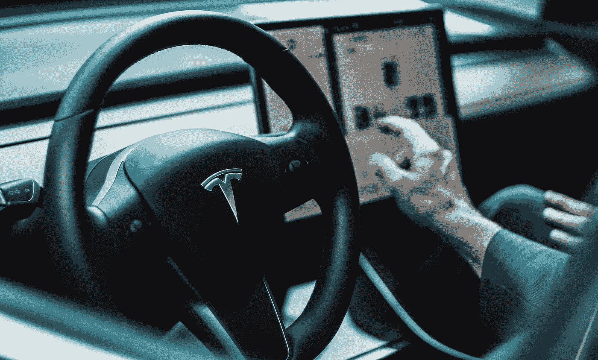
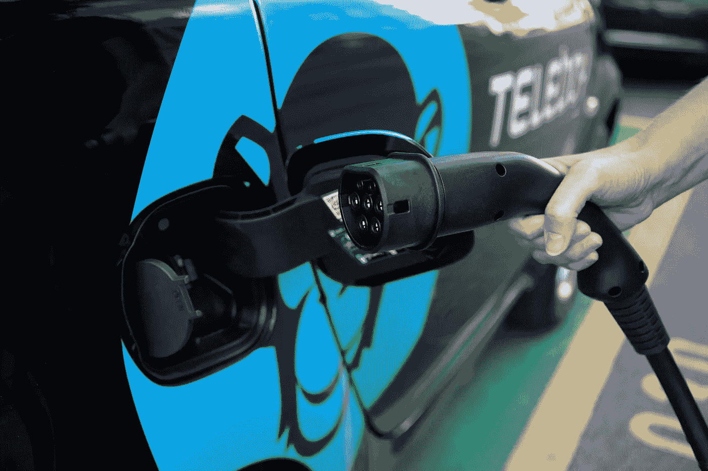
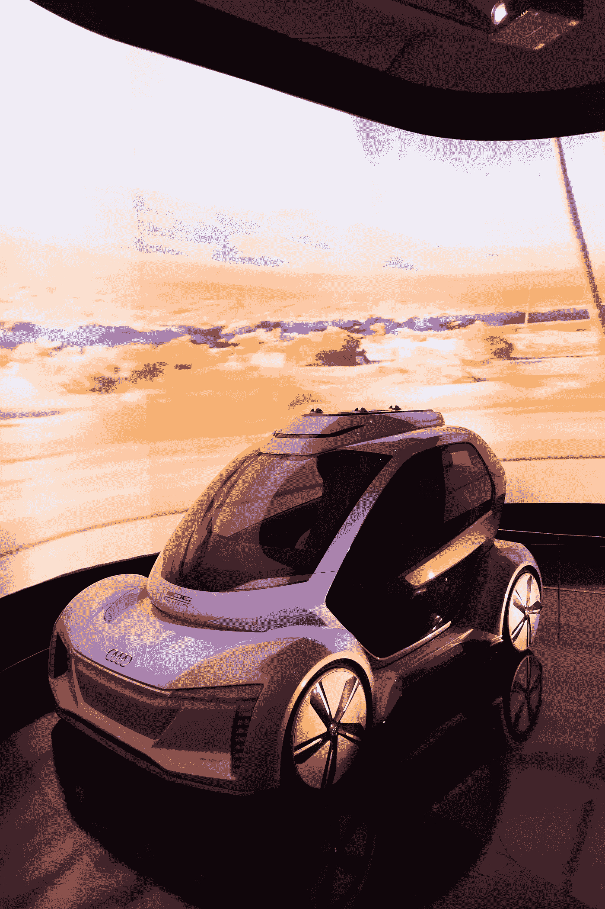
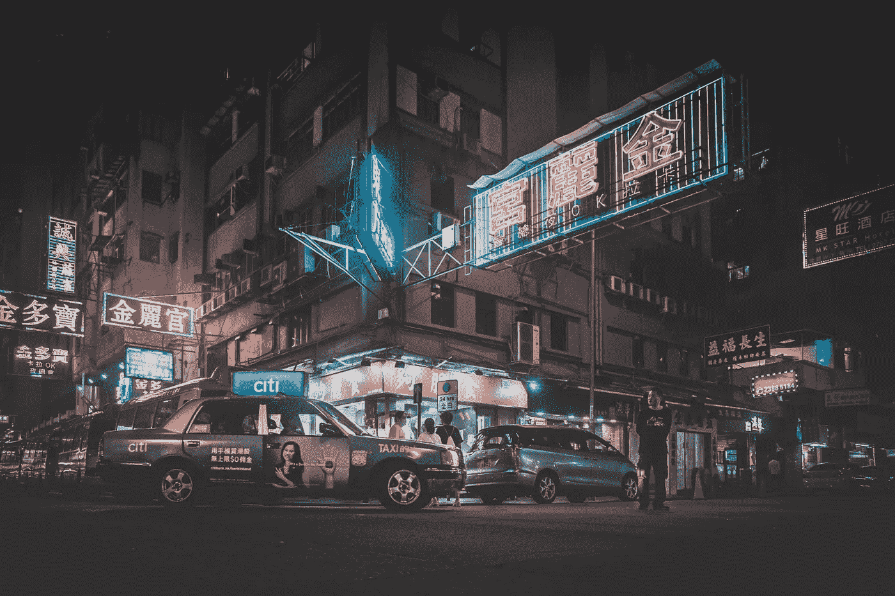
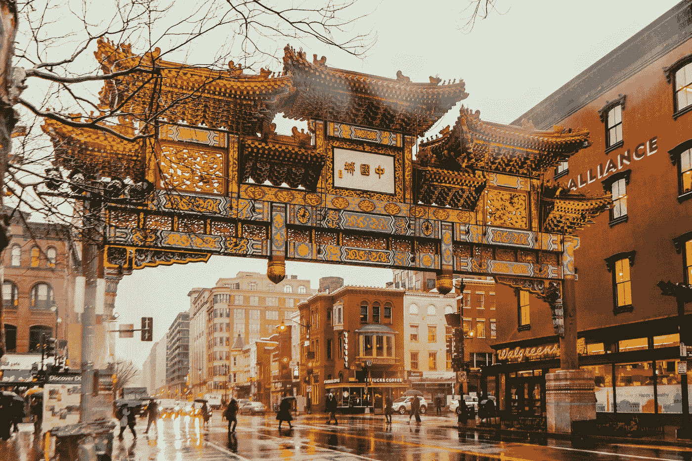
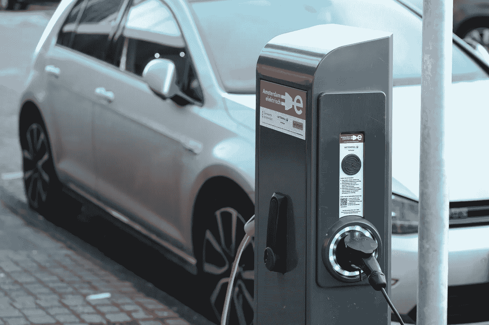
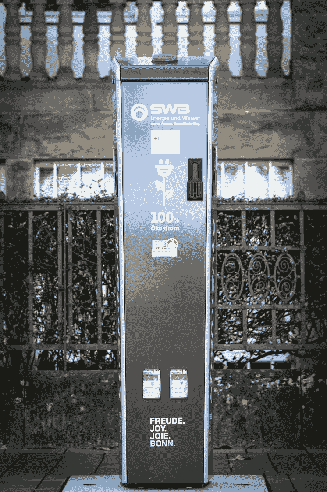
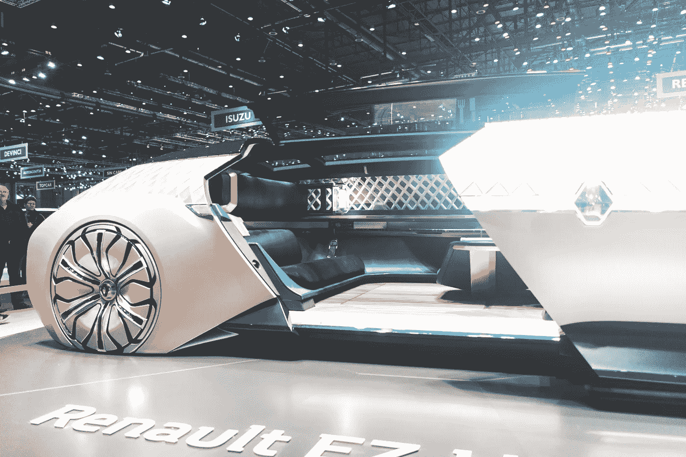

# 2021 年中国汽车工业 10 大预测

> 原文：<https://medium.datadriveninvestor.com/10-predictions-for-the-chinese-automotive-industry-in-2021-61541c5fbae1?source=collection_archive---------1----------------------->

## 从这些预测可以看出，在全球押注新能源技术的背景下，资本与概念技术的化学反应比百年燃油车更尴尬

Image by [Javier Rodriguez](https://pixabay.com/users/javier-rodriguez-15911/?utm_source=link-attribution&utm_medium=referral&utm_campaign=image&utm_content=2133976) from [Pixabay](https://pixabay.com/?utm_source=link-attribution&utm_medium=referral&utm_campaign=image&utm_content=2133976)

2020 年终于过去了。2020 年，汽车行业遭遇了新疫情的黑天鹅。汽车公司在深度时刻减薪、裁员、停产。他们转行做防疫车和口罩，造健康车，卖活车。汽车公司试图自救。跌出一个“深 V”后，中国车市触底反弹。

在中国的新能源汽车市场，股价像火箭一样持续上涨，新车纷至沓来。理想带着[肖鹏](https://en.xiaopeng.com/)横扫 2019 的阴霾，股价飙升，轰轰烈烈的“新能源汽车下乡”将五菱洪光 MINI EV 带上神坛。

今年，大众和丰田在纯电动汽车市场投入巨资的同时，忍受着碳排放法规带来的强烈不适。

中国传统车企再次举起冲击高端品牌的大旗，在新能源汽车领域展开攻势。

> 成败还不得而知

**冰与火的背后，往往有生命力**

中汽协预测，2021 年汽车总销量将同比增长 4%至 2630 万辆，新能源汽车增速有望达到 40%，总销量将攀升至 180 万辆。

在汽车市场动能转换、急需变革的关键时刻，智能电动化浪潮继续与汽车行业融合，吸引了华为和苹果。BBA 等科技巨头也加入了这场战斗。

**新年伊始**《未来汽车日报》为 2021 年汽车行业提供十大预测。从这些“预言”中可以看出，在全球押注新能源技术的背景下，资本与概念技术之间的化学反应比百年燃油车还要尴尬。

Photo by [David von Diemar](https://unsplash.com/@davidvondiemar?utm_source=unsplash&utm_medium=referral&utm_content=creditCopyText) on [Unsplash](https://unsplash.com/s/photos/tesla?utm_source=unsplash&utm_medium=referral&utm_content=creditCopyText)

# **1。特斯拉年销量可能突破 80 万辆**

2020 年，特斯拉股价飙升 6 倍多，如今市值已超过 6000 亿美元，成为全球最有价值的汽车公司。特斯拉顺势而为，通过 3 次增发募集资金，共募集 123 亿美元。

美国投资银行摩根斯坦利。根据声明，特斯拉已经有了 2021 年的“战争基金”。新的一年，特斯拉将会火力全开。

多数分析师认为，到 2021 年，无论是基本面还是产品布局，特斯拉都会在今年的基础上更进一步。2021 年销量超过 80 万辆似乎是“最低门槛”

在 2020 年第三季度的一次电话会议上，一位分析师预测特斯拉 2021 年的销量将达到 84 万至 100 万辆。特斯拉首席执行官埃隆·马斯克(Elon Musk)表示，销量“很有可能。会在这个区间附近”。

CICC 发布报告称，特斯拉 2021 年的全球销量预计将达到约 110 万辆，预计 2022 年将达到 150 万辆。Troy Teslike 在推特上预测，2021 年特斯拉将售出 86.7 万辆汽车，在中国的销量将达到 35.5 万辆。该网友曾预测，在过去的四个季度中，特斯拉的销量超过了 90%。

中国市场将继续成为特斯拉销量增长的主力。自特斯拉国产以来，Model 3 销量逐渐攀升，11 月份达到 21，604 辆，创下中国单月销量新纪录。2021 年 Model Y 投产时，特斯拉的销量可能会再次上升。

**2021 年**，特斯拉给自己定了很多“小目标”。马斯克表示，特斯拉将于 2021 年进入印度市场。下半年，特斯拉将推出 Model S 格子三电机高性能版。

新车将配备新结构电池组，包括新的 4680 型号锂电池。与此同时，特斯拉的柏林工厂将量产 Model Y，德克萨斯州的一座新超级工厂也将迎来投产。

 [## 为什么埃隆·马斯克要搬到德克萨斯？

### 马斯克正式告别加州，宣布他的新家在德克萨斯州

medium.com](https://medium.com/datadriveninvestor/why-elon-musk-is-moving-to-texas-112c74fe18b1) 

可以预见的是，在产能的快速扩张下，2021 年特斯拉的市场份额将进一步扩大。

Photo by [Toby Yang](https://unsplash.com/@tobyyang?utm_source=unsplash&utm_medium=referral&utm_content=creditCopyText) on [Unsplash](https://unsplash.com/s/photos/china?utm_source=unsplash&utm_medium=referral&utm_content=creditCopyText)

# **2。资本市场对新车公司的热情可能会逐渐降温**

在中国，2020 年的新车顶级梯队，蔚来、理想、肖鹏将成功登陆美股，并和特斯拉一样，迎来一轮又一轮的股价暴涨，毛利率集体转正。

已初步站稳脚跟的前三家新造汽车展开了“技术”竞赛，将在资本市场押注自动驾驶、电池等电动汽车核心技术。

在即将到来的 NIO 日，NIO 将发布 NT 2.0 下一代自动驾驶平台、150 千瓦时电池组、激光雷达产品；肖鹏将于 2021 年在量产车型上搭载激光雷达，进一步突破自动驾驶技术；理想情况下，它计划在 2021 年上半年将自动驾驶团队的规模扩大两倍。

**2021 年**，新车厂商需要加速丰富产品阵容。目前新势力的综合实力还不够强，基于现有平台开发车型的能力有限。

在传统车企密集投放新能源产品的时候，新车势力可能会出现“新车荒”现象。毕竟像特斯拉这么强大，成立至今也只推出了 5 款产品(好看+Roadster)。

**为腰新建汽车公司**

继续融资，寻求上市仍是重中之重，最好能搭上 2021 年的上市班车。届时，一批产品能力弱、融资能力不足的新车企将被挤出；路透社、JD.com 和网易计划第二次赴港上市。

> 与此同时，新车股价泡沫可能会破灭

新车制造商的高市值主要是由于投资者对电动汽车未来发展潜力的乐观预期。

**为新车公司**

即尚未能实现盈利和自制血液，市值已被大幅夸大。汽车制造需要规模效应。蔚来、理想、肖鹏目前的月销量都不到 1.5 万辆，甚至还不到大多数传统车企单一车型的月销量。

随着 2021 年一、二季度财报的公布，资本市场对新车公司的热情可能会逐渐降温，回归理性。

Photo by [Tommy Krombacher](https://unsplash.com/@ftm3000?utm_source=unsplash&utm_medium=referral&utm_content=creditCopyText) on [Unsplash](https://unsplash.com/s/photos/electric-car?utm_source=unsplash&utm_medium=referral&utm_content=creditCopyText)

# **3。合资车企强势分享纯电动汽车市场**

毫无疑问，纯电动汽车已经成为不可逆转的发展趋势。2020 年，特斯拉的销量和股价都在稳步上升，足以证明这一领域的发展潜力。

似乎受到了特斯拉的启发。经过长时间的观望，积累已久的合资品牌开始大举进攻新能源汽车市场。

其中大众的步伐比较快。它基于创新的模块化电力驱动(MEB)平台推出了首款纯电动 SUV 车型 ID.4。这款车依然采用两车策略。

> **在中国，目前的 ID.4 系列已被一汽-大众的佛山工厂和 SAIC-大众的安亭工厂投入生产。**

两家工厂的总产能可能达到 60 万辆，高于特斯拉上海工厂的产能。

日产的纯电动 SUV Ariya 将于 2021 年在中国市场正式上市。该车型将在武汉新工厂投产。

福特为全球市场推出了首款纯电动车型野马 Mach-E。长安福特目前正在推进国产计划，预计 2021 年上市。

现代品牌 IONIQ 5 也将于 2021 年正式亮相。该车型基于现代 E-GMP 纯电动平台打造。

相比自主品牌和特斯拉等新能源车企，合资品牌最大的优势在于车辆的质量、品牌、技术积累。

 [## 数据是新的石油

### 数据就像信息时代的石油，拥有大量数据的公司成为世界上最大的…

medium.com](https://medium.com/datadriveninvestor/data-is-the-new-oil-8baf652b9811) 

合资汽车公司放弃了备受批评的“油改电”理念，转而专注于纯电动平台。可见合资车企正在全力以赴。

**目前的纯电动汽车市场**呈现两极分化的特点。10 万元及以下区间被五菱洪光 MINI EV、欧拉豪茂等小型电动车牢牢把握。蔚来和理想主力车型价格都在 30 万元以上。

在 20-30 万元的价格区间，是合资品牌的传统优势。未来也可能是合资车企发展电动车的主要区间。

以两极分化为特征。10 万元及以下区间被五菱洪光 MINI EV、欧拉豪茂等小型电动车牢牢把握。

蔚来和理想主力车型价格都在 30 万元以上。在 20-30 万元的价格区间，是合资品牌的传统优势。

> 未来也可能是合资车企发展电动车的主要区间

凭借庞大的用户群和成本优势，2021 年，随着大众和日产纯电动车型的上市，合资品牌将对中国新能源汽车市场产生强大冲击。

Photo by [Theodor Vasile](https://unsplash.com/@theodorrr?utm_source=unsplash&utm_medium=referral&utm_content=creditCopyText) on [Unsplash](https://unsplash.com/s/photos/electric-car?utm_source=unsplash&utm_medium=referral&utm_content=creditCopyText)

# **4。自主高端纯电动品牌可能很难有大的突破**

合资品牌来了，很多自主车企也开始用电动车来补强自己的高端品牌。

【2020 年 7 月，中国公司东风汽车正式发布全新高端电动汽车品牌蓝兔。首款车型蓝兔自由侠定位为中大型智能电动 SUV，将于 2021 年第三季度交付。

**11 月**，长安汽车董事长朱华荣透露，长安将与华为、CATL 合作，打造高端智能汽车品牌。一个月后，长城汽车自主高端智能电动车品牌“SL 项目组”也浮出水面。

BAIC 被认为是这股“高等”力量的先锋。其首款高端品牌 ARCFOX αT 已于 2020 年 10 月正式上市。然而 ARCFOX αT 上市后的销售表现却不尽如人意。

> 旅行服务联合会的数据显示，2020 年 10 月 ARCFOX αT 终端销量为 336 台，11 月仅为 94 台

中国品牌向上突破，在燃油车领域有所尝试。奇瑞曾经布局观致，吉利转战 Lynk & Co，长城汽车全力打造 WEY 品牌。但从销量和平均售价来看，没有一个品牌能算成功。

**在燃油汽车领域**

合资企业领先国内企业近半个世纪，几乎已经失去了追赶的意义。此时，智能电动汽车领域提供了一条全新的赛道，但“弯道超车”并不容易。

**2021 年**，对于脱胎于传统车企的“新势力品牌”来说，将是交付和接受市场的关键一年。中国过去是特斯拉一马当先，然后蔚来、理想等新的车企越来越强大。

合资品牌已经开始布局纯电动车型。中国品牌要用纯电动汽车向高端突破，将面临巨大压力。

Photo by [SHUJA OFFICIAL](https://unsplash.com/@shujaofficial?utm_source=unsplash&utm_medium=referral&utm_content=creditCopyText) on [Unsplash](https://unsplash.com/s/photos/chinese-car?utm_source=unsplash&utm_medium=referral&utm_content=creditCopyText)

# **5。小型电动车可能还有一年的红利期**

自主品牌新一轮“射高”不易，但一批小型电动车成功突围。

推出时，5 个月销量就超过了特斯拉 Model 3。在中国，五菱洪光 MINI EV 已经成为 2020 年电动汽车赛道上的一匹黑马。来自《小型纯电动乘用车出行大数据白皮书(2020)》的数据显示，以月均销量计算，五菱洪光 MINI EV 以 43%的市场份额位居电动汽车市场份额第一。

【2020 年 11 月，五菱洪光 MINI EV 月销量(3.6 万辆)超过特斯拉 Model 3 1 万辆。五菱洪光 MINI EV 明显高于低速电动车的产品力和安全性，攻占了 2-3 万价位段的“老年代步车”市场。

**这款小型电动车**主要在三四五六线城市下沉市场销售。根据上汽通用五菱以往爆款产品的市场表现来看，宝骏 730 等“神车”的火爆一般会持续一年半左右。

预计五菱洪光 MINI 电动车将保持一年左右的高速增长。CICC 认为，2021 年，五菱洪光 MINI 电动汽车的增量约为 15 万辆。

但是，与低线城市相比，一线和二线城市是汽车消费的领头羊。随着电动车产品的成熟，就像小型燃油车一样，小型电动车在未来仍有被边缘化的可能。

Photo by [Richard Tao](https://unsplash.com/@richardtao28?utm_source=unsplash&utm_medium=referral&utm_content=creditCopyText) on [Unsplash](https://unsplash.com/s/photos/chinese-car?utm_source=unsplash&utm_medium=referral&utm_content=creditCopyText)

# **6。固态电池研发加速**

电动汽车激战正酣，动力电池行业也进入了新一轮的技术变革周期。

**2020 年**，比亚迪将推出刀片电池，特斯拉将发布“infinite ear”电池，LG 化学计划在 2021 年第二季度量产超高镍 NCMA 电池，CATL 和志基汽车正在开发“掺硅锂电池”技术，续航约 1000km 的强大电池将在 5 年左右推出。

在技术发生颠覆性变革之际，在动力电池市场已经使用了 10 年的传统液态锂电池，由于安全性和高能量密度难以平衡，以及易燃性等问题，正处于岌岌可危的境地。

**相比较而言**，高安全性、高能量密度、封装简化的固态电池可能成为下一代锂电池技术的方向。业内预测，当固态电池迎来大规模加载的时候，就是燃油车真正退出历史舞台的时候。

> 彭博·BNEF 估计，当固态电池开始大规模生产时，其制造成本将是目前锂离子电池的 40%左右(137 美元/千瓦时)

目前，丰田汽车固态电池的安装已经按计划完成。搭载固态电池的新车预计将于 2025 年量产，其电池能量密度可达锂电池的两倍以上。

不仅是丰田，大众、戴姆勒、福特、宝马、LG 化学、CATL、三星、松下、郭萱高科和许多其他公司也在开发固态电池。

*业界预计固态电池将在 2024–2025 年左右迎来量产。*

Photo by [Ernest Ojeh](https://unsplash.com/@namzo?utm_source=unsplash&utm_medium=referral&utm_content=creditCopyText) on [Unsplash](https://unsplash.com/s/photos/electric-car?utm_source=unsplash&utm_medium=referral&utm_content=creditCopyText)

# **7。传统车企试水混合直营模式**

2020 年 12 月底，终于落地线上线下相结合的“新零售”方式的 which 奥迪，再一次将传统汽车经销模式的变革推到了风口浪尖。新零售已经被特斯拉证明可行。

作为全球首家采用直销模式的汽车制造商，特斯拉已经连续五个季度实现净利润为正。

**在这个**的背后，中国经销商也面临着转型的阵痛，转型迫在眉睫。中国汽车流通协会数据显示，2020 年，中国汽车经销商库存预警指数已连续 12 个月位于 50%的下降线以上，最高达到 81.2%；2020 年上半年。

汽车行业整体新车毛利率骤然下降-3.5%，1019 家 4S 店陆续退网，近 3 万家经销商中只有 21.5%实现销售增长，盈利的经销商不到 30%。

特斯拉发起的汽车分销模式的变革，已经得到了蔚来、肖鹏等新势力，以及大众、通用等传统车企的认可。

**通用的别克电动车**开始了直销模式；大众集团也宣布 ID。系列电动车将更侧重于在线销售——用户直接在网上下单，经销商负责提供销售咨询试驾、交易、车辆移交等工作。

> 与传统车企的多层分销模式不同，特斯拉的直销模式效仿了苹果

车企自建展厅和体验店，采取“线上销售+线下展示+后续服务”的方式。

直销模式可以给车企带来更多直接的客户数据，降低营销成本；统一产品价格，方便车企统一管理市场和品牌，通过数据积累 D2C 能力，衍生出汽车销售、优化库存管理之外的多元化服务。

然而，这种改变并不容易。实行直营或混合直营模式，势必与现有经销商和主机厂的利益发生冲突；直营店的建设和运营成本高也是一个不小的压力。

对于主机厂来说，2021 年可能是设计新品牌(尤其是电动车品牌)渠道模式和构建混合直销渠道网络的初级阶段。

Photo by [Jonathan Kemper](https://unsplash.com/@jupp?utm_source=unsplash&utm_medium=referral&utm_content=creditCopyText) on [Unsplash](https://unsplash.com/s/photos/electric-car?utm_source=unsplash&utm_medium=referral&utm_content=creditCopyText)

# 8.芯片短缺可能会持续一年

“芯”危机席卷了大部分汽车行业，大众集团率先承认存在芯片供应削减。

供应削减主要是由于两大一级供应商-大陆集团和博世生产的 ESP(电子稳定程序系统)和 ECO(智能发动机控制系统)中的 ECU 模块短缺。

旅行联合会秘书长崔东树认为，核心不足要到 2021 年一、二季度才会缓解；而彻底淘汰要到 2021 年第四季度。

> 芯片是汽车实现自动驾驶、动力和传动以及车载娱乐等功能的最关键部件

**目前**，全球汽车级芯片主要厂商(恩智浦、英飞凌、瑞萨电子、意法半导体等。)都是外资公司。中国汽车级芯片基本依赖进口，年进口额 2313 亿美元。

在汽车芯片行业，中国普遍落后于先进国家 10 年以上。中国自主芯片集中在较低端的分立器件和无线电、导航芯片，缺乏高性能、高可靠性的汽车芯片。

业内许多公司已经意识到芯片技术的现状是“卡脖子”星光半导体、比亚迪、CRRC 时代等公司也在多年前开始研发自己的汽车级 IGBT。NIO 在 2020 年推出了自动驾驶计算芯片。

但是，芯片是一个比整车更需要规模的行业，芯片行业并不是弯道超车。

在芯片研发、生产、需求、原材料的产业链中，每个环节都需要深入布局。目前，中国 IGBT 最重要的技术瓶颈是可靠性和充电稳定性。突破技术瓶颈，发展芯片产业，需要长期投入。

*不可能立竿见影，也不急于求成。*

Photo by [Joshua Sortino](https://unsplash.com/@sortino?utm_source=unsplash&utm_medium=referral&utm_content=creditCopyText) on [Unsplash](https://unsplash.com/s/photos/tech-giants?utm_source=unsplash&utm_medium=referral&utm_content=creditCopyText)

# **9。科技巨头加入游戏加速智能应用的实施**

其实“缺芯”也反映了百年汽车产业和 ICT 产业一样，正在迎来新时代的变革。

人工智能、自动驾驶、5G 和车联网等技术正在给汽车行业带来颠覆性的变化。智能汽车的软件订阅方式也已经过了早期的用户教育和市场培育阶段。

车云研究院 2020 年 3 月发布的调查数据显示，84%的消费者愿意为汽车数字增值服务每年额外支付 500–3000 元。这样的变化吸引了 BAT(百度、阿里与腾讯)、华为、苹果等科技巨头来造车。

> **正如乔布斯所说，“真正认真对待软件的人，应该自己做硬件。”新一代苹果掌门人库克接力了这个“造车”游戏**

**在未来几年**，苹果将发布首款采用独特“单电池”设计的苹果汽车。据台湾《经济日报》报道，位于苹果汽车产业链上游的何达、Bizlink-KY、和勤等主要零部件厂商，目前订单已经全部售罄。

 [## 苹果 iCar:规格和传言

### 路透社爆料称，苹果正在推进自动驾驶技术，计划在 2024 年生产一款乘用车…

medium.com](https://medium.com/datadriveninvestor/apple-icar-specs-and-rumors-299a41cfdedb) 

拥有巨额资金的科技巨头进入汽车行业，给老牌汽车公司带来了前所未有的挑战。特斯拉 CEO 埃隆·马斯克(Elon Musk)四年前就断言:“特斯拉最大的竞争对手不是谷歌，而是苹果。

摩根士丹利分析师还预测，苹果进入自动驾驶电动汽车领域可能会创造一个“新的特斯拉熊市”。

在中国科技巨头的狩猎场，无论是曾经的互联网巨头巴斯(百度、阿里、腾讯、华为)，还是正在崛起的新秀 BMD(字节跳动、美团、滴滴)，都已经挤进了智能汽车的竞赛中。

其中，凭借其在通信和车-机系统方面的显著优势，华为加快了在智能汽车市场的渗透。其与长安、宁德时代共同打造的全新高端电动车品牌，在业内备受期待。

**汽车公司在软件研发领域处于劣势**需要科技公司的支持；主营业务增长遭遇天花板的科技巨头，迫切需要从智能汽车赛道开辟更大的利润空间。

2021 年，随着科技巨头苹果的进入以及跨界玩家与车企合作的深化，智能汽车的应用级产品将会显著丰富，新能源汽车产业链的相关标准也将更加完备。

Photo by [Marvin Meyer](https://unsplash.com/@marvelous?utm_source=unsplash&utm_medium=referral&utm_content=creditCopyText) on [Unsplash](https://unsplash.com/s/photos/future-car?utm_source=unsplash&utm_medium=referral&utm_content=creditCopyText)

# **10。L3 自动驾驶车型可能迎来集中量产**

自动驾驶是智能汽车赛道中最重要的一个分支，被科技巨头所看重。这个行业将在 2020 年迎来诸多突破，商业化将逐步落地。

虽然烧钱大战还在继续，但自动驾驶作为出行领域最具科技含量的业务，新的故事才刚刚开始。

**前瞻产业研究院**预计，到 2021 年，全球无人驾驶汽车市场规模可能达到 70.3 亿美元，到 2035 年，全球无人驾驶汽车销量有望达到 2100 万辆。

对于中国来说，2021 年将是自动驾驶汽车发展的关键一年。1 月 1 日起，《汽车驾驶自动化分类》将正式实施，中国将正式拥有自己的自动驾驶汽车分类标准。

根据《汽车驾驶自动化分类》，3 级自动驾驶也被称为条件自动驾驶。在此标准下，动态驾驶任务接管用户可以适当地执行动态驾驶任务接管。这也符合现阶段大部分车企能够达到的标准。

> 可以预见的是，2021 年，L3 自动驾驶车型可能会量产

一些汽车公司也将推出具有完全自动驾驶功能的车型。

【2020 年 10 月，特斯拉向小部分车主推出了全自动驾驶(FSD)功能的测试版。按照计划，将在 2021 年大范围推广，并支持订阅服务。

**2021 年**，会有一批全自动驾驶产品。宝马旗舰全自动无人驾驶车型 iNEXT 将迎来上路。福特将开始生产具有自动驾驶功能的全自动无人驾驶汽车。

另一方面，自动驾驶巨头扎堆的 RoboTaxi(自动驾驶出租车)已经完成了商业化的初步探索。

但自动驾驶是一项颠覆性的创新技术，配套的法律法规尚不完备。在此之前，还需要时间来普及。

【2020 年 12 月初，AutoX 正式公布了中国首批全无人驾驶、无遥控器的 RoboTaxi 车队。官方称之为“中国第一批能够完全满足安全要求，能够进行自动驾驶车队大规模无人化部署的硬件和无人驾驶系统。”

但这一说法并未得到深圳交管局的认可。深圳交管局表示，该市目前不允许任何无人驾驶出租车在测试区开展试运营，也没有批准任何完全无人驾驶车辆上路行驶。

无人驾驶技术日新月异，但其实施与法律和配套设施建设密切相关。

*2021 年，两个发展的矛盾可能会更加突出。*

**访问专家视图—** [**订阅 DDI 英特尔**](https://datadriveninvestor.com/ddi-intel)