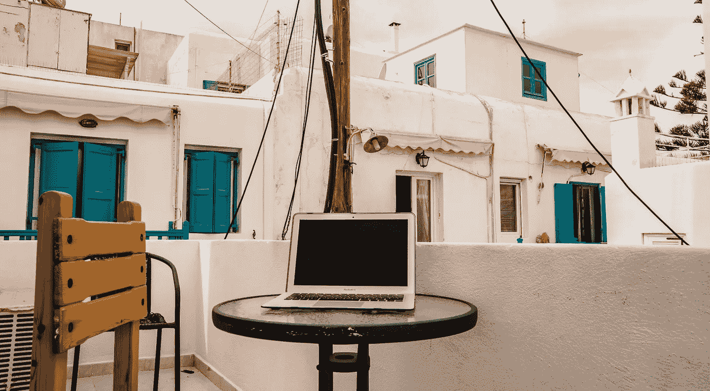

# 作为一名成功的数字流浪者，你需要具备的 10 个品质

> 原文：<https://medium.datadriveninvestor.com/10-qualities-you-need-to-succeed-as-a-digital-nomad-c98c54637546?source=collection_archive---------2----------------------->

## 如何成为一名全职旅行者

Picture by Jack Krier / [**Unsplash**](https://unsplash.com/photos/GnvKaaSO4Dg)

在过去的十年中，数字游牧从一个小众运动发展成为一种成熟的替代生活方式。

从周游世界的企业家到远程员工和寻求冒险的内容创作者，越来越多的人作为全职旅行者建立成功的职业生涯。

诱惑力是显而易见的。

地理套利保证了更高的生活水平。不断扩大的在线市场提供了无限的机会。数字游牧生活方式也打消了许多千禧一代对冒险的渴望。

一切都很好，但那些数字游牧者是谁？哪种类型的人能成为成功的远程工作者？

# **成功数字流浪者的 10 个决定性特征**

在路上工作了几年后，我决定列出成功的数字游牧者的 10 个决定性特征。

路径各不相同，每个游牧民族都有不同的优先事项，但这些是最常见的品质。

# **1。灵活性**

当谈到作为一个数字游牧者成功所需要的品质时，*灵活性*无疑是最重要的品质之一。

在这种情况下，灵活性包含生活的三个主要方面。

首先，你需要在工作中保持灵活性。

无论你是为一家公司远程工作，管理一家初创公司，还是创作内容，全职旅行都会给你的工作增加一层新的灵活性。

在旅途中会简化和复杂化你的工作模式。

一方面，你会从看到新奇的地方和自由选择你的[游牧基地](https://medium.com/datadriveninvestor/how-to-choose-your-nomad-base-as-a-remote-worker-efb619aec37b)中获得动力。

另一方面，经常出差和适应新环境的需要比办公室工作需要更多的时间、精力和灵活性。

其次，你的人际关系需要灵活。

作为一个全职的星球漫游者，交朋友并不容易，但如果人们有相同的波长是可行的。

约会也是一样。不要犯和一个生活方式完全不同的人约会的错误。

不平衡的关系——一方过着游牧生活，渴望冒险，而另一方想要稳定、安全的办公环境——很少会成功。

最后，成功的数字游牧者有灵活的日常安排。如果你想全职旅行，你不能指望在世界各地都有同样的早餐、闲聊和英语水平。

如果你喜欢旅行，但想在家坚持你喜欢的日常生活，坚持几个保证你工作效率的核心习惯。

例如，无论我在世界的哪个角落，我都会用米饭和蔬菜做鸡肉，因为我知道这种食物对我的身体健康至关重要。

我也在早上散步，晚上看书。这些习惯在世界上任何地方都有效，并且在任何环境下都能提高我的工作效率。

# **2。信心**

如果你想成为一名成功的远程工作者，你需要自信。

即使现在这种生活方式更加固定，许多人仍然认为它是一种边缘运动。简而言之，大多数社会不知道你到底在做什么。

这就是为什么你不能指望社会的认可或社会的确认。你需要对自己的能力、项目和人生选择有信心。

你的家人可能会支持你，你的朋友可能会对你的职业道路感兴趣，许多人会在网上分享他们的赞赏，但所有这些永远不会取代你作为一名远程工作者取得成功所需的精神动力。

# **3。激情**

沿着这些路线，信心和激情是齐头并进的。

激情是数字游牧者成功的先决条件。因为你设定了非传统的优先事项，设计了你喜欢的生活方式，你需要带着激情和毅力朝着你的目标努力。

远程工作比舒适的隔间工作风险更大。因此，只有真正的激情才能抵消旅途中工作带来的精神不确定性。

大多数远程工作者喜欢旅行，但也对他们的专业活动充满热情。

问问你自己:如果你不喜欢在普通的办公室环境中工作，你会有多喜欢在咖啡店、机场或共同工作的地方工作？

远程工作需要扎实的职业道德。这些职业道德通常是对你的工作充满热情的结果。

# **4。对冒险和新奇的渴望**

很少有数字游牧民是电视迷。

如果你想知道这种生活方式是否适合你，问问自己你有多重视冒险和刺激。

离开企业界后，我一直面临这种困境。

比起豪华车、闪亮的名片和香槟酒会，我更喜欢冒险和刺激吗？

在欣赏了巴塔哥尼亚令人敬畏的 Cerro Chaltén 之后，我有了答案。我知道这是我想要的生活，我意识到我需要让它实现。

漫游这个星球，寻找迷人的故事、鼓舞人心的地方和有趣的文化交流成了我的首要任务，我会相应地设计我的生活方式。

然而，许多人都在纠结优先顺序。

他们在 Instagram 上看到一个高度美化的远程工作幻想，并感到被触发。

问题在于，许多有抱负的游牧民并不熟悉全职旅游的日常事务。

你准备好过极简主义的生活方式了吗？你一个人感觉舒服吗？你愿意在陌生的城市里导航，用外语交流，心血来潮适应新的文化吗？

当衡量你对冒险的品味时，这些是你应该问自己的问题。

当然，当谈到游牧生活方式时，有不同程度的冒险，但对大多数人来说，这不会是邻近城市的咖啡。

Cerro Chaltén in Argentina by Bruno De Regge / [**Unsplash**](https://unsplash.com/photos/1AQltGe-iuo)

# **5。学科**

如果让我说出一个成功的数字游牧者的压倒一切的特征，那就是*纪律*。

如果你想在环游世界的同时在网上谋生，纪律是最基本的要求。

纪律也是大多数潜在的远程工作者失败的地方。他们想象自己在 Tulum 的沙滩上和 mezcal 一起工作，没有任何压力。

无论你是在管理一家企业，创造内容，还是为雇主工作，你都必须投入时间和精力。

远程工作并不意味着减少工作，而是意味着在不同的环境中工作。

因此，如果你在传统的办公室里没有纪律，你的麻烦会在旅途中成倍增加。

在这种情况下，在家工作是一个试水的好方法。

如果你在家训练有素、尽职尽责、富有成效，你就有能力成为一名成功的全职旅行者。

环境不同，奋斗却相似。

要想在任何地方工作，你需要一个自律的心态和一个可靠的工作心态。你的家可能是开始建立这种心态的理想场所。

# **6。思想开放并愿意学习**

如果你渴望一次数字游牧冒险，很可能你不会去下一个城镇。

你会想到遥远的土地、异国情调的食物和古怪的文化规范。

这就是文化适应性发挥作用的地方。大多数成功的远程工作者都有这一特点，大多数人都有强烈的愿望让自己沉浸在外国文化中。

成功的游牧生活方式和文化适应性密不可分，原因很简单。

你旅行的时间越长，你就越渴望与你所去的国家建立更深的联系。

如果去东南亚背包旅行两个月，没有当地熟人也能过得去。即使作为一个数字流浪者，你也可以在清迈找到你的泡泡，并“忽略”当地文化。

然而，在旅行和工作多年后，你可能会厌倦与同路人的无用联系。

你冒险的灵魂想要更多，外国文化变得越来越耐人寻味。

那时，成功的游牧者将适应、学习新的语言，并与来自不同背景的人建立改变生活的联系。

# **7。对非传统生活选择的渴望**

数字游牧是一种非传统的生活方式，是勇气、胆识和风险承受能力的体现。

具有这些品质的人通常具有适合成为远程工作者的性格。

如果你还不具备那些素质，也没必要绝望。随着时间的推移，许多人变得更加勇敢，并学会了如何计算风险。

然而，要知道获得这些品质需要时间、努力和毅力。

就非传统的生活选择而言，数字游牧是一大进步。

如果你以前从未做过非正统的决定，那么全职旅行可能是一步之遥。

有些人在跳进结了霜的湖里之前需要提高他们的游泳技术。

如果你不确定自己是否有足够的勇气和决心来成功地做一名远程工作者，那么在全力以赴之前，先尝试一次小的努力。

去一个熟悉的地方旅行一个月，在那里远程工作。在卖掉你所有的东西，成为一个成熟的流浪者之前，从一个简单的远程工作经历开始。

# **8。节俭和财务远见**

作为一个成功的数字流浪者，你需要的大部分品质都是精神上的，但是预算和财务预见也是拼图中必不可少的部分。

尤其是作为一个周游世界的企业家，你需要掌握自己的财务，在某些时期过得节俭。

取决于你来自哪里，旅行可能比呆在你的家乡便宜。

我自己就是这种情况。我在旅行上花的钱比在国内少，因为我的国家消费很高。

然而，在成为数字流浪者之前，我计算过我每个月需要挣多少钱。数字在变化，但我的预算策略没有变化。

我知道我能在消费品、住房和旅行费用上花多少钱。之后我每个月也尽量储蓄投资。

如果我的生意遇到困难，节俭就会成为常态。这也意味着我的旅行费用会下降。

总而言之，你总是需要计算你的“生活方式预算”如果你的收入在某个月末不够用，你需要改变你的消费习惯。

作为一个数字流浪者，这可能会带来挑战，因为你已经习惯了某种旅行方式。

毕竟，在舒适的机场度过几个月后，大多数游牧民都不想回到宿舍。

# **9。极简主义**

极简主义是数字游牧的重要组成部分。

因此，大多数成功的远程工作者更看重他们的生活方式而非物质财富。

如果你真的想全职旅行，这是你必须做出的选择之一。

一些游牧民族比其他人携带更多的东西，但总是有限制。要点是确定*你的*要点，去掉其余的。

我现在大约 70%的东西可以装进两个 45 升的袋子里。剩下的 30%是我存放在家乡的感性物品和季节性衣物。我购买耐用、质量好、用途广泛、适合各种用途的物品。

然而，极简主义远远不止于清理。

如果你想成为一名全职旅行者，你需要将你的承诺、财务约束和其他旅行限制最小化。

你需要设计自己的生活方式，让它适合全职环游世界。用极简主义来过滤你的财产，然后[整理你的生活](https://medium.com/live-your-life-on-purpose/6-effective-minimalist-habits-that-changed-my-life-687b950b94e0)。

 [## 如何极简旅行

### 我的极简旅行 10 原则

medium.com](https://medium.com/@jackkrier/how-to-travel-minimalist-d84a2bd669f1) 

# **10。享受自己陪伴的能力**

最后，许多有抱负的游牧者低估了享受孤独的重要性。

无论你做什么类型的远程工作，你都可能独自在屏幕前花费大量时间。

这就是为什么最好的数字游牧民通常喜欢自己的公司，并且不害怕拥有一些私人时间的前景。

你害怕一个人在餐馆吃饭吗？你需要有人一直在你身边吗？你会在咖啡店工作几个小时而不和非员工交谈吗？

不要误会，总有机会认识人，全职旅行可以是孤独的反义词。

然而，你最终会遇到孤独的时刻，你将不得不面对它们。

与其他游牧品质类似，在开始游牧之旅之前，训练你对孤独的反应是获得作为一名全职旅行者成功职业的正确工具的一个好方法。

## [加入我的邮件列表，获得更多关于如何建立理想生活方式的想法](https://minimalistfocus.com/email-list/)。

# 你可能也会喜欢

 [## 成为数字流浪者的好处和坏处

### 当你“梦想成真”时，你会期待什么

medium.com](https://medium.com/datadriveninvestor/the-benefits-and-disadvantages-of-being-a-digital-nomad-9086bdb9c549)