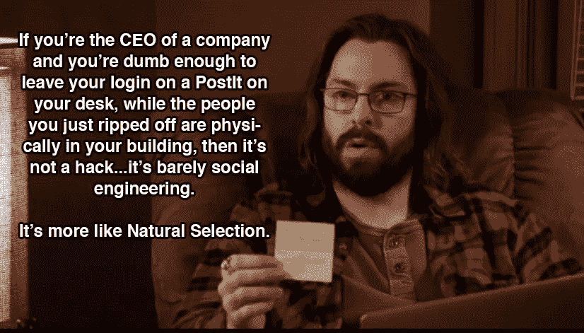
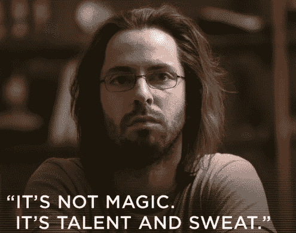
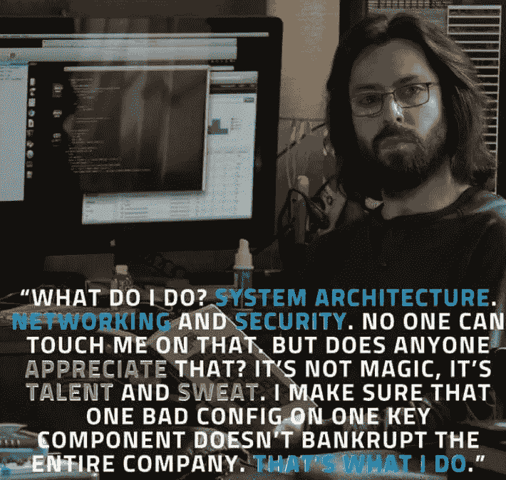
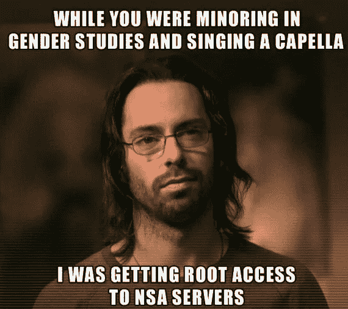
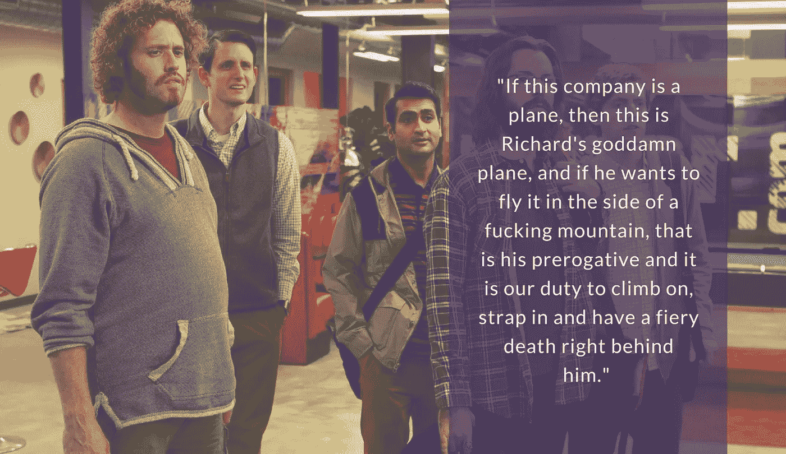
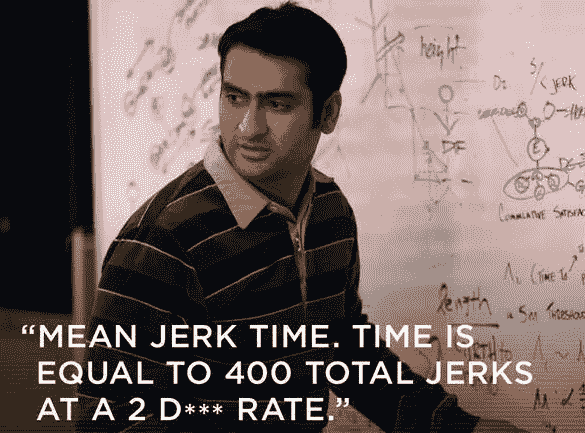
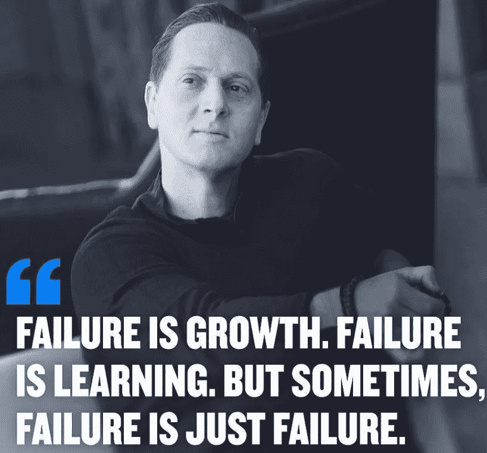

# 10 个“硅谷”的俏皮话/双关语是如此有趣、贴切且与技术世界相关

> 原文：<https://medium.datadriveninvestor.com/10-silicon-valley-liners-puns-that-are-so-funny-apt-relatable-to-the-tech-world-a2ee797f7949?source=collection_archive---------1----------------------->

## 虽然听起来很搞笑…

如果你一直在科技行业工作，没有看过 HBO(第二)最受欢迎的节目《硅谷》,你听起来会像个外星人。

> 确切地说，《硅谷》这部电视剧讲述的是白痴天才、不合群者、反叛者、方孔中的圆钉以及他们在科技行业的生活。

虽然听起来很有趣，但这些套话和双关语与技术世界如此贴切和相关，以至于我想通过这篇文章报道一些最好的，当然是为 ROFL(因为这是我工作繁忙的一周)。

# 其他一些最好的系列—

> [**三十天的机器学习 Ops**](https://medium.com/coders-mojo/day-1-of-30-days-of-machine-learning-ops-7c299e4b09be?sk=4ab48350a5c359fc157109e48b1d738f)
> 
> [**30 天自然语言处理(NLP)系列**](https://medium.com/coders-mojo/quick-recap-30-days-of-natural-language-processing-nlp-with-projects-series-ceb674e3c09b?sk=ca09b27b3d5867f23ab4dc367b6c0c32)
> 
> [**30 天数据工程与项目系列**](https://medium.com/coders-mojo/day-1-of-30-days-of-data-engineering-894822fcb128?sk=76ba558bfe2d9f85cbe741e505295531)
> 
> [**数据科学与机器学习研究(论文)简体**](https://medium.com/coders-mojo/day-1-data-science-and-ml-research-papers-simplified-a68b00a3b1c4?sk=56136229ff738bd734f19d2b6953f78c) ******
> 
> [**60 天数据科学与 ML 系列带项目**](https://medium.com/coders-mojo/day-1-day-60-quick-recap-of-60-days-of-data-science-and-ml-6fc021643d1?sk=4e75e043b7630a9f963562ebac94e129)
> 
> [**100 天:你的数据科学与机器学习学位系列与项目**](https://medium.com/coders-mojo/100-days-your-data-science-and-ml-degree-part-3-c621ecfdf711?sk=1a8c7b0c204d73432d56b7d1a3a26474)
> 
> [**你应该知道的 23 个数据科学技巧**](https://ai.plainenglish.io/23-data-science-techniques-you-should-know-61bc2c9d1b3a?sk=1680c36193eb22198974c9008d62a33c)
> 
> [**技术面试系列—编码问题精选清单**](https://medium.com/coders-mojo/mega-post-tech-interview-the-only-list-of-questions-you-need-to-practice-ee349ea197bb?sk=fac3614684daff4b50a70c0a71e4d528)
> 
> [**完成系统设计与最热门问题系列**](https://medium.com/coders-mojo/system-design-made-easy-quick-recap-of-complete-system-design-34af7e3aedfb?sk=bdd6a19edc1f3ce4a5064923f5b68721)
> 
> [**完成数据可视化及预处理系列与项目**](https://medium.com/coders-mojo/complete-data-preprocessing-and-data-visualization-with-projects-mega-compilation-part-2-41584ef0920e?sk=842390da51689b8d43148c3980570db0)
> 
> [**完整的 Python 系列与项目**](https://medium.com/coders-mojo/complete-python-and-projects-mega-compilation-7ec8f7adfe71?sk=ee0ecf43f23c6dd44dd35d984b3e5df4)
> 
> [**完成高级 Python 系列与项目**](https://medium.com/coders-mojo/complete-advanced-python-with-projects-mega-compilation-part-6-729c1826032b?sk=7faffe20f8039fa57099f7a372b6d665)
> 
> [**Kaggle 最会教你的笔记本**](https://medium.com/coders-mojo/my-list-of-kaggle-best-notebooks-topic-wise-data-science-and-machine-learning-part-2-84772863e9ae?sk=5ed02e419854a6c11add3ddc1e52947f)
> 
> [**Git 完整开发者指南**](/the-complete-developers-guide-to-git-6a23125996e1?sk=e30479bbe713930ea93018e1a46d9185)
> 
> [**打赏 Github Repos**](https://medium.com/coders-mojo/6-exceptional-github-repos-for-all-developers-part-1-21e8fa04e150?sk=9140b249af6fe73d45717185fad48962) **—第一部分**
> 
> [**打赏 Github Repos**](https://medium.com/coders-mojo/6-exceptional-github-repos-for-all-developers-part-2-3eec9a68c31c?sk=8e31d0eb7eb1d2d0bbbcecaa66bd4e7e) **—第二部**
> 
> [**所有数据科学和机器学习资源**](/best-resources-for-data-science-and-machine-learning-full-list-5ceb9a2791bf?sk=cf85b2cef95560c58509877a794577ff)
> 
> [**210 机器学习项目**](/210-machine-learning-projects-with-source-code-that-you-can-build-today-721b035649e0?sk=da5f593572a0261a6314afad99a0356c)

## 科技时事通讯—

> 如果你感兴趣，你可以加入我的时事通讯，通过它我向超过 30，000 名读者发送技术面试技巧，技术，模式，黑客——软件开发，ML，数据科学，创业公司和技术项目。可以订阅 **Tech Brew :**

 [## 点火器

### 数据科学，人工智能，人工智能和更多…点击阅读由 Naina Chaturvedi 撰写的 Ignito，子堆栈出版物。推出 7 个月…

naina0405.substack.com](https://naina0405.substack.com/) 

## Github —

 [## 编码器-world 04-概述

### 此时您不能执行该操作。您已使用另一个标签页或窗口登录。您已在另一个选项卡中注销，或者…

github.com](https://github.com/Coder-World04)  [## 使用 Python、OpenCV 和 NumPy 分析视频

### 通过代码实现…

naina0412.medium.com](https://naina0412.medium.com/analyzing-video-using-python-opencv-and-numpy-5471cab200c4) 

享受热闹的班轮！

# 社会工程还是黑客？

吉尔福伊尔，这个团队中唯一有点逻辑[和一些傲慢]的人

Image credits : Pinterest

 [## 在几秒钟内读取和处理大型数据集—第 1 部分

### 在几秒钟内处理十亿行..

naina0412.medium.com](https://naina0412.medium.com/read-and-process-large-datasets-in-seconds-part-1-1ce12ed95c71) 

# 当贾里德(业务开发人员)以积极的语气引用希特勒的话时。我是说谁有一线希望？

Img credits : Pinterest

 [## Python 中的统计简介—第 1 部分

### 统计很容易…真的吗？

medium.datadriveninvestor.com](/introduction-to-statistics-in-python-part-1-14e69ef05abe) 

# 这正是软件工程的意义所在。项目经理在听吗？

Img Credits : Pinterest

我们队里都有一个人，他基本上就像“一个人的军队”。不是吗？

Image credits : Pinterest

那个在电脑上 24 小时开机的家伙。他吃代码，睡代码和……

Image credits : Pinterest

当贾里德问他(吉尔福伊尔)是做什么的时候？

吉尔福伊尔回答—
“我该怎么办？系统架构。网络和安全。这房子里没人能在那件事上碰我。但是有人欣赏吗？当你忙着辅修性别研究和在莎拉·劳伦斯合唱团唱歌的时候，我正在获得国家安全局服务器的根权限。我差一点就要发动第二次伊朗革命了。我防止跨站点脚本编写，我监控 DDoS 攻击、紧急数据库回滚和错误的事务处理。互联网，听说过吗？一分钟传输半个 Pb 的数据，你知道这是怎么回事吗？如果不能在 12 秒内得到新的史奇雷克斯混音版，每个白痴都会尿裤子。不是魔术，是天赋和汗水。像我这样的人会确保你的包裹被原封不动地送出去。*那我该怎么办？我确保一个关键组件上的一个错误配置不会让整个该死的公司破产。我就是这么做的。……听着，不管我们在这里的结局如何，我只想说，我觉得我应该得到比迪内什更多的股权。”*

# 埃尔利希·巴赫曼的《巴赫曼蒂》

伙计，为了成为下一个史蒂夫·乔布斯，埃尔利希最终变成了肖恩·帕克。他是节目中最有趣的人，他无愧于夏威夷臀部的美誉。

Image credits : Streamio blog

巴克曼先生给房间里最聪明的人做了一个空洞的鼓舞人心的讲话——神童，辍学的主角《花衣魔笛手》的程序员理查德先生。

Image credits : Pinterest

# Dinesh 与 FBI 合谋逮捕她的黑客女友

你可以恨迪内什，但你不能忽视他。是的，就是那个努力证明自己比吉尔福伊尔更优秀的人。同样是这个家伙，为了炫耀而卖掉了特斯拉(他的特斯拉慢动作很搞笑)。

Image credits : Pinterest

在 Tech Crunch，Dinesh 得到了正确的等式— ***精确地进行中间压缩！***

Image credits : Pinterest

谁能忘记这场永无止境的霸权之战。

Image credits : Pinterest

# Dinesh 和 Gilfolye 永无止境的玩笑—

当迪内什渴望得到他一直迷恋的女人编写的代码时:
“我写了那个代码。你说你爱上了她的思想。你知道发生了什么吧？你对她没有性吸引力。这是我的准则…面对现实吧，迪内什，我的准则是你是同性恋。你是同性恋。”

 [## 旋转你的创业？4 种正确的方法|数据驱动的投资者

### 1)储备现金——在早期阶段，尤其是种子期，你有可能会一直转到找到…

www.datadriveninvestor.com](https://www.datadriveninvestor.com/2020/12/13/pivoting-your-startup-4-ways-to-do-it-right/) 

# 拉里+贝佐斯+贝尼奥夫=自大狂加尔文·贝尔森

加尔文·贝尔森试图成为这三者中的任何一个，但却失败了。但是，嘿，他说得有道理！

Image credits : Pinterest

# 吉尔福伊尔关于历史，人和东西…

难道人类的历史不是用血写的吗？

# 建议，建议，建议——书呆子程序员

Image credits : Pinterest

# 后退还是失控？

Image credits : Pinterest

我们不都有这样的夜母马吗？

Image credits : Pinterest

# 让世界变得更好还是更糟？

这一首共鸣如此之好；)

Image credits : Pinterest

***感谢阅读。继续学习编码 y'all :)***

*来源:硅谷秀*

# 推荐文章—

 [## Stack Overflow 分析了来自 60，000 多名软件开发人员的数据，包括他们的工作时间、语言…

### 以下是他们的发现…

medium.com](https://medium.com/datadriveninvestor/stack-overflow-analyzed-data-from-60-000-software-developers-hours-they-work-languages-they-476ac6ca0197)  [## 黑客地球调查了来自 76 个国家的 16000 名开发者——以下是我的发现

### 惊人的洞察力…

medium.com](https://medium.com/datadriveninvestor/hacker-earth-surveyed-16000-developers-from-76-countries-heres-what-i-found-dbd5d7c422b0)  [## Hacker Rank 分析了来自 10 万多名开发人员和招聘经理的数据——以下是我的发现

### 来自 100，000 多名开发人员和招聘经理的出色分析结果

medium.com](https://medium.com/datadriveninvestor/hacker-rank-analyzed-data-from-100k-developers-and-hiring-managers-here-is-what-i-found-a374b98e937e)  [## 编码原罪:令人捧腹的开发者自白

### “白板”是如何被嘲笑的

medium.com](https://medium.com/datadriveninvestor/coding-sins-hilarious-developer-confessions-f55eb342454e)  [## 编程幽默第 2 部分

### 继续笑，因为太搞笑了…

medium.com](https://medium.com/datadriveninvestor/programming-humor-part-2-f92cf5a26f2b)  [## 10 个让你着迷的诙谐编程笑话

### 这些太搞笑了…

medium.com](https://medium.com/datadriveninvestor/10-witty-programming-jokes-that-will-make-you-go-rofl-a53fbfb91943) 

## 访问专家视图— [订阅 DDI 英特尔](https://datadriveninvestor.com/ddi-intel)