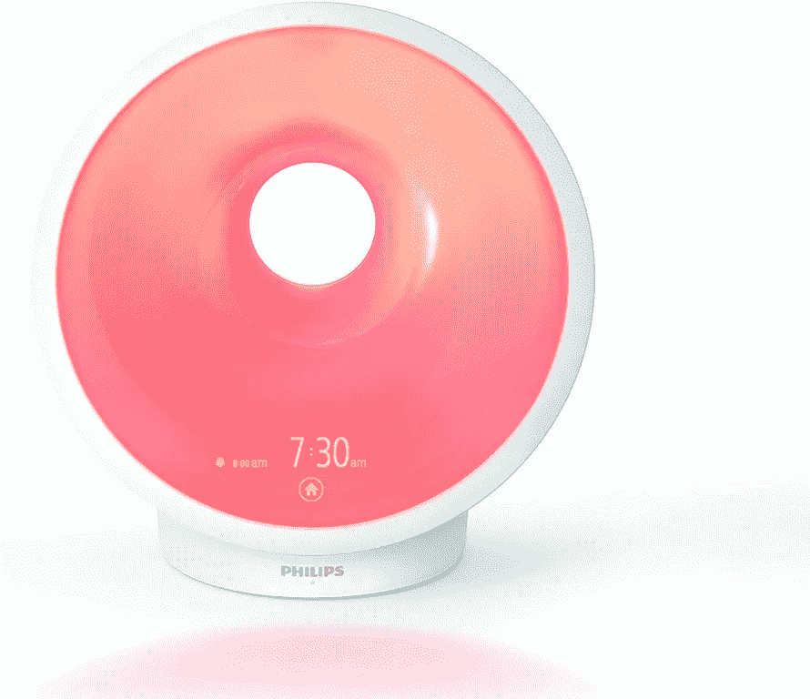
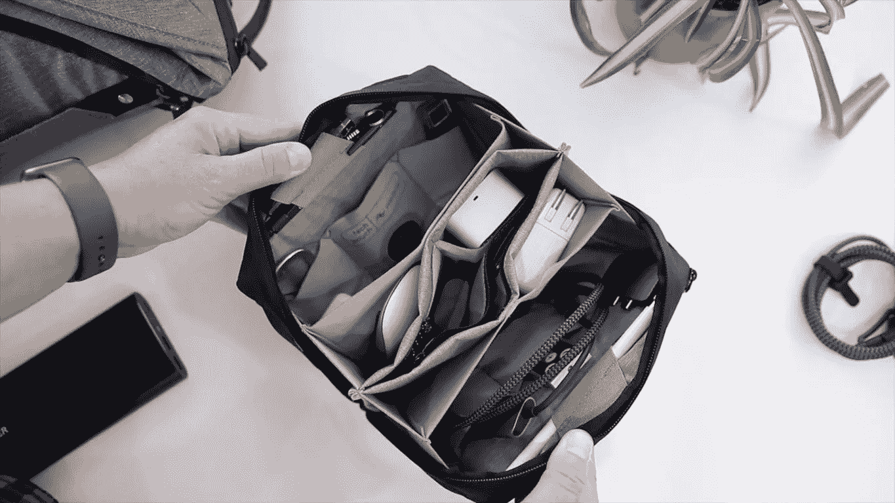
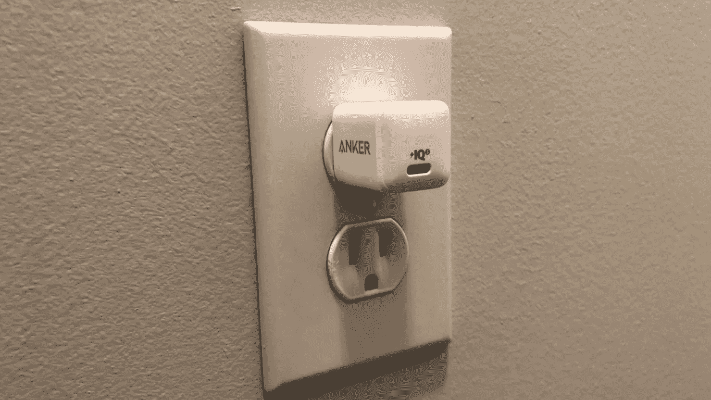
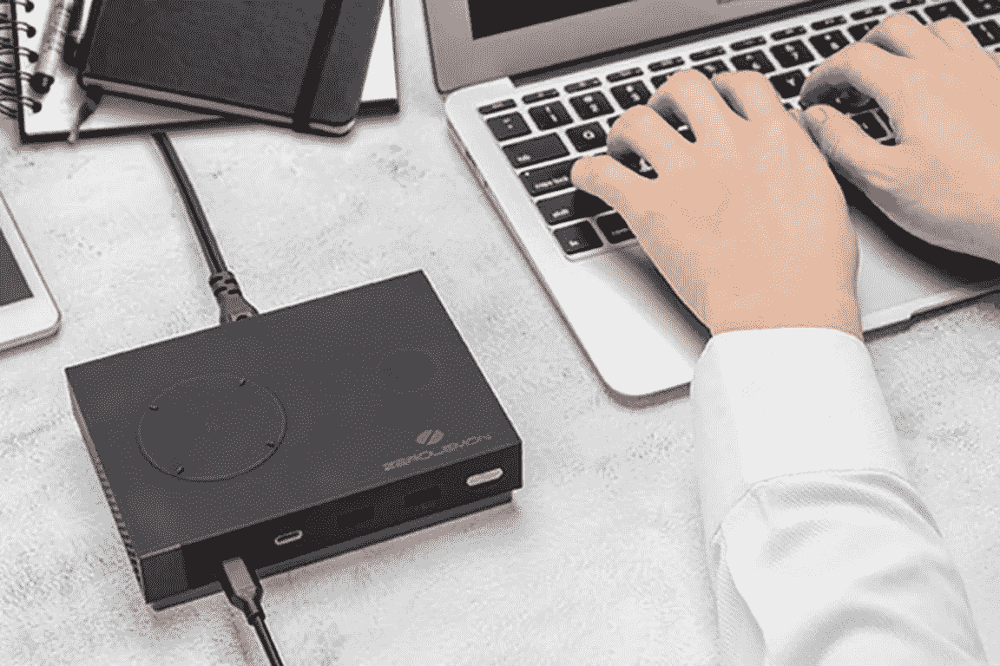
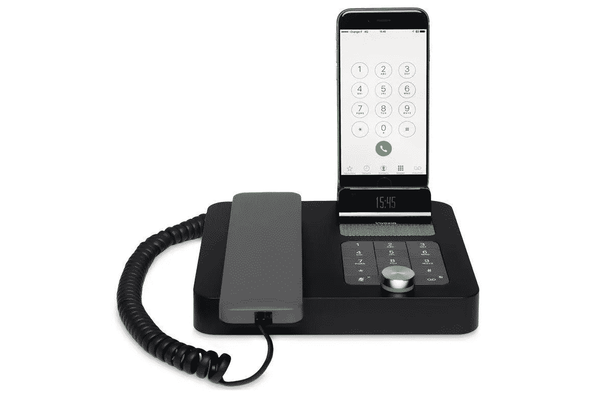
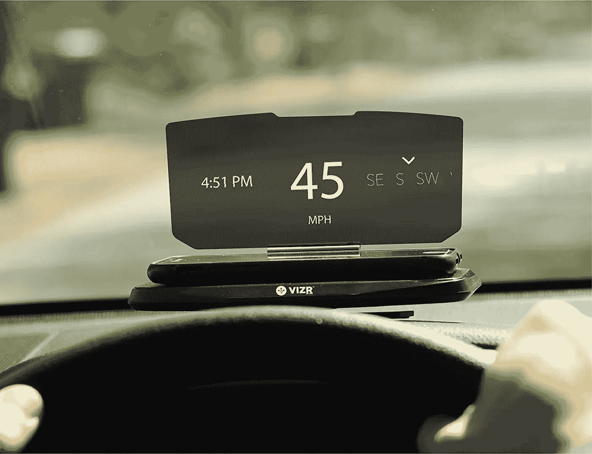
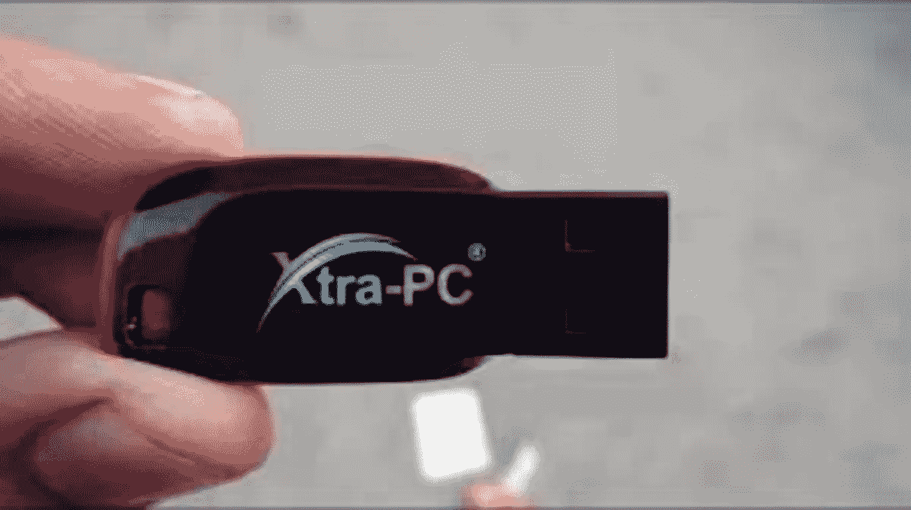
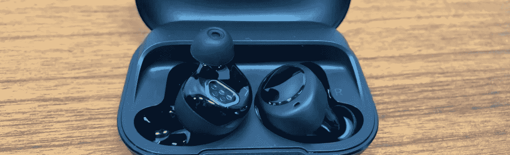
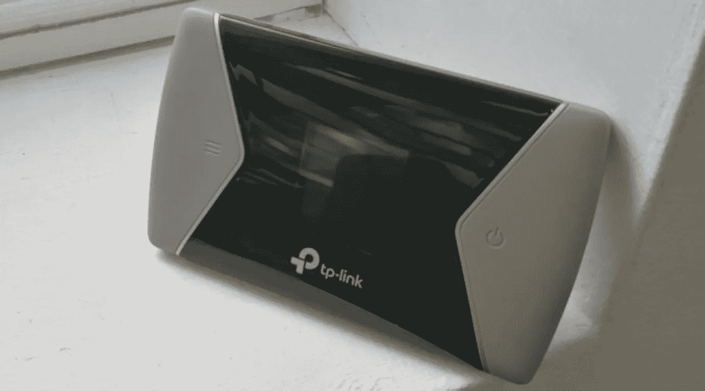

# 将在 2020 年提高您工作效率的 10 种技术配件

> 原文：<https://medium.datadriveninvestor.com/10-tech-accessories-that-will-increase-your-productivity-in-2020-de2958b3a254?source=collection_archive---------6----------------------->

新的技术浪潮已经到来，令人惊叹！

Image by [Alesia Kazantceva](https://unsplash.com/@saltnstreets) on Unsplash

每年都有新的小玩意问世，让我们的生活变得更轻松。技术正以闪电般的速度发展，我决定我要研究最新的小玩意。我搭上了科技潮流，到目前为止，我很享受这一过程！

我通常写关于自我提升的话题和真实的犯罪，但在研究了 2020 年的最新技术后，我决定写这篇关于我认为特别惊人的 10 个项目的文章！

 [## 跑步摆脱疯狂:锻炼如何提高你的生产力|数据驱动的投资者

### 没有比锻炼更好的方式来开始一天的工作了。我试着一周至少做四天，在…

www.datadriveninvestor.com](https://www.datadriveninvestor.com/2018/10/23/running-to-get-rid-of-the-crazy-how-working-out-increases-your-productivity/) 

无论你是否对技术感兴趣，我相信在阅读了 2020 年最新最酷的技术配件的功能后，你的亚马逊愿望清单会增长。

## 飞利浦睡眠和唤醒灯平均价格:200 美元

Image courtesy of [www.amazon.ca](http://www.amazon.ca)

准备好更容易入睡，醒来神清气爽！飞利浦 somneo 睡眠和唤醒灯经临床证明可改善您的睡眠。

特点:

*   模拟日出日落帮助你更容易醒来，更快入睡。
*   它有一个光导放松功能，可以帮助您在漫长的一天后通过呼吸减压。如果你跟着光呼吸，它自然会降低你的心率，推动你进入自然放松状态。它还具有声音引导的放松功能，允许您在使用过程中闭上眼睛。
*   当你在夜里醒来时，一盏柔和的灯指引着你。飞利浦 somneo 睡眠和唤醒灯有一盏柔和的灯，整夜亮着，不会让你睡不着。万一你醒来，它的光线刚好能指引你去厨房或浴室！
*   它有一个小睡功能，适用于那些你需要多睡一会儿的早晨。

## 高峰设计技术袋
平均成本:80 美元

Image courtesy of www.youtube.com

要出差吗？高峰设计技术袋是携带所有技术装备的完美配件！

特点:

*   它的设计很紧凑。
*   它是由耐候尼龙制成的。
*   它包含 15 个内部口袋，用于放置小工具、充电电缆和存储卡。
*   它设计有内部和外部拉链口袋。
*   它有一个内部电源线通道，让您可以将设备放在袋子里，并仍然能够为它们充电。

## Anker PowerPort III 纳米紧凑型壁式充电器
平均成本:20 美元

Image courtesy of [www.switchchargers.com](http://www.switchchargers.com)

Anker 的 PowerPort III Nano USB-C 充电器是一个非常小的充电器，具有强大的冲击力！它能够快速安全地为你所有的电子产品充电。

特点:

*   它有令人印象深刻的 18 瓦输出功率。
*   这是令人难以置信的微小和紧凑的一英寸厚！
*   它可以与任何 USB 兼容充电线配合使用。
*   它采用了一种内置技术，可以防止您的电子设备过热。
*   这种充电立方体带有 18 个月的制造商保修。

## 罗技 MX Master 3 高级无线鼠标
平均成本:130 美元

Image courtesy of [www.verge.com](http://www.verge.com)

你准备好无休止地滚动屏幕，而不会在漫长的工作日结束时感到手疼吗？罗技 MX Master 3 高级无线鼠标来了！这款鼠标是目前同类产品中最好的。

特点:

*   非凡的速度和安静的使用。它有一个 Mag 速度轮，使它比其他鼠标快 99%，安静 87%。
*   这款鼠标兼容 PC 和 Mac 电脑。
*   它具有符合人体工程学的设计，确保完全舒适。
*   它配备了特定于应用程序的定制，允许您使用特定于应用程序的配置文件来加快工作流程。
*   它有侧面的按钮和开关，让您可以轻松地快速浏览您的计算机。

## ZeroLemon 极限充电站
**平均费用:100 美元**

Image courtesy of [www.theverge.com](http://www.theverge.com)

你的电子产品充电慢得令人痛苦吗？好吧，不要害怕，因为 ZeroLemon 极限充电站就在这里！它有六个电源输出，允许您同时为所有设备充电。

特点:

*   极快的充电能力。这个充电站可以在短短 2 小时内将一台 MacBook Pro 从 0%充电到 100%！
*   它的最大输出功率为 135 瓦。
*   它有一个智能双冷却风扇系统，防止充电器过热和过度充电，确保安全使用。
*   它有 6 个电源输出:两个支持 PD 的 USB-C 端口，两个 USB-A 端口和两个无线充电器。
*   它有 12 个月的更换保修和 30 天的退款保证。

## Invoxia NVX200 台式电话
平均价格:220 美元

Image courtesy of [www.macworld.com](http://www.macworld.com)

Invoxia NVX200 桌面电话将您的智能手机变成桌面电话。凭借其时尚的设计和易于使用的功能，这款手机将使任何电话会议轻而易举！

特点:

*   它有一个通用充电底座
*   这部电话有扬声器和电话会议功能。
*   它兼容所有带蓝牙的智能手机。
*   扬声器电话可以在离用户 16 英尺远的地方使用。
*   Invoxia NVX200 台式电话为其使用互联网协议语音(VOIP)电话集成商的用户提供了软件开发套件[Skype](https://www.skype.com/)([iOS](https://www.apple.com/ios/ios-10/)和 [android](https://www.android.com/) )。这允许用户将他们的桌面电话集成到 VOIP 移动应用程序中。

## 平均成本:60 美元

Image courtesy of [www.amazon.ca](http://www.amazon.ca)

对于您所有的商务和休闲旅行，Vizr 是最安全的导航方式！这种免提系统允许司机在使用智能手机进行引导的同时，找到他们的目的地，并保持他们的眼睛在路上。这里没有电线，你只需要把手机放在 Vizr 上就可以了！

特点:

*   它与任何机动车辆兼容。
*   不管是白天还是晚上，它都昼夜不停地工作。
*   它具有多层覆盖，以防止它被划伤或弄脏。
*   它可以与许多类型的导航应用程序配合使用
*   它有防滑设计，所以你不必担心它会从仪表板上滑落。

## Xtra PC
平均成本:30 美元

Image courtesy of [www.home.clevergadgets.co/xtrapc](http://www.home.clevergadgets.co/xtrapc)

你的电脑慢得让人受不了吗？Xtra-PC 来拯救世界了！它是一个 USB 拇指驱动器，可以插入到您的计算机中，并用 Linux 操作系统覆盖您的 Windows 操作系统，使其运行更快。

特点:

*   它与 2004 年及以后生产的 MAC 和 PC 电脑兼容。
*   它适用于笔记本电脑、台式电脑和上网本。
*   它在重新启动时工作，并使您的计算机加载数据更快。
*   Xtra-PC 可清除您电脑中的病毒和恶意软件。
*   任何额外的硬件，如鼠标，键盘，甚至一个额外的显示器都可以与 Xtra-PC 一起工作。

## 平均成本:60 美元

Image courtesy of Alisha Jonas on Wordpress.com

你喜欢在没有音乐的宁静中工作，但又想淹没周围的喧嚣吗？然后拿起一副 Quietbuds 耳塞！Quietbuds 过滤掉你不想听到的噪音，让你可以和坐在你旁边的人继续交谈。

特点:

*   Quietbuds 由一组听力学家设计，为您提供充分的保护，防止噪音引起的听力损失。
*   它们带有几个过滤器，这些过滤器具有不同级别的噪声阻挡技术。
*   它们很容易使用，只需将耳塞拧在一起，就可以使用了！
*   Quietbuds 放在一个方便的便携包中，因此您可以随身携带。
*   你可以在睡觉的时候用它们过滤掉周围的噪音。
*   它们穿起来很舒服，所以如果需要的话，你可以整天穿着它们。

## TP-Link M7650 移动 Wi-Fi 热点

平均成本:470 美元

Image courtesy of www.techradar.com

如果您想在旅途中上网，TP-Link M7650 移动 Wi-Fi 热点是最佳选择！这个小型移动路由器是一个便携式热点，允许信息下载速度高达 600Mbps！

特点:

*   它是袖珍的，便于运输。
*   这款迷你路由器最多可同时支持 32 台设备。
*   它有一个 3000 毫安时的电池，可使用长达 15 个小时。
*   它有一个微型 SD 卡插槽，存储容量高达 32GB。

今天，我迈出了舒适区的一大步，写了一些不同的东西。我获得了以前没有的知识，现在我有一些东西可以添加到我的愿望清单上了！

*艾米·科特罗是一名自由作家，来自加拿大大西洋沿岸的一个小城市。她喜欢与同行作家互动，为她的下一篇文章构思灵感，并研究无数的主题。随时关注她* [*推特*](https://twitter.com/AmyCottreau) *！*