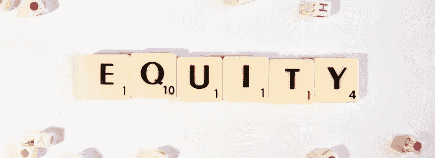

# 提高品牌资产要做的 10 件事

> 原文：<https://medium.datadriveninvestor.com/10-things-to-do-to-improve-brand-equity-fb6d0d173fa6?source=collection_archive---------15----------------------->

## 当收入因为疫情而直线下降的时候！

我的观点受到社会智慧和斯多葛主义的影响，社会智慧是我的谋生之道，斯多葛主义是我所推崇的哲学。

我将在本文中讨论几个相关的主题。

**第一个主题是:**

> A.我们能做些什么不同的事来帮助他人并完整地度过新冠肺炎疫情？

我将从三个不同的方面来回答这个问题:

1.  市场研究公司——因为我的公司就是其中之一
2.  品牌——因为他们是市场研究公司的客户
3.  所有个人——因为这个答案对每个人都有帮助

 [## 以最好的面貌面对未来|数据驱动型投资者

### 社交媒体营销从客户开始。广告、反馈和管理投诉交织在一起…

www.datadriveninvestor.com](https://www.datadriveninvestor.com/2020/03/01/take-charge-with-your-best-face-forward/) 

第一个主题的前提是人们必须呆在家里，这导致他们手中有更多的时间。他们更多地在网上交流，他们主动分享更多的内容，回复更多的帖子，他们肯定会阅读或观看更多的视频。

**1。市场研究公司**

他们可以在网上聊天中发挥有益的作用，提取交流的需求和恐惧，以及希望的信息和如何克服挑战的技巧。

提炼和解释是洞察实践者最擅长的。

巴西和墨西哥的一家跨国市场研究机构已经在用 [DigitalMR](https://www.digital-mr.com/) 做这项工作。他们在每天的电子邮件中向客户提供有用的信息。在这个时代，从 Twitter、FB、Instagram、论坛等收获数百万的网络帖子。使用机器学习来注释它们的主题和情感，在任何语言中都是高度准确的。

**2。品牌**

他们可以*听*人们发布的关于他们的产品类别和品牌的信息，以便发现有用的方法。

有三类公司:生产目前需求量很大的产品(如卫生纸或消毒喷雾)的公司，像连锁餐馆一样每天收入为零的公司，以及介于两者之间的公司。这三者都可以从社交倾听中受益:

*   了解如何灵活利用容量并挖掘新创造的需求，
*   微调他们的产品以解决新的需求和挑战，以及
*   提供使用技巧，为我们回归正常创造善意。

**3。所有个人**

对于所有正在阅读这篇文章的人，我想分享一些斯多葛派的原则:

> 驱动我们情绪和行为的不是生活中发生的事情，而是我们如何看待那些事情。

因此，当面临新的挑战时，我建议遵循以下思维过程，它是由 Aurelius Foundation 的创始人 Justin Stead 启发的:

“事情就是这样。我不贴标签；我不评价它。
积极的结果需要什么？
我将要采取的行动是出于利他主义、自我还是一厢情愿？”

**第二个主题是:**

> B.如何与那些在封锁期间**无法**使用你的产品或服务的客户保持联系。

如前所述，疫情迫使公司分成三类，一类是代理，一类是品牌:

1.  那些经历爆炸性销售增长的人
2.  一天零销售一天零销售
3.  介于两者之间

如果你因为危机而经历了更高的销售额，你会忙得不可开交，你可能不会读这样的文章。

如果你的销售额为零或急剧下降，你首先关心的显然是生存，为你现有的或仍能得到的现金创造足够的跑道。第二个问题——假设危机在你破产前结束——是如何让你的客户参与进来，以确保你的品牌资产得到加强而不是削弱。

你想知道怎么做吗？

好吧，社交智能是答案，它是:每天从 Twitter、FB、IG、论坛、博客、评论或 Youtube 等来源收获的数千篇帖子，通过机器学习算法对主题和情绪或情感进行注释。

即使你的收入直线下降，也不要绝望；并不是一切都没了。以下是你可以做的 10 件事，来提高你的品牌资产，并在这一切结束时做好准备:

1.  **了解**最大的挑战来自:消费者无法获得产品或服务，并向他们提供如何应对这种情况的建议，例如不能去美发沙龙染发；如何在家里选择和使用染发剂？
2.  **将关于需求和挑战的**帖子与建议解决方案的帖子联系起来——通过持续分享两者。
3.  **按目标群体找出**哪些社交媒体平台在危机期间最受欢迎，这样你就可以利用它们进行交流。
4.  发起一场宣传运动，积极发展，给人们带来希望。
5.  **整合**所有传达恐惧、不信任、愤怒的帖子，并以有益的信息回应。
6.  **识别**骗局和神话，并通过您的宣传活动传达它们。
7.  **发现**行为、购买决策和产品用途的变化，当我们在疫情的另一边时，这些可能对你的第一天有所帮助。
8.  **查看**与竞争对手相比，你的品牌的净情感得分是多少。
9.  **从在线活动中推断**你的竞争对手在第一天是如何准备的。
10.  **发现一些你甚至不知道自己在寻找的有用的东西。**

这实际上比听起来要简单得多。

第三、第四和第五个主题是另一篇文章的主题:

> C.将延续的新习惯D .封锁是解决我们气候问题的方法吗？
> E .组织和个人按下“重置”按钮的独特机会

我听到一位明星运动员在上周的一次采访中说:新冠肺炎正在让人类为更危险的事情进行一次演习——导致数百万人死亡——因此可能是塞翁失马焉知非福(对我们这些将在疫情中幸存的人来说)。

> 你怎么想呢?

*最初发表于*[*https://www.digital-mr.com*](https://www.digital-mr.com/blog/view/10-things-do-improve-brand-equity)*。*