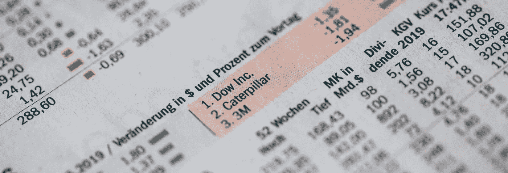
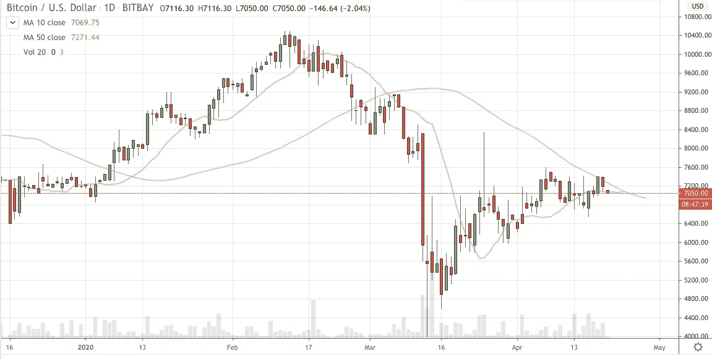
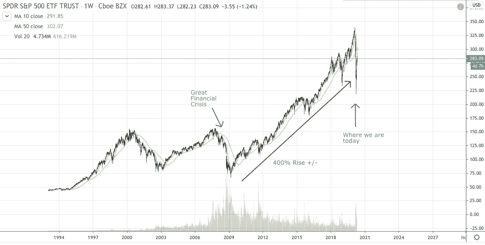

# 今天，给冒险进入股票市场的加密货币交易者的 10 个建议！

> 原文：<https://medium.datadriveninvestor.com/10-tips-for-cryptocurrency-traders-venturing-into-the-stock-markets-today-9d3732dad65?source=collection_archive---------17----------------------->

Photo by Markus Spiske on Unsplash

## 如何利用大锁定崩溃将你的投资组合扩展到加密货币之外

对于加密货币领域和股票领域的交易员来说，这是一个激动人心的时刻，因为我们在这两个领域都看到了巨大的波动和运动。

在过去的 3 个月里，全球股市经历了突然的下跌和复苏(2020 年 4 月)，世界各地的企业都在关门。国际货币基金组织预计，我们一生中最大的衰退即将来临。

> “这使得大萧条以来最严重的衰退成为大萧条，比全球金融危机还要严重。”— [国际货币基金组织](https://blogs.imf.org/2020/04/14/the-great-lockdown-worst-economic-downturn-since-the-great-depression/)

在同一时期，比特币一度下跌了 50%，尽管预计在 2020 年 5 月会下跌一半。在此期间，股票、加密货币、信贷和借贷等金融市场正经历巨大的波动和活跃。

BTC/USD 20 April 2020— chart from tradingview.com

随着所有这些市场运动，现在是加密货币交易商开始关注股票市场的好时机，因为在这个领域可能有更好的风险回报率。对于从活跃交易中赚钱的加密货币交易员来说，这也是一种选择，可以利用这次回调买入高回报股票。

股票有趣的因素(*和相反无趣的*)是它有几十年的风险回报预期和清晰的基本面价值底线。大幅低于其内在价值，最终将恢复到其长期内在价值。

 [## 加密货币行业是死是活？数据驱动的投资者

### 九月初，我们在 X-Order 内部就代币市场的未来进行了一场辩论。有趣的是，我们的观点是…

www.datadriveninvestor.com](https://www.datadriveninvestor.com/2019/12/12/will-the-cryptocurrency-industry-be-dead-or-alive/) 

在正常情况下，加密货币可能会提供更好的风险回报，因为它是一种仍在不断发展估值的金融工具(*类似于过去十年的私募股权*)，然而，在本世纪 20 年代的这场大萧条中，可能存在巨大的机会。

> 因此，为了利用这一点，这里有一个方便的翻译指南，适用于那些一开始不是股票交易者的加密 OGs(以前的 Gs！).

S&P 500 since the last Great Crisis. We are at the precipice of another cliff. P.s.: Not financial advice! — chart from tradingview.com

## 1.流动股票名称

这就像世界上的 BTC 或瑞士联邦理工学院，在那里你总是有流动性进出。显而易见的是大型国家指数，如 S&P500、道琼斯、纳斯达克。在香港和中国，你会有中国 A50，恒生指数，恒生中国企业指数。在日本，有日经 225 指数。在新加坡，有富时海峡时报指数，但它的流动性明显不如这里列出的其他指数。*从技术上讲，你应该购买跟踪指数的交易所交易基金。*

除了指数 ETF，你还可以购买世界上流动性最强的股票，它们的典型特征是市值巨大。

## 2.买卖差价

在这方面，股票市场不同于加密货币世界，因为它有一个标准的交易价格(只要你是从直接市场访问-DMA 平台购买)。对于想要套利交易的加密交易者来说，没有机会，但是，对于被经纪人冲击差价而被勒索的交易者来说，这将是天赐良机！

此外，与加密货币相比，当你交易流动性股票时，你的买卖价差往往非常小。

## 3.IPO——ICOs 之祖

IPO 可能与 ICO 非常相似，因为必须有一个发行目的和一个价值基准。在 IPO 中，价值基准总是盯住汇率。在一个 ICO 中，钉住的方式更多；加密令牌或资产。

在市场低迷时期，你很少会看到 IPO，除了勇敢者、疯狂者或神奇者。

## 4.存款和取款费用

这是许多加密交易者支付的标准，这在股票市场是闻所未闻的。在大多数股票交易账户中，没有存款或取款费用，除非他们有特别便宜的佣金。

## 5.佣金

如果算上买卖差价和代币转换(如果适用)，加密货币领域的佣金非常高，混合水平为 2%-5%。在股票交易行业，甚至有像[罗宾汉](https://medium.com/u/2a8b62298952?source=post_page-----9d3732dad65--------------------------------)(在美国)和 [8 证券](https://medium.com/u/66d3fffd10a7?source=post_page-----9d3732dad65--------------------------------)(在香港)这样的证券经纪公司提供免费的股票交易。

## 6.减半/减半

每个加密交易员都熟悉比特币 halvening，它基本上减少了市场供应。在股票市场，在公司回购期间也有类似的活动，但是，幅度没有那么极端，也没有那么断续。

公司回购确实会支撑股价，所以当预计回购将要发生时，你不会想做空。

## 7.新闻流

股票交易的伟大之处在于，新闻流比加密货币新闻流更容易获取，因为它通常来自公开可用的信息。在加密新闻流中，活动通常在新闻流之前。少数几个大的单一玩家可以推动市场，有效地制造新闻事件。

比特币目前的市值约为 1000 亿美元，以股票计算，它将在美国市场 100 只最大股票中排名第三。当它与每周 7 天、每天 24 小时的交易时间和去中心化的交易所结合在一起时，就变得有利于大型参与者影响市场。

## 8.技术分析

开始炒股最简单的方法就是掌握一些技术分析知识。大多数秘密交易者天生对价格水平的解读很敏感，但是技术分析不止于此。它着眼于总体价格行为，而这在加密货币市场中并不总是存在。Elliot Waves 也是为你的图表增添色彩的另一个很好的资源。

## 9.基本面分析

这是一个量化股价内在价值的过程:剥离下来的裸价值。这个价值为股票提供了下跌缓冲(基本面良好的股票)和上升平台的基础。

目前，加密货币市场的密切基本面是当 Alt 硬币使用 BTC 或 ETH 作为其基础挂钩，从而使 BTC 或 ETH 成为其基本面。尽管如此，BTC 和 ETH 本身并没有从根本上受到驱动。

## 10.买进卖出

因为它的基本价值，股票有季节性变化的看涨和看跌倾向，这可以极大地影响你的交易机会。举个例子，一只股票有很好的基本面，但本周患了严重的流感；做空它是危险的，因为这只股票随时都可能上涨。相反，基本面差的公司股票有更好的做空机会。

一般的指导方针是，如果你的股票交易头寸超过半周，你肯定需要对股票的基本面有所了解。它会反常地改变你的看涨/看跌利润比率。

我希望这个进入股票市场的玩笑能帮助你扩大你的交易机会范围。正如你从加密交易中已经知道的，你需要去体验市场，才能真正学到东西。因此，从小事做起，但是好消息是没有比现在更好的开始时间了。

平静的 ICO 市场，奢华的 BTC 估值，以及即将到来的股市回调，这些都是对你有利的因素！

*我错过了什么或者你想知道更多？请在下面的回答中留言！*

D *isclaimer:我的业余爱好是写一些我觉得有用的话题。这里不代表现在或过去雇主的意见，也不代表任何形式的产品推荐或财务建议。我希望你觉得这些文字有用。*