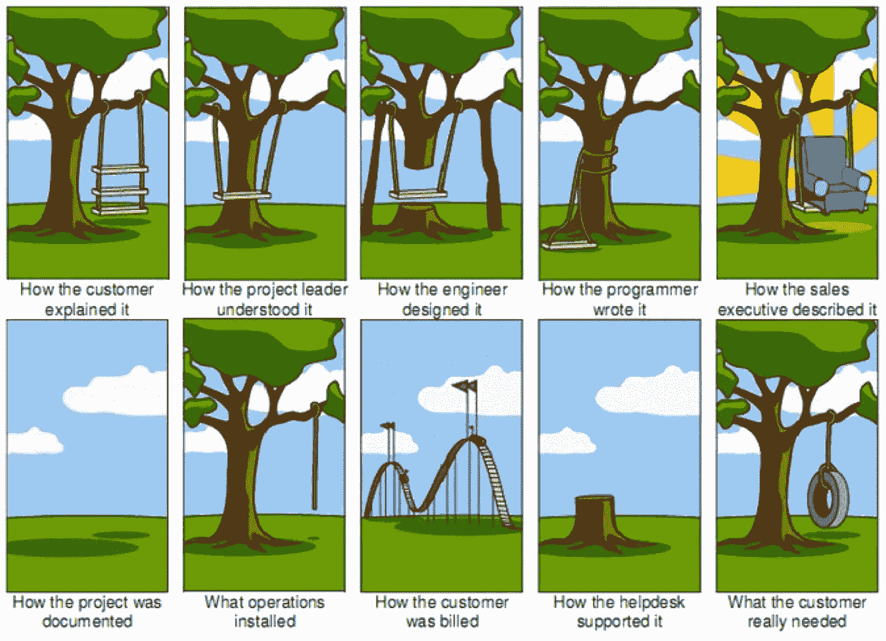
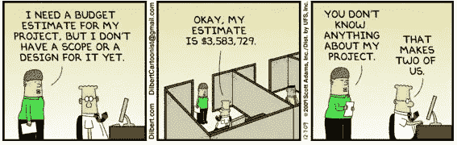
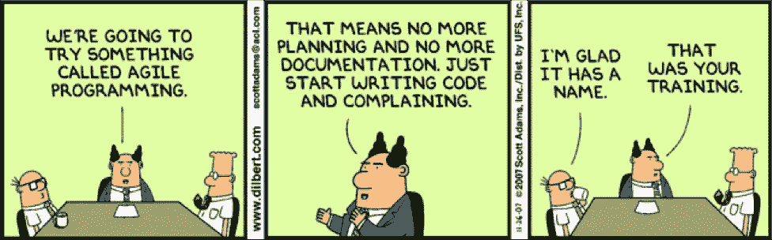

# 10 种让科技项目失败的方法

> 原文：<https://medium.datadriveninvestor.com/10-ways-to-make-unsuccessful-tech-project-d61df1f05845?source=collection_archive---------19----------------------->

一个不成功的项目很容易做。我们将分享开发中可能会破坏任何项目的主要问题。

如果你在互联网上搜索关于发展趋势的文本，你肯定会发现一个关于快速发展的技术以及它们将如何在 2020 年影响我们所有人的无尽的文章和信息列表。但是很少有人写项目失败的原因。

*   **01 定义不明确(或一般不确定)的结果**

“手机 app？我们在建桥，他们会需要吗？”
阻碍软件开发的最大问题之一是定义不明确的结果。如果没有一个“最终产品”应该是什么的正确定义，这个项目肯定会失败。
确定结果很重要。这个项目可能会改变方向，你必须对你所做的所有工作说再见(这就是为什么它在我们的列表中排名第一！).我们强烈建议编写一个规范，以更好地确定产品的外观、功能和实现方式。

*   **02 错题解答**

“我们建了一座新的木桥，看起来比旧的好多了。汽车？不，汽车不能在上面行驶。”
另一个常见问题是错误任务的解决方案。这在一定程度上与一个定义不清的结果相吻合，但总的来说，范围要广得多。虽然你可以正确地确定最终产品，并正确地解决我们在这里讨论的其他问题，但如果你的产品没有正确地解决问题，你将不会有任何成就。结果，你只会得到另一个不成功的项目。解决这个问题的一个方法是增量实施。定义你的主要任务，可以采取什么步骤来解决它和可能的方法。然后，根据用户的反馈不断更新产品。定期检查你的团队的任务和你的实现。这将确保项目恰当地满足客户的需求，并且是主要问题的解决方案。

*   **03 缺乏沟通**

“我们建了一半的桥；他们建了一半的隧道。”
几乎所有的项目、行业、公司都存在这个问题。沟通在软件开发项目的每个层面都是至关重要的。在内部，你的开发人员必须有效地相互沟通。这可确保制造出一致且兼容的正确工具和传送带。这里一个常见的解决方案是为设计、API 和项目所需的任何其他技术需求开发初步的规范。这对于节省数百小时至关重要，否则这些时间会浪费在重构和重组上。
在更高的层面上，与其他团队正确沟通也很重要。例如，营销团队在销售概念之前需要知道什么是技术上可行的。

*   **04 缺乏计划或截止日期**

“是的……将会是……几个星期后？不确定之后我们会做什么… "
不管最后期限和计划是否被遵守，拥有它们是很重要的。它们是你项目的框架。它至少会给你一个任务何时以及如何完成的粗略估计。

当然，好的计划远不止这些。对于大型团队来说，一个好的计划或时间表可以作为一个共同的边界，这将允许他们在 sprints 中快速有效地工作。如果功能实现失败或需要更多时间，则可以快速调整计划/日程，之后可以更改预算。

*   **05 缺乏责任心**

“船不走了！”—可能是哈里·杜鲁门。
当某种类型的不清洁击中风扇时，应该有人准备好用拖把清洁它。如果任何功能出现故障，应该明确谁应该负责，以及应该采取什么措施来防止将来出现这种情况。
这听起来可能很幼稚，但在开发行业，通常的做法是转移责任。后端人指责领跑者，领跑者指责销售部门，销售部门指责营销部门，律师指责律师，管理部门…这一过程不仅耗时，而且对公司的士气具有破坏性，而且，它留下了一个主要问题“哪里出了问题？”开着没人接。

*   **06 过于频繁地改变目标**

“嗯，但现在这座桥应该作为一条跑道，有 10 多条跑道。而中间的公园呢？”跟踪项目目标并监督其及时实施是很重要的，否则你的项目将一事无成。项目可能需要扩展，或者需求会发生变化。但是“最终目标”的频繁改变不仅会破坏团队的士气，还会使项目无法完成。通常变化是没有计划的，需要大量的重构。随着时间的推移，这会导致大量的时间损失，最终导致项目的失败。乍看之下，一个小小的改变最终会成为一个大项目。

*   **07 记录和跟踪不充分**

“拆弹说明上说停电就需要剪断红线，可是所有的线都是红色的，10 分钟前就该断电了！”—职业生涯末期的詹姆斯·邦德。

您可以遵循灵活的方法并快速前进，但是文档总是很重要。一个没有文档记录的代码可能会导致多年的技术债务，并在将来导致巨大的“这个功能做什么”类型的问题。一个不成功的项目会充满这样的困难。记录产品非常重要。过程的每一步，从想法到设计和开发，都需要被很好地记录下来，以确保项目被容易地导航和跟踪。好的文档使跟踪项目中的关键里程碑变得非常简单

*   **08 定义不明确的系统要求**

“该死，你的意思是说对于 5000 人来说我们只有 5 个面包和 2 条鱼？!"
设计规格可能难以衡量。但是你必须识别他们。看似很小的增加很可能会变成一个大问题，需要额外的基础设施和重新定义整个系统来实现支持。

*   **09 年准备不足**

“我们还有半艘船。”
通常项目很吸引人，很容易“进入”其中。然而，适当的训练对此至关重要。需要创建规范、开发设计系统、协调期限和分配资源。从技术上来说，一种流行的管理方法是测试驱动开发。在为一个项目写一行代码之前，计划好架构和每个部分需要做什么。然后编写测试来理解每一部分都做了预期的事情。因此，你将有一个现成的结构和设定的目标，你可以量化开发产品的进度。

*   **10 个不切实际的期望**

“太好了，应用程序看起来很完美。但是为什么配色不会根据用户的衣服自动变化呢？”
管理预期很重要。通常客户要求一个不合理的、不切实际的或不可能的功能。通常的做法是限制可以对规范进行的更改的数量。讨论时还要求有程序员在场。他将能够确定该功能在技术上是否可行。一个不成功的项目试图一次实现所有的愿望清单。

 [## 幸福的算法？

### 从一开始，我们就认为技术正在使我们的生活变得更好、更快、更容易和更实用。社交媒体…

www.datadriveninvestor.com](https://www.datadriveninvestor.com/2019/03/08/an-algorithm-for-happiness/) 

我希望下次你能避开这 10 个陷阱，你的下一个项目将会取得巨大成功！你在项目中遇到过什么问题？通过[【电子邮件保护】](https://geniusee.com/cdn-cgi/l/email-protection)向我们发送电子邮件

*原载于*[*https://geniusee.com*](https://geniusee.com/single-blog/10-ways-to-make-unsuccessful-tech-project)*。*