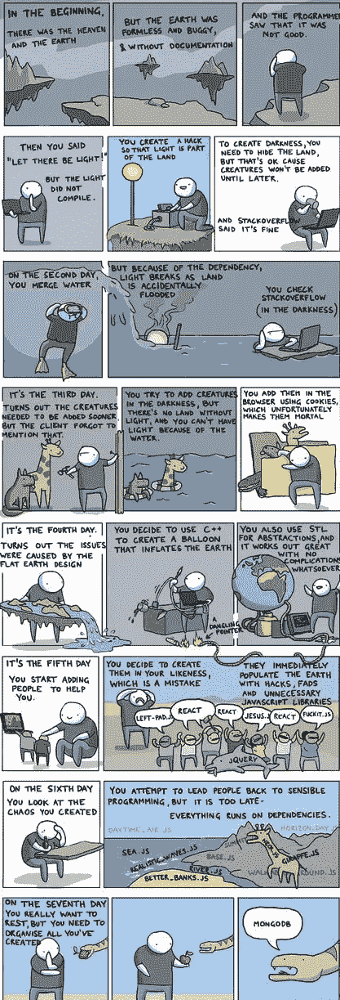
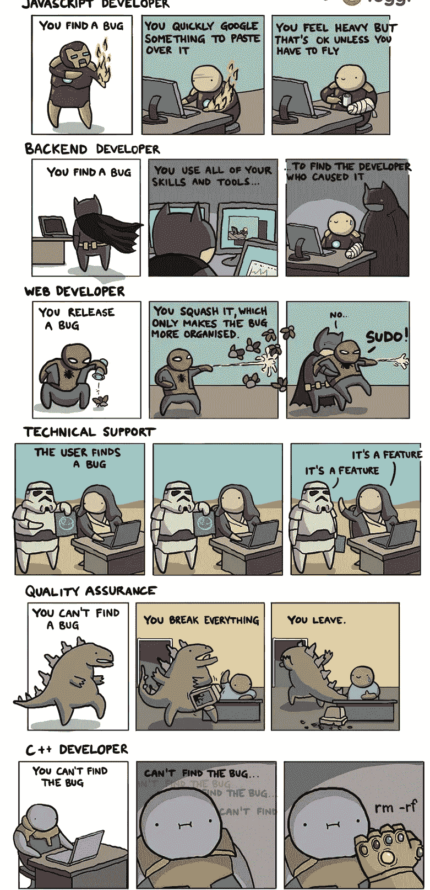
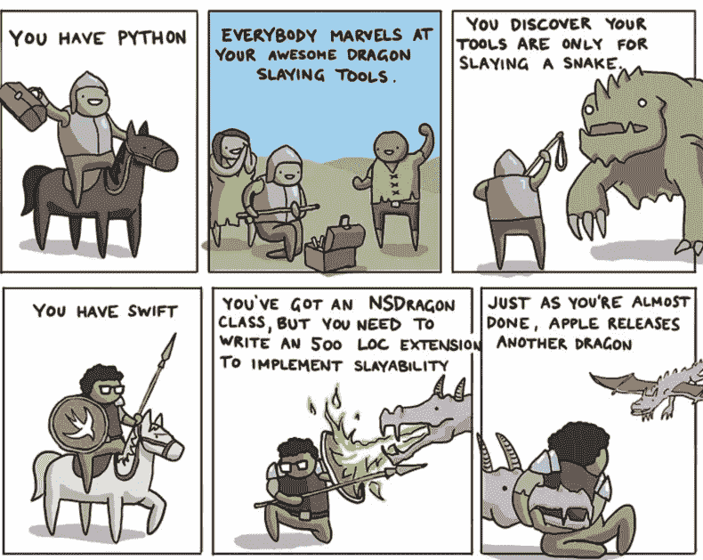
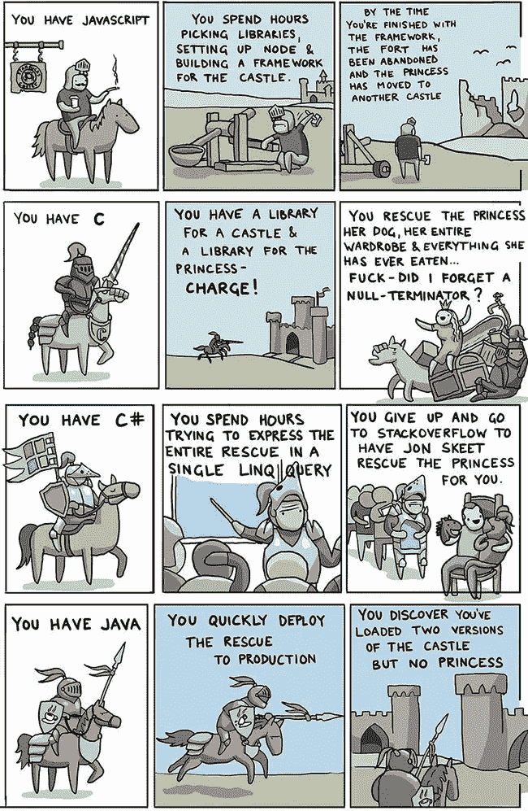
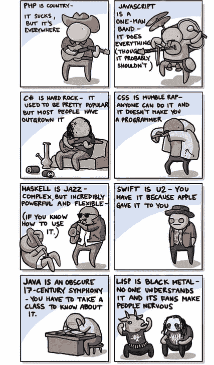
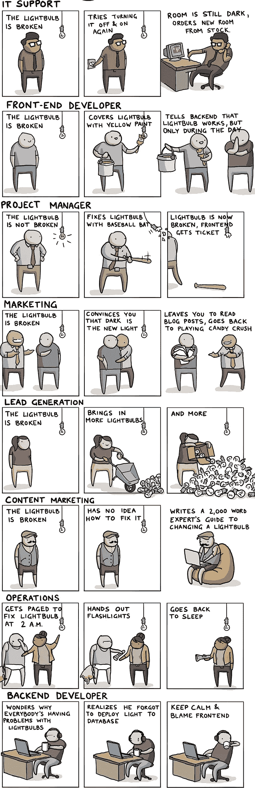
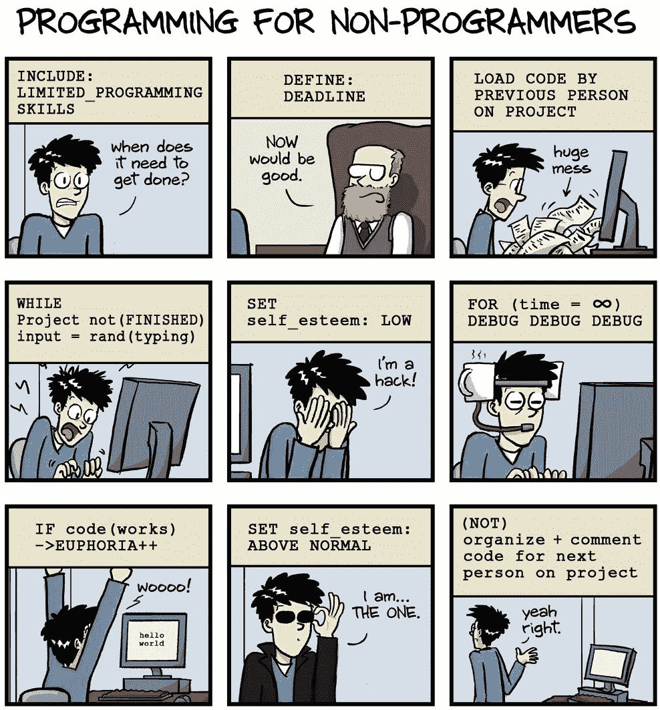
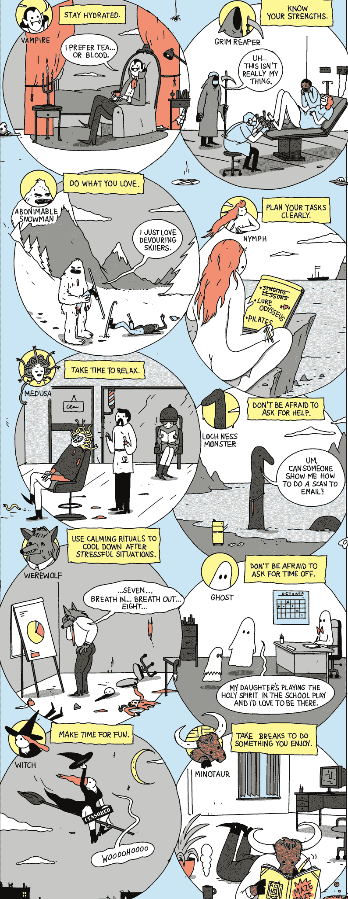
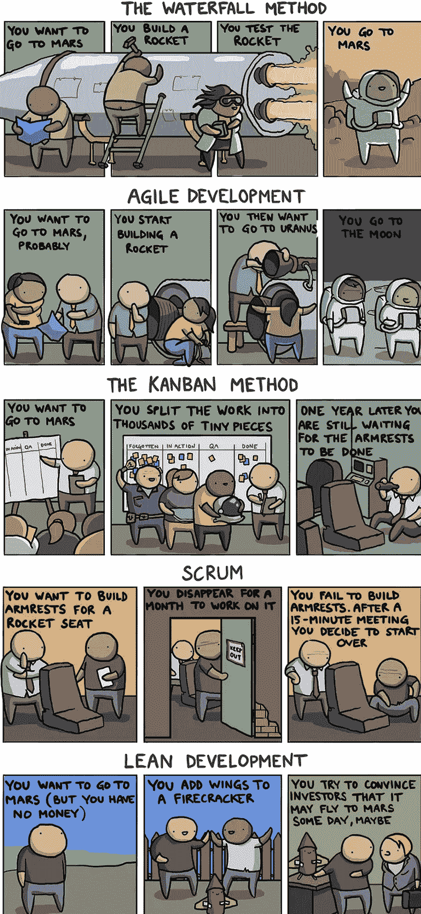
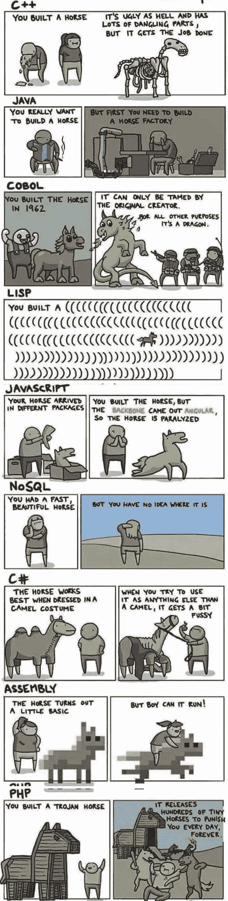

# 10 个让你着迷的诙谐编程笑话

> 原文：<https://medium.datadriveninvestor.com/10-witty-programming-jokes-that-will-make-you-go-rofl-a53fbfb91943?source=collection_archive---------2----------------------->

## 这些太搞笑了…

Photo from Unsplash.com

长时间工作，第 n 杯咖啡，情绪波动(从沮丧到快乐，再回到更沮丧)——程序员的生活是艰难的！

# 其他一些最好的系列—

> [**三十天的机器学习 Ops**](https://medium.com/coders-mojo/day-1-of-30-days-of-machine-learning-ops-7c299e4b09be?sk=4ab48350a5c359fc157109e48b1d738f)
> 
> [**30 天自然语言处理(NLP)系列**](https://medium.com/coders-mojo/quick-recap-30-days-of-natural-language-processing-nlp-with-projects-series-ceb674e3c09b?sk=ca09b27b3d5867f23ab4dc367b6c0c32)
> 
> [**30 天数据工程与项目系列**](https://medium.com/coders-mojo/day-1-of-30-days-of-data-engineering-894822fcb128?sk=76ba558bfe2d9f85cbe741e505295531)
> 
> [**数据科学与机器学习研究(论文)简体**](https://medium.com/coders-mojo/day-1-data-science-and-ml-research-papers-simplified-a68b00a3b1c4?sk=56136229ff738bd734f19d2b6953f78c) ******
> 
> [**60 天数据科学与 ML 系列带项目**](https://medium.com/coders-mojo/day-1-day-60-quick-recap-of-60-days-of-data-science-and-ml-6fc021643d1?sk=4e75e043b7630a9f963562ebac94e129)
> 
> [**100 天:你的数据科学与机器学习学位系列与项目**](https://medium.com/coders-mojo/100-days-your-data-science-and-ml-degree-part-3-c621ecfdf711?sk=1a8c7b0c204d73432d56b7d1a3a26474)
> 
> [**你应该知道的 23 个数据科学技巧**](https://ai.plainenglish.io/23-data-science-techniques-you-should-know-61bc2c9d1b3a?sk=1680c36193eb22198974c9008d62a33c)
> 
> [**技术面试系列—编码问题精选清单**](https://medium.com/coders-mojo/mega-post-tech-interview-the-only-list-of-questions-you-need-to-practice-ee349ea197bb?sk=fac3614684daff4b50a70c0a71e4d528)
> 
> [**用最热门的问题系列**](https://medium.com/coders-mojo/system-design-made-easy-quick-recap-of-complete-system-design-34af7e3aedfb?sk=bdd6a19edc1f3ce4a5064923f5b68721) 完成系统设计
> 
> [**用项目**](https://medium.com/coders-mojo/complete-data-preprocessing-and-data-visualization-with-projects-mega-compilation-part-2-41584ef0920e?sk=842390da51689b8d43148c3980570db0) 完成数据可视化和预处理系列
> 
> [**完成 Python 系列与项目**](https://medium.com/coders-mojo/complete-python-and-projects-mega-compilation-7ec8f7adfe71?sk=ee0ecf43f23c6dd44dd35d984b3e5df4)
> 
> [**完成高级 Python 系列与项目**](https://medium.com/coders-mojo/complete-advanced-python-with-projects-mega-compilation-part-6-729c1826032b?sk=7faffe20f8039fa57099f7a372b6d665)
> 
> [**Kaggle 最会教你的笔记本**](https://medium.com/coders-mojo/my-list-of-kaggle-best-notebooks-topic-wise-data-science-and-machine-learning-part-2-84772863e9ae?sk=5ed02e419854a6c11add3ddc1e52947f)
> 
> [**Git 完整开发者指南**](/the-complete-developers-guide-to-git-6a23125996e1?sk=e30479bbe713930ea93018e1a46d9185)
> 
> [**打赏 Github Repos**](https://medium.com/coders-mojo/6-exceptional-github-repos-for-all-developers-part-1-21e8fa04e150?sk=9140b249af6fe73d45717185fad48962) **—第一部**
> 
> [**打赏 Github Repos**](https://medium.com/coders-mojo/6-exceptional-github-repos-for-all-developers-part-2-3eec9a68c31c?sk=8e31d0eb7eb1d2d0bbbcecaa66bd4e7e) **—第二部**
> 
> [**所有数据科学和机器学习资源**](/best-resources-for-data-science-and-machine-learning-full-list-5ceb9a2791bf?sk=cf85b2cef95560c58509877a794577ff)
> 
> [**210 机器学习项目**](/210-machine-learning-projects-with-source-code-that-you-can-build-today-721b035649e0?sk=da5f593572a0261a6314afad99a0356c)

## 科技时事通讯—

> 如果你感兴趣，你可以加入我的时事通讯，通过它我向超过 30，000 名读者发送技术面试技巧，技术，模式，黑客——软件开发，ML，数据科学，创业公司和技术项目。可以订阅 **Tech Brew :**

 [## 点火器

### 数据科学，人工智能，人工智能和更多…点击阅读由 Naina Chaturvedi 撰写的 Ignito，子堆栈出版物。推出 7 个月…

naina0405.substack.com](https://naina0405.substack.com/) 

## Github —

 [## 编码器-world 04-概述

### 此时您不能执行该操作。您已使用另一个标签页或窗口登录。您已在另一个选项卡中注销，或者…

github.com](https://github.com/Coder-World04) 

这篇文章很短，只是为了好玩(*和放松，因为我在过去的 48 小时里一直在赶最后期限*)。享受你们这些笨蛋吧—

 [## 黑客地球调查了来自 76 个国家的 16000 名开发者——以下是我的发现

### 惊人的洞察力…

medium.com](https://medium.com/datadriveninvestor/hacker-earth-surveyed-16000-developers-from-76-countries-heres-what-i-found-dbd5d7c422b0) 

# 如果世界是由程序员创造的

好吧，在那种情况下，理想情况下我们会挫败所有的混乱，让这个世界成为一个“结构良好、逻辑严密”的地方(*当然是借助 stack overflow :P* )，反驳“平地球社会”的说法。

 [## SlashData 调查了 159 个国家的 17000 多名开发人员，分析结果如下…

### 惊人的洞察力…

naina0412.medium.com](https://naina0412.medium.com/slashdata-surveyed-more-than-17000-developers-in-159-countries-heres-what-the-analysis-says-d25484a42051) 

# 软件开发的英雄和恶棍

难道不是可以理解的吗？

 [## 编程恐怖和幽默第 3 部分

### 继续笑，因为太搞笑了…

naina0412.medium.com](https://naina0412.medium.com/programming-horror-and-humor-part-3-a0bdea3f56f4) 

# GIT the Dragon——如何使用 9 种编程语言杀死这条龙

龙之母——你在听吗？

 [## 如果编程语言是《权力的游戏》中的角色会怎样

### 最后一个很搞笑…

naina0412.medium.com](https://naina0412.medium.com/what-if-programming-languages-were-game-of-thrones-characters-ffc2c3018841)  [## 10 个“硅谷”的俏皮话/双关语是如此有趣、贴切且与技术世界相关

### 虽然听起来很搞笑…

naina0412.medium.com](https://naina0412.medium.com/10-silicon-valley-liners-puns-that-are-so-funny-apt-relatable-to-the-tech-world-a2ee797f7949) 

# GIT 公主——如何使用 8 种编程语言拯救公主

计划。进攻。保存！

 [## 史上最搞笑的代码注释

### 程序员幽默:是的，实际上是程序员写的！

medium.com](https://medium.com/datadriveninvestor/the-most-hilarious-code-comments-ever-bae3cb1030b5)  [## 编码原罪:令人捧腹的开发者自白

### “白板”是如何被嘲笑的

medium.com](https://medium.com/datadriveninvestor/coding-sins-hilarious-developer-confessions-f55eb342454e)  [## Python 迭代器、生成器和装饰器变得简单

### 快速实施指南

medium.com](https://medium.com/python-in-plain-english/python-iterators-generators-and-decorators-made-easy-659cae26054f)  [## 你应该知道的 23 种数据科学技术！

### 使用这些技巧来节省你的宝贵时间

medium.com](https://medium.com/ai-in-plain-english/23-data-science-techniques-you-should-know-61bc2c9d1b3a) 

问题是——你打算自己去救你的公主，还是雇乔恩·斯基特来帮你？

 [## 技术是市场的领头羊|数据驱动的投资者

### 大量的首次公开募股，中国做他们自己的事，微软政府的灾难应对，以及抖音的民谣…

www.datadriveninvestor.com](https://www.datadriveninvestor.com/2020/08/28/tech-is-the-market-top-dog/) 

# 音乐解说节目

谁喜欢硬摇滚？:D

而 Python 呢？也许我会叫它 EDM。

# IT 乔布斯用一个坏掉的灯泡解释道

不可能比这更好了。

# 面向非程序员的编程

保持高度的自尊。你能行的！

# 来自超级自然人的工作生活平衡小贴士

没时间喘口气了。

# 飞往火星的开发方法

我宁愿选择瘦。

# 如何用编程打造一匹马

还有谁在考虑建一个特洛伊木马？*哈哈*

***感谢阅读。继续编码吧。***

***喜欢这个帖子？下面别忘了鼓掌！:D***

*帖子来源及致谢:reddit.com*

# 想看程序员幽默？

 [## 编程幽默第 2 部分

### 继续笑，因为太搞笑了…

medium.com](https://medium.com/datadriveninvestor/programming-humor-part-2-f92cf5a26f2b)  [## 史上最搞笑的代码注释

### 程序员幽默:是的，实际上是程序员写的！

medium.com](https://medium.com/datadriveninvestor/the-most-hilarious-code-comments-ever-bae3cb1030b5)  [## 编码原罪:令人捧腹的开发者自白

### “白板”是如何被嘲笑的

medium.com](https://medium.com/datadriveninvestor/coding-sins-hilarious-developer-confessions-f55eb342454e)  [## 10 个让你着迷的诙谐编程笑话

### 这些太搞笑了…

medium.com](https://medium.com/datadriveninvestor/10-witty-programming-jokes-that-will-make-you-go-rofl-a53fbfb91943) 

# 推荐文章-

 [## Python 迭代器、生成器和装饰器变得简单

### 快速实施指南

medium.com](https://medium.com/python-in-plain-english/python-iterators-generators-and-decorators-made-easy-659cae26054f)  [## 你应该知道的 23 种数据科学技术！

### 使用这些技巧来节省你的宝贵时间

medium.com](https://medium.com/ai-in-plain-english/23-data-science-techniques-you-should-know-61bc2c9d1b3a)  [## 编码原罪:令人捧腹的开发者自白

### “白板”是如何被嘲笑的

medium.com](https://medium.com/datadriveninvestor/coding-sins-hilarious-developer-confessions-f55eb342454e)  [## 面向数据科学家的 5 项酷炫先进熊猫技术

### 使用这些技巧…

medium.com](https://medium.com/datadriveninvestor/5-cool-advanced-pandas-techniques-for-data-scientists-c5a59ae0625d)  [## Stack Overflow 分析了来自 60，000 多名软件开发人员的数据，包括他们的工作时间、语言…

### 以下是他们的发现…

medium.com](https://medium.com/datadriveninvestor/stack-overflow-analyzed-data-from-60-000-software-developers-hours-they-work-languages-they-476ac6ca0197)  [## 高级 Python 变得简单—第 4 部分

### 使用这些技巧和技术…

medium.com](https://medium.com/datadriveninvestor/advanced-python-made-easy-part-4-a4996ba9fe19)  [## 高级 Python 变得简单—第 1 部分

### 使用这些技巧和技术…

medium.com](https://medium.com/datadriveninvestor/advanced-python-made-easy-part-1-ce1e2f17431e)