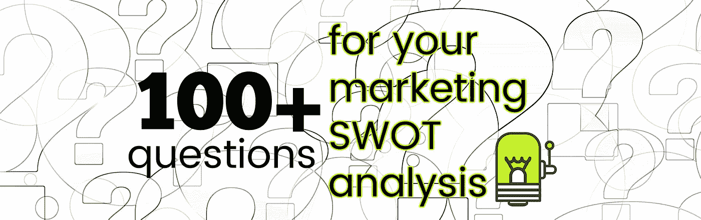
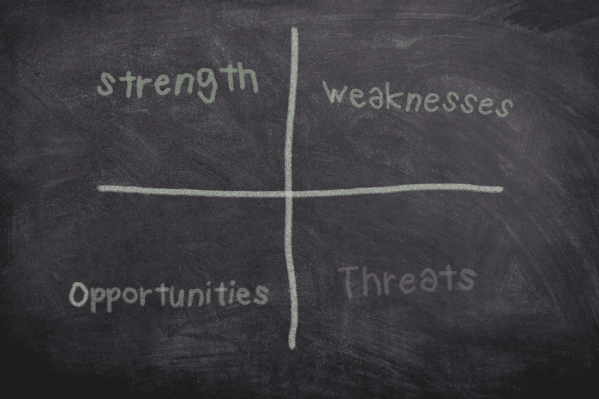

# 进行市场 SWOT 分析时要问的 100 多个问题

> 原文：<https://medium.datadriveninvestor.com/100-questions-to-ask-when-conducting-your-marketing-swot-analysis-cf554eb7802f?source=collection_archive---------2----------------------->

## 对于创业公司来说，营销 SWOT 分析是商业规划过程中不可或缺的一部分，有助于建立一个强大的营销战略。

# 什么是营销 SWOT？

SWOT 是代表优势、劣势、机会和威胁的首字母缩写词。市场 SWOT 分析可以帮助你了解影响你的业务的内部和外部因素，包括宏观和微观因素，以及成功的可能性。这是一个快照，反映了你的企业目前的状况，正面的和负面的，并帮助你发现机会，以帮助你实现未来的营销目标。

这是一个必须诚实完成的策略。如果你不愿意充分解决 SWOT 分析的每一个象限，你就有可能创造一个无效的营销策略，把你引向错误的方向。你必须开诚布公地说出你的弱点，以及你的产品在竞争中的地位。

优势和劣势往往着眼于企业的内部能力。你擅长什么？是什么让你比你的竞争对手领先？你不擅长什么？与竞争对手相比，你的弱点在哪里？

机会和威胁通常是外部因素，如行业趋势、政府监管和竞争对手。

当你发现一个与你的优势相符的机会时，最好的营销策略就会出现。例如，让我们说关于你销售的产品类型的问题在 Reddit 上正在增加——这是一个机会。你知道你有几个员工在这个平台上有固定的位置，这是一个很大的优势。你的策略可以将这种优势应用到机会中。在这个例子中，你的建议可能是成立一个由员工大使组成的工作组，他们愿意在 Reddit 平台上参与对话并回答问题。如果你的员工不愿意这样做，你有一个巨大的弱点，可能包括你的员工不相信产品，团队领导，或两者兼而有之。

 [## 您的企业今天需要虚拟现实营销的 3 个原因|数据驱动的投资者

### 新冠肺炎是并将继续是一个前所未有的全球性事件，将医疗保健系统和全球经济带到…

www.datadriveninvestor.com](https://www.datadriveninvestor.com/2020/04/09/3-reasons-why-your-business-needs-vr-marketing-today/) 

## 解决你的市场 SWOT 分析

在做深入的 SWOT 分析时，我喜欢检查公司的每个方面。从产品到接电话的人——优势、劣势、机会和优势都可能出现在意想不到的地方。

对于初创公司，SWOT 分析应该是商业规划过程的一部分。这将有助于勾勒出一个营销策略，让你朝着正确的方向前进。

100+ Questions for your Marketing SWOT Analysis — Image by Image by [athree23](https://pixabay.com/users/athree23-6195572/?utm_source=link-attribution&utm_medium=referral&utm_campaign=image&utm_content=4887880) from [Pixabay](https://pixabay.com/?utm_source=link-attribution&utm_medium=referral&utm_campaign=image&utm_content=4887880)

进行 SWOT 分析没有对错之分。我更喜欢将 SWOT 分析作为一个头脑风暴会议，在这个会议上，我们观察公司的不同方面，处理大量的问题，并询问每个部分是否有优势、劣势、机会和威胁。有时候，类似的问题可以用不同的方式来问，看看你是否会得到不同的答案。

通过这个练习，你应该能够创建一个重要优势、劣势、机会和优势的列表，并决定哪些应该优先考虑，成为你的营销策略的一部分。

## 不要做你的市场 SWOT 分析

*   不要一概而论
*   不要高估你的力量
*   不要只是掩饰你的弱点

## Dos 为您的营销 SWOT 分析

*   解决质量和数量上的优势和劣势
*   试着按重要性排序，这样在制定营销策略时，你就知道该优先考虑什么了。

100+ Questions for your Marketing SWOT Analysis — Image by Image by [athree23](https://pixabay.com/users/athree23-6195572/?utm_source=link-attribution&utm_medium=referral&utm_campaign=image&utm_content=4887880) from [Pixabay](https://pixabay.com/?utm_source=link-attribution&utm_medium=referral&utm_campaign=image&utm_content=4887880)

这里有一个超过 100 个问题的列表，当你建立 SWOT 分析时，你可以问你的团队。这些问题有助于解释每个部分，激发围绕其他问题的创造性思维，并最终提供成功营销战略所需的关键要素。

[Buy the latest marketing book by Audrey Nesbitt](https://www.smashwords.com/books/view/1025113)

## 针对您的市场营销 SWOT 分析的 100 多个问题

**产品或服务**

你的公司比任何人做得更好的是什么？

你有什么竞争优势？

你的品牌有多成熟？

与供应商存在哪些排他性关系？

你的分销网络有多广？

你目前的市场份额是多少？

你的地理位置是否给了你优势？

公司是否拥有任何专有技术、知识产权或有价值的资产或信息，从而为公司带来竞争优势？

该产品的市场趋势是什么？

是否有竞争对手尚未提供的产品或服务？

这个行业目前是否忽视了一个潜在的利基市场？

有没有可以添加到你的投资组合中的补充产品或服务？

外部发生了什么事情吗(政治、经济、社会等)。)这可能会带来机遇？

当前和预测的经济趋势如何为企业带来机遇？

对不同级别政府的拟议变更会对业务产生什么影响？

有没有公司目前不是直接竞争对手，但将来可能会是？

是否有资源来开发产品的全部潜力？

你的产品是否列在产品评论网站上？

与竞争对手相比，你的产品在评论网站上的排名如何？

**顾客**

当前客户群的安全性如何？

从客户的角度来看，产品/服务的可靠性如何？

你的客服部门有多强？

客户是否要求您目前不提供的东西？

我们经常从潜在客户那里听到哪些异议？

顾客在网上发布正面或负面评论吗？

潜在客户不认可你的品牌吗？

您有客户案例研究吗？

你会主动寻求现有客户的评价吗？

**团队**

你有一个强大的团队吗？

团队成员快乐吗？

团队成员对产品的感觉如何？

团队成员对公司的感觉如何？

有什么知名的团队成员让你有优势吗？

创始人或团队的任何部分有哪些可以利用的优势？

开发团队的熟练程度如何？

公司士气如何？

公司文化是什么样的？

创始人和团队领导参与社区的程度如何？

团队领导和创始人有发言机会吗？

**营销&销售**

**销售**

当前销售材料的设计有多好？

你缺什么销售资料？

是否有品牌销售材料的核心库？

销售团队在品牌材料方面训练有素吗？

销售团队在实现共同目标方面有多精通？

当前销售渠道的建立程度如何？

销售团队得到了怎样的支持？

是否鼓励销售人员参加社交活动？

销售人员是否获得了成功所需的任何工具？

**网站**

网站设计的有多好？

网站在 UI 设计、移动友好性、网站速度和页面优化方面做得如何

网站和其他数字财产上的行动号召有多强烈？

你的网站使用模式标记(一种帮助你的网站在搜索引擎中排名的微数据形式)吗？

您的网站是否针对语音识别搜索进行了优化？

**SEO**

你的网站针对 SEO(搜索引擎优化)的优化程度如何？

你的品牌名称在搜索引擎中的排名如何？

你的公司在关键词搜索引擎中的排名如何？

你的竞争对手在关键词搜索引擎中的排名如何？

你是如何为 SEO 重新利用内容的？

是不是所有的本地房源网站都被利用来做优化和链接建设？

**内容**

是否有适当的内容策略？

是否有门控内容策略？

你使用像 Medium 这样的外部博客渠道吗？

有免费赠品吗？

有电子邮件数据库吗？

目前是否有电子邮件策略？

你和记者、有影响力的人或新网站有什么可以利用的关系吗？

你有没有可以探索的联合品牌营销和/或销售机会？

有没有可以更多利用的视频？

有没有视频内容策略？

**社交媒体**

你的社交媒体影响力有多大？

你在社交媒体上的活跃程度如何？

你是否为 SEO 充分优化了你的社交媒体帖子？

你在 Reddit 上有固定的存在吗？

你在在线行业社区中的地位如何？

是否有社交媒体受众未被发掘？

你的竞争对手有强大的社交媒体吗？

你有社交倾听策略吗？

有没有新的社交媒体渠道可以击败你的竞争对手？

是否正在探索行业事件？

你鼓励员工参加当地的活动和聚会吗？

你有聚会小组吗？

你举办活动吗？

你参加或参加行业午餐并学习吗？

你的竞争对手参加什么比赛吗？

是否有机会与某项活动进行交叉推广？

**付费广告**

有广告预算吗？

营销预算是否足以实现预期的营销目标？

迄今为止，有没有发起任何 PPC 活动？

过去的活动效果如何？

哪些广告渠道超出预期？

除了谷歌之外，在 LinkedIn、脸书或其他平台上发起过付费活动吗？

PPC 广告中使用过哪些关键词？

你在你的竞价排名活动中使用了正确的关键词吗？

PPC 管理者对负面关键词的攻击性有多大？

最常用的关键词是什么？

热门关键词的每次点击成本是多少？

多少点击转化为销售额？

是否有适当的登录页面策略？

登陆页面是否经过转换测试？

如何跟踪转化率？

是否使用了任何跟踪像素？

你在监控你的竞争对手的 PPC 活动吗？

你的竞争对手和以前相比有什么不同吗？

你可以模仿你的竞争对手做什么？

有没有可以直接在上面做广告的高流量网站？

营销 SWOT 分析的重要性不容忽视。正确的 SWOT 分析有助于呈现所有可用的事实，允许公开和诚实的评论，并提供你前进所需的所有信息。

奥黛丽·奈斯比特

[奥黛丽·奈斯比特在 Linkedin 上](https://www.linkedin.com/in/audrey-nesbitt-mba-pmp-0388a52a/)

[@ audreynesbit 11 在推特上](https://twitter.com/AudreyNesbitt11)

[螺旋营销&公关](http://www.spinspirational.com/)

**访问专家视图—** [**订阅 DDI 英特尔**](https://datadriveninvestor.com/ddi-intel)