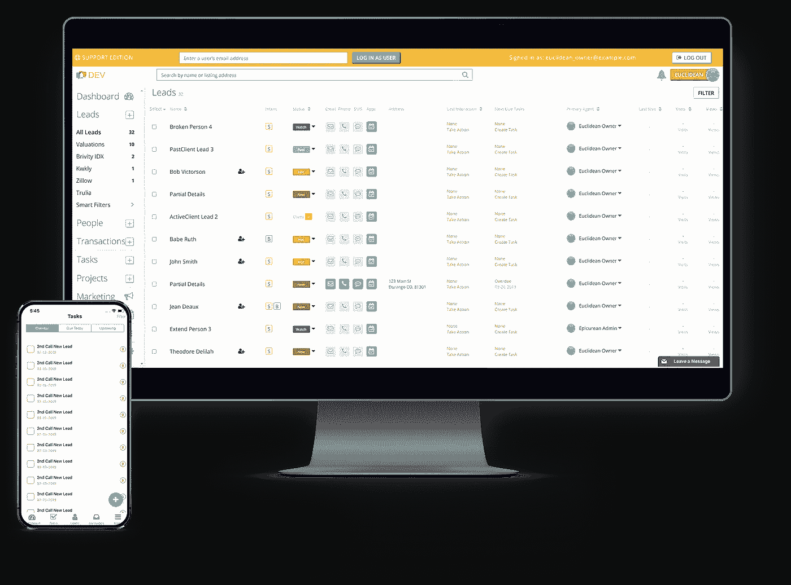
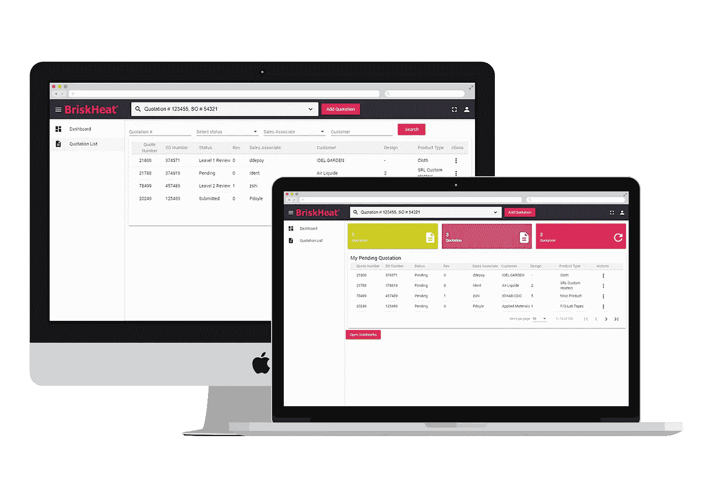

# Web 应用程序开发的 11 个好处

> 原文：<https://medium.datadriveninvestor.com/11-benefits-of-web-app-development-fcd12209fbd9?source=collection_archive---------7----------------------->

探索 web 应用程序开发的奇妙世界，以及为什么您应该在业务模型中实现 web 应用程序的 11 个理由

# 什么是 web 应用程序开发，它对我有什么帮助？

如果你曾经想知道什么是 web 应用程序开发，那你来对地方了。Web 应用程序开发是创建驻留在上并可通过互联网访问的程序的过程。“应用程序”这个词通常与移动设备联系在一起，但在 web 应用程序中却不是这样。网络应用和移动应用的最大区别在于，后者需要你下载一个产品，而前者可以通过浏览器访问。Gmail、微软团队、Office 365 都是常用的网络应用。既然您已经对 web 应用程序有了更好的理解，那么让我们开始确定将 web 应用程序整合到您的业务模型中可以从中获益的方式。从节省时间和金钱到改善沟通，以下是 web 应用程序开发的 11 个好处。

# 更具成本效益

先说大家脑子里的第一件事:价格。虽然一般来说很难给 web 应用程序开发定价，但它确实比开发移动应用程序更具成本效益。这在很大程度上是因为开发时间更少，因为只需要构建一个版本的应用程序来服务所有操作系统。所以，如果你预算有限，但仍然想在你的业务中实现一个定制软件，web 应用程序开发可能是你最好的选择。

[移动应用开发的 11 个好处](https://www.thesunflowerlab.com/blog/11-benefits-of-mobile-app-development/)

# 平台包容性

说到操作系统，这是 web 应用程序的另一个突出优点。由于只有一个产品，而且只有一个产品，用户可以访问您的平台，而不用担心他们的操作系统是否是最新的，甚至是兼容的。您的单平台基于 web 的产品更易于开发和使用，这是快速成功的敲门砖！web 应用程序的平台友好特性也使其在交付过程中易于安装。

# 易于维护

说到更新，移动应用把负担放在了用户身上。为了让移动应用程序正常运行，或者在某些情况下，客户需要在软件提供商的应用程序商店中更新它。另一方面，Web 应用程序开发产品托管在 web 上。从用户的角度来看，这意味着应用程序将自行更新所有内容。你越不需要用系统更新来烦扰你的用户，就越好。

# Web 应用程序开发在搜索引擎上提供了更好的发现

搜索引擎优化(SEO)是提高你的企业出现在搜索引擎结果中的几率的做法。因为网络应用程序存在于——你猜对了——网络上，客户更有可能通过谷歌找到你的产品。例如，如果你创建了一个照片编辑 web 应用程序，并优化了你的网站，你的用户可以通过搜索“照片编辑”或“在线编辑照片”找到你每天有超过 35 亿次的谷歌搜索，我们认为这是一个被发现的绝佳机会！

# 改进的组织

到目前为止，我们已经讨论了 web 应用程序开发面向用户的好处。然而，创建内部产品来管理业务有很多好处。客户关系管理(CRM) web 应用程序帮助企业更好地组织和访问客户数据。这些工具非常有助于与现有客户保持联系，并在一个定制目录中发现新的业务机会。 [Brivity](https://www.thesunflowerlab.com/portfolio/brivity/) 使用 CRM web 应用程序开发成功简化了他们的房地产流程，而 [BriskHeat](https://www.thesunflowerlab.com/portfolio/briskheat/) 使用他们的定制产品更高效地管理任务。

[查看更多 CRM WEB 应用开发](https://www.thesunflowerlab.com/ourwork/)

# 改善与 Web 应用程序开发的沟通

沟通失误会导致灾难性的失败——以 IHOP 臭名昭著的“ [IHOB](https://www.beekeeper.io/blog/3-internal-communication-failures-that-turned-into-pr-disasters/) ”事件为例。好吧，这可能是一个公关噱头，但我们袖手旁观我们的要求。使用自定义 web 应用程序让您的团队了解最新情况。CRM 可以帮助你的员工进行内部沟通。您的 web 应用程序也可以是您发布公司更新的地方。信息交流是保持你商业机器良好运转的关键！

Web 应用程序开发也有助于您的企业更好地与外部世界沟通。通过把你的生意放到网上，你大大提高了你对现有客户和潜在客户的可见性。随着越来越多的业务转移到网上，您希望为用户提供出色的体验——超越传统网站的体验。web 应用程序开发中提供的特性和功能将为客户提供独特的体验，让他们一次又一次地回来。

# 可定制性

购买现成的软件包和从可靠的定制 web 应用程序开发公司开发专用软件都有利弊。在“开箱即用”解决方案的情况下，您不必花时间与开发团队一起设计您的软件。然而，这种应用程序在最终用户需求方面是通用的，并且可能提供不完全适合您的独特业务需求的某些功能。因此，即使花了钱，你可能仍然不得不与业务自动化的某些方面作斗争，因为一些功能可能在你现成的软件中不可用。

不仅如此，就外观而言，现成的解决方案是非常基本的。定制解决方案有助于支持您在市场中的独特身份。因为软件是完全定制的，所以你可以选择使用什么样的框架来设计你的应用。你有能力用最新的引领潮流的技术来拓展你的品牌，实现你的调色板、主题、字体、美学和标志！谁知道呢，也许你甚至想提供一种增强现实体验。web 应用程序开发服务无所不能！

# 借助 Web 应用程序开发服务，保持您的业务全天候开放

如今，人们到处都在做生意。而传统的上午 9 点到下午 5 点的营业时间呢？这是过去十年的事了。未能适应不断变化的商业环境可能会扼杀潜在的顾客，并让你损失金钱——哎呀！借助 web 应用程序开发服务，让您的隐喻之灯全天候开启。客户可以在自己舒适的家中浏览你的业务，或者在家长会和游泳课之间浏览。此外，几乎可以从任何设备或浏览器轻松访问 web 应用程序！人们比以往更加忙碌。停止限制对您公司的访问，并开始使用 web 应用程序开发服务。对于真正的全天候服务，考虑给你的观众一个聊天机器人的客户服务体验！

# 安全性

许多 B2B 和 B2C 公司主要关心的是数据访问和安全性，以及它如何影响最终用户。企业希望为消费者提供一个安全的在线环境来进行交易和输入信息。Web 应用程序开发服务可以解决所有这些问题，甚至更多。它们不仅构建了最强大的安全系统，而且 web 应用程序开发服务还包括一个安全专业团队来监控您的 web 应用程序。这些专家可以让您的系统为自然灾害做好准备，主动消除数据泄露，并让您全天候在线。

# 可量测性

无论你是希望增加新地点的小企业，还是希望缩小规模的大型企业集团，web 应用程序开发服务都将在你身边。这些产品的美妙之处在于它们是完全可扩展的。想想“旅行裤的姐妹情谊”，但是用软件！在训练有素的技术人员的帮助下，您的服务可以根据您的业务计划进行收缩和扩展。

组织流程随着时间而变化，随着市场动态的变化，有必要适应新的流程和技术来保持您的营销据点。定制的软件可以很容易地改变——当市场趋势发生变化时，新的流程和技术可以集成到您现有的软件中。粉碎您的目标，通过 web 应用程序开发服务领先于竞争对手。

# 用户跟踪/分析

采用数据驱动的业务方法是衡量真正成功的唯一方法。通过 web 应用程序开发，您可以内置强大的分析功能。您可以定制您的仪表板，以快速查看不同指标的执行情况。这些数字可以帮助您了解过去的业务计划并规划未来的合作。在 web 应用程序开发中使用分析重新控制您的业务。

# 受益于 Web 应用程序开发

决定将 web 应用程序开发整合到您的商业模式中，会让您在许多层面上取得成功。从改善内部功能到增加对客户的可见性，web 应用可以产生巨大的影响。但是为了优化机会，你必须选择合适的合作伙伴。合适的 web 应用程序开发公司将通过卓越的客户服务、训练有素、经验丰富的技术人员和卓越的产品，在您的每一步中都陪伴在您身边。向日葵实验室得到了全球数百家财富 500 强公司和企业家的信任，能够为他们的独特问题提供定制解决方案。我们掌握了开发生命周期，客户满意率达 97%。[让我们今天就将您的应用梦想变为现实](https://www.thesunflowerlab.com/contact-us/)！