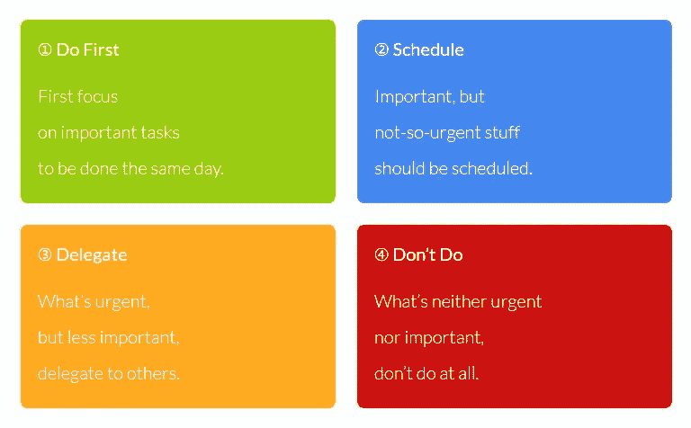
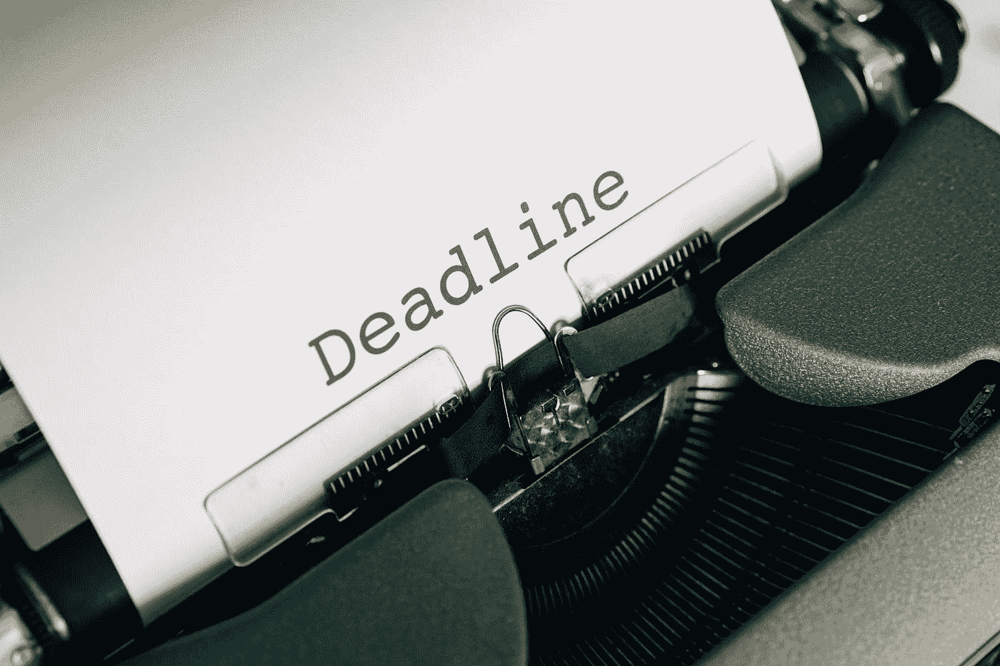

# 关于如何管理时间的 11 个强有力的时间管理技巧

> 原文：<https://medium.datadriveninvestor.com/11-powerful-time-management-tips-on-how-to-manage-your-time-d1feb27e91e2?source=collection_archive---------5----------------------->

## 没有人生来就有生产力，但是你可以通过时间来培养

没有人生来就富有成效，但是你可以随着时间的推移培养它，这种变化不会发生，除非你迈出一大步，改变你的心态。你如何管理时间非常重要。

不管你的金钱、名望等，每个人唯一的共同点是**时间**。是啊！我们每天都有同样的 24 小时，只是提醒你一下。所以，每个成功的背后，都有一个人每天都在竭尽全力。

# 什么是时间管理？

时间管理是你在给定时间内组织和计划活动的方式。时间管理对于提高效率和在短时间内完成大量工作非常重要。

Photo by [Djim Loic](https://unsplash.com/@loic?utm_source=medium&utm_medium=referral) on [Unsplash](https://unsplash.com?utm_source=medium&utm_medium=referral)

虽然时间管理并不真正存在，因为让我们面对它，不管你喜欢与否，时间都会流逝，你不能停止它，改变它，甚至让它弯曲。但是你可以管理你自己和你处理事情的方式。

所以，这篇文章将向你展示一些时间管理技巧，帮助你通过排除干扰来控制时间，提高效率。最后，这将帮助你更接近你的梦想和目标。

# 有效管理时间的 3 个步骤

在你有效地管理时间之前，如果你想在你选择的时间管理和生产力的新道路上征服并赢得胜利，有三个重要的步骤你必须遵循。

## 第一步:记录一天的时间

首先，你必须问自己一个问题，**我的时间去了哪里？**记住这个问题，你将不得不记录下自己每天的时间来回答这个问题。

在你学会如何管理你的时间之前，你需要了解你是如何度过的。这有助于你知道你做错了什么。

所以，当你明天醒来的时候，在你的日程表上写下你的起床时间，并且随着你一天的过去，写下你做的每件事以及完成每项任务需要的时间

例如，你洗澡、吃饭、准备一天要花多长时间。还有，锻炼的时间或者你在办公室呆的时间等等。

 [## 后 COVID 世界中具有前瞻性思维的虚拟财富管理顾问|数据驱动…

### 随着世界范围内病例数量的持续上升，新冠肺炎绝不是一个过去，但是我…

www.datadriveninvestor.com](https://www.datadriveninvestor.com/2020/07/28/virtual-wealth-management-with-forward-thinking-advisors-in-a-post-covid-world/) 

如果你在家用电脑和电话工作，检查一下你的屏幕时间。这将显示你在什么网站和应用上花费的时间和持续时间。

把每一个细节都做到最后，因为这将有助于你更有效地管理你的时间。

## 第二步:分析你的时间表

如果你想高效地管理好你的时间，你必须对自己非常诚实。

你是否花了 10 分钟工作，然后在接下来的 1 小时左右分心做社交媒体？你必须承认这一点，告诉自己你没有效率。

所以仔细检查你跟踪的时间表，然后突出任何你做了没有效率的事情的时候。把你浪费的时间加起来，看看你在没有结果的活动中浪费了多少时间。

通过跟踪和分析你的时间，你会发现你需要改进的地方。

## 步骤 3:改变

是时候开始改变你的时间表，更好地管理时间了。你必须减少你的坏习惯，努力变得富有成效。

所以这里有一些建议，可以帮助你改掉浪费时间的习惯，成为一个更好的时间管理者。

# 如何管理时间——11 个强大的时间管理技巧

## 1.找到完美的计划方法

如何管理时间是通过计划，这有助于你知道你应该做什么，什么时候做。你需要找到最适合你的计划方法。

Photo by [Jazmin Quaynor](https://unsplash.com/@jazminantoinette?utm_source=medium&utm_medium=referral) on [Unsplash](https://unsplash.com?utm_source=medium&utm_medium=referral)

有一个待办事项清单是一种方法，但是对于那些一天中需要一点条理的人来说，它不起作用。我会建议你每小时计划一次，这样你就能确切地知道一天中的每一个时间该做什么。

你也可以用电脑或手机做周计划、子弹日记或数字计划。

## 2.设定目标和奖励

设定你的目标对计划你的一天非常重要，这样你就不会脱离你的计划。当你设定了目标，它会帮助你变得更有效率，这样你就能实现你的梦想。

你可能有很多想完成的事情，但是你不能一次完成，所以一件接一件地去做。你应该每月或每周定期设定目标，这样你就可以一直在正轨上。

所以在实现任何目标后，你都可以奖励自己。知道你做某事会有回报会很有动力。你的奖励可以是任何东西，或大或小，比如享受一次款待，或者看几个小时的电影，或者只是休息一下。

## 3.优先考虑你的任务，分配你的时间

待办事项清单是管理时间的有效方法。写下那天你要做的所有事情。然后根据它们的重要性或紧急程度来排列它们的优先顺序。

用[艾森豪威尔的决策原则](https://www.eisenhower.me/eisenhower-matrix/)在他的书*中，高效能人士的 7 个习惯。*

Photo by Eisenhower on [Website](https://www.eisenhower.me/eisenhower-matrix/)

**重要而紧急的**是需要马上完成的任务。重要但不紧急的任务也很重要，但你可以决定何时去做。

**紧急但不重要**是指需要立即完成但完成后没有持久价值的任务。**不重要不紧急**通常是休闲活动，这些是你并不真的需要做但想做的事情。

你可以用颜色搭配你清单上的任务，让它变得非常有趣。

## 4.提前安排好你的一天

早上醒来没有计划或者不知道白天要做什么是一个很大的问题。它会让你忘记重要的事情，或者做你力所不及的工作。

在每周末花点时间计划下一周的活动。睡觉前，仔细检查一下第二天的日程表，以防你需要增加或删除什么。

其次，花时间计划好第二天的服装，计划好你的饮食，因为决定吃什么会花很多时间。

如果你喜欢自制的食物，那么在周末给自己一些时间来计划和准备一周的食物。

类似地，如果你喜欢外卖，提前写下你要订购的食物和餐馆的清单。

## 5.给任务设定时间限制

多任务处理效率不高，也不节省时间。它还会让你慢下来，你可能会以低质量完成你的工作。因此，不要一心多用，而是分配一个特定的时间来完成一天的任务。

Photo by [Lukas Blazek](https://unsplash.com/@goumbik?utm_source=medium&utm_medium=referral) on [Unsplash](https://unsplash.com?utm_source=medium&utm_medium=referral)

从你早上的例行公事开始，你是花 30 分钟做准备，还是工作 4-8 小时，或者锻炼 30 分钟，让每项活动都有一个持续时间。当你把时间花在你的任务上，你会在一天中完成很多事情。

## 6.批量相似的任务

如果你在家工作或者是一个企业家，这种方法将大大有助于节省你的时间。

例如，作为一名博客写手，我会在周日为我的帖子创建图钉，并把它们安排在 2 周内。有了它，我就不会为每天发帖而烦恼了。

你可以在某一天为你的 Instagram 拍照，拍摄你的内容，选择一天为一周做准备，去杂货店购物。

## 7.排除杂念

分心对很多人来说都是个问题，这会让你浪费时间。所以工作的时候把手机收起来，屏蔽掉你的社交媒体通知。

如果你在家工作，创建一个指定的工作空间，这有助于你的大脑知道无论何时你在这个空间，都是工作和高效的时候。

## 8.设定明确的截止日期

你什么时候需要完成一项任务或完成你的任务或发表那篇博文？如果你不知道这一点，就很难掌握你的时间。

Photo by [Markus Winkler](https://unsplash.com/@markuswinkler?utm_source=medium&utm_medium=referral) on [Unsplash](https://unsplash.com?utm_source=medium&utm_medium=referral)

如果你为每项任务设定一个明确的截止日期，那么在该做的时候做每件事都很容易。你可以在你的计划或日历上标记你的截止日期来提醒你。设定最后期限也有助于你知道在某个特定的时间你应该关注的任务。

总是在实际截止日期前 2-3 天设定截止日期，这将有助于你按时完成工作，你也不会感到压力。

## 9.委派你的任务

目标是用更少的时间做更多的事情，但是你不能在一天中花费更多的时间或者得到更多的时间。所以，委派你的任务，委派就是给别人领导和信任他们的责任。

你可以委派一些小任务，比如雇人来安排你一天的活动，为你的家找一个清洁工，或者与工作相关的大任务。

根据 Rory Vaden 在 TED x Douglasville 的一个视频中所说，想要增加时间的人会想到任务的重要性。想想他们今天能做什么，让明天工作得更好。

> *你通过给自己情感上的许可来倍增时间，今天花时间在事情上，明天会给你更多的时间*
> 
> *罗里·瓦登*

## 10.休息和放松

你想知道为什么在工作、研讨会或会议等场合会有午休时间吗？当你长时间做某事或学习时，你的大脑可能会停止正常工作。

我发现自己读了很长时间，我的大脑无法理解我在读什么。

同样，当你学习或工作时，你的大脑需要几分钟的休息时间。几分钟后，你会感到神清气爽，准备开始工作。

在你休息的 15 分钟——1 小时里，你可以吃点零食，看部电影，听听音乐或者和朋友聊聊天。

你也应该有一个特定的放松时间，停止一天的工作，给自己一些时间。

## 11.每周做一次回顾

回顾过去的一周，反思你是否能够实现你的目标和完成你的任务。当你这样做的时候，你会看到你的进步和你需要努力的地方。

Photo by [Isaac Smith](https://unsplash.com/@isaacmsmith?utm_source=medium&utm_medium=referral) on [Unsplash](https://unsplash.com?utm_source=medium&utm_medium=referral)

## 结论

仅仅因为我们在谈论如何管理你的时间和提高效率，你就不应该把你的日程安排得太满。

给可能出现的事情留出空间，因为生活中任何需要紧急关注的事情都可能发生。你甚至可能会疲劳或生病，所以你需要一些时间放松。

记住，效率就是快速有效地完成工作，这样你就有时间好好照顾自己，做你喜欢的事情。

我希望这篇关于如何有效管理时间的 10 种方法的文章对你有所帮助？

***感谢阅读 XOXO***

**访问专家视图—** [**订阅 DDI 英特尔**](https://datadriveninvestor.com/ddi-intel)