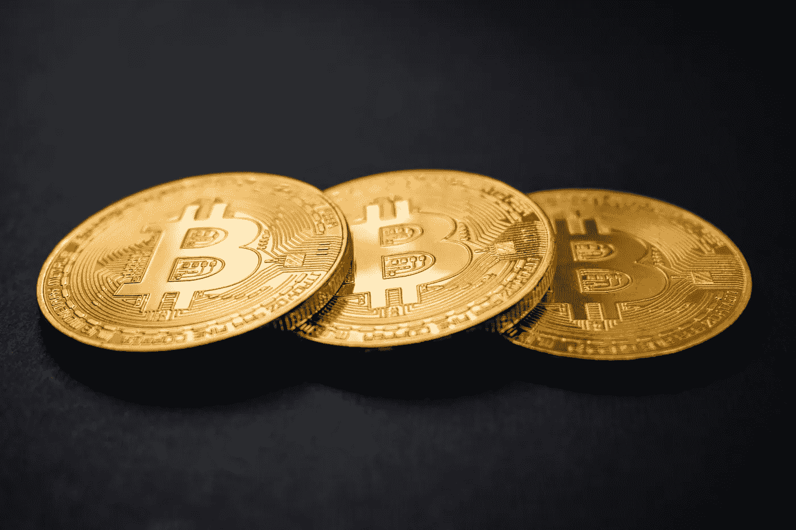

# 黄金优于比特币的 11 个理由

> 原文：<https://medium.datadriveninvestor.com/11-reasons-gold-is-better-than-bitcoin-814c07746d1b?source=collection_archive---------11----------------------->

Photo by [Dmitry Demidko](https://unsplash.com/@wildbook?utm_source=unsplash&utm_medium=referral&utm_content=creditCopyText) on [Unsplash](https://unsplash.com/s/photos/bitcoin?utm_source=unsplash&utm_medium=referral&utm_content=creditCopyText)

当世界经济陷入困境时，一些人转向加密货币比特币寻求金融安全。

但提醒一句:对于任何想拥有久经考验的资产的人来说，黄金仍然是更好的选择。

原因如下:

# 黄金作为财富的长期储存手段已有 5000 年的历史

比特币甚至没有百年的历史记录。

# **黄金总是有一个现成的、流动的市场**

即使在金融危机期间，当市场上其他证券刚刚枯竭时，你也可以轻松地买卖你的黄金。比特币是在 2008 年发明的，当时危机还未结束，所以在下一次危机到来之前，我们不知道它是否能真正通过这次考验。

# **黄金可以保护你免受核辐射**

众所周知，铅可以保护人类免受伽马射线的伤害。只要你有足够的黄金，黄金的效果和铅一样，甚至比铅更好。比特币不提供这种保护。

# **黄金更安全**

偷窃大量的金属会异常困难。行业标准的 400 盎司金条，在撰写本文时每根价值略高于 50 万美元，移动起来特别笨重。如果你有任何疑问，就去一个友好的金库，要求举起一根这样的金条。要带着 500 万美元潜逃，你需要移动 10 个这样的金锭，这对小偷来说很费时间。对于加密货币来说，窃取大额美元很容易，至少从快速浏览报道此类抢劫的新闻故事来看是如此。

 [## 加密货币行业是死是活？数据驱动的投资者

### 九月初，我们在 X-Order 内部就代币市场的未来进行了一场辩论。有趣的是，我们的观点是…

www.datadriveninvestor.com](https://www.datadriveninvestor.com/2019/12/12/will-the-cryptocurrency-industry-be-dead-or-alive/) 

# **可以把黄金当首饰戴**

比特币就没这么多了。

# **黄金是极好的电导体**

这就是为什么它被用于太空旅行的电子设备中。比特币不导电。

# **黄金从未过时**

绝不！用比特币很难说，只是太新了。

# **您无需网络连接即可使用您的金卡**

为了使用方便，你的比特币钱包需要互联网供你转账或消费。网站[Coinsutra.com](https://coinsutra.com/bitcoin-wallet/)更详细地解释了比特币的情况:“我只使用网络钱包来保存少量的比特币，类似于口袋里的钱包，用于日常交易。[……]我用桌面钱包来保存日常交易中不用的比特币。以便在任何需要的时候，我可以快速将我的桌面钱包连接到比特币网络，并转移比特币。”换句话说，网络是这个问题的重要组成部分。

# **黄金永不变色**

即使它已经在海底枯萎了几百年。从来没有。比特币也没有，不过话说回来，它不是金属。

# **黄金是春药**

我见过里面有金箔的香槟和上面撒有金箔的汉堡。没那么多，比特币。那大概是因为吃不到比特币吧。

# **“比特币还在实验中**”

那是根据 Bitcoin.org 的[说的。黄金就没那么多了。](https://bitcoin.org/en/you-need-to-know)

*这是 2017 年 9 月 5 日首次在 Forbes.com 上发表的一篇报道的编辑版本*