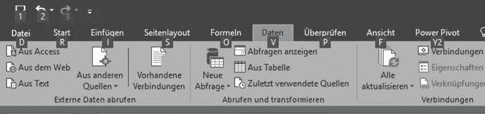

# 像顾问一样处理它的 11 个 Excel 小技巧

> 原文：<https://medium.datadriveninvestor.com/11-tiny-excel-tricks-to-crunch-it-like-a-consultant-1480e186f9c4?source=collection_archive---------15----------------------->

## 鲜为人知的 excel 绝招


Photo by [Timothy Dykes](https://unsplash.com/@timothycdykes?utm_source=medium&utm_medium=referral) on [Unsplash](https://unsplash.com?utm_source=medium&utm_medium=referral)

## 1.不到万不得已不要碰鼠标。

如果你按 alt，你会得到所有的快捷键。仅使用键盘导航。



## 2.前面的撇号帮助您保留公式，而无需执行它。

用它来写复杂的长公式，在你飘走一段时间的时候留住它。


## 3.扔鼠标和点击。

按 F2 进入编辑单元格文本模式。

## 4.使用&连接。

代替

```
=CONCATENATE(A1,”-”,B1"-”,C1)
```

去

```
 =A1&”-”&B1&”-”&C1
```

## 5.用 F4 来“重复最后一个动作”

用这个直到你的 F4 瓦解。粗线，颜色细胞，改变文字颜色，你的名字，F4 它。

## 6.不要动 Shift 和 Caps 键。

用小写字母键入你的公式。如果你写对了，它们会自动大写。你的手指可以自由地做正确的事情。

[](https://www.datadriveninvestor.com/2020/09/02/5-mindset-tips-to-make-you-a-better-marketer/) [## 让你成为更好的营销者的 5 个思维技巧|数据驱动的投资者

### 凭借 20 多年围绕品牌营销的企业和小型企业咨询经验，我逐渐认识到…

www.datadriveninvestor.com](https://www.datadriveninvestor.com/2020/09/02/5-mindset-tips-to-make-you-a-better-marketer/) 

## 7.你必须知道的公式

VLOOKUP，左，右，修剪。

记住，你必须首先对 VLOOKUP 进行排序

## 8.如有疑问，请替换

如果您不确定单元格中有多少前导空格和尾随空格，请使用 substitute 函数而不是 trim 函数来删除所有空格。


侧边栏:使用 clean 删除所有不可打印的杂乱输出，保留 ASCII 文本。

## 9.如果您正在编写复杂的公式，请将它们记录在那里。

为公式编写文档添加

```
+N(“Your Documentation Here”) 
```

示例:


## 10.使用 F9，检查部分公式结果

首先，使用 f9 键要非常小心，因为如果您不选择公式的任何部分，它将会用结果值不可逆地替换您的公式。按 escape 退出调试模式。

也就是说，选择公式的范围，您将看到范围内的实际数字，而不是单元格引用。您将看到所选部分的结果，可用于评估您的配方。

## 11.如果你有一个德国键盘，我会给你额外的奖励。

alt gr +任意数字是自动超级脚本；)


5, alt gr+2

目前就这些。这是我的 [linkedin](https://www.linkedin.com/in/sruthi-korlakunta-7a5b80121) ，这是我的 [medium](https://sruthi-korlakunta.medium.com/) 个人资料。回头见！

## 访问专家视图— [订阅 DDI 英特尔](https://datadriveninvestor.com/ddi-intel)