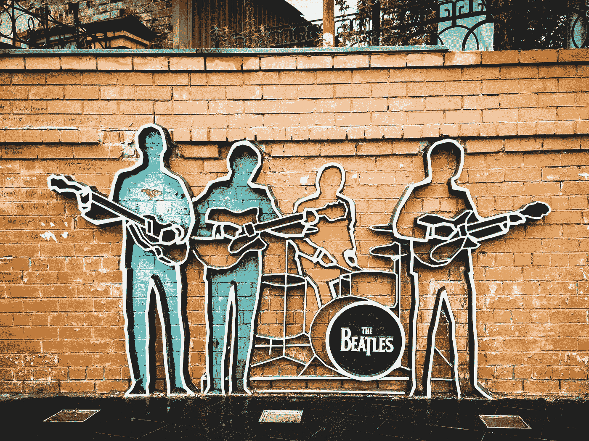

# 你可以从披头士那里得到 11 条关于创业的明智建议

> 原文：<https://medium.datadriveninvestor.com/11-wise-advice-for-entrepreneurship-you-can-take-from-the-beatles-7e040f525a89?source=collection_archive---------23----------------------->

## 向大师学习是人生的关键！

Photo by [Fedor](https://unsplash.com/@fmdevice?utm_source=unsplash&utm_medium=referral&utm_content=creditCopyText) on [Unsplash](https://unsplash.com/s/photos/beatles?utm_source=unsplash&utm_medium=referral&utm_content=creditCopyText)

# 我喜欢音乐。

我在很小的时候就开始现场演奏音乐。我迷上了 60 年代和 70 年代，虽然我是一个 80 年代和 90 年代的人。父母的影响是无穷的…

我记得在我只有 5、6 岁的时候，我就开始听披头士的歌，从未停止过。作为一个非英语母语的人，我用披头士乐队来提高我的英语，从那以后，他们的歌成了我生活的一部分。

> 我的生活建立在创业的基础上。

我成了那些创建公司却不知道如何开始的疯子之一。我想我们大多数人都是这样开始的。

> 在这篇文章中，我将与你分享我在这个始于 2002 年的奇妙旅程中所学到的一些经验，希望它们能有所帮助，并为你节省时间或避免犯错误，至少是我犯的那些错误。

每一课都与披头士的一首歌有关，因为你与一个想法联系得越多，你就越能记住它。也因为他们值得这份敬意。

# 让我们开始吧！

## [1。生命中的一天](https://www.youtube.com/watch?v=usNsCeOV4GM)

生命中的一天，你会站起来说:“我的生命毫无意义”。

# 那是一切的开始。

*   你不喜欢你的工作。
*   你读到了其他拥有非凡人生的企业家(要小心，因为不是所有的事情都是如此甜蜜)。
*   你觉得你在浪费时间。
*   你觉得你可以成为更好的自己。
*   你需要给这个世界[【一些东西】](https://www.youtube.com/watch?v=UelDrZ1aFeY)。
*   …

## [2。钱(这就是我想要的)](https://www.youtube.com/watch?v=CeWjEYhk7Xo)

这是每个人都需要的，即使你不是企业家。

不要惊慌。我们大多数人白手起家，根本没有钱。

> 我甚至没有车库，如果你想创建一个成功的公司，这似乎是强制性的。

也许这样更好，因为这样你才会关注你投资的每一分钱。

*   你不会在愚蠢的事情上赔钱。
*   你将独自做许多事情。
*   你会学到新的东西。
*   你会开始成为更好的自己。

 [## 不见面就做交易？风投和企业家的 5 个指南|数据驱动…

### 自从 covid 六个月前登陆美国以来，全球的风险投资家和企业家都不得不适应新的现实…

www.datadriveninvestor.com](https://www.datadriveninvestor.com/2020/09/20/doing-deals-without-meeting-in-person-5-guidelines-for-vcs-and-entrepreneurs/) 

## [3。亲爱的普鲁登斯](https://www.youtube.com/watch?v=wQA59IkCF5I)

衡量你的风险。

> 不要潜入黑暗的水域。

你可以跳进一个池子里，因为创业是要冒一些风险的，但至少要确保里面有一点水。

随着时间的推移，你将学会在浅水中游泳。

## [4。在朋友们的帮助下](https://www.youtube.com/watch?v=0C58ttB2-Qg)

你会孤独，被误解。

许多人(甚至你的家人)会认为你错了，你疯了，你在浪费你的生命。

> 请不要责怪他们。他们永远不会理解你。他们缺乏信息。

你的感觉是你的。他们在内心深处。向别人解释它们并不容易。

无论如何，试着与朋友交谈，分享你的感受、失败、疑惑，以及你小小的胜利。

一切都是为了减轻压力。

## [5。你需要的只是爱](https://www.youtube.com/watch?v=4EGczv7iiEk)

热爱你所做的事情。对他人的爱。

与客户、供应商、自由职业者、员工、任何人分享你的爱。

> 你表现出越多的爱，别人就会越爱你。

我们都想被爱，做你喜欢的事情会让你的生活有意义。

感觉等于动力。动机等于行动。行动等于结果。结果等于生存。

## [6。一周八天](https://www.youtube.com/watch?v=kle2xHhRHg4)

做好努力的准备，朋友。

对于一个企业家来说，时间不够用。你总是需要更多。

> 别担心。如果一周有 8 天，你将需要 9 天。

故事就是这样发展的。

不要抱怨。别担心。你越早接受这一点，你的项目就越能顺利进行。

如果你想简化的话，事情很简单！

## [7。每一件小事](https://www.youtube.com/watch?v=jrDikOz8YSU)

每一件小事都很重要。

注意细节。

他们是差异化的拥有者。他们会让你出人头地。

你会找到你的利基，你真正的市场附加值。这就是好处所在。

## [8。山上的傻瓜](https://www.youtube.com/watch?v=wsRatIMUSu8)

那就是你很多天都会有的感觉。

这是流程的一部分:

*   我做得对吗？
*   这方便吗？
*   我要去哪里？
*   也许每个人都是对的，而我错了？
*   …

> 艰难的处境。解决方法:继续工作。

忘记你的想法。别听它的。不安全感是企业家精神的一部分。

即使你失败了，你也会变得更加自信。这对生活是如此重要！

## [9。我们可以算出来](https://www.youtube.com/watch?v=Qyclqo_AV2M)

事情会失败。你会犯错的。一切都不会像你想象的那样。

像我这样的完美主义者说这些。对了，在这里找[“如何和一个完美主义者(我自己)过 24 小时并活下来”](https://medium.com/datadriveninvestor/how-to-live-24-hours-with-a-perfectionist-myself-and-survive-d48d601f418e)。

> 你必须认为一切都可以解决。

做好犯错的准备。一旦失败出现在你的门前，你就要准备好思考解决方案。

> 人生短暂，没有时间大惊小怪和争吵，我的朋友
> 
> —甲壳虫乐队(“我们能解决”歌词)

[**10。**](https://www.youtube.com/watch?v=8Zeyej5bfZE)
做好受苦的准备。

你会痛苦的。

这是旅程的一部分。

> 血、汗和泪。这就是企业家精神。

苦难会让你变得更强大。再次，表现出更好的自己。

哭吧。不要感到尴尬。你必须处理不公平的情况。

市场不会关注你。人们不会欣赏你所有的努力，所有的牺牲。

别担心，迟早你会朝着更好的歌前进的。

相信我的话。

## [11。像鸟一样自由](https://www.youtube.com/watch?v=ODIvONHPqpk)

别管钱了。

忘掉公众认可吧。

忘记闪光和福尔贝的封面。

> 自由是答案。这就是你决定开始这次旅行的原因。

你将决定你的时间投资在什么上。

你将决定你的下一个“任务”是什么。

你将成为自己生活的主人。

自由是无价的。

我们只有一次生命。我确实喜欢免费的。

## 外卖食品

每首歌旁边都有链接。

当我写这篇文章的时候，我听了他们所有人(再一次)。

> 每当我听这些家伙的时候，我的头发总是竖起来。

我笑着，哭着，感觉自己还活着。

它激励我走得更远，克服障碍，享受生命中的每一刻(就像为你写这篇文章)。

> 甲壳虫乐队是“创造内容”的最高概念。

让人们感受到这种感觉是无价的。这是一个人所能渴望的最高感觉。

> 非常感谢林戈、乔治、保罗和约翰。

在人类最关键的旅程中，你们是无与伦比的旅伴:他的生命。

## 访问专家视图— [订阅 DDI 英特尔](https://datadriveninvestor.com/ddi-intel)