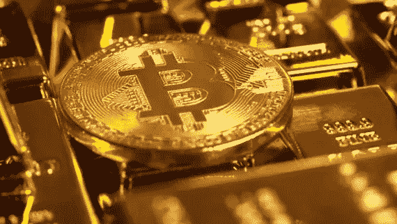
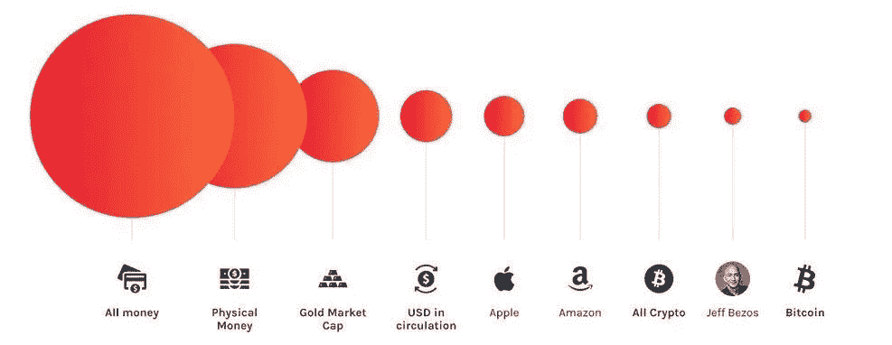

# 12000 美元的比特币和 2000 美元的黄金又回来了，而且还会继续存在

> 原文：<https://medium.datadriveninvestor.com/12-000-bitcoin-2-000-gold-are-back-here-to-stay-756d4a3632a5?source=collection_archive---------6----------------------->

**比特币案例。**

比特币继续获得机构巨头的关注。前保诚金融首席执行官乔治·鲍尔(George Ball)建议富裕的投资者收购比特币。他在视频电话采访中解释说:

> 我以前从来没有这样说过，我一直是区块链、加密货币和比特币的反对者。但如果你现在看看，政府不可能永远刺激市场，流动性泛滥将会结束。

他把自己描述为一个皈依者，在这一点上，他是一个怀疑论者，但现在明白了资产的用途。他关注的是刺激之后。正在使用的债务必须偿还或重组，他担心政府会采取什么措施来减轻负担。

> “他们会提高那么高的税收吗？如果不会，他们会印钞票吗？如果他们印钞票使货币贬值，甚至可能使通货膨胀保值债券(TIPS)受损，”

在外界的大力支持下，我们看到过去几个月的高交易量就不足为奇了。截至 8 月 17 日，比特币找到了 12200 美元的支撑，波动性比一周前重新进入时小。

 [## 比特币 2025 年路线图|数据驱动的投资者

### 在这篇文章中，我将准确地描绘出我对未来几周、几个月和几个月比特币价格走势的看法

www.datadriveninvestor.com](https://www.datadriveninvestor.com/2020/05/26/bitcoin-roadmap-to-2025/) 

其他新闻，比特币已经超过了 T2 美洲银行 T3 的市值。根据 fiatmarketcap 的数据，比特币的价值已经超过新西兰流通的所有货币，在世界货币中排名第 34 位。

随着越来越多的国家抛售美元进行替代投资，美元继续走弱。有了这些消息和乐观情绪，我们可以相信该行业将继续增长，因为它仍处于起步阶段。

**俄国抛弃美元**

俄罗斯现在从对中国的出口中获得的欧元多于美元。弗拉基米尔·普京总统已经签署了一项承诺，减少对美元的依赖。俄罗斯是通过接受欧元而不是美元来实现出口的。俄罗斯银行(Bank of Russia)的数据显示，欧元在对欧盟出口中所占的份额从去年年底的 38%升至 43%。这对欧盟来说是个好消息，但对美国来说却是个坏消息。

此外，中国继续谴责美元，称其为“危机的种子”。他们指责美联储由于他们的大规模刺激而将世界推向另一场金融危机。中国银监会主席郭树清一直在批评其他发达国家支持美国，支持他们将中国公司和实体列入黑名单。

**表壳为金色。**

> “我错了”
> 
> 沃伦·巴菲特

当代最有影响力的投资者之一沃伦·巴菲特对美国经济下了大赌注。他长期以来一直批评黄金，尤其是比特币。然而，Berkshire Hathaway 在出售富国银行(WFC)和摩根大通(JPM)股票的同时，收购了 2100 万股 Barrick Gold 股票。做出这种举动很能说明奥马哈先知对这个国家未来的看法。巴菲特一生中经历了许多繁荣和萧条，但现在他认为我们正迎来一个转折点:

> “这可能是我在经济学中见过的最有趣的问题，你能继续做我们现在正在做的事情吗……我们可能会面临一个时期，在这个时期，我们将测试你能继续做下去的假设”

这让许多黄金爱好者和比特币传播者兴奋不已。那些一直鼓吹金融体系崩溃的人可能只是看到了金融体系崩溃的那一天。

参考

1.  [https://news . bit coin . com/former-prudential-financial-CEO-George-ball-says-now-time-to-buy-bit coin/](https://news.bitcoin.com/former-prudential-financial-ceo-george-ball-says-now-time-to-buy-bitcoin/)
2.  https://fiatmarketcap.com/
3.  [https://Twitter . com/gold telegram _/status/1294779953246900225？s=20](https://twitter.com/Frank_Giustra/status/1294755272351576066?s=20)

**访问专家视图—** [**订阅 DDI 英特尔**](https://datadriveninvestor.com/ddi-intel)