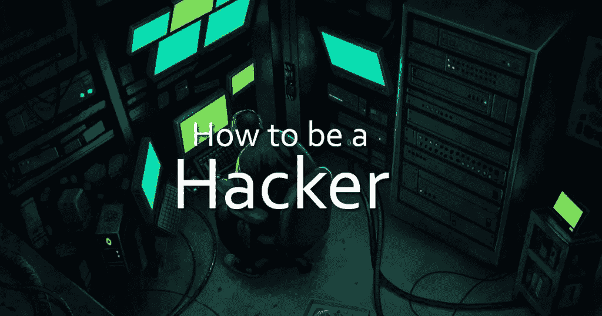

# 2023 年成为黑客的 12 个简单步骤

> 原文：<https://medium.datadriveninvestor.com/12-easy-steps-to-become-a-hacker-in-2020-20bcf9d6d3f2?source=collection_archive---------2----------------------->

Photo by [Kaur Kristjan](https://unsplash.com/@badgerblack?utm_source=medium&utm_medium=referral) on [Unsplash](https://unsplash.com?utm_source=medium&utm_medium=referral)

黑客是这十年来最热门的职业之一，但不要让它成为一件容易的事情。你必须对计算机系统、编程语言和操作系统有深入的了解。有些人认为黑客攻击永远是违法的事情，但他们错了。其实很多大公司都是高薪聘请黑客来保护自己的系统和信息。我准备了一份清单，列出了成为一名黑客所需要的 12 个最重要的步骤，并有了深入的了解。

## 1.学习 UNIX / LINUX

UNIX / Linux 是一个开源操作系统，提供了更好的安全计算机系统。它最初是由美国电话电报公司·贝尔实验室开发的，并为安全领域做出了巨大贡献。你应该在你的桌面上安装免费开源版本的 LINUX，因为不学习 UNIX / LINUX 是不可能成为黑客的。

## 2.C 语言编程

UNIX / LINUX 操作系统是用 C 语言开发的，所以在 UNIX / LINUX 操作系统中使用 C 语言比其他语言更有优势。C 语言是由 Dennis Ridge 在 20 世纪 70 年代末开发的。要成为一名黑客，你应该掌握 c。

3.学习多种编程语言

学习黑客领域的多种编程语言很重要，比如 Python，JAVA，C ++。

## 4.学习网络概念

成为一名黑客的另一个重要步骤是擅长网络概念，了解网络是如何创建的。你需要了解不同类型的网络之间的差异。你必须清楚地了解 TCP / IP 和 UDP。了解局域网、广域网、虚拟专用网和防火墙也很重要。

 [## 2019 年最值得学习的编码语言|数据驱动的投资者

### 在我读大学的那几年，我跳过了很多次夜游去学习 Java，希望有一天它能帮助我在…

www.datadriveninvestor.com](https://www.datadriveninvestor.com/2019/02/21/best-coding-languages-to-learn-in-2019/) 

您必须学会使用 Wireshark、NMAP 等网络工具进行数据包分析、网络扫描等。

## 5.学习多种操作系统

黑客学习多种操作系统至关重要。除了 Windows，UNIX / LINUX 等还有很多其他的操作系统。，每个系统都有漏洞，黑客需要利用这一点。

## 6.学习密码学

要成为一名成功的黑客，你必须掌握密码的艺术。加密和解密是黑客的重要技能。加密广泛应用于身份验证、机密性和数据完整性信息系统安全的几个方面。网络上的信息以加密形式传输，如密码。当入侵一个系统时，这些加密的代码需要被解密。

## 7.了解更多黑客技术

学习黑客领域专家写的各种教程和书籍。在黑客领域，学习是无止境的，因为系统中的安全更新每天都在变化。

## 8.多重实践

学了一些概念后，坐下来练习。为自己的实践设定目标。你需要一个配有一些工具的好的计算机系统，可能还需要一个强大的处理器，RAM 等。，不断的测试学习，直到你进入系统。

## 9.编写易受攻击的程序

漏洞就是它进入系统的门。通过扫描系统、网络等。，试着自己写程序，用系统找漏洞。

## 10.推广开源安全项目

一个开源的计算机安全项目可以帮助你锻炼和测试你的黑客技术。一些组织如 Mozilla、APACHE 提供开源项目。贡献或成为其中的一部分，即使你的贡献很小，对提高你的领域也会有很大的价值。

## 11.无尽的学习

在黑客世界中，学习是成功的关键。不断的学习和实践，让你成为最好的黑客。请继续关注安全更新的变化，并了解入侵系统的新方法。

## 12.参与讨论和交流

对于一个黑客来说，最重要的事情是参加一个社区或论坛，与世界各地的其他黑客讨论，分享他们的知识，并为一个团队工作。