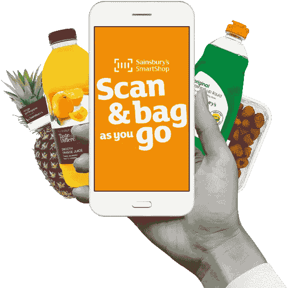
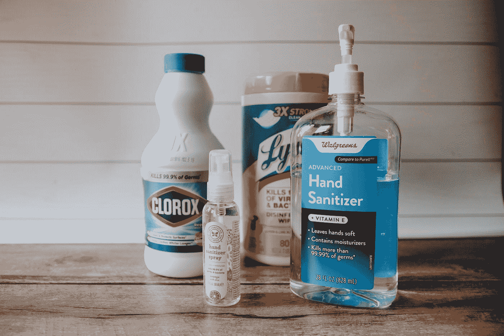
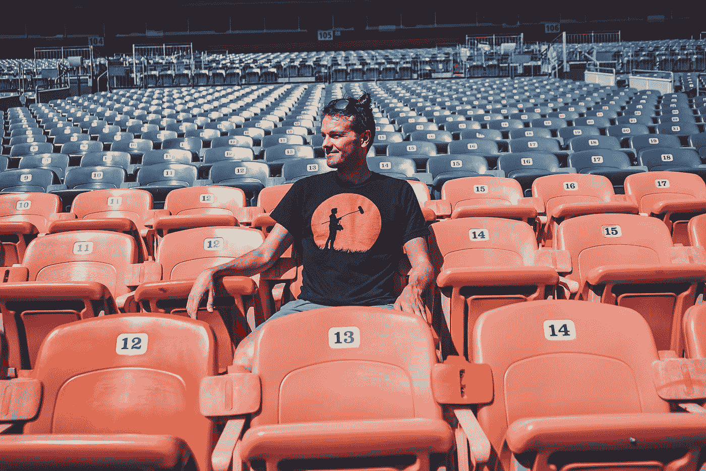
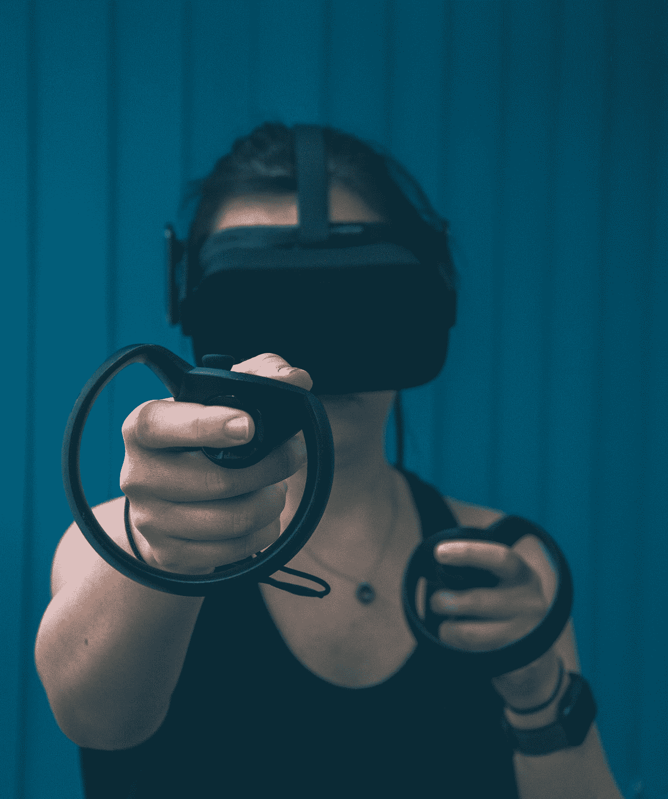
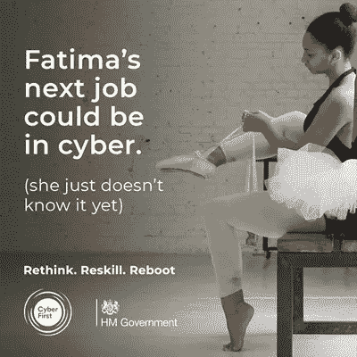

# 现在你可以利用的 12 个关键商业趋势

> 原文：<https://medium.datadriveninvestor.com/12-key-business-trends-emerging-from-the-global-pandemic-e3289d1aed29?source=collection_archive---------2----------------------->

## 新趋势正在出现，您现在可以利用它们

你是否在寻找关键的商业和消费者趋势，以此来启动或发展你的业务？

在全球化的疫情中，寻找你可以利用或从中获得灵感的新机会？

当前的不确定性、混乱性和波动性的气候——尽管带来了痛苦和毁灭性的金融、经济和个人影响— **可能是有史以来推出新企业的最佳时机之一**。

如果你能适应并“滑向冰球要去的地方”，那就是。

> 2020 年很可能代表着经济将经历的最重要的重置之一——slide bean 的首席执行官[卡亚](https://medium.com/u/49c6156c7516?source=post_page-----e3289d1aed29--------------------------------)

## 因此，我编制了一份清单，列出了一些关键趋势，可能会帮助你在今年启动或引导你的业务走向一个新的方向。

# #1:在线职业和商业辅导

Photo by [Green Chameleon](https://unsplash.com/@craftedbygc?utm_source=medium&utm_medium=referral) on [Unsplash](https://unsplash.com?utm_source=medium&utm_medium=referral)

随着社交距离限制的到位和办公室的关闭，对在线职业建议、咨询和更广泛的商业辅导的需求激增，这为在这些领域提供服务的教练提供了新的机会。

全世界客户的新期望是，教练将主要通过在线渠道提供。

这让教练们**在规模和数量上都有所增长，**随着市场成为一个全球性的市场。

他们不再局限于在能够到达的地理区域运营，也不需要亲临现场提供服务。

此外，由于办公室工作人员现在远程工作，更多的时间可以分配给个人发展和教练。员工不再需要通勤上班，而是希望继续投资自己。这包括首席执行官级别的高管。

最后，员工和企业主在全球疫情期间保持职业和个人生活最佳状态所需的弹性、思维敏捷度和韧性得到了增强。

这导致在这一领域对有针对性的教练服务的潜在更高需求。

除了提供教练这一服务本身，新的和创新的在线平台也有提供个性化建议的空间。

这可以利用人工智能技术，或者采取在线自助服务工具的形式作为额外的服务。

# #2:在线健身培训和社区

Photo by [Sebastian Pociecha](https://unsplash.com/@sebastianpoc?utm_source=medium&utm_medium=referral) on [Unsplash](https://unsplash.com?utm_source=medium&utm_medium=referral)

由于疫情，数字健身一直在增长，而实体健身房和健身俱乐部行业已经暂停。这也影响了面授课程和个人培训课程。这种趋势将会持续下去，因为用户们已经形成了**现在已经根深蒂固的习惯**，在过去的 9 个月里，他们一直在家锻炼。

随着健身房开始重新开放，顾客可能不愿意回到物理环境，而是坚持他们的新习惯。尤其是如果他们订阅了帮助他们达到健身目标的定制计划。

这不仅解决了健身爱好者的问题，也解决了通常不倾向于健身活动的人群的问题。他们越来越多的久坐不动的生活方式促使他们对自己的健康做些什么，他们可能会进入市场。

这种趋势的一些例子包括 HomeCourt 应用程序，它在几周内就跃升为 Iphone 免费体育应用程序的榜首，以及 Techne Futbol。然而，这一趋势涵盖了所有类型的锻炼和训练追求。

通过引人注目的网站、应用程序和社交媒体来推销其训练计划和在线课程的运动员可能会受益。在这个领域可以做些什么的一个很好的例子是[克里斯·赫里亚](https://heriapro.com/programs)，围绕在线锻炼、商品销售和社区建立一个强大的品牌。

那些提供模仿真人课堂精神的**点播课程的人也可以利用这个机会。他们可以创建一个狂热粉丝的社区，一旦限制解除，他们将坚持这种锻炼方式，而不是回到健身房。**

以前可能对参加体育锻炼或现场课程感到不舒服的整个人群，将对这些选择更加开放。因此，数字课程的市场甚至可能进一步增长，课程甚至可以为这些观众量身定制。

人们可能还会怀疑，随着可支配收入中用于外部娱乐和度假的部分越来越少，消费者可能会愿意在健身和一般健康方面花费更多的钱，比如购买家庭健身设备、培训课程和材料等。

面向家庭锻炼的设备制造商和经销商也可能成为疫情的赢家，这些设备重新创造了竞争精神，甚至通过 VR 和 AR 技术带来沉浸式体验。

Peloton 在 9 月份首次公开募股后 250 亿美元的市值就是一个例子(而健康、健身和福利行业本身每年的价值超过 4 万亿美元)。

其他的，如 [Mirror](https://www.mirror.co/) (“几乎看不见的互动家庭健身房”)或 [Virzoom](https://www.virzoom.com/) 都在效仿。

前者特别有趣，因为它解决了在没有教练在场的情况下，不知道一个人是否以正确的形式或技术正确地表演动作的问题。后者创造了一个模拟真实世界的沉浸式环境。随着技术的进步，这种解决方案的准确性和沉浸性必然会提高。这甚至可能演变成超越核心视觉元素的多感官体验、**、**。例如，将触觉或嗅觉融入其中。

**健康服务的提供者&健身项目、应用程序以及设备制造商**可能会从疫情创造的环境中受益，以及在保持健康方面如何影响人们的生活。

随着居家工作者越来越意识到缺乏运动对他们的健康构成威胁，对新的节食计划或体重控制方案的需求可能也会增加。

点击，你可以找到[精选的一些顶级家庭健身应用。](https://www.tomsguide.com/uk/best-picks/best-workout-apps)

# #3:本地社交网络和社区

Photo by [Breno Assis](https://unsplash.com/@brenoassis?utm_source=medium&utm_medium=referral) on [Unsplash](https://unsplash.com?utm_source=medium&utm_medium=referral)

随着越来越多的人躲在家里，对当地支持的需求可能会增加，对社区意识的需求也会增加。特定的细分人群(如老年人或有健康问题的人)可能更看重这一点。

在线工具和平台将特定地区寻求本地帮助或服务的用户联系起来，如 [Nextdoor](https://medium.com/u/338fda763c89) 可以从中受益。它与沃尔玛合作推出了一个睦邻援助项目，这显示了人们的兴趣。

**脸书**也打算利用这一需求，推出目前正在测试的[全新“邻里”功能](https://techcrunch.com/2020/10/21/facebook-is-working-on-neighborhoods-a-nextdoor-clone-based-on-local-groups/?guccounter=1&guce_referrer=aHR0cHM6Ly93d3cuZ29vZ2xlLmNvbS8&guce_referrer_sig=AQAAAMyVtpcypt7Z7GWPdiLXZAnN59bhHLqQwb3fBE0Mi42e8CT9h552s5T3-_ieqx8BoD2cw0EttTzddiSFET99zxVuA1MX7Pr_EpdFszUtJKMZdl9gxCzAQnh_Qr_coMrvKQ3m32i2GARRFEPDHQvKd2VU1jQpfbJmL664S7XeNAvW)。它将提供类似的服务，允许用户根据他们居住的地方进行连接。

# #4:基于兴趣的数字社区

Photo by [Obi Onyeador](https://unsplash.com/@thenewmalcolm?utm_source=medium&utm_medium=referral) on [Unsplash](https://unsplash.com?utm_source=medium&utm_medium=referral)

随着越来越多的人花更多的时间在网上，允许他们聚集在共同兴趣周围并进行对话的平台会蓬勃发展。

品牌甚至可以利用这个机会，通过**在他们服务的市场或利基市场创造利益中心。**他们可以开展用户主导的对话，以发现趋势或进一步改进他们的产品和服务(消费者主导的创新)。

这种平台可以针对非常具体的利益。例如，企业可以利用 Twitter 或 Reddit 等社交媒体上的热门话题，并围绕这些话题创建社区。

# #5:增强远程工作的新工具

Photo by [Corinne Kutz](https://unsplash.com/@corinnekutz?utm_source=medium&utm_medium=referral) on [Unsplash](https://unsplash.com?utm_source=medium&utm_medium=referral)

随着大多数组织的办公室工作人员远程办公(英国国家统计局的一项[调查](https://www.ons.gov.uk/employmentandlabourmarket/peopleinwork/employmentandemployeetypes/articles/technologyintensityandhomeworkingintheuk/2020-05-01)显示，到 4 月份，英国一半的活跃人口在家工作)，协作、团队工作、会议和生产力工具的市场是巨大的，帮助疲惫的员工和父母在这段时间保持精神健康和生产力的工具和技术也是巨大的。

围绕现场工作会议、问题解决和头脑风暴提供功能的工具为**重新创建现场团队合作/工作会议环境**(甚至增强它)提供了有价值的解决方案。

例如，[壁画](https://www.mural.co/)就是这样一个工具，它为各种用途提供了[广泛的模板](https://www.mural.co/templates?template-categories=all-templates&utm_source=adwords&utm_medium=ppc&utm_campaign=tempsuper&hsa_src=g&hsa_ver=3&hsa_ad=468237842395&hsa_mt=b&hsa_cam=2061087301&hsa_tgt=aud-978560006360:dsa-437115340933&hsa_acc=9046011228&hsa_net=adwords&hsa_grp=110300560016&gclid=Cj0KCQjwxNT8BRD9ARIsAJ8S5xaHwJ0fWcqQfmfu7PFu7MpOthuuDpKzPpSbieDX4d6vrqG-aHF89s4aAj52EALw_wcB)(从思考板和构思，到研讨会和冲刺规划，一直到用户故事映射、业务画布等)。).Miro 提供了一个类似的平台，拥有令人印象深刻的[模板库](https://miro.com/templates/)！

在各种规模的组织中，变革的步伐都在加快。帮助团队交付项目和变更计划的工具也是这个领域的领导者。例子包括[体式](https://asana.com/)或【Monday.com】T2。

展望未来，看到新兴平台和功能将**的远程工作带入下一个阶段将会很有趣。**这可能意味着:

*   **增强的“办公”环境** ( [微软团队的合作模式](https://news.microsoft.com/innovation-stories/microsoft-teams-together-mode/)就是一个例子)。物理和数字模糊之间的界限，也许由人工智能和/或虚拟现实技术支持。想象一个“真实”的办公室，你可以戴上一副虚拟现实眼镜潜入其中，与现实生活中的同事(或他们选择的化身)进行交流！
*   **额外的协作功能**可使团队合作更加有效；甚至比在现实环境中更有趣
*   **团队成员和员工建立关系网的方式**，创造即时会面和交流想法的机会，超越他们直接团队或实际工作角色的职权范围(想想类固醇的数字午餐)。没有了更多的实体存在，融入工作空间，员工如何扩展他们的网络，为自己和团队创造新的机会？

对于进入**的人来说，也可能有机会围绕远程工作整合端到端价值链。**这将简化环境，让团队和组织不必为有效工作而设置和投资大量工具、应用和订阅。

# #6:网络平台的崛起

Photo by [Brooke Cagle](https://unsplash.com/@brookecagle?utm_source=medium&utm_medium=referral) on [Unsplash](https://unsplash.com?utm_source=medium&utm_medium=referral)

在更个人化的层面上，像午餐俱乐部(Lunchclub)这样根据个人背景和兴趣建立相关的个性化联系的网络应用可能会因为疫情而激增。随着更多的时间呆在家里，人们有更多的时间和更高的愿望去结交新的朋友。

人类是群居动物，那些希望扩大个人和专业网络的人会重视这样的平台。

# #7:会议和峰会走向虚拟化

Photo by [The Climate Reality Project](https://unsplash.com/@climatereality?utm_source=medium&utm_medium=referral) on [Unsplash](https://unsplash.com?utm_source=medium&utm_medium=referral)

除此之外，随着实体会议、圆桌会议和其他活动的暂停，对于[新的数字平台来说，这是一个实现类似会议的体验的重要机会](https://www.mightynetworks.com/virtual-conference-platforms)。

解决方案**重现了参加活动**的一些核心要素(例如能够参观供应商展台、观看产品演示和与代表交谈)，在这方面可能有很大优势。

这种解决方案将连接全球各地的演讲者和提供商，将他们聚集在一个虚拟平台上，客人可以探索和互动。这可以利用虚拟现实和增强现实技术的使用。

# #8:无摩擦结账和支付方式

从 2016 年的亚马逊以及该领域的其他几个技术解决方案开始，人们越来越关注**，以限制实体客户旅程中的“摩擦”。**

从疫情对更加**卫生和无接触环境的需求**开始，随着现金使用的急剧下降，无摩擦的结账和支付方式激增。

像 Co-op 这样的零售商(他们的[‘通道支付’技术](https://www.trendhunter.com/trends/ukbased-grocer-coop)目前正在进一步推广)正在完善和扩展他们在这一领域的客户产品。Sainsbury's 本月[宣布](https://www.thegrocer.co.uk/sainsburys/sainsburys-to-roll-out-smartshop-to-all-stores/649222.article)将扩展其[智能商店](https://smartshop.sainsburys.co.uk/)解决方案的部署。该解决方案已经在 250 家便利店中提供；在一些现场销售的商店中，销售额超过 50%。

> “使用非接触式支付，如卡，占交易的 50%以上。疫情只是在加速这种零售进化，需要店内空间来帮助限制面对面互动的次数。”

From [https://smartshop.sainsburys.co.uk/](https://smartshop.sainsburys.co.uk/)

无论是在 it、零售还是其他领域，能够以客户为中心设计体验的技术提供商都可以利用这个不断增长的市场。

# #9:重新关注卫生

Photo by [Kelly Sikkema](https://unsplash.com/@kellysikkema?utm_source=medium&utm_medium=referral) on [Unsplash](https://unsplash.com?utm_source=medium&utm_medium=referral)

对更卫生产品的需求可以告知消费品公司、品牌和制造商的渠道。这可能包括以下产品:

*   **让卫生变得更简单，让所有人更容易获得**。包括世界上欠发达地区，在这些地区，这种产品的供应和可用性是一个真正的挑战
*   **将卫生嵌入产品设计和制造过程**本身。例如，通过移除包装或以限制物理接触点的方式进行设计
*   **带来新的配方或用途，使卫生在日常生活中更加普及**,或找到影响行为的方法，以获得更好的卫生习惯

全球顶级消费品组织利洁时(Reckitt Benckiser)早在 7 月份就宣布投资 2500 万美元建立新的全球卫生研究所。

目标是建立科学伙伴关系，帮助设计和推出新产品，并影响公众的卫生行为:

> “我们认为需要一种新的模式，将最高质量的科学证据和明智的公共卫生建议结合起来，以**为更清洁、更健康的世界带来大规模的行为改变”**
> 
> ——利洁时首席执行官拉克斯曼·纳拉西姆汉

能够带来这种急需的行为改变，或者设计新产品以使卫生最佳实践在整个社会更容易获得和普及的公司和解决方案，可以对未来的世界产生重大影响，并在此过程中发展他们的业务。

# #10:沉浸式数字娱乐和体验

Photo by [Free To Use Sounds](https://unsplash.com/@freetousesoundscom?utm_source=medium&utm_medium=referral) on [Unsplash](https://unsplash.com?utm_source=medium&utm_medium=referral)

受疫情早期被困在家里的消费者的最初反应的推动，网飞的使用量飙升，在截至 9 月底的三个月里，又增加了 220 万用户。

虽然这种增长现在正在放缓(比预期的要慢)，但是对于一种更加沉浸式的、多感官的娱乐方式来说，T4 是有市场的。它将以消费者从未体验过的新方式结合视觉、听觉和动觉组件。

这种身临其境的体验已经被投入到体育产业中。例如，使观众能够体验足球、橄榄球或拳击比赛，就像他们自己在球场上或拳击场上一样。

因此，观众可以亲身体验这一事件，并感觉自己是其中的一部分。而且，随着未来技术的进步，可能几乎和玩家在同一水平线上。例如，2015 年美国高尔夫公开赛[就使用了虚拟现实 Oculus Rift 技术进行了直播。](https://www.geekwire.com/2015/i-watched-live-golf-with-a-virtual-reality-headset-and-it-was-amazing/)

当体育赛事暂停时，球迷和业余体育爱好者可能有机会在家舒适地体验他们最喜欢的球队的训练或全面的比赛。

比赛仍然可以进行，尽管是在空荡荡的体育馆里，但仍然会有成千上万的球迷在家观看比赛。虽然体验不会完全相同，但这可能会进一步刺激人们尝试虚拟现实技术，并保持行业的发展。

Photo by [Christine Sandu](https://unsplash.com/@lenscapewithme?utm_source=medium&utm_medium=referral) on [Unsplash](https://unsplash.com?utm_source=medium&utm_medium=referral)

VR 的兴起在游戏行业也能感受到，玩家可以充当主角。这同样适用于电子竞技世界。能够在虚拟现实技术上设计出令人兴奋的新奇体验的开发者可以**开创一个新的游戏领域**，这可能会吸引传统游戏之外的新观众。

# #11:不断更新技能的永无止境的需求

Photo by [matthew Feeney](https://unsplash.com/@matt__feeney?utm_source=medium&utm_medium=referral) on [Unsplash](https://unsplash.com?utm_source=medium&utm_medium=referral)

由于许多部门和整个行业都面临风险，工人们将需要重新培训和重新发明他们的技能，以及他们的个人*和*职业身份，以便能够在新的世界中茁壮成长(甚至生存)。

[尤瓦尔·诺亚·哈拉里](https://medium.com/u/8a6d8f1fc05c)在他的书《21 世纪的 21 个教训》中很好地描述了这一点。哈拉里解释了人们总是需要**对自己进行再投资，以跟上不断发展的市场，在这个市场中，新的职位、角色和整个行业可以在短时间内创造和毁灭。**

> “因此，即使有足够多的工作，人们也没有心理平衡和毅力来不断地接受再培训、重新掌握技能或重塑自我。”
> 
> 尤瓦尔·诺亚·哈拉里

最近的“反思。雷斯基尔。“重新启动”英国政府运动展示了这最终会是什么样子……尽管它在本月受到了强烈反对，但它确实描绘了在不久的将来可能需要的技能再培训。

除了传统“稳定”工作和行业的员工，这对企业家和企业主的影响同样令人生畏。

随着新模式的出现和取代旧模式，几年前建立的成功企业，正在成长和盈利，可能会在眨眼间崩溃。

熊彼特的“创造性破坏”背后的相同原则，应用于更广泛的全球经济和社会结构，将会全面展开。

熊彼特将这一过程描述为:

> 工业突变的过程，从内部不断革新经济结构，不断摧毁旧的结构，不断创造新的结构。
> 
> 约瑟夫·熊彼特

仅在美国就有超过三分之一的新工作岗位在一代人之前并不存在，而工业用机器人预计今年将超过 300 万个。机器人的使用案例也超越了传统的劳动密集型制造业角色。

根据【2020 年 6 月麦肯锡的一项调查，从欧洲的角度来看，令人震惊的 5100 万个工作岗位面临自动化的风险，而其中 2400 万个工作岗位是由于新冠肺炎的经济效应加上自动化范围的扩大造成的。

在这样的背景下，**需要出现新的教育模式**。与目前使用的“静态”学习方法完全相反，在生命的早期阶段(学习阶段)、中期阶段(积极劳动阶段)和最后阶段(退休阶段)之间有明显的区别，因为学习和提高技能将贯穿个人的一生。

以上内容为能够应对挑战的企业提供了三个有趣的机会:

1.  帮助员工**识别接下来可能发生的事情的“信号”**以及他们未来的角色可能涉及的内容。发现潜在趋势，这些趋势可能会影响行业以及某些角色或工作的未来相关性(或不相关性)
2.  为现有和新兴行业以及未来需要的角色的员工提供持续、终身学习和再培训的平台
3.  为员工和企业家部署方法和服务，以增强他们的心理弹性和敏捷性。帮助他们**应对不断的变化及其对他们自我认同和心理健康的影响**(这种需求无疑会因寿命和工作年限的延长而加剧)

# #12:食品可追溯性可能成为重中之重

Photo by [Rinson Chory](https://unsplash.com/@nessa_rin?utm_source=medium&utm_medium=referral) on [Unsplash](https://unsplash.com?utm_source=medium&utm_medium=referral)

随着病毒传播的最初来源可能与食品污染有关，围绕**食品可追溯性和来源**的敏感度将会提高。因此，人们对能够大规模实现这一目标的技术更感兴趣。

像[origin](https://medium.com/u/2cac22865e2f)这样的公司正在利用区块链技术将供应链带给购物者[。在垂直行业和供应网络中实施这样的解决方案，虽然是一个复杂的挑战，但可能会彻底改变我们所吃的东西从源头到餐桌的追踪方式。](https://www.provenance.org/)

通过在端到端供应链中产品转移和所有权变更的每个环节创建“数字握手”,供应链上的双方以及最终消费者可以对他们购买的食品的来源和安全性充满信心。

能够加速这种能力并推动其在更大规模上应用的解决方案，以及跨垂直行业的解决方案，可以带来更多的控制和更高的食品安全标准。进而限制未来食物传播病毒和疾病的风险。

好吧！这里有很多值得思考的趋势——也许其中一个会引发新的商业想法？**不要让 2020 年像又一年(谁会呢？)…取而代之的是，利用这些趋势来启动或引领你的企业走向新的方向。**

你认为对其他行业有重大影响的进一步趋势是什么？请在下面留下您的想法、评论和反馈！

现在，随着这样的信息和趋势不断出现，可能很难穿过噪音，缩小范围并在正确的机会采取行动。

你如何度过这个难关，采取真正的、有针对性的行动？**这将是** [**另一篇**](https://clementbourcart.medium.com/12-key-business-trends-emerging-from-the-global-pandemic-e3289d1aed29) **的重点——敬请关注！**