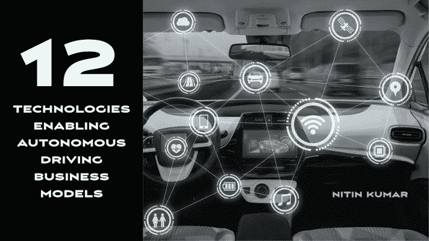
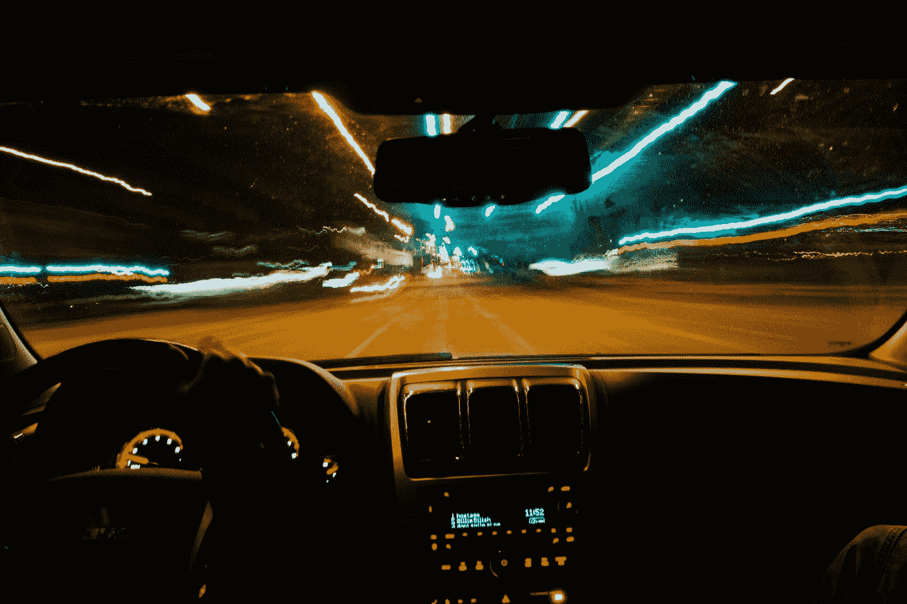

# 支持自动驾驶商业模式的 12 项技术

> 原文：<https://medium.datadriveninvestor.com/12-technologies-enabling-autonomous-driving-business-models-33088ba89474?source=collection_archive---------21----------------------->

Image created by author by Pixabay

*了解推动自动驾驶的颠覆性技术*

在我的[上一篇文章](http://www.forbes.com/sites/forbestechcouncil/2020/06/24/autonomous-driving-business-models-part-one/)中，我们讨论了商业模式的各种驱动因素，以及它将如何改变城市、道路、停车、通勤、休闲和所有权，同时创造新的就业机会。在第一部分的后续文章中，我们将探索更多由特定技术支持的商业模型。

# **5G 和边缘计算**

增强现实为自动驾驶创造了传感器支持的覆盖层。他们将在向第五级(即完全自治)的过渡中发挥重要作用。hud(平视显示器)、导航系统、个性化内容和安全功能为 AV 赋予了全息智能。增强现实可以以产品、服务或数据的形式货币化。

# **V2X(车辆对一切)**

实现自动驾驶等实时用例需要 5G 无处不在，并靠近消费点(例如，更高速度和更低延迟的边缘)。传统的电信运营商一直在 5G 方面进行大量投资，这将有助于他们通过订阅、使用和混合商业模式将数据、带宽和容量货币化。在远程位置提供边缘网络将创造新的商业模式。

# **区块链**

V2X 是车辆和万物之间的关键连接和通信层——人(V2P)、基础设施(V2I)和其他车辆(V2V)。它们可以实现自助停车、远程诊断、监控等服务。随着车辆位置、速度、路况和天气状况的即时数据共享，V2V 将是革命性的。新的市场和服务以及销售路线优先和基于条件的功能升级将成为潜在的商业模式。

# **人工智能和大数据**

区块链有潜力通过去中心化成为 AV 价值链内的生态系统粘合剂。用例以制造商、原始设备制造商和移动公司之间的合作为中心。区块链还可以在捆绑、存储和传输具有不变性和完整性的汽车数据方面发挥关键作用。其他使用案例围绕供应链或确保 V2X 干扰预防。区块链商业模式包括向 AV 价值链提供基础设施、可扩展性、安全性或强制执行作为服务。

# **智能传感器**

大数据和人工智能将嵌入自动驾驶汽车价值链的每个功能和方面。大数据从传感器、物联网、手机和 V2X 交互中收集信息。它还可以创建道路流量，用于缓解拥堵、诊断、市场、新应用程序、支持数据的即时功能，并使人工智能能够更快地学习。人工智能将通过应用于预测性维护、状态监控和即时 OTT 升级的机器学习来帮助实现大数据的货币化。人工智能将为许多事情提供动力，包括车内语音助手，通过眼球追踪和面部表情分析进行疲劳检测或分心。将有几个用例和商业模式通过情境人工智能和各种不同的车载、B2B、B2C 和生态系统级货币化选项(例如，安全、安保、娱乐、便利、新兴技术)来实现。

Photo by [Gabe Pierce](https://unsplash.com/@gaberce?utm_source=medium&utm_medium=referral) on [Unsplash](https://unsplash.com?utm_source=medium&utm_medium=referral)

# **虚拟现实**

智能传感器将在调节自动驾驶汽车的运行方面发挥作用。他们将从激光雷达、雷达、相机和其他传感器收集实时数据，以创建周围环境的远程安全视图。典型的业务模式将基于应用程序或 API 支持的大量数据和服务(例如，除尘、极端天气下增加的功能等。).

 [## 移动网络 O2 发布英国首个无人驾驶汽车实验室测试使用 5G 和…

### 随着时间的推移，技术越来越强大。我们不仅成功地登上了月球，我们现在…

www.datadriveninvestor.com](https://www.datadriveninvestor.com/2020/11/24/mobile-network-o2-launch-uks-first-driverless-car-lab-testing-driverless-cars-using-5g-and-satellite-technology/) 

# **电气化**

虚拟现实将改变汽车的美学和内部装饰，并为通勤增加理想的位置、氛围或活动。VR 可以让汽车内部看起来像办公室、健身房或度假胜地。虚拟现实还可以实现空间计算，这将发现许多不同的用例，根据用例从自动驾驶汽车本身、边缘或云中提取计算。围绕虚拟现实将有几种商业模式，并以各种不同的方式赚钱。

# **先进材料**

大多数(如果不是全部)自动驾驶汽车将是电动的。随着电池寿命和基础设施的发展，人们将看到新的商业模式，如能源即服务或电动汽车充电器即产品、平台、市场、服务或分时度假。车队级电气化将创造规模经济，并将降低维护和停机成本，使 MaaS(移动即服务)和 ARS(自主拼车)等商业模式成为主流。

# **高清贴图**

先进材料(即更轻、更安全、更坚固的材料)将是全球范围内自动驾驶的关键。从钢中迁移出来减少了消耗，创造了模块化，同时保持了重量和安全性。先进材料还将实现 3d 打印和增材制造，提高设计和组装效率。通过制造，商业模式将主要集中在原始设备制造商和供应商上。

# **电子控制系统**

标清地图和基于全球定位系统的转向都不起作用；因此，开发者寻求更高的精确度和准确度。精确度需要从道路水平发展到包括车道、拐角和路边位置水平。这些地图必须是三维的、计算机化的和高度详细的，需要高清晰度技术来使它们精确。高清地图可以通过多种方式实现货币化，包括订阅、使用、区域销售、一次性使用等等。

# **自我修复技术**

ECS 系统控制一个或多个电气系统或子系统。它们被嵌入到汽车中，并通过内置自动化来取代传统的机械功能，如制动、转向或换挡。人们可以探索在基本安全和舒适的基础上增加功能的商业模式。

# **结论**

汽车、基础设施和传感器产生的数据量和速度之大，将让人类难以记录、监控、报告和修复。范式将从事后操作修复转变为预防性和自主修复或组件和功能。由 ML 和深度学习实现的自主预防、检测和纠正系统将发挥作用。它们将通过原始设备制造商、保险价值链和基础设施提供商实现货币化。

自动驾驶价值链将包括多种技术、生态系统和利益相关者，甚至包括传统汽车制造商以外的利益相关者。随着这些技术嵌入自动驾驶价值链，它们中的许多技术正在以不同的速度发展。

# 其他相关条款:

1.[自动驾驶技术栈](https://medium.com/predict/the-autonomous-driving-technology-stack-f0b53ab08f99)

2.[自动驾驶:为什么大数据价值是一个神话](https://medium.com/datadriveninvestor/autonomous-driving-why-big-data-value-is-a-myth-584427b50f05)

3.[自动驾驶的七大数据挑战](https://medium.com/datadriveninvestor/7-data-challenges-in-autonomous-driving-e21d05dacc3a)

4.[七大自动驾驶商业模式](https://medium.com/datadriveninvestor/7-autonomous-driving-business-models-930cd4de6b86)

5.[支持自动驾驶商业模式的 12 项技术](https://medium.com/datadriveninvestor/12-technologies-enabling-autonomous-driving-business-models-33088ba89474)

6.[采用自动驾驶基础设施的途径](https://medium.com/the-innovation/pathways-to-adoption-for-autonomous-driving-infrastructure-676438a7aaa3)

【https://www.forbes.com】最初发表于**。**

## *访问专家视图— [订阅 DDI 英特尔](https://datadriveninvestor.com/ddi-intel)*