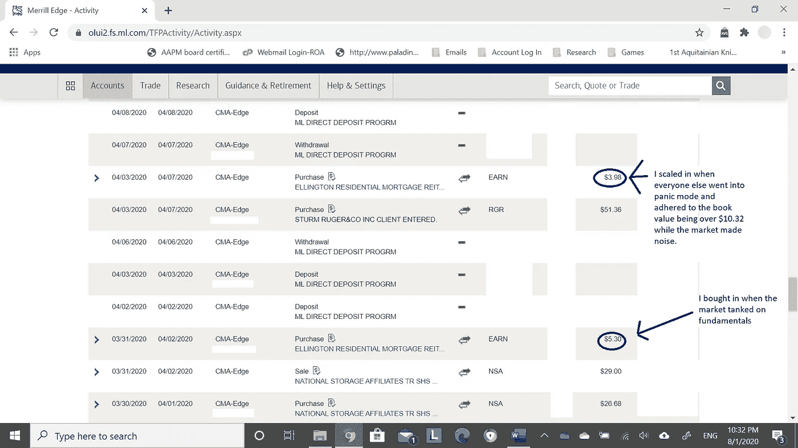
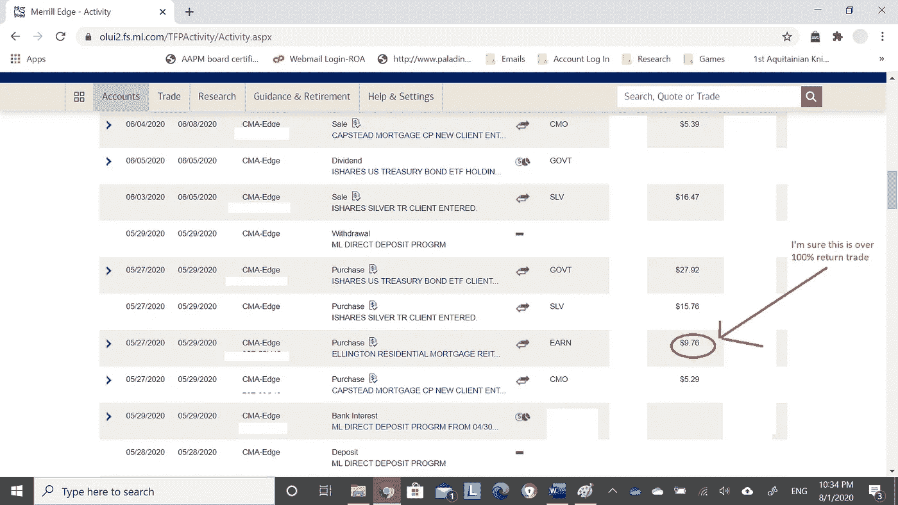

# 许多人亏损 120 天，但我盈利 120 天

> 原文：<https://medium.datadriveninvestor.com/120-days-of-loss-for-many-but-120-days-of-profit-for-me-37f5abcbb108?source=collection_archive---------6----------------------->

## 身体力行。事后回想起来很容易。预测结果几乎是不可能的。我做了一些人所谓的几乎不可能的事。

Source: Self Created Image with Canva

我很擅长打基本面的电话。你读过我的文章“利用市场羊群恐慌使利润最大化”吗？

如果你照做了，并听从了我的建议，你就会有所收获。

1.你的投资组合在 2020 年 5 月升值了 30%。

2.今年迄今，你的投资组合很可能上涨了 15%以上。

3.你的投资组合通常与荒谬的市场波动呈负相关。

4.你的投资组合很可能是 1%交易账户的一部分。

你错过文章了吗？你错过了一些免费的建议吗？**最后没有推销。我没有可点击的链接。我没有压力去得到一些产品。我不是来找客户的。我喜欢写作，如果这对任何人有帮助，那就是一种益处。**我其实写……只是为了写**。这是宣泄，我绝对喜欢它。没有钱可以激励我，也没有商业交易可以让它更甜蜜。**

> 因此…你很幸运。我可以保证 90%的作家不仅仅是为了写作而写作。这让我不偏不倚。我不是来要你的钱的。

我的生活往往是一连串的幸运事件。我的生活常常与墨菲定律背道而驰——任何能走对的事都会走对。

就好像运气总是站在我这边。

你的注意力只局限在 Tik Tok 的视频上吗？我想我们都会发现(尽管你的退出和我的阅读率)。

那么，你怎么说？你有 5 分钟时间吗？如果你这样做了，也许你可以成为那些给我写私人“感谢”信息的人之一。

 [## 金钱:冠状病毒疫情期间的投资|数据驱动的投资者

### 在我将近 20 年的金融服务生涯中，我曾经负责监督整个…

www.datadriveninvestor.com](https://www.datadriveninvestor.com/2020/07/29/money-investing-during-the-coronavirus-pandemic/) 

**我的下一次感谢热身**

市场正在经历升值。重估发生是因为一个简单的概念。这个简单的概念叫做“供给与需求”。供求关系并不难理解。你拥有的东西越少，它就越有价值。人们对稀缺物品的需求越多，价格就越高。

目前，美国的货币有所扩张。

> 美国美联储正在制造更多的钱。由于创造了大量的本国货币，你需要更多的钱才能买到你想要的东西。

**如果你现在持有现金，这意味着你的表现为负资产。**

我估计在接下来的 12 个月里，持有现金的回报率约为负 25%。如果你只是把它塞进储蓄账户，或者把它取出来放进鞋盒，就会发生这种情况。

现在，现金是你财富保值的最大敌人。

*看着*我会在十二(12)个月前写下这件事(就像我以前无数次做的那样)。我们可以一起庆祝生日。

2021 年 8 月 1 日是你希望阅读我一年前的文章的日子，这篇文章题为“许多人亏损 120 天，但我盈利 120 天”，以保护你的货币价值。

**在下感谢**

升值的证据无处不在，但我将专注于我在 4 月份做的事情。今年 4 月，我通过不相信现金胜过有形资产，成功重估了我的投资组合。我们可以讨论理论、估值方法和其他东西，但让我们看一个真实的例子。**让我们看看我是如何挑选出一个好的赢家**。

4 月份，我重新配置了有形资产。我选择了账面价值稳定的股票。地产股因为很多原因大幅跳水。

我将把“为什么”留到另一篇文章中。现在，我只能说我知道为什么。我的结果证明我是对的。

政府担保的借款人的抵押贷款决定直线下降，这些借款人拥有稳定的评分、长期工作(通常是政府工作)和稳定的房屋评估。因此，我选择追逐持有有形政府担保房地产抵押贷款的公司。我最喜欢的选择是 EARN(股票代码)。我选择这只股票是因为一个叫“账面价值”的东西。

对于那些错过了我在 2 月份写的关于账面价值的重要一课的人，我在文章中写道:“[利用市场羊群恐慌来最大化利润](https://medium.com/@chrisknight_84513/leveraging-the-market-herd-scare-to-maximize-profit-3710f9863a5e?source=friends_link&sk=bcdfd733ffa76b2182d7f03cfdbee72a)，**阅读我写的内容**。这篇文章是我过去和未来的蓝图:

**闭幕欢迎辞**

许多人错过了我在二月份写的重要一课。我会给你一个简短的总结:

> 在一个动荡的市场，股票来自发行人谁 1。拥有健康的资产负债表。支付一致的股息和 3。植根于有形资产支持的行业将因投机者而被严重低估。

这个市场是给那些选择价值的人的礼物，他们足够聪明，不会用保证金交易。毕竟，一家公司的股票怎么可能比它持有的所有资产都值钱呢？尤其是这个公司盈利的时候？答案是，“这家公司被低估了，你应该买入并持有它。”

我和很多作家不一样。我写的东西实际上是我做的。这里没有理论，也没有书虫。这是基于有形应用的有形挑选。如果你想找到一个法拉利的 Instagram 标签，我可以向你保证，他们可能会从一家营销公司借来这辆车，让他们建立一个附属链接。你在这里找不到(法拉利或附属链接)。建立真正的财富或者回家。投资是给胜利者的，不是炫耀划船。

祝你知识成功！

****

关于 Christopher:Christopher Knight Lopez 是一名职业骗子，在他的职业生涯中，他与职业企业家进行了广泛的合作。在他 14 年的职业生涯中，Christopher 已经开了超过 7 家公司。克里斯托弗的目的是利用各种市场驱动的机会。Christopher 是注册项目经理(MPM)和认证财务分析师(AFA)。Christopher 之前通过了 65 系列证券执照考试。克里斯托弗也有他的总路线——人寿、意外、健康和健康维护组织。Christopher 已经管理了总计 2 . 86 亿美元的报告管理资产和建议资产。Christopher 在 29 个国家有工作经验，为各种业务筹集了超过 5000 万美元，在他的个人职业生涯中总收入超过 1300 万美元。Christopher 曾在高科技行业工作:生物技术、金融、证券、制造、房地产和住房抵押贷款。克里斯托弗是一名美国空军老兵。克里斯托弗热爱家庭、竞技体育、钓鱼、武术，并倡导企业家精神。克里斯托弗为崭露头角的企业家提供自助课程。克里斯托弗对导师的热情来自于企业家和骗子需要指导的信念。这个世界充满了关于企业家身份的相互矛盾的信息。在[www.christopherklopez.com 看更多。](http://www.christopherklopez.com.)

免责声明:这些信息并不意味着是一种投资建议或财务建议。不要把这种情况应用到你自己的个人环境中。各种风险包括:商业风险、投资风险、政治风险和其他风险。此信息仅用于信息和教育目的。请不要向作者寻求任何投资策略或哲学。针对自己的情况，请咨询自己的理财顾问或法律顾问。不是任何形式的推荐或认可。

**访问专家视图—** [**订阅 DDI 英特尔**](https://datadriveninvestor.com/ddi-intel)