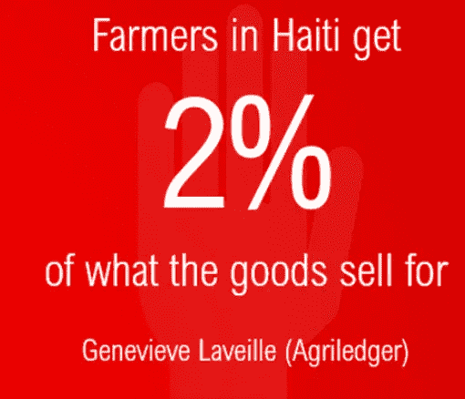
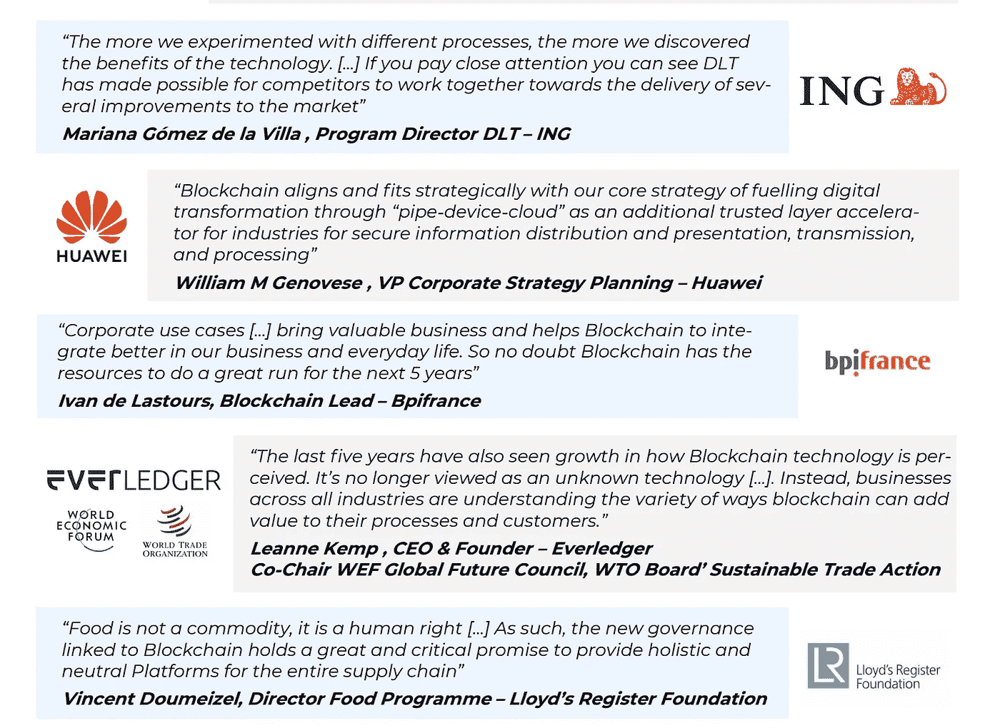
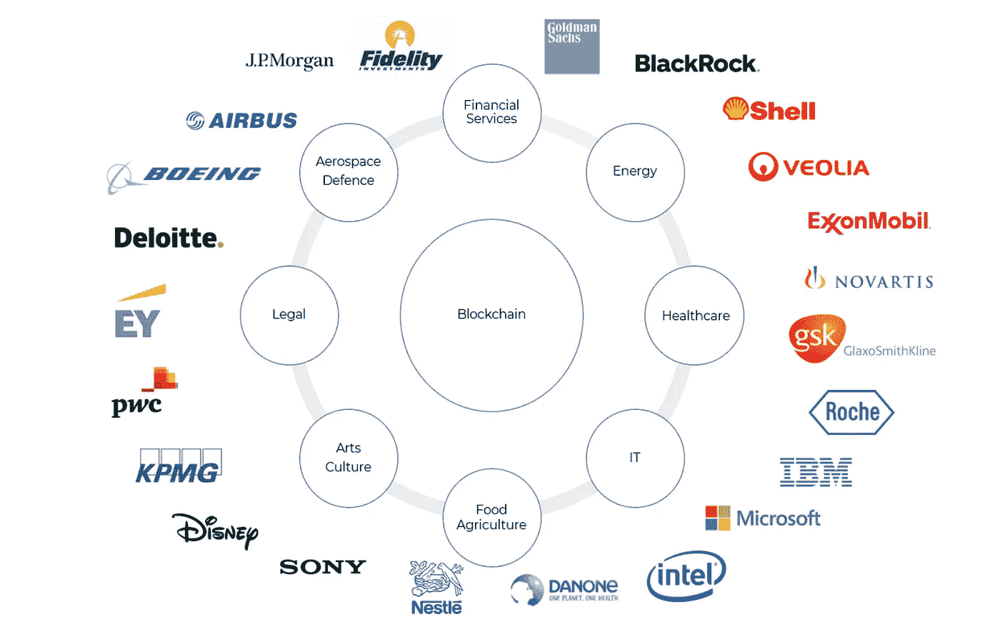
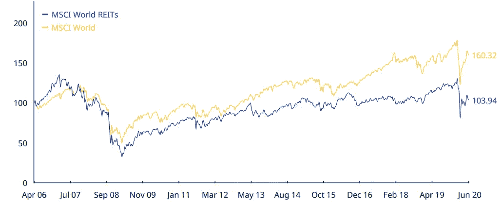
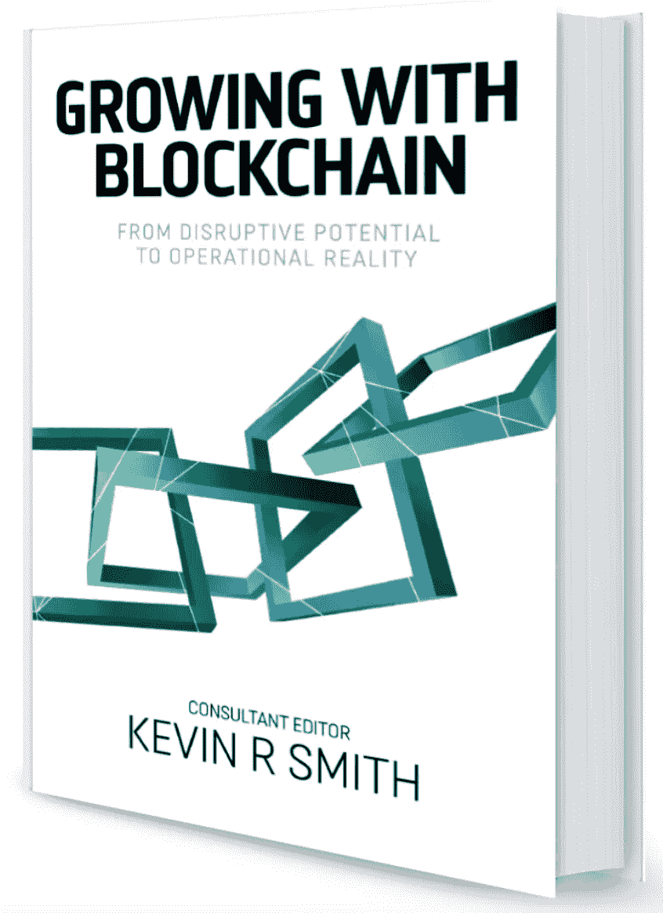

# 8 月 12 日数字字节

> 原文：<https://medium.datadriveninvestor.com/12th-august-digital-bytes-699ed07b21d3?source=collection_archive---------24----------------------->

区块链和数字资产领域的一些发展回顾。

【2020 年 8 月 12 日数字字节

**在区块链上追踪食物何苦呢？**

一个 [2 分钟的视频](https://youtu.be/yOzEwYmZKbo)——看看区块链技术如何帮助消费者、监管者和生产者。

资料来源:AgriLedger.com

能够追踪食物的来源和下落为顾客和商店提供了一系列有吸引力的好处，例如:

收取更高价格的能力( [IBM 高达 39%)](https://www.ibm.com/downloads/cas/EXK4XKX8)；

减少废物产生，提供更多关于供应链的信息；

提供更大的透明度，从而获得更多的信任；

降低商业风险，即由于来源已知，如果需要，能够更快地召回产品；

更好地遵守美国和欧盟的法律，这可能会随着时间的推移而增加。

我们已经看到组织使用区块链驱动的平台，很好的例子是沃尔玛现在跟踪虾、莴苣和卷心菜，家乐福监控其牛奶和鸡肉的供应链，雀巢使用它来生产 Mousline (一个马铃薯泥品牌)。这些公司都在使用二维码，顾客可以通过手机读取二维码来确定他们将要购买的食品的来源。

IBM 的 Food Trust 是倡导使用区块链技术的主要参与者之一，但还有许多其他公司，如 [Ripe.io](https://www.ripe.io/press) (它已经与[和 Neogen 合作研究动物基因组学](https://www.ift.org/news-and-publications/news/2020/february/05/neogen-ripeio-partner-to-bring-blockchain-to-food-safety-animal-genomics?type=Webcast#:~:text=Neogen%20has%20entered%20a%20partnership,safety%20diagnostics%20and%20animal%20genomics.))、德国的 [FoodLogiQ](https://www.foodlogiq.com/) 、 [TEFood](https://tefoodint.com/) 、德国的[exhausion(英国，最近获得€100 万欧盟奖)](https://www.provenance.org/news/movement/provenance-wins-1-million-euro-prize-from-the-european-commission-for-blockchains-for-social-good)、AgriLedger ( [英国)帮助海地农民，他们过去只获得最终价格的 2%](https://www.cryptoknowmics.com/news/agriledger-builds-blockchain-system-to-help-haitian-farmers)

到 2029 年，区块链在农业领域的使用预计将超过每年[20 亿美元，CAGR 为每年 40%](https://www.futuremarketinsights.com/reports/blockchain-in-agriculture-market)，这一需求还受到对粮食和农业资源浪费的日益担忧以及全球食品污染和食品欺诈数量不断增加的推动。因此，不难看出为什么区块链技术的使用正在被更广泛地采用。

**区块链**

**机构表示接受区块链和令牌化**

就在两年前，金融服务世界和区块链世界的融合似乎还很遥远。然而，我们一直看到区块链技术是英国 FCA 沙箱中许多项目的核心。事实上，我们最近看到了荷兰国际集团银行与 ABN·AMRO、法国巴黎银行证券服务公司、景顺、法国兴业银行、道富银行和瑞士联合银行合作的 Pyctor 项目，这些欧洲金融服务巨头刚刚被纳入 FCA 的第六个沙箱。有趣的是，这些公司宣布他们正在寻求建立一个“*数字资产安全保管和交易服务，重点是在私人或公共区块链*上发行的受监管的安全令牌。

来源:TeamBlockchain Ltd

此外，在最新的[群组 6](https://www.fca.org.uk/firms/regulatory-sandbox/regulatory-sandbox-cohort-6) 中，是备受尊敬的律师事务所 DLA Piper，该事务所正在提议一个 RegTech 平台，该平台提供基于规则的方法来数字化管理与数字资产发行相关的监管合规性。DLA Piper 的国际集团金融&项目和金融科技主管 Martin Bartlam 最近表示，“*我们正在寻求为公司创造一种更有效的方式，以应对围绕数字资产发行的复杂规则和法规，使其对监管者来说更具结构化，最终对发行者来说更快更便宜。值得注意的是，欧华还参与了 Pyctor 项目，希望提供一个机构级托管解决方案。*

一些全球领先金融机构的联合提供了更多证据，表明随着越来越多的客户希望参与这一资产类别，这些机构正越来越多地参与区块链技术，并正在考虑使用技术和数字资产的方法。然而，不仅仅是商业实体，监管机构也在寻求了解这些资产如何以及在哪里融入金融结构，以及区块链技术如何能够加强风险和合规控制。有趣的是，这种情况大多发生在全球领先的金融中心伦敦。

另一个表明该领域得到认可的发展是日本银行野村控股公司(Nomura Holdings Inc .)与加密货币合作伙伴 Ledger 和 CoinShares 作为合资企业首次亮相。Komainu 计划向其他机构提供数字资产和加密货币(如比特币)的托管服务。与此同时，[韩国最大的银行](https://www.financemagnates.com/cryptocurrency/news/south-koreas-largest-bank-to-offer-digital-assets-custody-services/)(韩国国民银行)认为，数字资产行业将继续发展，包括更广泛的数字资产，而不仅仅是加密货币。因此，它与其他几家公司合作提供托管服务，评论说，“*其他传统资产，如房地产、艺术品和其他具体化的权利将在区块链平台*发行和交易。”

我们看到一些机构对区块链技术和数字资产给予认可，风投和天使投资者也被区块链技术和数字资产创造的机会所吸引，如 [SpiceVC](https://spicevc.com/) 。早期阶段的股权融资平台 [Stakeholderz](https://bcn.to/gH0) ，在其监管平台上，使用区块链技术和/或考虑令牌化的公司数量稳步增长。Stakeholderz 的首席执行官德莫特·希尔(Dermot Hill)最近表示，“*我们看到，越来越多的企业开始从有良好记录的人那里寻找资本和合适的经验组合，以帮助他们不仅投资，而且与他们合作来发展公司。一个项目是*[*【inv inferencer】*](https://bcn.to/gHD)*，该项目使用位于其发行物中心的代币来合成投资智能*。为此，8 月 21 日上午 10:30，Stakeholderz 将举办一场名为“[区块链和令牌化:投资者需要知道的事情](https://attendee.gotowebinar.com/register/185163664397217548?source=Digital+Bytes)”的网络研讨会。

似乎我们已经达到了商业世界所有部门拥抱区块链技术的转折点，并看到了这项技术如何影响他们的日常活动。几乎每天都有来自主要全球公司甚至政府的公告，这些公司正在以各种创新的方式使用区块链技术和/或数字资产，从而提供更大的透明度，提高效率，并经常有助于提高对我们所有人都非常依赖的数据的信任。

 [## 人工智能、区块链和智能合约:为什么我们都需要拥抱创新|数据驱动的投资者

### 区块链是一个抓住了我的想象力的行业，有助于为更大的利益改造社会。我开始…

www.datadriveninvestor.com](https://www.datadriveninvestor.com/2020/08/03/ai-blockchain-and-smart-contracts-why-we-all-need-to-embrace-innovation/) 

**区块链市场的现状**

围绕区块链技术和一些现有的加密货币，仍然有很多炒作和猜测。区块链技术被企业和政府采用和接受的前景看起来很有希望。根据[市场和市场](https://www.marketsandmarkets.com/Market-Reports/blockchain-technology-market-90100890.html#:~:text=Blockchain%20market%20size%3F-,The%20global%20blockchain%20market%20size%20is%20expected%20to%20grow%20from,67.3%25%20during%202020%E2%80%932025.)的说法，虽然金融服务部门可能会获得最大的采用，但区块链技术为中小企业和新兴市场提供了巨大的机会，私人区块链可能会变得更加普遍。事实上，Markets 和 Markets 在今年早些时候发布的一份报告中预测，区块链市场将以[60%+](https://www.marketsandmarkets.com/Market-Reports/blockchain-technology-market-90100890.html#:~:text=Blockchain%20market%20size%3F-,The%20global%20blockchain%20market%20size%20is%20expected%20to%20grow%20from,67.3%25%20during%202020%E2%80%932025.)的复合年增长率(CAGR)增长，从 2020 年的 300 万美元增长到 2025 年的 397 亿美元。除此之外， [Gartner](https://www.gartner.com/en/newsroom/press-releases/2019-07-03-gartner-predicts-90--of-current-enterprise-blockchain#:~:text=Rapid%20Evolution%20of%20the%20Blockchain,a%20recent%20forecast%20by%20Gartner.) 得出结论，“区块链技术增加的商业价值”预计到 2025 年将超过 1700 亿美元，到 2030 年将达到令人难以置信的 3 万亿美元。

一些组织对区块链技术的观点精选

来源:[领先区块链 Partners.com](http://leadblockpartners.com/)

正如 LeadBlockchain Partners (LBP)最近一份报告中的上述引文所示，很明显，区块链技术正在全球范围内被不同司法管辖区的不同类型的组织所接受，LBP 的分析发现(除了金融服务)，农业、能源、食品和医疗保健是对使用该技术最感兴趣的行业。LBP 的报告还重点关注了中小企业领域，指出创始人采用区块链技术的三大原因是:

降低成本；

不变性；

可审计性。

这反过来又使其他补充技术得以采用，因为 [70%的初创企业使用](https://leadblockpartners.com/docs/Enterprise%20Blockchain%202020%20-%20LeadBlock%20Partners.pdf)区块链和人工智能、机器学习和/或物联网。许多使用区块链技术的欧洲中小企业的另一个特点是，创始人通常有与跨国组织合作的经验。在许多情况下，个人离开大公司和已建立的企业，以应对大公司面临的挑战。

中小企业创始人以前工作过的公司

来源:LeadBlockchainpartners.com

不幸的是，LBP 同样发现，80%的投资者不熟悉区块链技术，60%的投资者不区分区块链和加密货币，鉴于加密货币可疑的标题，不难理解为什么公司在筹集资本时会遇到传统投资者的不情愿。然而，欧洲的初创企业现在超过 3000 家，每年有 500 家以各种方式参与区块链技术的中小企业。出版物 [I-scope](https://www.i-scoop.eu/blockchain-distributed-ledger-technology/business-ecosystems-future-blockchain/) 警告说，组织需要拥抱区块链技术，因为“*早期采用者将有机会在生态系统中建立非常强大的地位，而较慢的采用者不会被完全排除在外，而是应该探索用例*”。

然而，不仅仅是商业组织对区块链技术感兴趣，因为就在本周，我们看到[美国农业部](https://btcmanager.com/us-agriculture-board-adopts-blockchain-technology-for-supply-chain/?q=/us-agriculture-board-adopts-blockchain-technology-for-supply-chain/&utm_source=onesignal&utm_medium=push&utm_campaign=push%25notification)宣布，它将使用这项技术来确保声称生产“有机”商品的制造商遵守其规则。这是一个很好的例子，说明如何通过提供更大的透明度来使用技术，从而获得信任，无论是与我们消费的商品相关，还是确保政府援助到达预期的接收者手中。区块链市场正在快速发展，最初受到许多初创企业的推动，并通过使用和创建各种密码(如 BTC、瑞士联邦理工学院和 XRP)登上了全球许多出版物的头版，我们正在看到一个非常不同的用户和赞助商群体。那些谈论拥抱无银行账户和路过机构的新范式的“网络朋克”现在是少数，已经被跨国公司和政府所取代，这些公司和政府正在使用并继续探索他们可以使用区块链平台的“方式和地点”。

**数字资产**

**房地产:现在是购买房地产支持的数字资产的时候吗？**

你有多少次听到“你不能在房地产上赔钱”？令人惊讶的是，人们的记忆会玩把戏，忘记在 2013 年[英国 FCA](https://www.independent.co.uk/property/house-and-home/up-to-630000-borrowers-are-stuck-in-negative-equity-as-the-housing-market-stagnates-8548584.html) 声称可能有多达 63 万人的抵押贷款超过了他们的房屋价值，即负资产。在 20 世纪 90 年代，负资产房屋的数量甚至更多，英格兰银行估计有超过 100 万套——这都是由于房地产价格下跌。

摩根士丹利资本国际房地产指数自 2006 年以来上涨了 3.9%，而全球股市自 2006 年以来上涨了 60%。因此，如果你是一个反向投资者，也许应该考虑投资房地产？

房地产与世界股票

来源:[MSCI.com](https://www.msci.com/documents/10199/ddf1037b-481a-4b17-a2a7-ba9c51043b45)

有许多开放式共同基金可供选择，或者你可以考虑投资封闭式房地产投资信托基金或投资信托基金，其中大多数基金每天交易一次，而且主要是纸面交易。或者，你可能希望看看各种证券代币发行(sto ),它们由房地产支持(证券化),可能 24/7 交易。

将一项资产证券化，可以看作是将它分成股份/单位。因此，为了“令牌化”房地产，管理人实际上是在发行代表基础房地产特定份额的股份/单位或“令牌”。

房地产的当前背景

由于新冠肺炎，房地产的短期前景看起来并不乐观，因为更多的人在家工作，因此租户较少，加上迫在眉睫的衰退。在英国，管理着埃塞克斯湖畔、曼彻斯特特拉福德中心(Trafford Centre)和盖茨黑德地铁中心(Gateshead's Metrocentre)等许多项目的房地产公司 Intu，刚刚与其它 47 家零售机构一起进入清算程序。苹果还要求将其在英国的店铺租金降低 50%。有趣的是，如果你看看英国最大的房地产公司[土地证券](https://investing.thisismoney.co.uk/quote/LAND)的表现，该公司拥有 2300 多万平方英尺的房地产，价值 170 多亿美元，2019 年的收入超过 10 亿美元，一切并不像你想象的那样。不幸的是，2006 年 12 月 29 日，土地证券的股价为 2477 英镑，而最近为 532 英镑，14 年内下跌了 78.5%。在美国，[先锋房地产基金](https://investor.vanguard.com/mutual-funds/profile/portfolio/vgsix)，去年价值 558 亿美元，已经损失了 5%。或许这是一个适当的时机来记住反向投资者罗斯柴尔德勋爵(Lord Rothschild)的话，他在 18 世纪说，“当街上有血时，就买入”。

事实上，FCA 正在考虑出台针对房地产基金的规定，这意味着投资者需要提前 180 天通知才能“兑现”他们的基金。现在，这应该被视为房地产支持的数字资产(STOs)的另一个原因吗？STOs 是投资房地产行业的一种方式。

**夏季和阅读**

很多人，无论是以个人身份还是在职业生活中，都只是把区块链和比特币等加密货币联系在一起，然后进而把加密货币和骗局联系在一起。当然，也有关于加密货币的骗局，但这些通常是“快速致富”计划中欺骗轻信者的标准形式，并不是加密货币独有的。另一个典型的回答可能是，'*我不了解它或它是如何工作的，所以我不信任它，所以我不会使用它*。然而，这是一个非常有缺陷的论点，因为毫无疑问，大多数人无法准确描述他们的汽车引擎或互联网是如何工作的，但这并不妨碍他们每天开车或使用互联网。

同样显而易见的是，区块链可能会在争论的另一端遭受损失——它是一种奇迹疗法或“银弹”。许多商界人士认为区块链是一个神奇的解决方案，冒险寻找一个问题来解决它。毫不奇怪，这完全是一种错误的方法，因为无论在什么情况下，当务之急是首先识别问题，寻找最佳解决方案，并最终决定基于*区块链*的解决方案是否确实是解决问题的最佳方式。区块链确实可以彻底改变某些流程和程序，但是它的范围当然是有限的，并且可能在其他情况下不可行。

虽然区块链肯定不是解决所有问题的完美解决方案，但它*非常适合企业在许多应用中使用，包括支付、供应链、智能合同的使用、资产的令牌化、产品跟踪等等。与此同时，政府正专注于将区块链用于财产登记等系统。许多国家现在也在考虑创建国家加密货币，现在已经开始理解区块链相对于法定货币的好处，尤其是如果他们自己的货币与美元“挂钩”的话。此外，区块链为远程用户网络创造的数字信任已经彻底改变了供应链和追踪商品的能力。同样，一旦智能合约被用于这一过程，那么贸易融资也开始发生革命性变化。总的来说，这些过程使系统更便宜、更安全、更透明、更快捷。同样，通过数字化资产和引入令牌化，区块链允许部分所有权，从而开创了一个交易资产和记录所有权的全新市场。与此同时，游戏化在忠诚度计划和奖励计划(以及对所提供信息的奖励)方面创造了大量新机会，同时允许个人拥有数据。*

**Kevin R . Smith:与区块链一起成长——从颠覆性潜力到运营现实**

这本书的每一章都由各自领域的专家撰写，给出了他们对区块链现在被使用的各种方式的看法和评论，包括如何去做。目的是让广大读者了解与区块链建立和发展业务的选择和行动。从全球知名公司(IBM、戴尔和律师事务所，CMS)到专家(团队区块链本身、Digital Catapult、Paydock 和区块链新秀)，再到颠覆时尚界的初创公司，以及见多识广的权威人士，都做出了贡献。这项研究和本书的许多撰稿人明确了一件事，即尽管区块链现在就在我们身边，但它仍然是一个基本未知的实体，或者更糟糕的是，被误解了。

来源:纳瓦罗出版社

在本书中，贡献者专注于现在实际正在做的事情，但显而易见的是，变化的速度非常快，区块链的使用呈指数级增长。正因为如此，区块链已经活跃在我们周围，不管人们是否意识到了这一点，这一趋势只会继续下去。总的来说，这本书的推荐书证实了这样一种观点，即区块链正在“彻底改变当前的商业模式”，*在评估区块链的潜力时，天空真的是无限的*。这本书的一个目的是非常有助于促进区块链的使用，并协助教育那些希望了解更多。一封感言总结了这本书，称“*阅读、重读、学习和应用”*。

如果你想要一本《与区块链一起成长》，在 https://novaropublishing.com/growing-with-blockchain/[使用代码“25 off-区块链”可以享受 25%的折扣](https://novaropublishing.com/growing-with-blockchain/)

**乔治·吉尔德:谷歌之后的生活——大数据的衰落和区块链经济的崛起**

在本书作者乔治·吉尔德的采访中，他谈到了里根总统时期许多经济政策的驱动力——“财富与贫困”。他的新书《谷歌之后的生活》展望了互联网的未来，政府、企业和个人都变得如此依赖互联网。这本书非常详细地描述了大数据时代如何走向终结，从而催生了区块链时代。吉尔德认为，我们将看到通过将人们的数据货币化，然后将其出售给在线广告来资助的免费内容的终结，将被小额支付所取代，小额支付将成为新的货币标准。正如吉尔德所说；"*全球最大的行业不是食品或运输，而是外汇，因为它允许政府印钱，如果他们只是印钱本身并不意味着什么*"

[吉尔德认为](https://bitcoinexchangeguide.com/george-gilder-report/)科技公司拥抱人工智能(AI)是在自欺欺人，这样做忽视了安全*，“即使人工智能的进步导致了无所不能和超越的错觉，硅谷也几乎放弃了安全。本应保护所有密码和个人信息的互联网防火墙被证明是不可渗透的。*为了解决这个问题，公司将转向吉尔德所谓的“密码宇宙”(cryptocosm)，即区块链的新架构。

如果您对数字字节中的任何内容有任何意见，或者有您想要涵盖的主题，或者如果出于某种原因，以上任何链接都不起作用，请通过[Jonny.Fry@TeamBlockchain.net](mailto:Jonny.Fry@TeamBlockchain.net)与我联系。

Digital Bytes 经过精心撰写，旨在引起人们对区块链和数字资产领域发展的关注，但建议读者在根据上述任何链接和信息采取任何行动之前，先听取专业建议。TeamBlockchain Ltd 对任何可能采取或可能不采取的行动、收到此版本数字字节的损失或收益不承担任何责任。

如果同事或朋友希望收到数字字节，请他们发电子邮件给 Jonny.Fry@TeamBlockchain.net

在推特上关注我们

[www.TeamBlockchain.net](http://www.teamblockchain.net/)

**进入专家视角—** [**订阅 DDI 英特尔**](https://datadriveninvestor.com/ddi-intel)