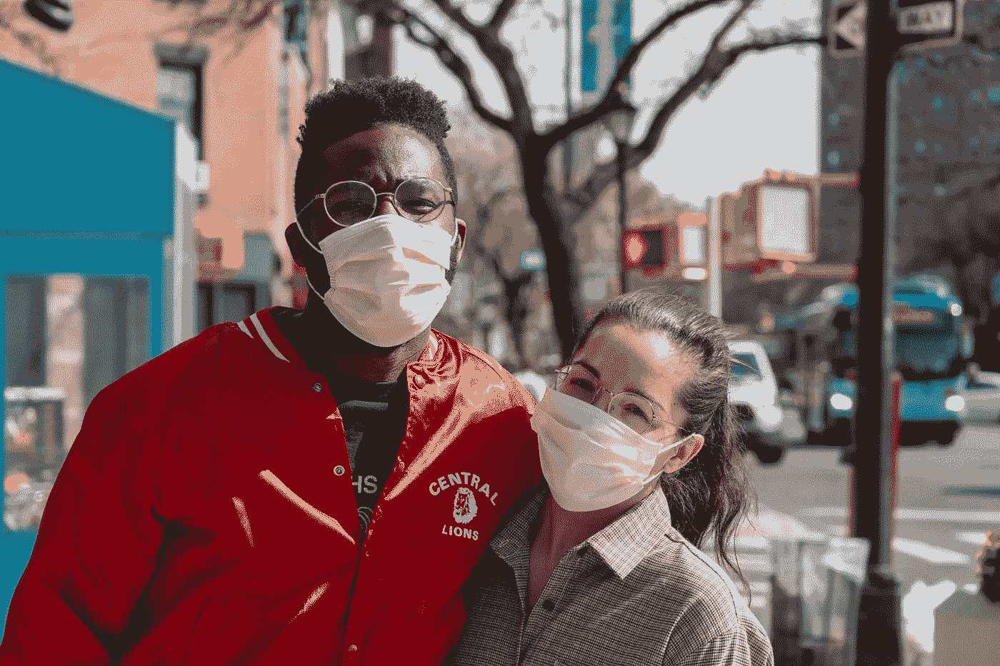
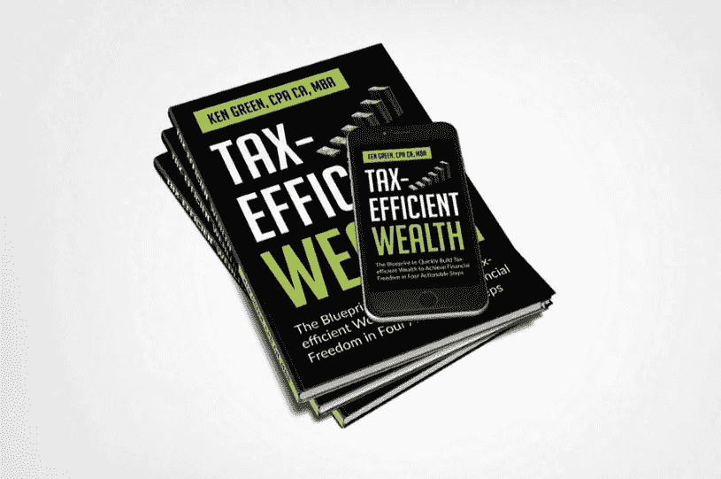

# 在我被监禁期间强化的 13 个事实

> 原文：<https://medium.datadriveninvestor.com/13-truths-reinforced-during-my-covid19-incarceration-c4b8ac9c017a?source=collection_archive---------21----------------------->

## 在 COVID19 中，我感谢这些真相

Photo by [Julian Wan](https://unsplash.com/@julianwan?utm_source=unsplash&utm_medium=referral&utm_content=creditCopyText) on [Unsplash](https://unsplash.com/s/photos/covid?utm_source=unsplash&utm_medium=referral&utm_content=creditCopyText)

我们都同意，2020 年在很多方面都是可怕的一年，主要是因为疫情飓风。尽管我们还有四个月的时间来结束这一年，但我们不太可能挽回过去几个月已经造成的重大损失。

不管怎样，在危机中，我们都能找到值得感激的东西。

对我来说，我很感激这场危机给了我空间和机会来巩固这些将在我的余生中为我服务的真理:

# 1.保持长远眼光是无价的

有一个长远的观点是非常重要的。学会如何不活在当下是非常关键的，因为这是唯一能让你克服压力、筋疲力尽、不知所措和旅途中遇到的小挑战的事情。

对于你们当中的基督徒来说，这就像有一个王国的焦点——理解我们在地球上的所有辛劳与无价的永恒相比毫无意义。

有了长期的专注，你真的永远不会失败。你将永远成功，你将永远享受旅程，你将拥有更好的经历和更丰富的生活。

# 2.生活在硬币的边缘

如果你想在生活中获得成功，两件事可以同时实现的想法是非常重要的。

我们生活在硬币边缘的 T2。一枚硬币的一面是机会，另一面是恐惧。生活在硬币的两面都不可能有进步。如果你不顾一切地追逐机会，你会引火烧身。如果你生活在恐惧中，你会在恐惧中死去。过充实的生活要求我们始终保持平衡，在硬币的*边缘*保持运动。

这意味着当你把一切都看成不是白的就是黑的时，你很难享受生活。你必须明白，有时候，它可以同时是白色的和黑色的。学会从以二元方式思考转变为持有多种相反的观点，这些观点有时可能同时是正确的。

 [## 用集体智慧对抗新冠肺炎|数据驱动的投资者

### “集体智慧是人类集体参与智力合作以创造……

www.datadriveninvestor.com](https://www.datadriveninvestor.com/2020/08/07/fighting-covid-19-with-collective-intelligence/) 

# 3.延迟满足——我今天做的大多数事情不一定会让我今天赚到钱

大多数人都忽略了这一点。事实上，这是大多数企业和风险投资在前 5 年失败的原因之一。如今，人们太专注于赚钱，以至于他们错过了宝贵的经验和教训，而这些经验和教训可以从多呆一会儿的过程中获得。

你必须意识到，每当你开始一件新的事情时，你所做的一部分应该包括其他事情，比如学习一种生活技能、建立一个社区、创造内容等等。掌握了这个，钱就来了。

这笔钱可能不是来自这个特定的风险投资。它可能来自另一个不相关的风险投资，这个风险投资将受益于你从以前的经验中创造的技能、社区和内容。

# 4.杠杆是成功的关键

你可能听说过杠杆的概念，也许你只从金融角度考虑过它。然而，生活就是杠杆。在你做的每一件事情中，总是想到“谁”而不是“如何”。

谁能帮你更快得到结果？

建网站谁比你技术强？

在你想完成的最重要的事情上，谁比你强？

如果你认为你可以自己做所有的事情，你最终会一事无成。

# 5.专注就是一切

我现在明白了保持专注和持续追随你为自己创造的愿景的价值。我知道分心是扼杀一个人梦想的最大方式之一，我们生活在一个越来越充满分心事物的世界。

当你注意力不集中的时候，当你从一件事跳到另一件事的时候，你会变得太瘦，在你知道之前，不知所措。这导致拖延，最终导致无所作为。

那么，保持专注意味着什么？意思是…

F —跟随

一个

c-课程

U —直到

S —成功

这是关键，“*遵循一个过程，直到成功*。”换句话说，你不应该尝试做任何其他事情，直到你第一次在做一件事情上变得非常舒适和成功。

李小龙曾经说过:“我害怕的不是知道一万次踢腿的人，而是练习一万次踢腿的人。”

所以，学着坚持到底，学着把注意力集中在一件事或几件相关的事情上，直到你对这一件事感到非常舒适和擅长。

# 6.个性不是永久的

本杰明·哈代，我在这个平台上认识的一位作家，也是我密切关注的一位作家，写了一本名为 [*人格不是永久的*](https://amzn.to/31Vwcui) 的伟大著作。他的书的观点是，你的过去不一定决定你的未来。

你可以重塑自己。你可以改变你的未来。你可以改变你的生活，当你与未来的自己比较时，你几乎认不出过去的自己。

# 7.知识是关键，但行动更重要

我现在意识到根据你的知识采取行动是多么重要。

> “对我来说，想法除非付诸实施，否则一文不值。他们只是一个乘数。行刑价值百万。”—史蒂夫·乔布斯

如果你想改变你的生活，你必须执行。

你必须从头脑中的知识转移到实际实施你所学到的想法。如果你不执行，什么都不会发生。你的生活不会改变。你不会比昨天更好。

为了执行，你必须开发能让执行变得轻松的系统。你需要一个系统来每天执行你的优先事项。一个能让你将十年目标分解成年度目标，并最终分解成日常任务的系统。

"一个人可以偷想法，但没有人可以偷执行力或激情."—蒂姆·费里斯

我在标题为 [*“毫不费力地执行的 5 种方法”*](https://medium.com/@ken_91806/5-ways-to-execute-effortlessly-a02b02d6e63c) 的文章中写了更多。

归根结底，没有执行力，什么都不会改变。句号。

# 8.在生活中，你必须拥抱“恐惧”

大多数人从不尝试新事物的一个原因是害怕——害怕失败和害怕未知。你必须明白恐惧是生活中美好的一部分。它永远不会消失。所以，你必须学会忍受它，更重要的是，你必须学会如何从你的恐惧中挖掘巨大的力量。

> "我不害怕明天，因为我经历过昨天，又热爱今天。"—威廉·艾伦·怀特

恐惧是一个主要的障碍，不仅在生意上，而且在生活的各个方面。尽管恐惧有负面的含义，我们必须认识到恐惧是生活中不可或缺的一部分。事实上，恐惧是当今世界进步和发展的主要因素之一。

造成这种差异的是我们对恐惧的反应方式。它可以阻碍你，也可以引发成功和胜利。

当我回顾和反思我的旅程时，恐惧在许多方面阻碍了我，我在这里分享了这个故事*。*

# *9.要有突破，你必须打破某些东西*

*你必须打破你的限制性信念。*

*你必须打破你贫穷的金钱心态。*

*你必须打破阻碍你的坏习惯。*

*当面对迈出一大步，对你的生活或职业生涯做出重大改变的现实时，你很容易被不确定性、怀疑或恐惧所麻痹。为了克服这些，你必须打破那些阻碍你前进的东西。*

# *10.我现在比以往任何时候都更有信心*

*对于你们当中的基督徒来说，你们知道信仰有多重要。信仰是基督信仰的基础。在希伯来书 11:6 中，它说“没有信仰，就不可能得到上帝的喜悦，因为任何接近上帝的人都必须相信他的存在，并且相信他会奖赏那些寻求他的人。”*

*同样，你需要对你正在做的任何事情有信心，这样才有成功的机会。拿破仑·希尔在他永恒的著作*中写道，信仰是创造财富的基本原则。他将其定义为视觉化和对欲望实现的信念。**

> **"凡是头脑能想到和相信的，头脑都能实现."—拿破仑·希尔**

**如果你没有信仰，如果你不相信自己，如果你不相信比自己更重要的东西，你完成目标的机会是零。**

# **11.享受旅程，而不是纠结于结果**

**虽然根据你在计划和实施中所做的工作来预测某些结果是可能的，但是仍然存在一些不确定性。如果你是做生意的，你就会明白我的意思。你不能总是预测市场对你的产品和服务的反应。你当然无法预测未来的经济会是什么样子。例如，没有人预测到 COVID19。**

**因此，记住这一点，你不能沉迷于你很少或根本无法控制的结果。这样做会招致不必要的压力。乔希·考夫曼(Josh Kaufman)在他的书《个人 MBA 中解释说，在设定目标时，你的控制点应该瞄准你能控制的东西(即你的努力)，而不是你不能控制的结果(如你是否得到那个角色)。**

# **12.我知道无论我做什么，总有人会抱怨，憎恨，并试图摧毁我。我已经学会忽略它们**

**人永远是人。当他们不理解你的时候，他们会胡说八道。当他们沮丧时，他们把它推到你身上。所以，没必要在这样的人身上浪费你的精力。为他们祈祷，继续前进。**

# **13.增长需要风险，风险创造增长**

**我在这个[故事](https://medium.com/illumination/why-growth-requires-risk-and-the-kind-of-risk-that-creates-growth-6a69c4dead96)中分享了更多。承担风险的能力是真正的赢家和失败者的区别之一。对我来说，在这个平台上写作是一种冒险，这种冒险迫使我成长。**

**无论是在商业中还是在我们的个人生活中，每当讨论增长时，都会提到冒险的重要性。当我们谈论风险时，有时会混淆风险和赌博。**

**亨利·克劳德博士在他的书《正直*中，对风险的定义如下:***

> ***风险意味着你做了一件有可能导致坏结果的事情，你拥抱这种可能性，并接受它。***

***他接着说，金融风险意味着你以某种方式投资你的钱，这种方式并不一定都是好的，但也有可能比你做更安全的事情获得更大的回报。***

***附注:我的任务是用金融教育来武装你。这是我开始在媒体上写作的一个原因，也是我写节税型财富的原因。这本书将帮助你以节税的方式加速你的财富。 [***拿一本我的新书《节税型财富***](https://www.5dayspersonalfinancechallenge.com/book) ***》的免费电子书版本，来学习如何利用能帮你省下一吨税的策略快速积累财富。******

****

**Image Credit: Author**

## **访问专家视图— [订阅 DDI 英特尔](https://datadriveninvestor.com/ddi-intel)**