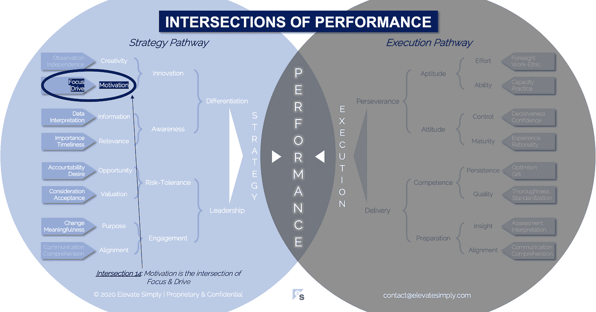

# 14.动机:专注和驱动的交集

> 原文：<https://medium.datadriveninvestor.com/14-motivation-the-intersection-of-focus-drive-d9ebd3ca9951?source=collection_archive---------18----------------------->

Image from 123rf.com

是什么促使我们采取行动？动机。动机是基于改变的需要或愿望的行动动力。

解释牛顿第一运动定律的一部分…一个静止的物体保持静止，除非受到外力的作用。可以说，动机是刺激这个定律中“受外力作用”部分的东西，因为它与活动的开始有关。

在商业中，就像在生活中一样，动机可以有积极或消极的来源。

积极的来源包括:

*   机会
*   兴奋
*   报酬
*   承认
*   允许
*   自治

负面来源包括:

*   害怕
*   威胁
*   债务
*   失败
*   惩罚
*   疼痛

不管起源如何，当付诸行动时，动机会导致改变。无论这种改变是创新的、渐进的还是有害的，都是行动的意图、方法和执行相结合的结果。动力让球开始滚动。那么，你如何激励员工呢？

**什么是动机交集？**

动机是焦点和驱动力的交叉点*(见下图交叉点 14)*。专注是“什么”,动力是“为什么”。在激励作为企业创新的先导的背景下，激励的来源可以是积极的，也可以是消极的。

个人或团队的动机程度是可变的。有些人为了生存(或者不被解雇)做了最起码的事情。另一些人似乎有无穷的动力储备，不断寻求超越预期。原因有很多，但专注和动力是核心。

*焦点*

焦点定义了可以或应该采取的行动。没有焦点，就没有目标和冷漠。在工作环境中，积极应对这些阻碍进步的因素至关重要，因为它们会导致浪费和混乱。浪费时间、金钱和资源。关于谁在何时做什么的困惑。

当个人或团队专注时，成就就会出现。这些可以包括日常工作中平凡的、基本的阻挡和处理，以及更令人兴奋的、创新的特殊项目。

专注证实了这样一个假设，即有一些事情需要被激励。

交叉点 14:动机=专注+驱动

Image by [Brett Simpson](https://medium.com/u/191cf90a65d7?source=post_page-----d9ebd3ca9951--------------------------------)

*驱动*

动力是动机背后的“为什么”。仅仅确定一个可以采取的行动是不够的。一定有它的意义；创造前进动力的价值。驱动加上专注完成了动机等式。

驱动力是做某事的原因或基本原理。就像动机的整体概念一样，动力可以来自积极或消极。不管怎样，动力推动运动。它还决定了步伐，努力的程度和对运动细节的关注。

驱动力决定了活动发生的速度，有时甚至是能力。

**领导能做什么？**

激励是领导者实现目标、策略和想法的方式。理解激励的先决条件，以及如何激励，是成功的领导者与不成功的领导者的区别。

动机并不能保证成功，只能保证行动的决定能够做出。糟糕的领导会导致低动力或没有动力，从而导致组织中的高水平的低效和无效。

作为领导者，重要的是不仅要管理要关注的内容，还要理解驱动力以及这种协同作用如何影响绩效(好或坏)。

**总结&下一个**

动机在商业中是一种强大的力量。很多时候，这就是成功与失败的区别。这当然是坚持和放弃的区别。

当动机是有意的和有意义的时，最好的结果就会出现。

下一次我们将考察表现的第 15 个交叉点，也就是**创意交叉点**。

*在这一系列文章中，我们探索了*性能*的交叉点，共有 30 个。*绩效的交叉点*框架是基于*[*Brett Simpson*](https://www.linkedin.com/in/brettjsimpson/)*[*董事总经理(简称为*](https://www.linkedin.com/company/elevatesimply/)*)20 多年来作为企业家、顾问和投资者在大大小小的组织中的领导经验和见解。**

***绩效-文章链接的交集***

*1.[绩效:策略的交集&执行](https://medium.com/the-innovation/1-performance-the-intersection-of-strategy-execution-2bf06329f8d4)*

*2.[战略:领导力的交叉点&分化](https://medium.com/the-innovation/2-strategy-the-intersection-of-leadership-differentiation-a568b17731ab)*

*3.[领导:参与的交集&风险承受能力](https://medium.com/the-innovation/3-leadership-the-intersection-of-engagement-risk-tolerance-f8c887e6c1d3)*

*4.[差异化:创新的交叉点&意识](https://medium.com/@brettjsimpson/4-differentiation-the-intersection-of-innovation-awareness-a21d053ecf12)*

*5.[啮合:目的的交集&对准](https://medium.com/@brettjsimpson/5-engagement-the-intersection-of-purpose-alignment-953747437c26)*

*6.[风险承受能力:机会的交叉点&估值](https://medium.com/@brettjsimpson/6-risk-tolerance-the-intersection-of-opportunity-valuation-29cf4d9a0ac)*

*7.[认知:信息的交集&关联](https://medium.com/@brettjsimpson/7-awareness-the-intersection-of-information-relevance-f0fd5322bcb7)*

*8.[创新:创造力的交汇点&动机](https://medium.com/@brettjsimpson/8-innovation-the-intersection-of-creativity-motivation-7c1a12e0d5e2)*

*9.[目的:变化的交集&意义的交集](https://medium.com/@brettjsimpson/9-purpose-the-intersection-of-change-meaningfulness-9f12b0153e1)*

*10.[估价:对价的交集&验收](https://medium.com/@brettjsimpson/valuation-the-intersection-of-consideration-acceptance-eebe7b15e763)*

*11.[机会:欲望的交汇&责任](https://medium.com/the-innovation/opportunity-the-intersection-of-desire-accountability-7e81adb1e195)*

*12.[相关性:重要性的交集&及时性](https://medium.com/@brettjsimpson/relevance-the-intersection-of-importance-timeliness-56cc748eb066)*

*13.[信息:数据的交集&解读](https://medium.com/@brettjsimpson/information-the-intersection-of-data-interpretation-62acc94ba8bf)*

*14.[动机:焦点的交集&驱动](https://medium.com/@brettjsimpson/14-motivation-the-intersection-of-focus-drive-d9ebd3ca9951)*

*15.[创造力:观察的交集&独立性](https://medium.com/@brettjsimpson/15-creativity-the-intersection-of-observation-independence-57f7294acb2b)*

*16.执行力:毅力与交付的交集*(即将推出！)**

*17.交付:准备与能力的交集*(即将推出！)**

*18.毅力:天资与态度的交汇*(即将推出！)**

*19.准备:洞察力和一致性的交集*(即将推出！)**

*20.能力:坚持与质量的交汇点*(即将推出！)**

*21.态度:控制与成熟的交集*(即将推出！)**

*22.资质:努力与能力的交集*(即将推出！)**

*23.洞察力:评估与解释的交集*(即将推出！)**

*24.质量:彻底性和标准化的交汇点*(即将推出！)**

*25.坚持:乐观与勇气的交汇*(即将推出！)**

*26.成熟:经验与理性的交集*(即将推出！)**

*27.控制:果断与自信的交汇点*(即将推出！)**

*28.能力:能力与实践的交集*(即将推出！)**

*29.努力:远见和职业道德的交集*(即将推出！)**

*30.对齐:传播与综合的交集*(即将推出！)**

*在 [**领导力、辅导和个人成长**](https://app.ddichat.com/category/leadership-coaching-and-personal-growth) **:** 中安排一次对话*

* [## 专家-领导力、教练和个人成长- DDIChat

### DDIChat 允许个人和企业直接与主题专家交流。它使咨询变得快速…

app.ddichat.com](https://app.ddichat.com/category/leadership-coaching-and-personal-growth) 

在此申请成为 DDIChat 专家[。
与 DDI 合作:](https://app.ddichat.com/expertsignup)[https://datadriveninvestor.com/collaborate](https://datadriveninvestor.com/collaborate)
点击此处订阅 DDIntel [。](https://ddintel.datadriveninvestor.com/)*