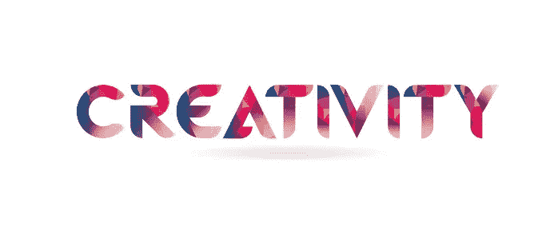
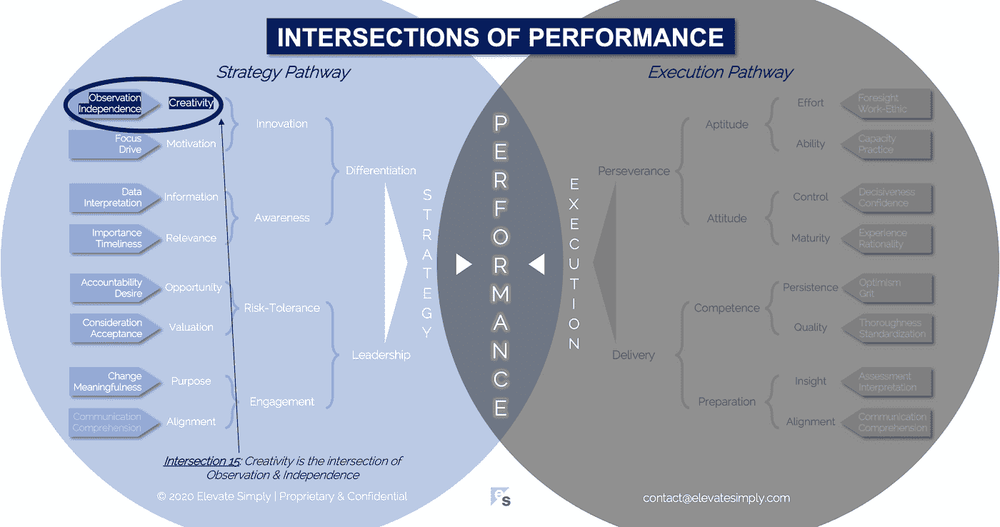

# 15.创造力:观察和独立的交叉点

> 原文：<https://medium.datadriveninvestor.com/15-creativity-the-intersection-of-observation-independence-57f7294acb2b?source=collection_archive---------5----------------------->

我们通常会将创造力与那些才华以易于识别和消费的方式表现出来的人联系在一起。艺术家、音乐家、舞蹈家、厨师、儿童和运动员通常被称为有创造力的人。还有其他人的创造力也同样重要，即使它不那么显而易见。教师、科学家、领导者和志愿者都在这个群体中。

这两个群体之间的主要区别之一是他们表现出的创造力。在第一组中，可辨别的创造力通常是一种输出或结果(即“是什么”)。一幅画、一幅画、一首歌、一支舞、一顿饭、一个想象中的朋友或运动场上的一场戏。在第二组中，创造力更多地存在于过程中，而不是结果本身(即如何)。一种教学技巧，一种科研方法，一种领导风格或一种过程效率。

不管是以“是什么”还是“如何”的形式表现出来，创造力都是有价值的。有时候是先天的，有时候是后天的。对一些人来说，它很容易流动，对另一些人来说，释放它是一个挑战。创造力是社会及其进步的重要组成部分。在商业中，创造力是创新、战略差异化和绩效的驱动力。

**什么是创意交集？**

创造力是观察和独立的交叉点*(见下图交叉点 15)*。当评论创造力时，我们经常会说一些简单的话，比如，“那就是创造力。”根据我的经验，伴随这句话的情绪可以是钦佩、惊讶或嫉妒，都是出于“我为什么没有想到这一点？”

*观察*

我相信创造力始于观察，因为它需要观点。观察激发想法。从那里，一个有创造力的人找到了让众所周知的汁液流动的方法，要么沿着他们观察到的相同方向，要么沿着一个全新的方向。

当创新的结果是对已有事物的改进时(如产品、流程、食谱、体育运动)，观察成为一个重要的先决条件。没有观察，这个人就不知道之前什么做得好或者不好。观察是创造力的催化剂。

同样，在创造力的输出是全新的情况下，很可能这个人观察到了差距。少了点什么，只有通过观察才知道。机会来自观察。

交叉点 15:创造力=观察力+独立性

*独立*

创意者传统上被认为是独立的思考者。这是因为创造力，就其本质而言，具有独特性和差异性。在商业中，创造力是独立思考应用于创新观察的结果。

在这种情况下，独立具有无限性。一切皆有可能，突破这一界限受到鼓励和重视。另一方面，独立思考让人感觉受到约束和限制。这并不是说创造力不能在群体中产生，在群体中人们往往更加依赖他人，而是说创造力不应该被强迫。当个人可以自由地将自己的独立思考应用到团队的机会中时，团队环境中的创造力就产生了。

独立性在真实性和可能性方面加强了创造力。

**领导者能做什么？**

领导者应该寻找促进创造力的方法，而不是压制它。鉴于其对创新、差异化和绩效的影响，创造力可能在任何成功的组织中发挥关键作用。认识到有时候创造力可能不符合团队、项目或公司的最佳利益也很重要。

最优秀的领导者会创造一个平衡的环境，在这个环境中，当工作完成并取得进步时，创造力会得到培养。

**总结&下一个**

个人对组织或团队最重要的贡献之一是他们的创造力。它利用每个人自己独特的经历和他们对给定机会进行观察和独立的能力。

下次我们将考察性能的第 16 个交叉点，也就是**执行交叉点**。

在这一系列文章中，我们探索了性能的交叉点，共有 30 个。绩效的交叉点*框架基于*[*Brett Simpson*](https://www.linkedin.com/in/brettjsimpson/)*[*董事总经理*](https://www.linkedin.com/company/elevatesimply/) *的经验和见解，以及他作为企业家、顾问和投资者在大大小小的组织中 20 多年的领导经验。**

***绩效-文章链接的交集***

*1.[绩效:策略的交集&执行](/the-innovation/1-performance-the-intersection-of-strategy-execution-2bf06329f8d4)*

*2.[战略:领导力的交叉点&分化](/the-innovation/2-strategy-the-intersection-of-leadership-differentiation-a568b17731ab)*

*3.[领导:参与的交集&风险承受能力](/the-innovation/3-leadership-the-intersection-of-engagement-risk-tolerance-f8c887e6c1d3)*

*4.[差异化:创新的交叉点&意识](/@brettjsimpson/4-differentiation-the-intersection-of-innovation-awareness-a21d053ecf12)*

*5.[订婚:目的的交集&对齐](/@brettjsimpson/5-engagement-the-intersection-of-purpose-alignment-953747437c26)*

*6.[风险承受能力:机会的交汇点&估值](/@brettjsimpson/6-risk-tolerance-the-intersection-of-opportunity-valuation-29cf4d9a0ac)*

*7.[认知:信息的交集&关联性](/@brettjsimpson/7-awareness-the-intersection-of-information-relevance-f0fd5322bcb7)*

*8.[创新:创造力的交汇点&动机](/@brettjsimpson/8-innovation-the-intersection-of-creativity-motivation-7c1a12e0d5e2)*

*9.[目的:变化的交集&意义的交集](/@brettjsimpson/9-purpose-the-intersection-of-change-meaningfulness-9f12b0153e1)*

*10.[估价:对价的交集&验收](/@brettjsimpson/valuation-the-intersection-of-consideration-acceptance-eebe7b15e763)*

*11.[机会:欲望的交汇&责任](/the-innovation/opportunity-the-intersection-of-desire-accountability-7e81adb1e195)*

*12.[相关性:重要性的交集&及时性](/@brettjsimpson/relevance-the-intersection-of-importance-timeliness-56cc748eb066)*

*13.[信息:数据的交集&解释](/@brettjsimpson/information-the-intersection-of-data-interpretation-62acc94ba8bf)*

*14.[动力:十字路口的焦点&驱动](/@brettjsimpson/14-motivation-the-intersection-of-focus-drive-d9ebd3ca9951)*

*15.[创造力:观察的交集&独立性](/@brettjsimpson/15-creativity-the-intersection-of-observation-independence-57f7294acb2b)*

*16.执行力:毅力与交付的交集*(即将推出！)**

*17.交付:准备与能力的交集*(即将推出！)**

*18.毅力:天资与态度的交汇*(即将推出！)**

*19.准备:洞察与对齐的交集*(即将推出！)**

*20.能力:坚持与质量的交汇点*(即将推出！)**

*21.态度:控制与成熟的交叉点*(即将推出！)**

*22.资质:努力和能力的交汇*(即将推出！)**

*23.洞察力:评估与解释的交集*(即将推出！)**

*24.质量:彻底性和标准化的交汇点*(即将推出！)**

*25.坚持:乐观与勇气的交汇*(即将推出！)**

*26.成熟:经验与理性的交汇*(即将推出！)**

*27.控制:果断与自信的交集*(即将推出！)**

*28.能力:能力与实践的交集*(即将推出！)**

*29.努力:远见和职业道德的交集*(即将推出！)**

*30.对齐:传播与综合的交汇点*(即将推出！)**

*在 [**领导力、辅导和个人成长**](https://app.ddichat.com/category/leadership-coaching-and-personal-growth) **:** 中安排一次对话*

* [## 专家-领导力、教练和个人成长- DDIChat

### DDIChat 允许个人和企业直接与主题专家交流。它使咨询变得快速…

app.ddichat.com](https://app.ddichat.com/category/leadership-coaching-and-personal-growth) 

在这里申请成为聊天专家。
与 DDI 合作:[https://datadriveninvestor.com/collaborate](https://datadriveninvestor.com/collaborate)
点击此处订阅 DDIntel [。](https://ddintel.datadriveninvestor.com/)*