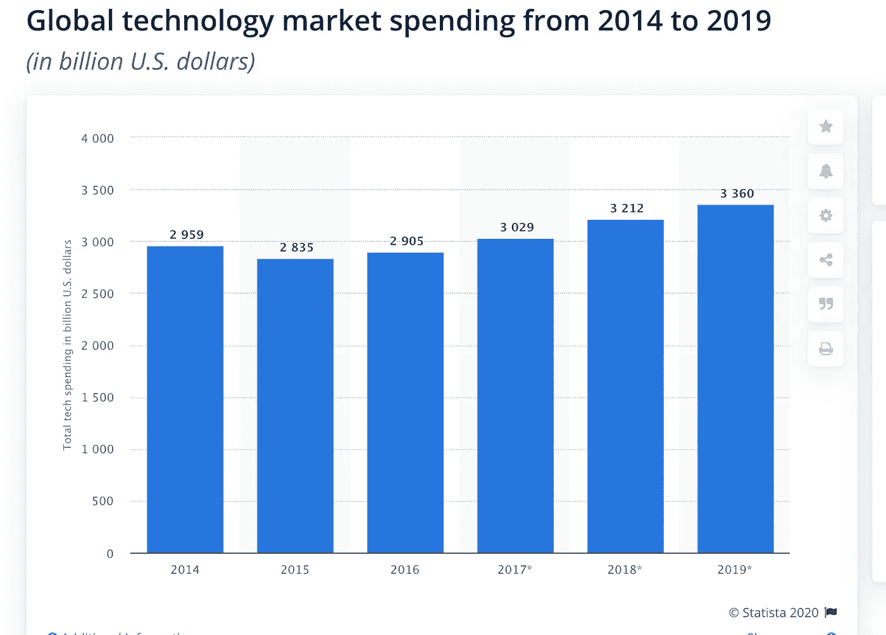

# 你应该知道的 15 个专业术语

> 原文：<https://medium.datadriveninvestor.com/15-technical-terms-you-should-know-f63bb7deed65?source=collection_archive---------3----------------------->

所有技术专业人员的快速参考

## 每个人都必须掌握技术知识

如果你环顾四周，你会发现我们被科技产品所包围。技术正成为我们生活中必不可少的一部分。尤其是为了建立业务并扩大规模，人们正在寻求技术来帮助它成长。

> 以下统计数据显示了 2014 年至 2019 年全球技术支出总额。2018 年，全球科技支出预计将达到 32，120 亿美元。全球技术市场包括电信服务、技术外包和硬件维护、技术咨询和系统集成服务、软件、通信设备和计算机设备。

[https://www.statista.com/statistics/886397/total-tech-spending-worldwide/](https://www.statista.com/statistics/886397/total-tech-spending-worldwide/)

> 雇主报告的最大招聘挑战是寻找具有新兴技术背景的员工，寻找具有所需软技能的员工，对技术人才的激烈竞争，不断上涨的薪资预期，以及有限的可用员工。( [ComTIA](https://www.comptia.org/resources/it-industry-trends-analysis) ，2018)——【https://financesonline.com/technology-statistics/】T4

因此，如果你正计划加入一家科技公司或计划开发一款科技产品，了解一些对你的工作有帮助的科技术语是很重要的！

这里有 15 个技术术语，理解它们对你很重要！

## #1 API(应用编程接口)

假设您正在开发一个 web 应用程序或应用程序，并且您想要某些公司已经开发和发布的某些功能。你宁愿考虑在你的 web 或移动应用程序中使用这些功能，而不是重新构建这些功能。

例如，一个电子商务 web 应用程序希望构建一个接受支付的功能。

这样的特性通常被打包并分发给你，这被称为“API”。API 通常被提供请求和响应字段的软件开发者所理解。请求是指服务需要从你那里得到的输入，以便向你提供输出(响应)

API 的例子可以查出来:
[https://developers.google.com/](https://developers.google.com/)

[https://developers.facebook.com/](https://developers.facebook.com/)

## #2 移动技术

像 Android 和 iOS 这样的移动设备随处可见。为这类设备构建的应用程序正成为任何企业的必需品。除了网站，现在每个人都有手机应用。那么你应该了解哪些移动技术。

*   移动应用程序是基于 Android 操作系统或 iOS 操作系统(操作系统)构建的
*   Android 的编程语言是 Java，iOS 的编程语言是 Swift 或 Objective C

## #3 网络技术:HTTP，客户端-服务器

HTTP 是所有 web 应用程序进行通信的通用语言。

**客户机-服务器** —这是软件开发中最基本的概念。任何 web 应用程序或移动应用程序都会有这种设计。客户端的示例是请求某些功能的应用程序，如移动设备/平板电脑/台式机，服务器是为来自不同客户端的请求提供服务的计算机。服务器拥有满足客户需求的业务逻辑和处理机制。服务器示例可以是 web 服务器、应用服务器

## #4 数据库

当我们在任何 web 应用程序/移动应用程序中创建个人资料时，它是如何被持久化的。它存储在数据库中。数据库是存储数据、商业信息、用户信息及其关系的技术。这通常保存在一个安全的地方，以便没有客户端应用程序/设备可以直接访问它。

要访问数据库，您需要安装 SQL developer、Oracle 或 Postgres 等应用程序。移动应用程序有时会将数据保存在 SQLite 中。

应用程序可以从这些关系数据库中查询，以获取保存在这里的信息。

为了访问应用程序外部的数据，需要公开 API，这些 API 将安全地获取数据并提供给请求者。

## #5 软件交付:版本控制、构建系统、部署自动化(DevOps)

构建和交付软件需要遵循特定的过程和工作流。DevOps 是当今公司正在采用的文化，以便运营人员和开发人员可以从一开始就一起工作，以确保代码、基础设施的安全和稳定。

**版本控制**是开发人员为应用程序检入代码的系统。这里维护代码和历史的版本。现在有各种版本控制系统，最流行的是 GitHub。

**构建系统和部署自动化**是当今大多数公司的需求。像 Jenkins、Docker 和 Chef 这样的工具通过自动化他们通常的发布活动使操作和开发人员的生活变得简单。

**持续集成**是确保所有开发人员的代码定期集成的过程，他们一起工作，为测试提供稳定的构建。

**持续交付**是一个过程，它将确保集成的代码被部署到各种其他环境中，以便代码也在其他环境中得到验证(类似于生产环境)

**连续部署**是在所有步骤发出绿色信号后，在 Prod 中自动部署代码的过程。然而这是有风险的，一般来说，公司不喜欢这样。

## #6 分布式系统(缓存、消息队列、REST)

在下列情况下，应用程序被称为分布式和大规模应用程序:

1.  产生了大量的数据
2.  大量并发用户访问应用程序
3.  需要大量的可伸缩性需求

例如——谷歌搜索引擎、脸书、推特、优步

为了设计这样的系统，架构师考虑使用**缓存**来提高性能，使用**消息队列**来提高可用性，使用 **REST** 架构风格，以便 API 易于理解和使用。

## #7 系统的非功能属性

系统不仅应该满足功能方面的要求，还应该确保非功能属性得到考虑。一些属性是:
a)可用性

b)可扩展性

c)可靠性

d)安全

e)可维护性

f)性能

> 如果一个系统是可靠的，它就是可用的。但是，如果有，也不一定可靠。

## #8 云计算

管理基础架构是当今企业的一项重大任务。它涉及到成本和人们的努力。这就是为什么企业更喜欢云计算。云旨在削减成本，并帮助用户专注于他们的核心业务，而不是受到 IT 障碍的阻碍。

云计算确保应用程序在需要时使用基础架构，并且企业根据具体使用情况付费。

> 云计算是计算机系统资源的按需可用性，特别是数据存储和计算能力，无需用户直接主动管理。该术语通常用于描述许多用户通过互联网使用的数据中心。[来源](https://en.wikipedia.org/wiki/Cloud_computing)

## #9 数据分析

有三种类型的分析:

*   描述性—发生了什么？
*   预测—可能会发生什么？
*   规范性—我们应该做什么？

数据可以是“定量的”或“定性的”

定量数据用数字表示，而定性数据用组或类别表示。

## #10 SDK(软件开发套件)

把这个想象成一个工具箱。你有一个 web 应用程序/移动应用程序，并且想插入这个工具箱并创建一些有趣的东西。

SDKs 提供诸如用户界面屏幕、API 集成、定制选项等功能。

作为一名移动应用开发者，如果你不想太担心后端 API 是什么样子的，那么这个客户端 SDK 将为你服务。

## #11 框架和编程语言

可以有服务器端框架和客户端框架。框架提供了基本的功能，您的代码可以在此基础上运行以完成特定的业务需求。

示例— spring- java。NET，Flask-python

编程语言——向计算机提供指令的语言。示例— Java、.Net、Python、Javascript

## #12 网络安全

这是一组有助于保护企业和消费者应用程序免受各种网络威胁的流程、技术和实践。

信息安全、硬件/网络安全、未授权访问、密码术是网络安全下的一些实践。

身份验证和授权是网络安全中的关键术语。

## #13 数据科学

这是对数据的研究，大数据。大数据是通过以下方式产生的:

a)速度—数据快速到来。

b)多样性—数据有多种形式

c)量—数据非常庞大

数据科学包括以下步骤:

*   识别业务问题
*   获取数据
*   清理数据并将其转换为可用的格式
*   创建模型
*   部署模型
*   使用 tableau 或 PowerBI 生成报告

## #14 机器学习

机器学习过程:

1.了解业务问题
2。收集原始数据
3。清理数据
4。创建训练数据
5。将该训练数据输入到 ML 算法
6 中。生成模型
7。应用程序将这种模型称为
8。获得预测/结果

两种基本类型的机器学习模型，**有监督的**和**无监督的**。

## #15 架构模式:微服务，SOA，SaaS

这些是架构模式。

**面向服务的架构(SOA):**

这里的服务通常意味着完全独立的操作系统进程。这些服务之间的通信是通过跨网络的调用进行的，而不是通过流程边界内的方法调用。SOA 作为一种应对大型整体应用挑战的方法应运而生。这是一种旨在促进软件可重用性的方法；例如，两个或多个最终用户应用程序可以使用相同的服务。

**微服务:**

微服务是小型的自治服务，可以协同工作。服务本身之间的所有通信都是通过网络调用进行的，以加强服务之间的分离，避免紧密耦合的危险。我们的服务公开了一个应用程序编程接口(API)，协作服务通过这些 API 与我们通信。

> 黄金法则:您能在不改变任何其他东西的情况下，对服务进行更改并自行部署它吗？

**SaaS:**

> 软件即服务，也称为 SaaS，是一种基于云的服务，在这种服务中，你不用下载软件到你的台式电脑或企业网络来运行和更新，而是通过互联网浏览器访问应用程序。软件应用程序可以是任何东西，从办公软件到统一通信，以及各种其他可用的业务应用程序。— [来源](https://www.techradar.com/in/news/what-is-saas)